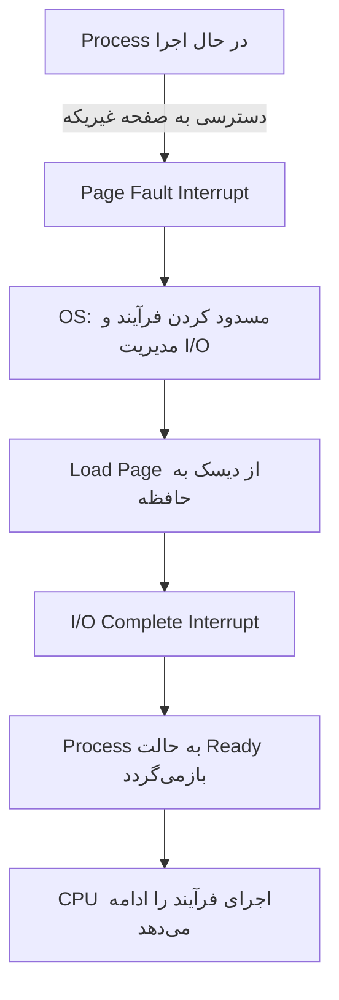
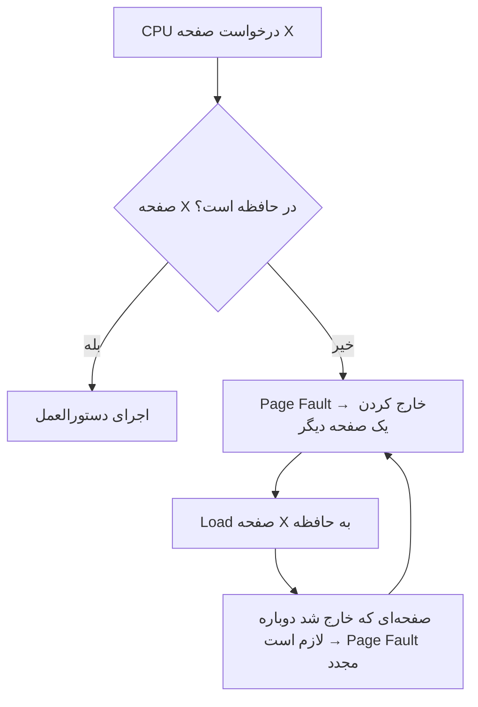
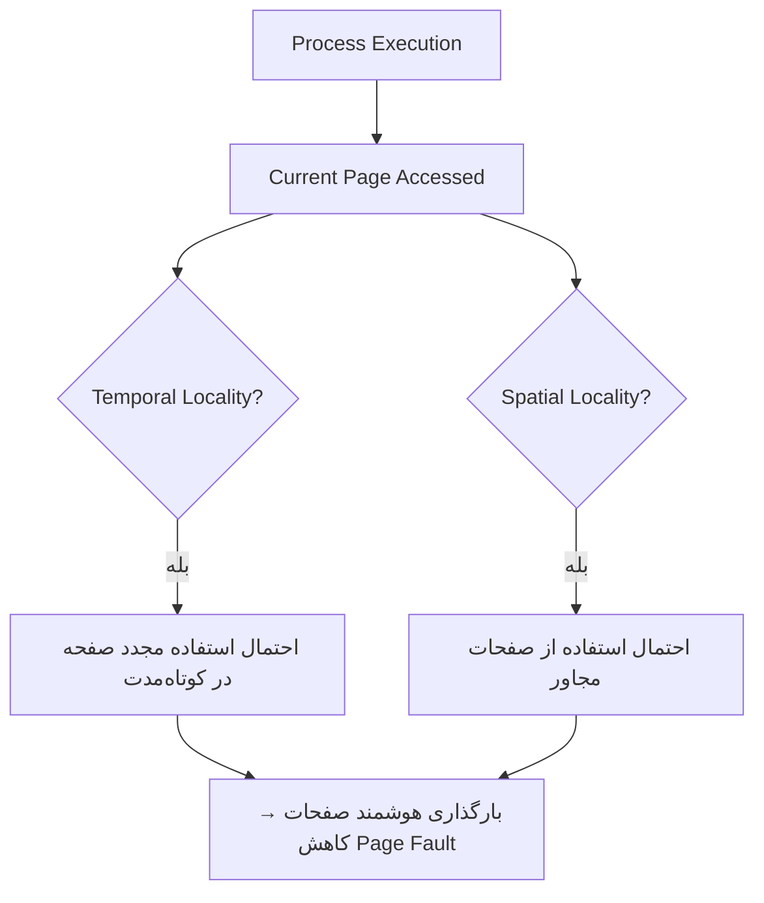
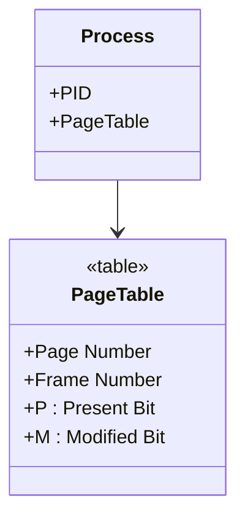
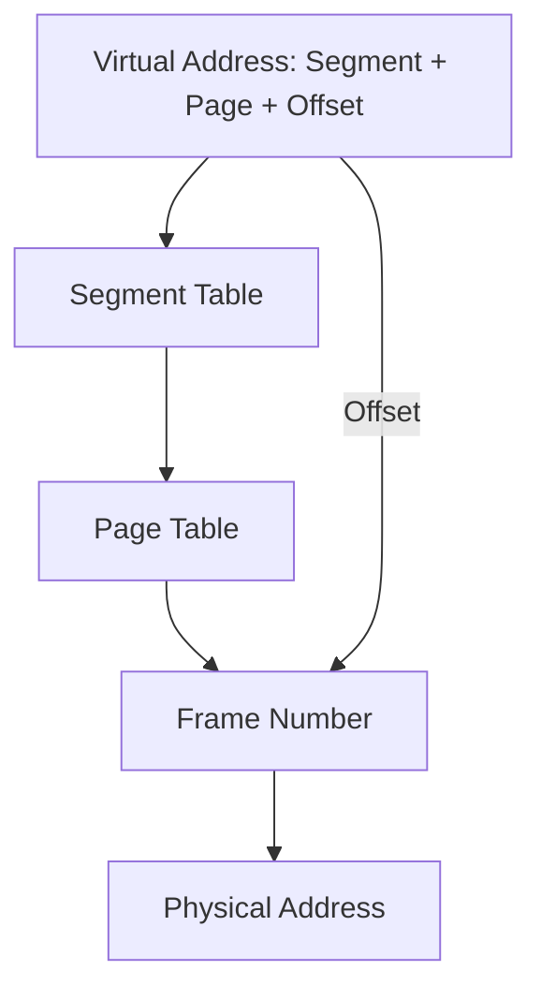
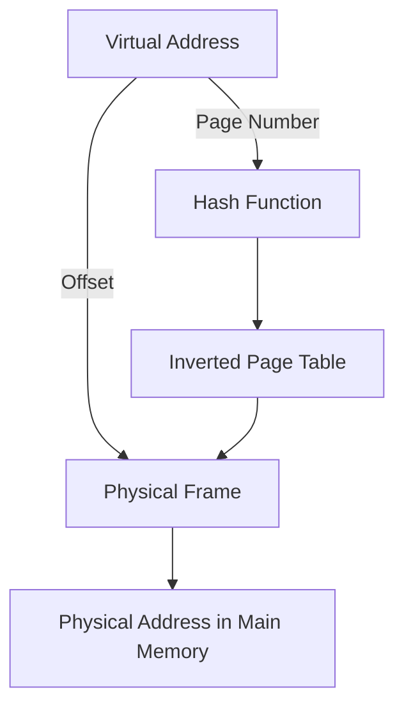
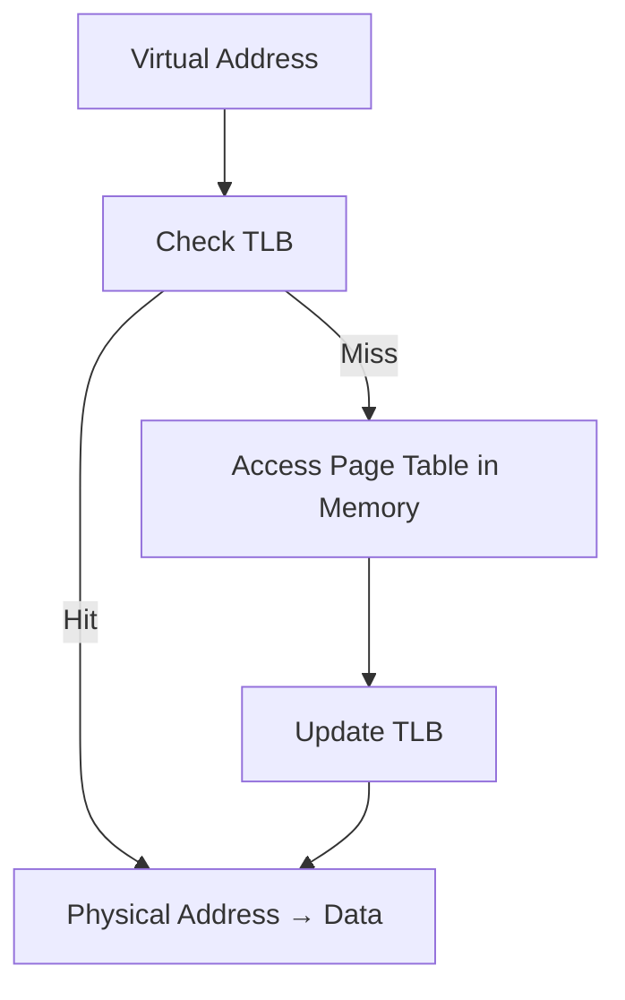
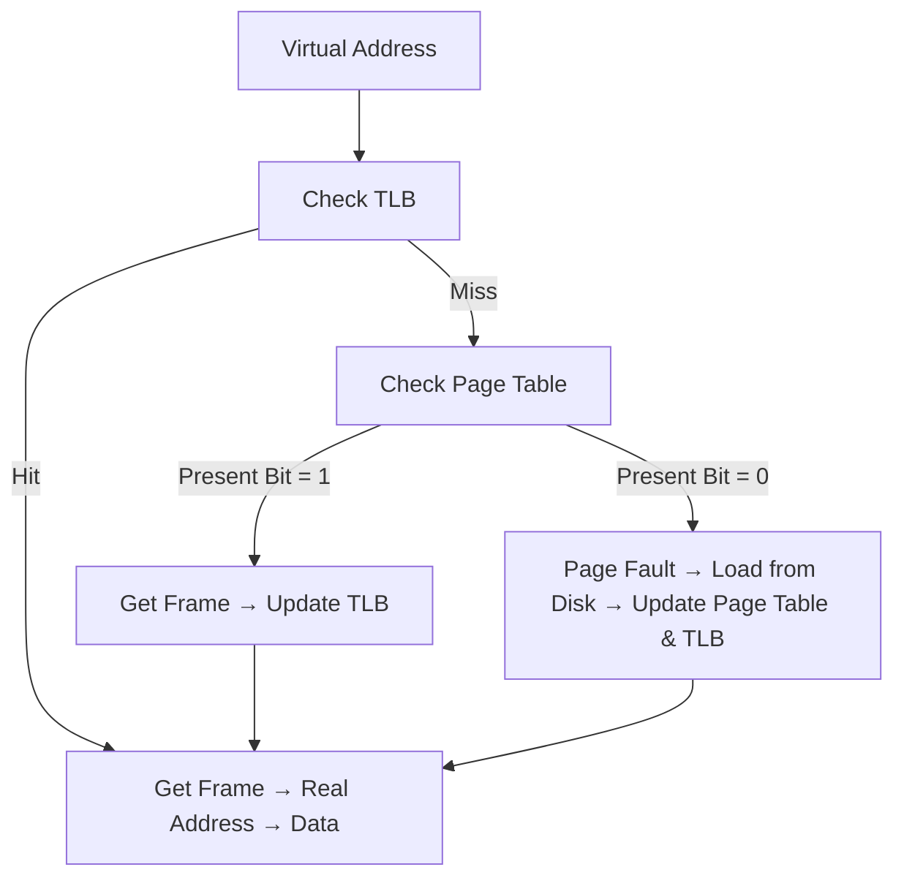

# فصل ۱۰: حافظه مجازی (Virtual Memory)

## ۱۰.۲ سخت‌افزار و ساختارهای کنترلی (Hardware and Control Structures)

### توضیح ساده و قابل فهم

این اسلاید درباره نحوه **مدیریت حافظه مجازی** در سیستم عامل است و بر سه مفهوم کلیدی تمرکز دارد:

1. **آدرس‌های منطقی و فیزیکی**
    
    - هر دسترسی به حافظه توسط یک **فرآیند**، با استفاده از **آدرس منطقی** (Logical Address) انجام می‌شود.
        
    - **آدرس منطقی** به طور دینامیک و در زمان اجرا به **آدرس فیزیکی** (Physical Address) ترجمه می‌شود.
        
    - این ترجمه به سیستم عامل اجازه می‌دهد که فرآیندها را **در مکان‌های متفاوت حافظه اصلی** جا به جا کند بدون آنکه فرآیند متوجه شود.
        
2. **تقسیم فرآیند به صفحات یا بخش‌ها**
    
    - یک فرآیند می‌تواند به **چندین تکه کوچک** (صفحه یا بخش) تقسیم شود.
        
    - این تکه‌ها **لازم نیست که به صورت متوالی** در حافظه اصلی قرار گیرند.
        
    - با استفاده از **جدول صفحات (Page Table)** یا **جدول بخش‌ها (Segment Table)**، سیستم عامل می‌تواند آدرس منطقی را به آدرس فیزیکی مناسب تبدیل کند.
        
3. **لزوم قرار داشتن همه صفحات یا بخش‌ها در حافظه اصلی**
    
    - با وجود ویژگی‌های بالا، **نیازی نیست که همه صفحات یا بخش‌های یک فرآیند به طور همزمان در حافظه اصلی باشند**.
        
    - این امکان باعث می‌شود حافظه اصلی به صورت بهینه استفاده شود و فرآیندها بتوانند حتی با بخشی از حافظه اصلی اجرا شوند (که اساس مفهوم **حافظه مجازی demand paging** است).
        

---

### مثال آموزشی ساده

فرض کنید یک فرآیند داریم که شامل **۴ صفحه** است و حافظه اصلی فقط جا برای **۲ صفحه** دارد:

|صفحه فرآیند|آدرس منطقی|وضعیت در حافظه اصلی|
|---|---|---|
|صفحه ۰|۰-۴ کیلوبایت|در حافظه اصلی|
|صفحه ۱|۴-۸ کیلوبایت|در حافظه اصلی|
|صفحه ۲|۸-۱۲ کیلوبایت|روی دیسک|
|صفحه ۳|۱۲-۱۶ کیلوبایت|روی دیسک|

- وقتی CPU نیاز دارد به صفحه ۲ دسترسی پیدا کند، سیستم عامل آن را از دیسک به حافظه اصلی منتقل می‌کند و ممکن است یکی از صفحات فعلی را خارج کند (**Page Replacement**).
    
- فرآیند بدون اینکه از این جابه‌جایی مطلع شود، ادامه می‌دهد.
    

---

### نکات کلیدی

- **آدرس منطقی ≠ آدرس فیزیکی**؛ همه دسترسی‌ها با آدرس منطقی انجام می‌شود و در زمان اجرا ترجمه می‌شوند.
    
- فرآیندها می‌توانند **در مناطق غیرمتوالی حافظه اصلی** قرار گیرند.
    
- **حافظه اصلی لازم نیست کل فرآیند را نگه دارد**؛ سیستم عامل می‌تواند صفحات/بخش‌ها را به صورت داینامیک بارگذاری کند.
    
- این ویژگی پایه‌ی **حافظه مجازی (Virtual Memory)** است که امکان **اجرای فرآیندها با حافظه کمتر از اندازه واقعی‌شان** را می‌دهد.
    

---

# اجرای برنامه (Run Program) – حافظه مجازی

### توضیح ساده و قابل فهم

این اسلاید به **نحوه اجرای یک فرآیند در حافظه مجازی** و مفهوم **Resident Set** می‌پردازد:

1. **Resident Set (مجموعه مقیم)**
    
    - **Resident Set** به بخش‌هایی از یک فرآیند گفته می‌شود که در **هر لحظه در حافظه اصلی** قرار دارند.
        
    - این مجموعه ممکن است فقط **یک قسمت از کل فرآیند** باشد، نه همه آن.
        
2. **Fault آدرس حافظه (Page Fault)**
    
    - وقتی پردازنده به **آدرس منطقی‌ای دسترسی پیدا می‌کند که در حافظه اصلی نیست**، یک **Interrupt** تولید می‌شود که به آن **Memory Access Fault یا Page Fault** گفته می‌شود.
        
    - سیستم عامل این فرآیند را در حالت **مسدود (Blocking)** قرار می‌دهد و **کنترل CPU** را به دست می‌گیرد.
        
3. **بارگذاری صفحه و ادامه اجرا**
    
    - سیستم عامل صفحه یا بخش مورد نیاز را از دیسک به حافظه اصلی منتقل می‌کند (**I/O Operation**).
        
    - وقتی صفحه بارگذاری شد، یک **I/O Interrupt** تولید می‌شود و سیستم عامل فرآیند را به حالت **Ready** بازمی‌گرداند تا CPU بتواند اجرای آن را ادامه دهد.
        
4. **مزایای حافظه مجازی**
    
    - امکان نگه داشتن **تعداد بیشتری فرآیند در حافظه اصلی**.
        
    - امکان اجرای فرآیندهایی که **بزرگ‌تر از حافظه اصلی** هستند.
        

---

### مثال آموزشی ساده

فرض کنید فرآیند P شامل ۴ صفحه است و فقط صفحات ۰ و ۱ در حافظه اصلی قرار دارند (Resident Set). CPU نیاز دارد به صفحه ۲ دسترسی پیدا کند:

1. CPU به صفحه ۲ دسترسی می‌خواهد → **Page Fault** رخ می‌دهد.
    
2. سیستم عامل فرآیند را مسدود می‌کند.
    
3. صفحه ۲ از دیسک به حافظه اصلی منتقل می‌شود.
    
4. سیستم عامل فرآیند را به حالت **Ready** بازمی‌گرداند.
    
5. CPU اجرای فرآیند را ادامه می‌دهد.
    

---

### نمودار Mermaid: جریان Page Fault و بازگشت به Ready



---

### نکات کلیدی

- **Resident Set:** بخشی از فرآیند که در هر لحظه در حافظه اصلی قرار دارد.
    
- **Page Fault:** زمانی رخ می‌دهد که CPU به صفحه‌ای که در حافظه نیست دسترسی می‌خواهد.
    
- **Blocking و Ready:** سیستم عامل فرآیند را موقتاً مسدود می‌کند و بعد از بارگذاری صفحه آن را دوباره آماده می‌کند.
    
- **مزایای حافظه مجازی:**
    
    1. نگهداری تعداد بیشتری فرآیند در حافظه اصلی.
        
    2. امکان اجرای فرآیندهایی که بزرگ‌تر از حافظه اصلی هستند.
        

---
# Thrashing در حافظه مجازی

### توضیح ساده و قابل فهم

این اسلاید درباره پدیده‌ای به نام **Thrashing** در حافظه مجازی صحبت می‌کند:

1. **تعریف Thrashing**
    
    - وقتی سیستم عامل **یک صفحه یا بخش از فرآیند را بارگذاری می‌کند**، ممکن است مجبور شود **یک صفحه دیگر را از حافظه اصلی خارج کند** تا جای صفحه جدید باز شود.
        
    - اگر سیستم **صفحه‌ای را خارج کند که قرار است خیلی زود دوباره استفاده شود**، آن صفحه باید دوباره بارگذاری شود.
        
    - این چرخه دائمی بارگذاری و خارج کردن صفحات، بدون اینکه فرآیندها دستورالعمل‌ها را اجرا کنند، **Thrashing** نامیده می‌شود.
        
2. **نشانه‌های Thrashing**
    
    - زمان CPU برای اجرای دستورالعمل‌ها به شدت کاهش می‌یابد.
        
    - سیستم اکثر وقت خود را صرف **Swap کردن صفحات بین حافظه اصلی و دیسک** می‌کند.
        
    - در نتیجه، **کارایی سیستم بسیار پایین می‌آید**.
        

---

### مثال آموزشی ساده

فرض کنید حافظه اصلی جا برای ۲ صفحه دارد و یک فرآیند نیاز به ۳ صفحه دارد. روند اجرا به صورت زیر است:

|گام|صفحات در حافظه|عملیاتی که رخ می‌دهد|
|---|---|---|
|۱|صفحه ۰, ۱|CPU به صفحه ۲ نیاز دارد → صفحه ۰ خارج می‌شود، صفحه ۲ بارگذاری می‌شود|
|۲|صفحه ۲, ۱|CPU به صفحه ۰ نیاز دارد → صفحه ۱ خارج می‌شود، صفحه ۰ بارگذاری می‌شود|
|۳|صفحه ۰, ۲|CPU به صفحه ۱ نیاز دارد → صفحه ۲ خارج می‌شود، صفحه ۱ بارگذاری می‌شود|

- مشاهده می‌کنیم که سیستم فقط صفحات را جا‌به‌جا می‌کند و **اجرای واقعی دستورالعمل‌ها بسیار کم است**.
    
- این همان **Thrashing** است.
    

---

### نمودار Mermaid: چرخه Thrashing



- این نمودار نشان می‌دهد که در **Thrashing** سیستم در چرخه مکرر بارگذاری و خارج کردن صفحات گیر می‌کند.
    

---

### نکات کلیدی

- **Thrashing:** زمانی رخ می‌دهد که سیستم بیش از حد صفحات را جا‌به‌جا می‌کند.
    
- سیستم در حالت Thrashing **بیشتر زمانش را صرف مدیریت حافظه می‌کند تا اجرای واقعی دستورالعمل‌ها**.
    
- **علت اصلی:** اندازه Resident Set یک فرآیند کمتر از حد نیاز واقعی آن است.
    
- **راه حل‌ها:** افزایش اندازه حافظه، کاهش تعداد فرآیندهای همزمان یا استفاده از الگوریتم‌های جایگزینی صفحات بهتر.
    

---

# اصل محلیّت (Principle of Locality) در حافظه مجازی

### توضیح ساده و قابل فهم

این اسلاید به **یکی از اصول پایه حافظه مجازی** به نام **Principle of Locality** می‌پردازد که به سیستم عامل کمک می‌کند **thrashing را کاهش دهد**:

1. **تعریف Principle of Locality**
    
    - در طول اجرای یک فرآیند، **دسترسی‌ها به دستورالعمل‌ها و داده‌ها تمایل دارند در نواحی مشخصی متمرکز شوند**.
        
    - به عبارت دیگر، برنامه‌ها و داده‌ها معمولاً به صورت **خوشه‌ای (clustered)** مورد دسترسی قرار می‌گیرند.
        
2. **Locality انواع مختلف دارد**
    
    - **Temporal Locality (محلیّت زمانی):** اگر یک داده یا دستورالعمل در حال حاضر استفاده شده، احتمال استفاده مجدد آن در کوتاه‌مدت زیاد است.
        
    - **Spatial Locality (محلیّت مکانی):** اگر یک داده یا دستورالعمل استفاده شود، احتمال استفاده از داده‌ها یا دستورالعمل‌های مجاور آن نیز زیاد است.
        
3. **اهمیت Principle of Locality**
    
    - این اصل به سیستم عامل اجازه می‌دهد **حدس‌های هوشمندانه‌ای درباره صفحات مورد نیاز در آینده نزدیک بزند**.
        
    - نتیجه: **کاهش Page Fault** و جلوگیری از Thrashing.
        

---

### مثال آموزشی ساده

فرض کنید فرآیند زیر در حال اجرا است:

```
Instruction sequence: I1, I2, I3, I4, I5, I6
Data sequence: D1, D2, D3
```

- اگر صفحه‌ای که شامل I1 و I2 است در حافظه باشد، احتمالاً **I3 و I4 هم به زودی نیاز خواهند شد** → سیستم عامل می‌تواند پیش‌بینی کند و صفحه بعدی را آماده کند.
    
- همینطور برای داده‌ها: اگر D1 استفاده شد، احتمال استفاده D2 و D3 نیز زیاد است.
    

این پیش‌بینی باعث می‌شود **صفحات درست بارگذاری شوند و Thrashing رخ ندهد**.

---

### نمودار Mermaid: اصل محلیّت در حافظه



- نمودار نشان می‌دهد که سیستم عامل با استفاده از **محلیّت زمانی و مکانی**، می‌تواند صفحات مورد نیاز را پیش‌بینی کند.
    

---

### نکات کلیدی

- **Principle of Locality:** دسترسی‌های برنامه و داده معمولاً خوشه‌ای هستند.
    
- **Temporal Locality:** استفاده دوباره از یک صفحه در کوتاه‌مدت محتمل است.
    
- **Spatial Locality:** استفاده از صفحات یا داده‌های مجاور محتمل است.
    
- استفاده از این اصل باعث **کاهش Page Fault و جلوگیری از Thrashing** می‌شود.
    
- سیستم عامل می‌تواند با **بارگذاری هوشمند صفحات**، کارایی حافظه مجازی را افزایش دهد.
    

---
# Paging (صفحه‌بندی) در حافظه مجازی

### توضیح ساده و قابل فهم

این اسلاید به **مکانیزم Paging در حافظه مجازی** می‌پردازد:

1. **جدول صفحات (Page Table)**
    
    - هر فرآیند **جدول صفحات مخصوص خودش** را دارد.
        
    - وقتی همه صفحات یک فرآیند در حافظه اصلی قرار می‌گیرند، **جدول صفحات آن فرآیند نیز ایجاد و در حافظه اصلی بارگذاری می‌شود**.
        
    - **کاربرد جدول صفحات:** ترجمه آدرس‌های منطقی به آدرس‌های فیزیکی.
        
2. **شماره قاب (Frame Number)**
    
    - هر خانه در جدول صفحات (Page Table Entry) شامل **شماره قاب (Frame Number)** است که نشان می‌دهد صفحه مربوطه در **کدام بخش از حافظه اصلی** قرار دارد.
        
3. **بیت حضور (Present Bit – P)**
    
    - چون ممکن است **فقط بخشی از صفحات یک فرآیند در حافظه اصلی باشند**، یک بیت در جدول صفحات لازم است تا مشخص شود که آیا صفحه در حافظه اصلی است یا خیر.
        
4. **بیت تغییر (Modify Bit – M)**
    
    - این بیت مشخص می‌کند که **آیا صفحه از آخرین بار که به حافظه اصلی بارگذاری شده، تغییر کرده است یا نه**.
        
    - اگر تغییر کرده باشد و قرار باشد از حافظه خارج شود، باید ابتدا به دیسک بازگردد (Write Back).
        

---

### مثال آموزشی ساده

فرض کنید یک فرآیند با ۴ صفحه داریم و جدول صفحات آن به صورت زیر است:

|Page Number|Frame Number|P (Present)|M (Modified)|
|---|---|---|---|
|0|5|1|0|
|1|9|1|1|
|2|–|0|0|
|3|–|0|0|

- **صفحه 0 و 1** در حافظه اصلی هستند (P=1) و صفحه 1 تغییر کرده است (M=1).
    
- **صفحه 2 و 3** در حافظه اصلی نیستند (P=0). اگر CPU به این صفحات نیاز داشته باشد، **Page Fault** رخ می‌دهد.
    

---

### نمودار Mermaid: ساختار جدول صفحات



- هر **فرآیند** یک **جدول صفحات** مخصوص دارد.
    
- جدول صفحات شامل **شماره قاب، بیت حضور و بیت تغییر** برای هر صفحه است.
    

---

### نکات کلیدی

- هر فرآیند **جدول صفحات مخصوص خود را دارد**.
    
- جدول صفحات برای **ترجمه آدرس منطقی به فیزیکی** استفاده می‌شود.
    
- **Present Bit (P):** مشخص می‌کند که صفحه در حافظه اصلی است یا خیر.
    
- **Modify Bit (M):** مشخص می‌کند که صفحه تغییر کرده و نیاز به نوشتن روی دیسک دارد یا نه.
    
- این ساختار پایه‌ای است برای **Paging و مدیریت حافظه مجازی** و جلوگیری از بارگذاری غیرضروری صفحات.
    

---
![[Pasted image 20250902114932.png]]

# ساختار جدول صفحه (Page Table Structure)

این اسلاید سه مدل اصلی نگاشت آدرس مجازی به آدرس فیزیکی را نشان می‌دهد:  
۱. **صفحه‌بندی (Paging)**  
۲. **بخش‌بندی (Segmentation)**  
۳. **ترکیب بخش‌بندی و صفحه‌بندی (Segmentation + Paging)**

---

## 1. Paging Only
- آدرس مجازی شامل: **Page Number + Offset**  
- هر ورودی جدول صفحه (Page Table Entry):  
  - **P (Present bit):** آیا صفحه در حافظه هست؟  
  - **M (Modified bit):** آیا صفحه تغییر کرده؟  
  - **Frame number:** شماره قاب (محل قرارگیری صفحه در RAM).  

**نمودار:**
```mermaid
flowchart LR
    A[Virtual Address] -->|Page Number| B[Page Table]
    B -->|Frame Number| C[Physical Address]
    A -->|Offset| C
````

---

## 2. Segmentation Only

- آدرس مجازی شامل: **Segment Number + Offset**
    
- هر ورودی جدول بخش (Segment Table Entry):
    
    - **P, M**: بیت‌های کنترلی
        
    - **Length:** طول بخش
        
    - **Segment Base:** آدرس شروع بخش
        

**نمودار:**

```mermaid
flowchart LR
    A[Virtual Address] -->|Segment Number| B[Segment Table]
    B -->|Base + Length| C[Physical Address]
    A -->|Offset| C
```

---

## 3. Combined Segmentation + Paging

- آدرس مجازی شامل: **Segment Number + Page Number + Offset**
    
- مراحل:
    
    1. **Segment Table** مشخص می‌کند هر بخش از کجا شروع می‌شود.
        
    2. در داخل هر بخش، **Page Table** تعیین می‌کند صفحه در کدام قاب RAM است.
        
- ترکیب انعطاف‌پذیری segmentation با سادگی paging.
    

**نمودار:**



---

## مثال ساده

فرض کنید برنامه‌ای سه بخش دارد: کد، داده، استک.

- با **Segmentation** هر بخش جدا نگهداری می‌شود.
    
- با **Paging** هر بخش به صفحات کوچک تقسیم شده و پراکنده در حافظه ذخیره می‌شود.
    
- با **Segmentation + Paging**: ابتدا بخش انتخاب می‌شود، سپس صفحه داخل آن بخش.
    

---

## نکات کلیدی

- **Paging**: تقسیم حافظه به بلوک‌های یکسان → ساده ولی بدون توجه به منطق برنامه.
    
- **Segmentation**: تقسیم بر اساس ساختار منطقی برنامه (کد، داده، استک).
    
- **Segmentation + Paging**: ترکیب هر دو → مدیریت بهینه‌تر حافظه.
    
- بیت‌های مهم:
    
    - **P (Present):** صفحه/بخش در حافظه است یا نه.
        
    - **M (Modified):** تغییر یافته و نیاز به ذخیره روی دیسک دارد.
        

---
![[Pasted image 20250902115049.png]]
# Address Translation (ترجمه آدرس)

این اسلاید مکانیزم تبدیل **آدرس مجازی** (Virtual Address) به **آدرس فیزیکی** (Physical Address) در سیستم‌های صفحه‌بندی را نشان می‌دهد.

---

## مراحل ترجمه
1. **برنامه** یک آدرس مجازی تولید می‌کند:  
   - شامل دو بخش:  
     - **Page Number** (شماره صفحه)  
     - **Offset** (جابه‌جایی داخل صفحه)  

2. **رجیستر پایه جدول صفحه** (Page Table Base Register) → مکان شروع جدول صفحه را نگه می‌دارد.  

3. **Page Number** + مقدار رجیستر پایه → آدرس ورودی مربوط در جدول صفحه.  

4. جدول صفحه مقدار **Frame Number** (شماره قاب در حافظه اصلی) را برمی‌گرداند.  

5. با ترکیب **Frame Number + Offset** → آدرس فیزیکی ساخته می‌شود.  

6. در نهایت این آدرس در **Main Memory** به داده واقعی اشاره می‌کند.  

---

## دیاگرام
```mermaid
flowchart TD
    A[Virtual Address] -->|Page # + Offset| B[Page Table Base Register]
    B --> C[Page Table Lookup]
    C --> D[Frame Number]
    A -->|Offset| D
    D --> E[Physical Address]
    E --> F[Main Memory]
````

---

## مثال ساده

- فرض کنید آدرس مجازی = (Page=2, Offset=50)
    
- جدول صفحه نشان می‌دهد که **Page 2 → Frame 7**
    
- آدرس فیزیکی = (Frame 7, Offset 50)
    

---

## نکات کلیدی

- **Virtual Address = Page # + Offset**
    
- **Physical Address = Frame # + Offset**
    
- جدول صفحه (Page Table) نقش نگاشت را دارد.
    
- رجیستر پایه جدول صفحه مشخص می‌کند جدول در حافظه کجاست.
    
---

# Process Page Table (جدول صفحه هر فرآیند)

---

## توضیح
- در اغلب سیستم‌ها، **هر فرآیند یک جدول صفحه (Page Table) جداگانه** دارد.  
- چون هر فرآیند می‌تواند فضای مجازی بسیار بزرگی داشته باشد، جدول صفحه ممکن است بسیار بزرگ شود.  

---

## مثال: معماری VAX
- فضای آدرس مجازی هر فرآیند: $2^{31} = 2$ گیگابایت  
- اندازه هر صفحه: $2^9 = 512$ بایت  
- بنابراین:  
  - تعداد صفحات مورد نیاز = $\frac{2^{31}}{2^9} = 2^{22}$  
  - پس هر فرآیند نیازمند $2^{22}$ ورودی در جدول صفحه است.  

---

## دیاگرام
```mermaid
flowchart TD
    A[Process] --> B[Page Table]
    B -->|Page 0 → Frame| C[Main Memory]
    B -->|Page 1 → Frame| C
    B -->|Page N → Frame| C
````

---

## مثال ساده

فرض کنید فرآیندی 1GB فضای آدرس مجازی دارد و اندازه هر صفحه 1KB است:

- تعداد صفحات = 1GB1KB=1M=220\frac{1GB}{1KB} = 1M = 2^{20}
    
- پس جدول صفحه باید **حداقل یک میلیون ورودی** داشته باشد.
    

---

## نکات کلیدی

- هر فرآیند معمولاً یک **Page Table** اختصاصی دارد.
    
- اندازه جدول صفحه به بزرگی فضای آدرس و اندازه صفحه وابسته است.
    
- جدول‌های صفحه می‌توانند بسیار بزرگ باشند (مثلاً میلیون‌ها ورودی).
    

---
![[Pasted image 20250902115322.png]]

# A Two-Level Hierarchical Page Table (جدول صفحه سلسله‌مراتبی دو سطحی)

---

## ایده اصلی
- مشکل: جدول صفحه برای هر فرآیند می‌تواند **خیلی بزرگ** باشد.  
- راه‌حل: تقسیم جدول صفحه به **چند سطح** → به جای یک جدول عظیم، چند جدول کوچک‌تر و پویا.  
- در این ساختار:  
  1. **Root Page Table** (جدول صفحه ریشه)  
  2. **User Page Table** (جدول صفحه سطح دوم)  
  3. **User Address Space** (فضای آدرس کاربر)  

---

## مراحل دسترسی
1. آدرس مجازی به چند بخش تقسیم می‌شود:  
   - **Root Index** (انتخاب ورودی از جدول ریشه)  
   - **User Page Index** (انتخاب ورودی از جدول صفحه سطح دوم)  
   - **Offset** (جابه‌جایی داخل صفحه)  

2. ابتدا جدول ریشه → مکان جدول صفحه کاربر را نشان می‌دهد.  
3. سپس جدول صفحه کاربر → مکان فریم حافظه را مشخص می‌کند.  
4. در نهایت با Offset → آدرس فیزیکی ساخته می‌شود.  

---

## دیاگرام
```mermaid
flowchart TD
    A[Virtual Address] -->|Root Index| B[Root Page Table]
    B --> C[User Page Table]
    A -->|User Page Index| C
    C --> D[Frame Number]
    A -->|Offset| D
    D --> E[Physical Address in Main Memory]
````

---

## مثال ساده

- فرض کنید آدرس مجازی 32 بیتی باشد.
    
    - 10 بیت اول → انتخاب ورودی از Root Page Table
        
    - 10 بیت بعدی → انتخاب ورودی از User Page Table
        
    - 12 بیت آخر → Offset
        
- با این روش فقط جدول‌های لازم ساخته می‌شوند (نه همه‌ی فضای آدرس).
    

---

## مزایا

- کاهش اندازه جدول صفحه.
    
- فقط بخش‌هایی از فضای آدرس که واقعاً استفاده می‌شوند، جدول صفحه دارند.
    

---

## نکات کلیدی

- **Hierarchical Paging** برای حل مشکل بزرگی جدول صفحه معرفی شده است.
    
- ساختار دو سطحی شامل: Root Page Table + User Page Table.
    
- آدرس مجازی به چند بخش تقسیم می‌شود.
    
- مزیت: حافظه کمتری برای نگهداری جدول‌ها نیاز است.
    
---
![[Pasted image 20250902115437.png]]

..
.
.
```
توضیحات فراموش نشه
```

---

# Inverted Page Table (IPT)

## ایده اصلی

- به‌جای داشتن یک جدول صفحه بزرگ برای هر فرآیند، تنها **یک جدول صفحه معکوس** برای کل سیستم وجود دارد.
    
- در این جدول، هر **فریم فیزیکی** در حافظه‌ی اصلی دقیقاً یک ورودی دارد (نه هر صفحه مجازی).
    

---

## سازوکار

1. **آدرس مجازی** به دو بخش تقسیم می‌شود:
    
    - شماره‌ی صفحه مجازی (Virtual Page Number)
        
    - Offset
        
2. به‌جای جستجوی مستقیم:
    
    - شماره صفحه مجازی → توسط **تابع هش** به یک مقدار Hash تبدیل می‌شود.
        
    - Hash → اشاره‌گر به **جدول صفحه معکوس**.
        
3. جدول معکوس:
    
    - شامل اطلاعات مربوط به اینکه کدام **صفحه مجازی** روی کدام **فریم فیزیکی** قرار دارد.
        
    - هر فریم حافظه اصلی یک ورودی دارد.
        

---

## دیاگرام ساده



---

## مزایا

- تنها به اندازه **تعداد فریم‌های حافظه اصلی** ورودی نیاز دارد (ثابت).
    
- صرفه‌جویی قابل توجه در حافظه برای جدول‌های صفحه.
    
- مستقل از تعداد فرآیندها یا اندازه فضای آدرس مجازی.
    

---

## معایب

- نیاز به **محاسبه‌ی هش** → زمان بیشتر برای آدرس‌دهی.
    
- امکان برخورد (Collision) در هش → نیاز به بررسی زنجیره‌ای (chaining).
    
- پیچیدگی بیشتر در پیاده‌سازی نسبت به جدول‌های چندسطحی.
    

---

## نکته کلیدی

- **IPT یک جدول جهانی برای کل سیستم است** (نه برای هر فرآیند جداگانه).
    
- مقیاس آن بر اساس **فریم‌های فیزیکی** است، نه صفحات مجازی.
    

---

![[Pasted image 20250902115620.png]]
```
توضیحات لازمه
.
.

```

---

# Translation Lookaside Buffer (TLB)

## مشکل

- در سیستم حافظه مجازی، هر **ارجاع به آدرس مجازی** نیازمند **۲ دسترسی حافظه** است:
    
    1. دسترسی به حافظه برای پیدا کردن **Page Table Entry (PTE)**
        
    2. دسترسی به حافظه برای آوردن **داده واقعی**
        
- این فرآیند کند است چون عملاً دو برابر زمان می‌برد.
    

---

## راه‌حل: TLB

- برای حل مشکل، از یک **حافظه‌ی کش با سرعت بالا** استفاده می‌شود به نام **Translation Lookaside Buffer (TLB)**.
    
- TLB شامل **صفحات اخیراً استفاده‌شده** است.
    
- مشابه کش پردازنده عمل می‌کند، ولی مخصوص **Page Table Entries** است.
    

---

## نحوه عملکرد

1. پردازنده هنگام دسترسی به آدرس مجازی → اول TLB بررسی می‌شود.
    
    - **TLB Hit:** آدرس فیزیکی بلافاصله پیدا می‌شود → تنها ۱ بار دسترسی به حافظه (برای داده).
        
    - **TLB Miss:** باید ابتدا Page Table در حافظه جستجو شود → سپس PTE جدید به TLB بارگذاری می‌شود.
        

---

## دیاگرام ساده



---

## مزایا

- کاهش چشمگیر **زمان دسترسی به حافظه**.
    
- بهره‌وری بیشتر نسبت به استفاده مستقیم از Page Table.
    
- بهره‌وری بالا مخصوصاً برای برنامه‌هایی با **locality بالا** (صفحات تکراری در مدت کوتاه).
    

---

## نکته کلیدی

- TLB یک **کش سخت‌افزاری کوچک اما بسیار سریع** است.
    
- به‌طور معمول فقط **چند صد ورودی** دارد.
    

---

# Translation Lookaside Buffer (TLB) – Workflow

## مراحل دسترسی به آدرس مجازی

1. پردازنده آدرس مجازی (Virtual Address) تولید می‌کند.
    
2. **بررسی TLB**:
    
    - اگر **TLB Hit** → شماره‌ی Frame مستقیم گرفته می‌شود → آدرس واقعی ساخته می‌شود.
        
    - اگر **TLB Miss** → باید Page Table بررسی شود.
        
3. در صورت **TLB Miss**:
    
    - پردازنده شماره صفحه (Page Number) را در جدول صفحه (Page Table) جستجو می‌کند.
        
    - اگر **Present Bit = 1** → صفحه در حافظه اصلی است → Frame Number گرفته می‌شود.
        
    - سپس TLB با این ورودی جدید **به‌روزرسانی** می‌شود.
        

---

## جدول مقایسه TLB Hit و TLB Miss

|وضعیت|عمل انجام‌شده|تعداد دسترسی حافظه|توضیح|
|---|---|---|---|
|**TLB Hit**|Frame از TLB گرفته می‌شود|1 (فقط داده)|سریع‌ترین حالت|
|**TLB Miss + Page موجود در RAM**|ابتدا Page Table بررسی می‌شود، سپس TLB آپدیت|2 (Page Table + Data)|کندتر از Hit ولی بدون Page Fault|
|**TLB Miss + Page روی دیسک (Page Fault)**|باید صفحه از دیسک به RAM آورده شود، سپس TLB آپدیت|خیلی زیاد (هزینه دیسک)|کندترین حالت|

---

## دیاگرام فرآیند



---

