# فصل ۱۰: حافظه مجازی (Virtual Memory)

## ۱۰.۲ سخت‌افزار و ساختارهای کنترلی (Hardware and Control Structures)

### توضیح ساده و قابل فهم

این اسلاید درباره نحوه **مدیریت حافظه مجازی** در سیستم عامل است و بر سه مفهوم کلیدی تمرکز دارد:

1. **آدرس‌های منطقی و فیزیکی**
    
    - هر دسترسی به حافظه توسط یک **فرآیند**، با استفاده از **آدرس منطقی** (Logical Address) انجام می‌شود.
        
    - **آدرس منطقی** به طور دینامیک و در زمان اجرا به **آدرس فیزیکی** (Physical Address) ترجمه می‌شود.
        
    - این ترجمه به سیستم عامل اجازه می‌دهد که فرآیندها را **در مکان‌های متفاوت حافظه اصلی** جا به جا کند بدون آنکه فرآیند متوجه شود.
        
2. **تقسیم فرآیند به صفحات یا بخش‌ها**
    
    - یک فرآیند می‌تواند به **چندین تکه کوچک** (صفحه یا بخش) تقسیم شود.
        
    - این تکه‌ها **لازم نیست که به صورت متوالی** در حافظه اصلی قرار گیرند.
        
    - با استفاده از **جدول صفحات (Page Table)** یا **جدول بخش‌ها (Segment Table)**، سیستم عامل می‌تواند آدرس منطقی را به آدرس فیزیکی مناسب تبدیل کند.
        
3. **لزوم قرار داشتن همه صفحات یا بخش‌ها در حافظه اصلی**
    
    - با وجود ویژگی‌های بالا، **نیازی نیست که همه صفحات یا بخش‌های یک فرآیند به طور همزمان در حافظه اصلی باشند**.
        
    - این امکان باعث می‌شود حافظه اصلی به صورت بهینه استفاده شود و فرآیندها بتوانند حتی با بخشی از حافظه اصلی اجرا شوند (که اساس مفهوم **حافظه مجازی demand paging** است).
        

---

### مثال آموزشی ساده

فرض کنید یک فرآیند داریم که شامل **۴ صفحه** است و حافظه اصلی فقط جا برای **۲ صفحه** دارد:

|صفحه فرآیند|آدرس منطقی|وضعیت در حافظه اصلی|
|---|---|---|
|صفحه ۰|۰-۴ کیلوبایت|در حافظه اصلی|
|صفحه ۱|۴-۸ کیلوبایت|در حافظه اصلی|
|صفحه ۲|۸-۱۲ کیلوبایت|روی دیسک|
|صفحه ۳|۱۲-۱۶ کیلوبایت|روی دیسک|

- وقتی CPU نیاز دارد به صفحه ۲ دسترسی پیدا کند، سیستم عامل آن را از دیسک به حافظه اصلی منتقل می‌کند و ممکن است یکی از صفحات فعلی را خارج کند (**Page Replacement**).
    
- فرآیند بدون اینکه از این جابه‌جایی مطلع شود، ادامه می‌دهد.
    

---

### نکات کلیدی

- **آدرس منطقی ≠ آدرس فیزیکی**؛ همه دسترسی‌ها با آدرس منطقی انجام می‌شود و در زمان اجرا ترجمه می‌شوند.
    
- فرآیندها می‌توانند **در مناطق غیرمتوالی حافظه اصلی** قرار گیرند.
    
- **حافظه اصلی لازم نیست کل فرآیند را نگه دارد**؛ سیستم عامل می‌تواند صفحات/بخش‌ها را به صورت داینامیک بارگذاری کند.
    
- این ویژگی پایه‌ی **حافظه مجازی (Virtual Memory)** است که امکان **اجرای فرآیندها با حافظه کمتر از اندازه واقعی‌شان** را می‌دهد.
    

---

# اجرای برنامه (Run Program) – حافظه مجازی

### توضیح ساده و قابل فهم

این اسلاید به **نحوه اجرای یک فرآیند در حافظه مجازی** و مفهوم **Resident Set** می‌پردازد:

1. **Resident Set (مجموعه مقیم)**
    
    - **Resident Set** به بخش‌هایی از یک فرآیند گفته می‌شود که در **هر لحظه در حافظه اصلی** قرار دارند.
        
    - این مجموعه ممکن است فقط **یک قسمت از کل فرآیند** باشد، نه همه آن.
        
2. **Fault آدرس حافظه (Page Fault)**
    
    - وقتی پردازنده به **آدرس منطقی‌ای دسترسی پیدا می‌کند که در حافظه اصلی نیست**، یک **Interrupt** تولید می‌شود که به آن **Memory Access Fault یا Page Fault** گفته می‌شود.
        
    - سیستم عامل این فرآیند را در حالت **مسدود (Blocking)** قرار می‌دهد و **کنترل CPU** را به دست می‌گیرد.
        
3. **بارگذاری صفحه و ادامه اجرا**
    
    - سیستم عامل صفحه یا بخش مورد نیاز را از دیسک به حافظه اصلی منتقل می‌کند (**I/O Operation**).
        
    - وقتی صفحه بارگذاری شد، یک **I/O Interrupt** تولید می‌شود و سیستم عامل فرآیند را به حالت **Ready** بازمی‌گرداند تا CPU بتواند اجرای آن را ادامه دهد.
        
4. **مزایای حافظه مجازی**
    
    - امکان نگه داشتن **تعداد بیشتری فرآیند در حافظه اصلی**.
        
    - امکان اجرای فرآیندهایی که **بزرگ‌تر از حافظه اصلی** هستند.
        

---

### مثال آموزشی ساده

فرض کنید فرآیند P شامل ۴ صفحه است و فقط صفحات ۰ و ۱ در حافظه اصلی قرار دارند (Resident Set). CPU نیاز دارد به صفحه ۲ دسترسی پیدا کند:

1. CPU به صفحه ۲ دسترسی می‌خواهد → **Page Fault** رخ می‌دهد.
    
2. سیستم عامل فرآیند را مسدود می‌کند.
    
3. صفحه ۲ از دیسک به حافظه اصلی منتقل می‌شود.
    
4. سیستم عامل فرآیند را به حالت **Ready** بازمی‌گرداند.
    
5. CPU اجرای فرآیند را ادامه می‌دهد.
    

---

### نمودار Mermaid: جریان Page Fault و بازگشت به Ready

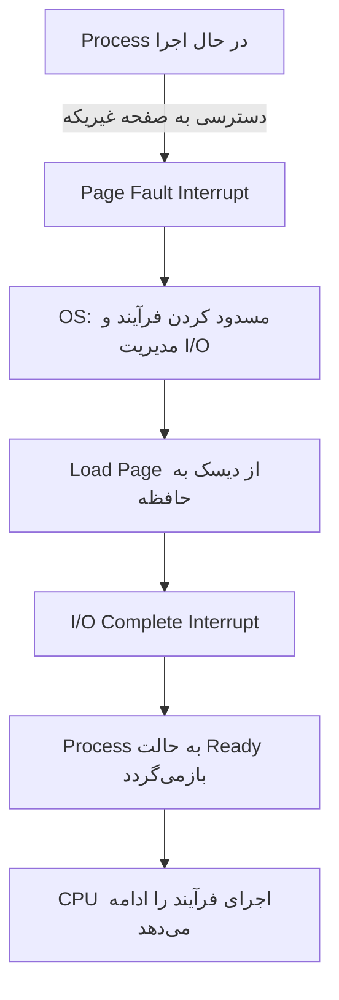

---

### نکات کلیدی

- **Resident Set:** بخشی از فرآیند که در هر لحظه در حافظه اصلی قرار دارد.
    
- **Page Fault:** زمانی رخ می‌دهد که CPU به صفحه‌ای که در حافظه نیست دسترسی می‌خواهد.
    
- **Blocking و Ready:** سیستم عامل فرآیند را موقتاً مسدود می‌کند و بعد از بارگذاری صفحه آن را دوباره آماده می‌کند.
    
- **مزایای حافظه مجازی:**
    
    1. نگهداری تعداد بیشتری فرآیند در حافظه اصلی.
        
    2. امکان اجرای فرآیندهایی که بزرگ‌تر از حافظه اصلی هستند.
        

---
# Thrashing در حافظه مجازی

### توضیح ساده و قابل فهم

این اسلاید درباره پدیده‌ای به نام **Thrashing** در حافظه مجازی صحبت می‌کند:

1. **تعریف Thrashing**
    
    - وقتی سیستم عامل **یک صفحه یا بخش از فرآیند را بارگذاری می‌کند**، ممکن است مجبور شود **یک صفحه دیگر را از حافظه اصلی خارج کند** تا جای صفحه جدید باز شود.
        
    - اگر سیستم **صفحه‌ای را خارج کند که قرار است خیلی زود دوباره استفاده شود**، آن صفحه باید دوباره بارگذاری شود.
        
    - این چرخه دائمی بارگذاری و خارج کردن صفحات، بدون اینکه فرآیندها دستورالعمل‌ها را اجرا کنند، **Thrashing** نامیده می‌شود.
        
2. **نشانه‌های Thrashing**
    
    - زمان CPU برای اجرای دستورالعمل‌ها به شدت کاهش می‌یابد.
        
    - سیستم اکثر وقت خود را صرف **Swap کردن صفحات بین حافظه اصلی و دیسک** می‌کند.
        
    - در نتیجه، **کارایی سیستم بسیار پایین می‌آید**.
        

---

### مثال آموزشی ساده

فرض کنید حافظه اصلی جا برای ۲ صفحه دارد و یک فرآیند نیاز به ۳ صفحه دارد. روند اجرا به صورت زیر است:

|گام|صفحات در حافظه|عملیاتی که رخ می‌دهد|
|---|---|---|
|۱|صفحه ۰, ۱|CPU به صفحه ۲ نیاز دارد → صفحه ۰ خارج می‌شود، صفحه ۲ بارگذاری می‌شود|
|۲|صفحه ۲, ۱|CPU به صفحه ۰ نیاز دارد → صفحه ۱ خارج می‌شود، صفحه ۰ بارگذاری می‌شود|
|۳|صفحه ۰, ۲|CPU به صفحه ۱ نیاز دارد → صفحه ۲ خارج می‌شود، صفحه ۱ بارگذاری می‌شود|

- مشاهده می‌کنیم که سیستم فقط صفحات را جا‌به‌جا می‌کند و **اجرای واقعی دستورالعمل‌ها بسیار کم است**.
    
- این همان **Thrashing** است.
    

---

### نمودار Mermaid: چرخه Thrashing

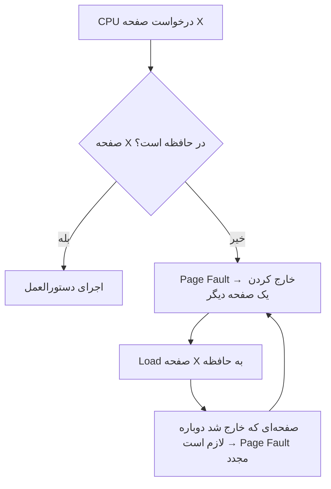

- این نمودار نشان می‌دهد که در **Thrashing** سیستم در چرخه مکرر بارگذاری و خارج کردن صفحات گیر می‌کند.
    

---

### نکات کلیدی

- **Thrashing:** زمانی رخ می‌دهد که سیستم بیش از حد صفحات را جا‌به‌جا می‌کند.
    
- سیستم در حالت Thrashing **بیشتر زمانش را صرف مدیریت حافظه می‌کند تا اجرای واقعی دستورالعمل‌ها**.
    
- **علت اصلی:** اندازه Resident Set یک فرآیند کمتر از حد نیاز واقعی آن است.
    
- **راه حل‌ها:** افزایش اندازه حافظه، کاهش تعداد فرآیندهای همزمان یا استفاده از الگوریتم‌های جایگزینی صفحات بهتر.
    

---

# اصل محلیّت (Principle of Locality) در حافظه مجازی

### توضیح ساده و قابل فهم

این اسلاید به **یکی از اصول پایه حافظه مجازی** به نام **Principle of Locality** می‌پردازد که به سیستم عامل کمک می‌کند **thrashing را کاهش دهد**:

1. **تعریف Principle of Locality**
    
    - در طول اجرای یک فرآیند، **دسترسی‌ها به دستورالعمل‌ها و داده‌ها تمایل دارند در نواحی مشخصی متمرکز شوند**.
        
    - به عبارت دیگر، برنامه‌ها و داده‌ها معمولاً به صورت **خوشه‌ای (clustered)** مورد دسترسی قرار می‌گیرند.
        
2. **Locality انواع مختلف دارد**
    
    - **Temporal Locality (محلیّت زمانی):** اگر یک داده یا دستورالعمل در حال حاضر استفاده شده، احتمال استفاده مجدد آن در کوتاه‌مدت زیاد است.
        
    - **Spatial Locality (محلیّت مکانی):** اگر یک داده یا دستورالعمل استفاده شود، احتمال استفاده از داده‌ها یا دستورالعمل‌های مجاور آن نیز زیاد است.
        
3. **اهمیت Principle of Locality**
    
    - این اصل به سیستم عامل اجازه می‌دهد **حدس‌های هوشمندانه‌ای درباره صفحات مورد نیاز در آینده نزدیک بزند**.
        
    - نتیجه: **کاهش Page Fault** و جلوگیری از Thrashing.
        

---

### مثال آموزشی ساده

فرض کنید فرآیند زیر در حال اجرا است:

```
Instruction sequence: I1, I2, I3, I4, I5, I6
Data sequence: D1, D2, D3
```

- اگر صفحه‌ای که شامل I1 و I2 است در حافظه باشد، احتمالاً **I3 و I4 هم به زودی نیاز خواهند شد** → سیستم عامل می‌تواند پیش‌بینی کند و صفحه بعدی را آماده کند.
    
- همینطور برای داده‌ها: اگر D1 استفاده شد، احتمال استفاده D2 و D3 نیز زیاد است.
    

این پیش‌بینی باعث می‌شود **صفحات درست بارگذاری شوند و Thrashing رخ ندهد**.

---

### نمودار Mermaid: اصل محلیّت در حافظه

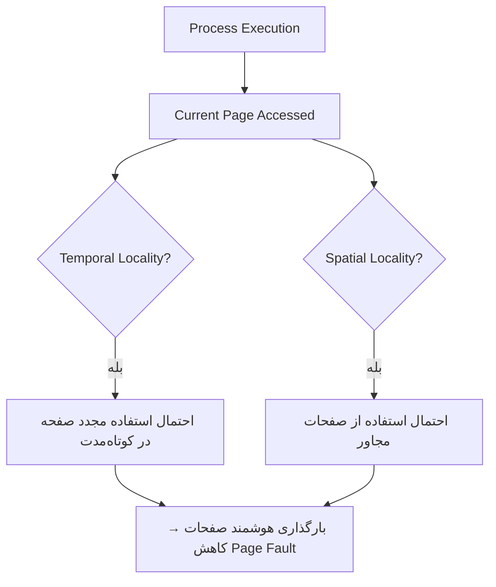

- نمودار نشان می‌دهد که سیستم عامل با استفاده از **محلیّت زمانی و مکانی**، می‌تواند صفحات مورد نیاز را پیش‌بینی کند.
    

---

### نکات کلیدی

- **Principle of Locality:** دسترسی‌های برنامه و داده معمولاً خوشه‌ای هستند.
    
- **Temporal Locality:** استفاده دوباره از یک صفحه در کوتاه‌مدت محتمل است.
    
- **Spatial Locality:** استفاده از صفحات یا داده‌های مجاور محتمل است.
    
- استفاده از این اصل باعث **کاهش Page Fault و جلوگیری از Thrashing** می‌شود.
    
- سیستم عامل می‌تواند با **بارگذاری هوشمند صفحات**، کارایی حافظه مجازی را افزایش دهد.
    

---
# Paging (صفحه‌بندی) در حافظه مجازی

### توضیح ساده و قابل فهم

این اسلاید به **مکانیزم Paging در حافظه مجازی** می‌پردازد:

1. **جدول صفحات (Page Table)**
    
    - هر فرآیند **جدول صفحات مخصوص خودش** را دارد.
        
    - وقتی همه صفحات یک فرآیند در حافظه اصلی قرار می‌گیرند، **جدول صفحات آن فرآیند نیز ایجاد و در حافظه اصلی بارگذاری می‌شود**.
        
    - **کاربرد جدول صفحات:** ترجمه آدرس‌های منطقی به آدرس‌های فیزیکی.
        
2. **شماره قاب (Frame Number)**
    
    - هر خانه در جدول صفحات (Page Table Entry) شامل **شماره قاب (Frame Number)** است که نشان می‌دهد صفحه مربوطه در **کدام بخش از حافظه اصلی** قرار دارد.
        
3. **بیت حضور (Present Bit – P)**
    
    - چون ممکن است **فقط بخشی از صفحات یک فرآیند در حافظه اصلی باشند**، یک بیت در جدول صفحات لازم است تا مشخص شود که آیا صفحه در حافظه اصلی است یا خیر.
        
4. **بیت تغییر (Modify Bit – M)**
    
    - این بیت مشخص می‌کند که **آیا صفحه از آخرین بار که به حافظه اصلی بارگذاری شده، تغییر کرده است یا نه**.
        
    - اگر تغییر کرده باشد و قرار باشد از حافظه خارج شود، باید ابتدا به دیسک بازگردد (Write Back).
        

---

### مثال آموزشی ساده

فرض کنید یک فرآیند با ۴ صفحه داریم و جدول صفحات آن به صورت زیر است:

|Page Number|Frame Number|P (Present)|M (Modified)|
|---|---|---|---|
|0|5|1|0|
|1|9|1|1|
|2|–|0|0|
|3|–|0|0|

- **صفحه 0 و 1** در حافظه اصلی هستند (P=1) و صفحه 1 تغییر کرده است (M=1).
    
- **صفحه 2 و 3** در حافظه اصلی نیستند (P=0). اگر CPU به این صفحات نیاز داشته باشد، **Page Fault** رخ می‌دهد.
    

---

### نمودار Mermaid: ساختار جدول صفحات

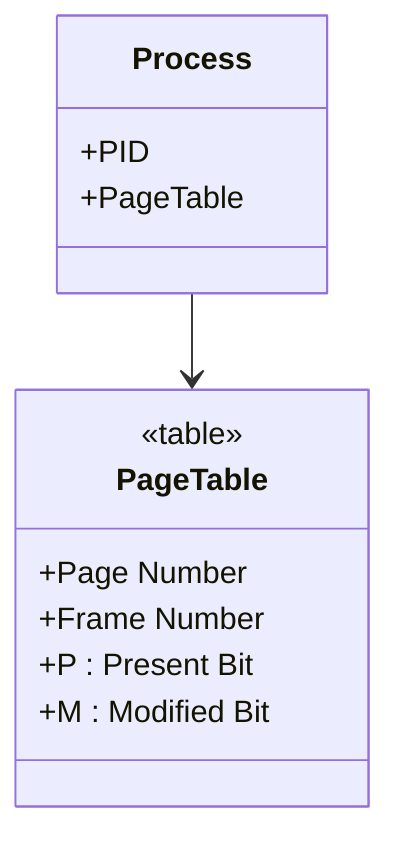

- هر **فرآیند** یک **جدول صفحات** مخصوص دارد.
    
- جدول صفحات شامل **شماره قاب، بیت حضور و بیت تغییر** برای هر صفحه است.
    

---

### نکات کلیدی

- هر فرآیند **جدول صفحات مخصوص خود را دارد**.
    
- جدول صفحات برای **ترجمه آدرس منطقی به فیزیکی** استفاده می‌شود.
    
- **Present Bit (P):** مشخص می‌کند که صفحه در حافظه اصلی است یا خیر.
    
- **Modify Bit (M):** مشخص می‌کند که صفحه تغییر کرده و نیاز به نوشتن روی دیسک دارد یا نه.
    
- این ساختار پایه‌ای است برای **Paging و مدیریت حافظه مجازی** و جلوگیری از بارگذاری غیرضروری صفحات.
    

---
![[Pasted image 20250902114932.png]]

# ساختار جدول صفحه (Page Table Structure)

این اسلاید سه مدل اصلی نگاشت آدرس مجازی به آدرس فیزیکی را نشان می‌دهد:  
۱. **صفحه‌بندی (Paging)**  
۲. **بخش‌بندی (Segmentation)**  
۳. **ترکیب بخش‌بندی و صفحه‌بندی (Segmentation + Paging)**

---

## 1. Paging Only
- آدرس مجازی شامل: **Page Number + Offset**  
- هر ورودی جدول صفحه (Page Table Entry):  
  - **P (Present bit):** آیا صفحه در حافظه هست؟  
  - **M (Modified bit):** آیا صفحه تغییر کرده؟  
  - **Frame number:** شماره قاب (محل قرارگیری صفحه در RAM).  

**نمودار:**
```mermaid
flowchart LR
    A[Virtual Address] -->|Page Number| B[Page Table]
    B -->|Frame Number| C[Physical Address]
    A -->|Offset| C
````

---

## 2. Segmentation Only

- آدرس مجازی شامل: **Segment Number + Offset**
    
- هر ورودی جدول بخش (Segment Table Entry):
    
    - **P, M**: بیت‌های کنترلی
        
    - **Length:** طول بخش
        
    - **Segment Base:** آدرس شروع بخش
        

**نمودار:**

```mermaid
flowchart LR
    A[Virtual Address] -->|Segment Number| B[Segment Table]
    B -->|Base + Length| C[Physical Address]
    A -->|Offset| C
```

---

## 3. Combined Segmentation + Paging

- آدرس مجازی شامل: **Segment Number + Page Number + Offset**
    
- مراحل:
    
    1. **Segment Table** مشخص می‌کند هر بخش از کجا شروع می‌شود.
        
    2. در داخل هر بخش، **Page Table** تعیین می‌کند صفحه در کدام قاب RAM است.
        
- ترکیب انعطاف‌پذیری segmentation با سادگی paging.
    

**نمودار:**

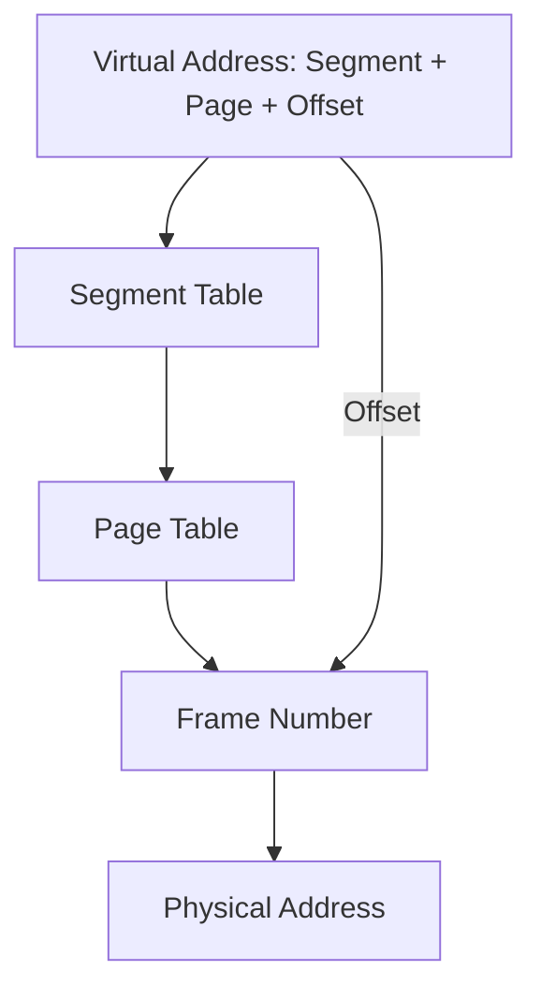

---

## مثال ساده

فرض کنید برنامه‌ای سه بخش دارد: کد، داده، استک.

- با **Segmentation** هر بخش جدا نگهداری می‌شود.
    
- با **Paging** هر بخش به صفحات کوچک تقسیم شده و پراکنده در حافظه ذخیره می‌شود.
    
- با **Segmentation + Paging**: ابتدا بخش انتخاب می‌شود، سپس صفحه داخل آن بخش.
    

---

## نکات کلیدی

- **Paging**: تقسیم حافظه به بلوک‌های یکسان → ساده ولی بدون توجه به منطق برنامه.
    
- **Segmentation**: تقسیم بر اساس ساختار منطقی برنامه (کد، داده، استک).
    
- **Segmentation + Paging**: ترکیب هر دو → مدیریت بهینه‌تر حافظه.
    
- بیت‌های مهم:
    
    - **P (Present):** صفحه/بخش در حافظه است یا نه.
        
    - **M (Modified):** تغییر یافته و نیاز به ذخیره روی دیسک دارد.
        

---
![[Pasted image 20250902115049.png]]
# Address Translation (ترجمه آدرس)

این اسلاید مکانیزم تبدیل **آدرس مجازی** (Virtual Address) به **آدرس فیزیکی** (Physical Address) در سیستم‌های صفحه‌بندی را نشان می‌دهد.

---

## مراحل ترجمه
1. **برنامه** یک آدرس مجازی تولید می‌کند:  
   - شامل دو بخش:  
     - **Page Number** (شماره صفحه)  
     - **Offset** (جابه‌جایی داخل صفحه)  

2. **رجیستر پایه جدول صفحه** (Page Table Base Register) → مکان شروع جدول صفحه را نگه می‌دارد.  

3. **Page Number** + مقدار رجیستر پایه → آدرس ورودی مربوط در جدول صفحه.  

4. جدول صفحه مقدار **Frame Number** (شماره قاب در حافظه اصلی) را برمی‌گرداند.  

5. با ترکیب **Frame Number + Offset** → آدرس فیزیکی ساخته می‌شود.  

6. در نهایت این آدرس در **Main Memory** به داده واقعی اشاره می‌کند.  

---

## دیاگرام
```mermaid
flowchart TD
    A[Virtual Address] -->|Page # + Offset| B[Page Table Base Register]
    B --> C[Page Table Lookup]
    C --> D[Frame Number]
    A -->|Offset| D
    D --> E[Physical Address]
    E --> F[Main Memory]
````

---

## مثال ساده

- فرض کنید آدرس مجازی = (Page=2, Offset=50)
    
- جدول صفحه نشان می‌دهد که **Page 2 → Frame 7**
    
- آدرس فیزیکی = (Frame 7, Offset 50)
    

---

## نکات کلیدی

- **Virtual Address = Page # + Offset**
    
- **Physical Address = Frame # + Offset**
    
- جدول صفحه (Page Table) نقش نگاشت را دارد.
    
- رجیستر پایه جدول صفحه مشخص می‌کند جدول در حافظه کجاست.
    
---

# Process Page Table (جدول صفحه هر فرآیند)

---

## توضیح
- در اغلب سیستم‌ها، **هر فرآیند یک جدول صفحه (Page Table) جداگانه** دارد.  
- چون هر فرآیند می‌تواند فضای مجازی بسیار بزرگی داشته باشد، جدول صفحه ممکن است بسیار بزرگ شود.  

---

## مثال: معماری VAX
- فضای آدرس مجازی هر فرآیند: $2^{31} = 2$ گیگابایت  
- اندازه هر صفحه: $2^9 = 512$ بایت  
- بنابراین:  
  - تعداد صفحات مورد نیاز = $\frac{2^{31}}{2^9} = 2^{22}$  
  - پس هر فرآیند نیازمند $2^{22}$ ورودی در جدول صفحه است.  

---

## دیاگرام
```mermaid
flowchart TD
    A[Process] --> B[Page Table]
    B -->|Page 0 → Frame| C[Main Memory]
    B -->|Page 1 → Frame| C
    B -->|Page N → Frame| C
````

---

## مثال ساده

فرض کنید فرآیندی 1GB فضای آدرس مجازی دارد و اندازه هر صفحه 1KB است:

- تعداد صفحات = 1GB1KB=1M=220\frac{1GB}{1KB} = 1M = 2^{20}
    
- پس جدول صفحه باید **حداقل یک میلیون ورودی** داشته باشد.
    

---

## نکات کلیدی

- هر فرآیند معمولاً یک **Page Table** اختصاصی دارد.
    
- اندازه جدول صفحه به بزرگی فضای آدرس و اندازه صفحه وابسته است.
    
- جدول‌های صفحه می‌توانند بسیار بزرگ باشند (مثلاً میلیون‌ها ورودی).
    

---
![[Pasted image 20250902115322.png]]

# A Two-Level Hierarchical Page Table (جدول صفحه سلسله‌مراتبی دو سطحی)

---

## ایده اصلی
- مشکل: جدول صفحه برای هر فرآیند می‌تواند **خیلی بزرگ** باشد.  
- راه‌حل: تقسیم جدول صفحه به **چند سطح** → به جای یک جدول عظیم، چند جدول کوچک‌تر و پویا.  
- در این ساختار:  
  1. **Root Page Table** (جدول صفحه ریشه)  
  2. **User Page Table** (جدول صفحه سطح دوم)  
  3. **User Address Space** (فضای آدرس کاربر)  

---

## مراحل دسترسی
1. آدرس مجازی به چند بخش تقسیم می‌شود:  
   - **Root Index** (انتخاب ورودی از جدول ریشه)  
   - **User Page Index** (انتخاب ورودی از جدول صفحه سطح دوم)  
   - **Offset** (جابه‌جایی داخل صفحه)  

2. ابتدا جدول ریشه → مکان جدول صفحه کاربر را نشان می‌دهد.  
3. سپس جدول صفحه کاربر → مکان فریم حافظه را مشخص می‌کند.  
4. در نهایت با Offset → آدرس فیزیکی ساخته می‌شود.  

---

## دیاگرام
```mermaid
flowchart TD
    A[Virtual Address] -->|Root Index| B[Root Page Table]
    B --> C[User Page Table]
    A -->|User Page Index| C
    C --> D[Frame Number]
    A -->|Offset| D
    D --> E[Physical Address in Main Memory]
````

---

## مثال ساده

- فرض کنید آدرس مجازی 32 بیتی باشد.
    
    - 10 بیت اول → انتخاب ورودی از Root Page Table
        
    - 10 بیت بعدی → انتخاب ورودی از User Page Table
        
    - 12 بیت آخر → Offset
        
- با این روش فقط جدول‌های لازم ساخته می‌شوند (نه همه‌ی فضای آدرس).
    

---

## مزایا

- کاهش اندازه جدول صفحه.
    
- فقط بخش‌هایی از فضای آدرس که واقعاً استفاده می‌شوند، جدول صفحه دارند.
    

---

## نکات کلیدی

- **Hierarchical Paging** برای حل مشکل بزرگی جدول صفحه معرفی شده است.
    
- ساختار دو سطحی شامل: Root Page Table + User Page Table.
    
- آدرس مجازی به چند بخش تقسیم می‌شود.
    
- مزیت: حافظه کمتری برای نگهداری جدول‌ها نیاز است.
    
---
![[Pasted image 20250902115437.png]]

..
.
.
```
توضیحات فراموش نشه
```

---

# Inverted Page Table (IPT)

## ایده اصلی

- به‌جای داشتن یک جدول صفحه بزرگ برای هر فرآیند، تنها **یک جدول صفحه معکوس** برای کل سیستم وجود دارد.
    
- در این جدول، هر **فریم فیزیکی** در حافظه‌ی اصلی دقیقاً یک ورودی دارد (نه هر صفحه مجازی).
    

---

## سازوکار

1. **آدرس مجازی** به دو بخش تقسیم می‌شود:
    
    - شماره‌ی صفحه مجازی (Virtual Page Number)
        
    - Offset
        
2. به‌جای جستجوی مستقیم:
    
    - شماره صفحه مجازی → توسط **تابع هش** به یک مقدار Hash تبدیل می‌شود.
        
    - Hash → اشاره‌گر به **جدول صفحه معکوس**.
        
3. جدول معکوس:
    
    - شامل اطلاعات مربوط به اینکه کدام **صفحه مجازی** روی کدام **فریم فیزیکی** قرار دارد.
        
    - هر فریم حافظه اصلی یک ورودی دارد.
        

---

## دیاگرام ساده

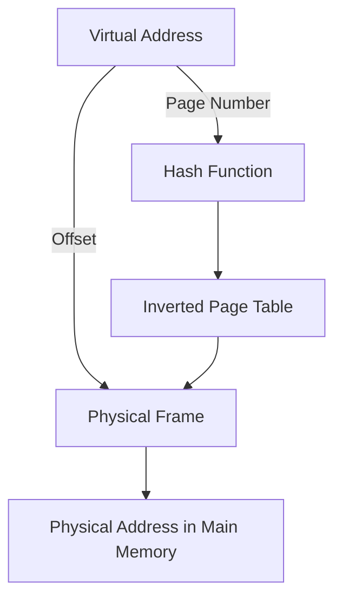

---

## مزایا

- تنها به اندازه **تعداد فریم‌های حافظه اصلی** ورودی نیاز دارد (ثابت).
    
- صرفه‌جویی قابل توجه در حافظه برای جدول‌های صفحه.
    
- مستقل از تعداد فرآیندها یا اندازه فضای آدرس مجازی.
    

---

## معایب

- نیاز به **محاسبه‌ی هش** → زمان بیشتر برای آدرس‌دهی.
    
- امکان برخورد (Collision) در هش → نیاز به بررسی زنجیره‌ای (chaining).
    
- پیچیدگی بیشتر در پیاده‌سازی نسبت به جدول‌های چندسطحی.
    

---

## نکته کلیدی

- **IPT یک جدول جهانی برای کل سیستم است** (نه برای هر فرآیند جداگانه).
    
- مقیاس آن بر اساس **فریم‌های فیزیکی** است، نه صفحات مجازی.
    

---

![[Pasted image 20250902115620.png]]
```
توضیحات لازمه
.
.

```

---

# Translation Lookaside Buffer (TLB)

## مشکل

- در سیستم حافظه مجازی، هر **ارجاع به آدرس مجازی** نیازمند **۲ دسترسی حافظه** است:
    
    1. دسترسی به حافظه برای پیدا کردن **Page Table Entry (PTE)**
        
    2. دسترسی به حافظه برای آوردن **داده واقعی**
        
- این فرآیند کند است چون عملاً دو برابر زمان می‌برد.
    

---

## راه‌حل: TLB

- برای حل مشکل، از یک **حافظه‌ی کش با سرعت بالا** استفاده می‌شود به نام **Translation Lookaside Buffer (TLB)**.
    
- TLB شامل **صفحات اخیراً استفاده‌شده** است.
    
- مشابه کش پردازنده عمل می‌کند، ولی مخصوص **Page Table Entries** است.
    

---

## نحوه عملکرد

1. پردازنده هنگام دسترسی به آدرس مجازی → اول TLB بررسی می‌شود.
    
    - **TLB Hit:** آدرس فیزیکی بلافاصله پیدا می‌شود → تنها ۱ بار دسترسی به حافظه (برای داده).
        
    - **TLB Miss:** باید ابتدا Page Table در حافظه جستجو شود → سپس PTE جدید به TLB بارگذاری می‌شود.
        

---

## دیاگرام ساده

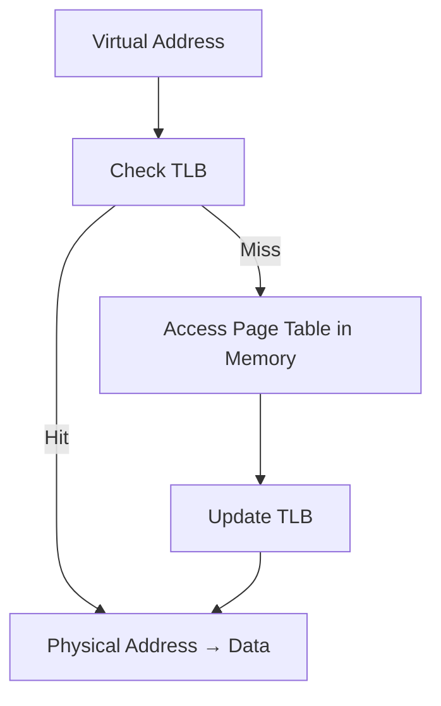

---

## مزایا

- کاهش چشمگیر **زمان دسترسی به حافظه**.
    
- بهره‌وری بیشتر نسبت به استفاده مستقیم از Page Table.
    
- بهره‌وری بالا مخصوصاً برای برنامه‌هایی با **locality بالا** (صفحات تکراری در مدت کوتاه).
    

---

## نکته کلیدی

- TLB یک **کش سخت‌افزاری کوچک اما بسیار سریع** است.
    
- به‌طور معمول فقط **چند صد ورودی** دارد.
    

---

# Translation Lookaside Buffer (TLB) – Workflow

## مراحل دسترسی به آدرس مجازی

1. پردازنده آدرس مجازی (Virtual Address) تولید می‌کند.
    
2. **بررسی TLB**:
    
    - اگر **TLB Hit** → شماره‌ی Frame مستقیم گرفته می‌شود → آدرس واقعی ساخته می‌شود.
        
    - اگر **TLB Miss** → باید Page Table بررسی شود.
        
3. در صورت **TLB Miss**:
    
    - پردازنده شماره صفحه (Page Number) را در جدول صفحه (Page Table) جستجو می‌کند.
        
    - اگر **Present Bit = 1** → صفحه در حافظه اصلی است → Frame Number گرفته می‌شود.
        
    - سپس TLB با این ورودی جدید **به‌روزرسانی** می‌شود.
        

---

## جدول مقایسه TLB Hit و TLB Miss

|وضعیت|عمل انجام‌شده|تعداد دسترسی حافظه|توضیح|
|---|---|---|---|
|**TLB Hit**|Frame از TLB گرفته می‌شود|1 (فقط داده)|سریع‌ترین حالت|
|**TLB Miss + Page موجود در RAM**|ابتدا Page Table بررسی می‌شود، سپس TLB آپدیت|2 (Page Table + Data)|کندتر از Hit ولی بدون Page Fault|
|**TLB Miss + Page روی دیسک (Page Fault)**|باید صفحه از دیسک به RAM آورده شود، سپس TLB آپدیت|خیلی زیاد (هزینه دیسک)|کندترین حالت|

---

## دیاگرام فرآیند

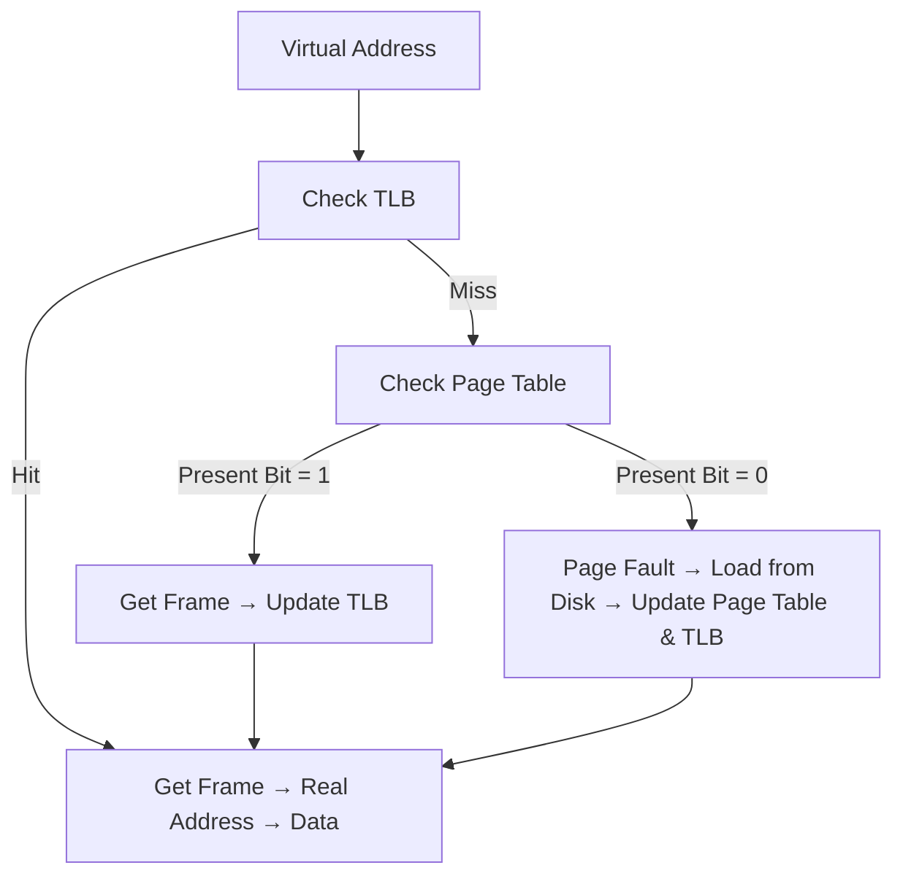

---

![[Pasted image 20250907074524.png]]

## Translation Lookaside Buffer (TLB) – خلاصه روند شکل

1. **Virtual Address** به دو قسمت تقسیم میشه:
    
    - **Page #**
        
    - **Offset**
        
2. **بررسی در TLB**:
    
    - اگر **TLB Hit** → مستقیماً Frame # پیدا میشه → آدرس واقعی ساخته میشه → داده از حافظه اصلی (Main Memory) خونده میشه.
        
    - اگر **TLB Miss** → پردازنده باید **Page Table** رو نگاه کنه.
        
        - اگر صفحه موجود باشه (Present Bit = 1) → Frame # پیدا میشه، TLB آپدیت میشه.
            
        - اگر موجود نباشه → **Page Fault** رخ میده → صفحه از Secondary Memory (مثل دیسک) بارگذاری میشه توی RAM → Page Table و TLB آپدیت میشن.
            
3. در نهایت، **Real Address** = Frame # + Offset ساخته میشه.
    

---

این تصویر ۳ حالت اصلی رو نشون میده:

- **TLB Hit** → سریع‌ترین
    
- **TLB Miss ولی Page موجود در RAM** → کندتر
    
- **TLB Miss + Page Fault (نیاز به دیسک)** → خیلی کند
    

---

![[Pasted image 20250907074646.png]]
 این شکل داره دو روش مختلف استفاده از **Translation Lookaside Buffer (TLB)** رو نشون می‌ده:

---

## 1. Direct Mapping (سمت چپ)

- پردازنده از **Virtual Address (Page # + Offset)** استفاده می‌کنه.
    
- **Page #** میره به Page Table.
    
- از اونجا **Frame #** پیدا میشه.
    
- در نهایت، **Real Address = Frame # + Offset** ساخته میشه.
    
- این روش مستقیمه، اما زمان بیشتری می‌بره چون همیشه باید Page Table رو نگاه کنیم.
    

---

## 2. Associative Mapping (سمت راست)

- پردازنده باز هم **Virtual Address (Page # + Offset)** رو می‌سازه.
    
- **Page #** وارد **TLB (Translation Lookaside Buffer)** میشه.
    
- در TLB به‌صورت **Associative Search (جستجوی موازی)** بررسی میشه که آیا این Page # قبلاً ترجمه شده یا نه:
    
    - اگر باشه (**TLB Hit**) → سریع Frame # پیدا میشه → Real Address ساخته میشه.
        
    - اگر نباشه (**TLB Miss**) → باید بریم سراغ Page Table → Frame # بیاریم → TLB آپدیت کنیم.
        

---

✅ نتیجه:

- **Direct Mapping** → کندتر، چون همیشه باید از Page Table کمک بگیریم.
    
- **Associative Mapping (TLB)** → سریع‌تر، چون بیشتر وقت‌ها مستقیماً Frame # از TLB گرفته میشه.
    

---

![[Pasted image 20250907074810.png]]
این شکل تعامل **TLB** و **Cache** رو نشون می‌ده:

---

## 1. TLB Operation (سمت چپ)

- آدرس مجازی = Page # + Offset.
    
- **TLB** بررسی می‌کنه:
    
    - **TLB hit** → مستقیماً Frame # می‌گیریم.
        
    - **TLB miss** → باید از **Page Table** در حافظه اصلی Frame # رو بیاریم و بعد TLB رو آپدیت کنیم.
        

---

## 2. Cache Operation (سمت راست)

- بعد از تشکیل **Real Address (Frame # + Offset)** → وارد Cache میشه.
    
- Cache بررسی می‌کنه:
    
    - **Hit** → داده سریعاً برگردونده میشه.
        
    - **Miss** → داده از حافظه اصلی (Main Memory) آورده میشه و در Cache ذخیره میشه.
        

---

✅ نتیجه نهایی:

- **TLB** سرعت ترجمه آدرس (Virtual → Physical) رو بالا می‌بره.
    
- **Cache** سرعت دسترسی به داده‌های حافظه اصلی رو بالا می‌بره.
    
- این دو با هم ترکیب بشن، دسترسی حافظه خیلی سریع‌تر میشه چون هم lookup سریع‌تره هم داده‌ها در cache نزدیک CPU هستن.
    

---

# Page Size (اندازه صفحه) در حافظه مجازی

### توضیح ساده و قابل فهم

یکی از **تصمیم‌های مهم در طراحی سخت‌افزار و سیستم عامل** تعیین **اندازه صفحه (Page Size)** است. انتخاب اندازه صفحه بر چندین عامل اثر دارد:

---

#### 1. **Internal Fragmentation (قطعه‌بندی داخلی)**

- **صفحات کوچک‌تر → قطعه‌بندی داخلی کمتر**
    
    - چون فضای خالی بلااستفاده درون یک صفحه کوچک‌تر خواهد بود.
        
    - مثال: اگر یک فرآیند به 4100 بایت نیاز داشته باشد و اندازه صفحه 4KB باشد، یک صفحه کامل (4096 بایت) + 4 بایت دیگر استفاده می‌شود. → 4092 بایت هدر می‌رود.
        
- **صفحات بزرگ‌تر → قطعه‌بندی داخلی بیشتر**
    
    - فضای خالی بیشتری هدر می‌رود چون ممکن است آخرین صفحه فرآیند به‌طور کامل پر نشود.
        

---

#### 2. **تعداد صفحات و اندازه جدول صفحات**

- **صفحات کوچک‌تر → تعداد صفحات بیشتر** برای هر فرآیند.
    
- این یعنی جدول صفحات بزرگ‌تر می‌شود و فضای بیشتری از حافظه اصلی باید صرف نگهداری Page Table شود.
    
- اگر جدول صفحات خیلی بزرگ باشد، بخشی از آن باید در حافظه مجازی نگهداری شود.
    
- در این حالت، ممکن است **یک دسترسی ساده به حافظه باعث دو Page Fault شود**:
    
    1. یکی برای پیدا کردن ورودی جدول صفحه.
        
    2. دیگری برای دسترسی به خود صفحه مورد نظر.
        

---

#### 3. **ویژگی سخت‌افزار ذخیره‌سازی ثانویه (Secondary Storage)**

- بیشتر دستگاه‌های ذخیره‌سازی (مثل دیسک سخت سنتی) **چرخشی هستند** و از بلوک‌های بزرگ داده برای انتقال بهینه استفاده می‌کنند.
    
- بنابراین **صفحات بزرگ‌تر** برای **انتقال بلوک‌های بزرگ داده** کارایی بیشتری دارند.
    

---

### مثال آموزشی ساده

- اگر اندازه صفحه **1KB** باشد و فرآیندی به **8MB** حافظه نیاز داشته باشد → به **8192 صفحه** نیاز است.
    
- اما اگر اندازه صفحه **4KB** باشد → فقط به **2048 صفحه** نیاز است.
    
- در حالت 1KB، جدول صفحات 4 برابر بزرگ‌تر خواهد بود.
    

این نشان می‌دهد که انتخاب اندازه صفحه یک **تبادل (Trade-off)** بین کاهش قطعه‌بندی داخلی و افزایش کارایی مدیریت جدول صفحات است.

---

### نمودار Mermaid: تأثیر اندازه صفحه

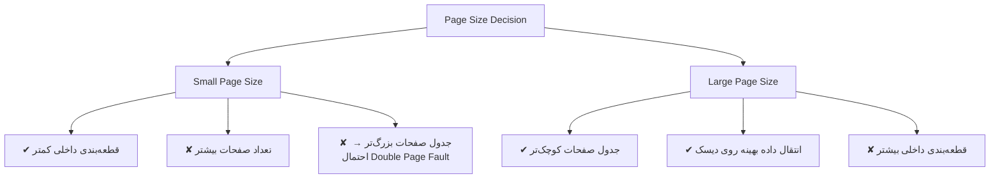

---

### نکات کلیدی

- انتخاب اندازه صفحه (Page Size) یک تصمیم حیاتی در طراحی سیستم است.
    
- **صفحات کوچک‌تر:** قطعه‌بندی داخلی کمتر، اما جدول صفحات بزرگ‌تر.
    
- **صفحات بزرگ‌تر:** جدول صفحات کوچک‌تر و کارایی I/O بیشتر، اما قطعه‌بندی داخلی بیشتر.
    
- در سیستم‌های واقعی، اندازه صفحه معمولاً یک **توازن (Trade-off)** بین این عوامل است (مثل 4KB یا 8KB).
    
- اندازه صفحه تأثیر مستقیمی بر **کارایی حافظه مجازی** دارد.
    

---
![[Pasted image 20250907075300.png]]
# رفتار معمولی صفحه‌بندی یک برنامه (Typical Paging Behavior)

### (a) نمودار سمت چپ – نرخ Page Fault در برابر اندازه صفحه (Page Size)

- محور افقی: **اندازه صفحه (Page Size)**
    
- محور عمودی: **نرخ Page Fault**
    

**تحلیل:**

1. در ابتدا، وقتی **اندازه صفحه خیلی کوچک است**:
    
    - Page Table بسیار بزرگ می‌شود.
        
    - احتمال وقوع **Double Page Fault** افزایش می‌یابد.
        
    - به همین دلیل، نرخ Page Fault بالاست.
        
2. وقتی اندازه صفحه کمی افزایش می‌یابد:
    
    - سیستم تعادلی بین **هزینه جدول صفحات** و **قطعه‌بندی داخلی** برقرار می‌کند.
        
    - نرخ Page Fault کاهش پیدا می‌کند.
        
3. اگر اندازه صفحه بیش از حد بزرگ شود:
    
    - **قطعه‌بندی داخلی (Internal Fragmentation)** شدید می‌شود.
        
    - نرخ Page Fault دوباره افزایش می‌یابد.
        

→ بنابراین یک **اندازه بهینه صفحه (Optimal Page Size)** وجود دارد که نرخ Page Fault را حداقل می‌کند.

---

### (b) نمودار سمت راست – نرخ Page Fault در برابر تعداد قاب‌های اختصاص داده شده

- محور افقی: **تعداد قاب‌های اختصاص داده شده به فرآیند** (از ۰ تا N = تعداد کل صفحات فرآیند).
    
- محور عمودی: **نرخ Page Fault**
    

**تحلیل:**

1. اگر تعداد قاب‌ها خیلی کم باشد:
    
    - Resident Set کوچک است.
        
    - نرخ Page Fault خیلی زیاد است (چون فرآیند مدام نیاز به صفحات جدید دارد).
        
2. وقتی تعداد قاب‌ها افزایش یابد:
    
    - نرخ Page Fault کاهش شدیدی پیدا می‌کند.
        
3. در نقطه‌ای که برابر با **Working Set Size (W)** است:
    
    - فرآیند تقریباً همه صفحات مورد نیاز خود را در حافظه دارد.
        
    - از اینجا به بعد، افزودن قاب‌های بیشتر تأثیر کمی دارد.
        

---

### مثال آموزشی ساده

فرض کنید یک فرآیند شامل ۱۰۰ صفحه است و اندازه Working Set آن ۲۰ صفحه است:

- اگر فقط ۵ قاب به فرآیند بدهیم → نرخ Page Fault بسیار زیاد می‌شود (Thrashing).
    
- اگر ۲۰ قاب بدهیم → فرآیند تقریباً بدون Page Fault اجرا می‌شود.
    
- اگر ۴۰ قاب بدهیم → تفاوت زیادی با حالت ۲۰ قاب ندارد، چون بیش از نیاز فرآیند حافظه تخصیص داده‌ایم.
    

---
### نکات کلیدی

- **Page Size:**
    
    - کوچک‌تر → Page Table بزرگ‌تر، Double Page Fault
        
    - بزرگ‌تر → Internal Fragmentation بیشتر
        
    - یک اندازه بهینه وجود دارد.
        
- **تعداد قاب‌ها (Page Frames):**
    
    - کمتر از Working Set → نرخ Page Fault بالا، احتمال Thrashing
        
    - برابر یا بیشتر از Working Set → نرخ Page Fault خیلی کم
        
    - بیشتر از Working Set → بهبود قابل توجهی ندارد.
        

---

# Segmentation (بخش‌بندی حافظه)

### توضیح ساده و قابل فهم

**Segmentation** یک روش مدیریت حافظه است که در آن حافظه به چندین **بخش (Segment)** تقسیم می‌شود. هر بخش می‌تواند اندازه متفاوتی داشته باشد و حتی اندازه‌اش در زمان اجرا تغییر کند.

1. **ویژگی اصلی Segmentation**
    
    - حافظه نه به صورت صفحات ثابت، بلکه به صورت **بخش‌های منطقی** دیده می‌شود.
        
    - هر بخش می‌تواند مربوط به یک **ماژول برنامه، تابع، آرایه یا داده خاص** باشد.
        
    - اندازه بخش‌ها می‌تواند **نامساوی و پویا** باشد.
        
2. **مزایای Segmentation**
    
    - **مدیریت راحت‌تر ساختارهای داده در حال رشد:** مثلاً یک آرایه که در طول اجرای برنامه بزرگ‌تر می‌شود می‌تواند در یک Segment مجزا قرار گیرد.
        
    - **انعطاف در توسعه و تغییر برنامه:** اگر بخشی از برنامه تغییر کند، فقط همان Segment تغییر می‌کند و نیازی به بارگذاری مجدد کل برنامه نیست.
        
    - **اشتراک‌گذاری میان فرآیندها:** چندین فرآیند می‌توانند یک Segment (مثل کتابخانه مشترک) را استفاده کنند.
        
    - **امکان حفاظت (Protection):** هر Segment می‌تواند مجوز دسترسی مخصوص خودش را داشته باشد (Read/Write/Execute).
        

---

### مثال آموزشی ساده

فرض کنید برنامه‌ای شامل سه بخش است:

- **کد (Code Segment)**: شامل دستورالعمل‌های برنامه.
    
- **داده (Data Segment)**: شامل متغیرها و آرایه‌ها.
    
- **پشته (Stack Segment)**: شامل فراخوانی توابع و متغیرهای محلی.
    

هر کدام از این بخش‌ها در حافظه به صورت یک Segment مجزا نگهداری می‌شوند و می‌توانند به طور مستقل رشد کنند یا تغییر کنند.

---
### نکات کلیدی

- **Segmentation** حافظه را به بخش‌های منطقی تقسیم می‌کند (کد، داده، پشته و ...).
    
- بخش‌ها می‌توانند **اندازه متفاوت و پویا** داشته باشند.
    
- مزایا:
    
    1. مدیریت ساده ساختارهای در حال رشد.
        
    2. امکان تغییر و بازکامپایل بخشی از برنامه بدون تأثیر روی کل.
        
    3. قابلیت اشتراک‌گذاری بین فرآیندها.
        
    4. اعمال حفاظت (Permissions) بر اساس Segment.
        

---


# Segmentation Table (جدول بخش‌بندی حافظه)

### توضیح ساده و قابل فهم

برای مدیریت **Segmentation**، سیستم عامل از یک **Segment Table** استفاده می‌کند. این جدول برای هر فرآیند ایجاد می‌شود و اطلاعات مربوط به بخش‌های مختلف آن فرآیند را نگهداری می‌کند.

هر ورودی (Entry) در جدول بخش‌بندی شامل موارد زیر است:

1. **Starting Address (آدرس شروع بخش در حافظه اصلی)**
    
    - نشان می‌دهد که بخش مربوطه از کدام آدرس در حافظه اصلی آغاز می‌شود.
        
2. **Length (طول بخش)**
    
    - مشخص می‌کند که بخش چه اندازه‌ای دارد.
        
    - این ویژگی باعث می‌شود که حافظه بتواند بخش‌هایی با اندازه‌های متغیر و پویا را مدیریت کند.
        
3. **Present Bit (بیت حضور)**
    
    - مشخص می‌کند که آیا این بخش در حال حاضر در حافظه اصلی وجود دارد یا نه.
        
    - اگر نباشد و پردازنده به آن دسترسی بخواهد → **Segment Fault** رخ می‌دهد و سیستم عامل باید آن را از دیسک بارگذاری کند.
        
4. **Modify Bit (بیت تغییر)**
    
    - مشخص می‌کند که آیا محتویات بخش از آخرین باری که به حافظه اصلی بارگذاری شده، تغییر کرده است یا نه.
        
    - اگر تغییر کرده باشد و بخواهیم آن را از حافظه خارج کنیم، باید قبلش روی دیسک ذخیره شود (Write Back).
        

---

### مثال آموزشی ساده

فرض کنید یک فرآیند شامل ۳ بخش است:

|Segment #|Starting Address|Length|Present (P)|Modified (M)|
|---|---|---|---|---|
|0 (Code)|1000|2000|1|0|
|1 (Data)|5000|1500|1|1|
|2 (Stack)|–|1000|0|0|

- بخش **Code** در حافظه اصلی است (P=1) و تغییری نکرده (M=0).
    
- بخش **Data** در حافظه اصلی است (P=1) و تغییر کرده است (M=1) → اگر بخواهیم آن را خارج کنیم، باید روی دیسک ذخیره شود.
    
- بخش **Stack** در حافظه اصلی نیست (P=0) → اگر CPU به آن دسترسی بخواهد، **Segment Fault** رخ می‌دهد.
    

---

### نمودار Mermaid: ساختار جدول بخش‌بندی

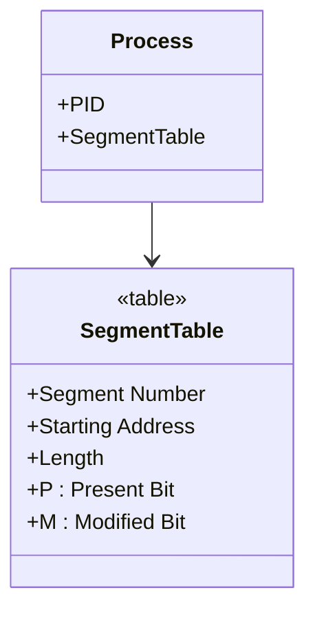

---

### نکات کلیدی

- **Segment Table** برای هر فرآیند ایجاد می‌شود.
    
- هر ورودی شامل:
    
    - آدرس شروع بخش
        
    - طول بخش
        
    - بیت حضور (P) → نشان می‌دهد بخش در حافظه است یا نه
        
    - بیت تغییر (M) → نشان می‌دهد بخش تغییر کرده یا نه
        
- اگر P=0 و CPU به آن بخش نیاز داشته باشد → **Segment Fault** رخ می‌دهد.
    
- اگر M=1 و بخواهیم بخش را خارج کنیم → باید ابتدا روی دیسک ذخیره شود.
    

---
![[Pasted image 20250907075719.png]]

# Address Translation در Segmentation

### توضیح ساده و قابل فهم

1. **آدرس مجازی (Virtual Address)**
    
    - هر آدرس مجازی از دو بخش تشکیل می‌شود:
        
        - **Segment Number (شماره بخش)**
            
        - **Offset (جابجایی داخل بخش = d)**
            
    
    مثال: اگر برنامه بخواهد به متغیر داخل بخش داده (Data Segment) دسترسی پیدا کند، آدرس آن به صورت `(Seg#, d)` بیان می‌شود.
    

---

2. **Segmentation Table**
    
    - پردازنده ابتدا از **Segment Number** استفاده می‌کند تا ورودی متناظر در جدول بخش‌ها (Segment Table) را پیدا کند.
        
    - هر ورودی شامل:
        
        - **Base (آدرس شروع بخش در حافظه اصلی)**
            
        - **Length (طول بخش)**
            

---

3. **بررسی اعتبار آدرس**
    
    - اگر **Offset (d) > Length** باشد → دسترسی غیرمجاز است و خطای **Segmentation Fault** رخ می‌دهد.
        
    - در غیر این صورت، دسترسی معتبر است.
        

---

4. **محاسبه آدرس فیزیکی**
    
    - **Physical Address = Base + Offset**
        
    - بدین ترتیب آدرس فیزیکی به دست می‌آید و از حافظه اصلی بازیابی می‌شود.
        

---

### مثال آموزشی ساده

فرض کنید:

- Segment #2 دارای Base = 4000 و Length = 1000 است.
    
- برنامه می‌خواهد به آدرس `(Seg=2, d=200)` دسترسی پیدا کند.
    

محاسبه:

- `Physical Address = 4000 + 200 = 4200`
    
- چون 200 < Length (1000)، دسترسی معتبر است.
    

اما اگر `(Seg=2, d=1500)` بود:

- چون 1500 > Length (1000)، خطای **Segmentation Fault** رخ می‌دهد.
    

---
### نکات کلیدی

- آدرس مجازی = `(Segment Number, Offset)`
    
- جدول بخش‌ها شامل **Base** و **Length** هر بخش است.
    
- اگر **Offset > Length** → Segmentation Fault
    
- اگر معتبر باشد:
    
    - آدرس فیزیکی = Base + Offset
        
    - دسترسی به حافظه اصلی انجام می‌شود.
        

---
# Combined Paging and Segmentation

### توضیح ساده و قابل فهم

هرکدام از دو روش **Paging** و **Segmentation** مزایا و معایب خاص خودشان را دارند:

1. **Paging (صفحه‌بندی)**
    
    - برای برنامه‌نویس **شفاف** است (یعنی برنامه‌نویس نیازی ندارد به آن فکر کند).
        
    - مشکل **external fragmentation (تکه‌تکه شدن خارجی)** را برطرف می‌کند.
        
    - استفاده‌ی کارآمدتری از حافظه اصلی می‌دهد.
        
2. **Segmentation (بخش‌بندی)**
    
    - برای برنامه‌نویس **قابل مشاهده** است (برنامه‌نویس می‌تواند بخش‌های مختلف مثل Code, Data, Stack را ببیند).
        
    - مدیریت راحت‌تر ساختارهای داده‌ای در حال رشد (مثل آرایه‌ها).
        
    - پشتیبانی از **modularity (ماژولار بودن برنامه)**.
        
    - امکان **اشتراک‌گذاری (Sharing)** و **حفاظت (Protection)** در سطح بخش‌ها.
        

---

### ایده‌ی ترکیب

برای این که هم از **مزایای Paging** و هم از **مزایای Segmentation** استفاده کنیم، برخی سیستم‌ها سخت‌افزار پردازنده و نرم‌افزار سیستم‌عامل را طوری طراحی می‌کنند که هر دو مکانیزم با هم ترکیب شوند:

- هر فرآیند ابتدا به صورت **Segments** تقسیم می‌شود (مطابق نیاز منطقی برنامه).
    
- سپس هر Segment به **Pages** تقسیم می‌شود تا مشکل تکه‌تکه شدن خارجی (external fragmentation) حل شود.
    
- در نتیجه:
    
    - برنامه‌نویس هنوز می‌تواند با بخش‌ها (Segments) کار کند.
        
    - سیستم‌عامل حافظه را به صورت صفحات مدیریت می‌کند و از مزایای Paging بهره می‌برد.
        

---

### مثال آموزشی ساده

فرض کنید یک برنامه سه بخش دارد:

- Code (کد برنامه)
    
- Data (داده‌ها)
    
- Stack (پشته)
    

در **سیستم ترکیبی**:

- هر بخش (Segment) جداگانه تعریف می‌شود.
    
- سپس هر بخش به صفحات کوچکتر (Pages) تقسیم شده و در حافظه قرار می‌گیرد.
    

---

### نمودار Mermaid: ترکیب Paging و Segmentation

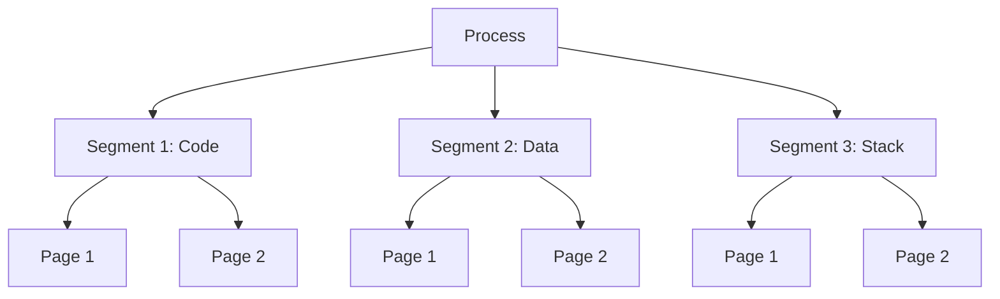

---

### نکات کلیدی

- **Paging** → شفاف برای برنامه‌نویس، حذف external fragmentation، کارایی حافظه بالا.
    
- **Segmentation** → قابل مشاهده برای برنامه‌نویس، پشتیبانی از رشد داده‌ها، ماژولار بودن، حفاظت و اشتراک‌گذاری.
    
- **ترکیب Paging + Segmentation**:
    
    - برنامه به بخش‌ها تقسیم می‌شود.
        
    - هر بخش به صفحات تقسیم می‌شود.
        
    - بهترین ویژگی‌های هر دو روش با هم به دست می‌آید.
        

---
![[Pasted image 20250907080034.png]]

# Combined Paging and Segmentation – Address Translation

### توضیح ساده و قابل فهم

در این مکانیزم، یک **آدرس مجازی (Virtual Address)** شامل سه بخش است:

1. **Segment Number (شماره بخش)**
    
2. **Page Number (شماره صفحه در آن بخش)**
    
3. **Offset (جابجایی در صفحه)**
    

#### مراحل ترجمه آدرس:

1. **مرحله Segmentation**
    
    - ابتدا CPU از **Segment Number** استفاده می‌کند تا به **Segment Table** دسترسی پیدا کند.
        
    - هر ورودی جدول بخش‌ها شامل اطلاعاتی مثل **Base Address** برای جدول صفحات آن بخش است.
        
    - با این کار، می‌فهمیم جدول صفحات (Page Table) مربوط به این بخش کجاست.
        
2. **مرحله Paging**
    
    - سپس از **Page Number** برای جستجو در **Page Table** استفاده می‌شود.
        
    - این جدول مشخص می‌کند که صفحه مورد نظر در کدام **Frame** از حافظه اصلی قرار دارد.
        
3. **تشکیل آدرس فیزیکی**
    
    - **Physical Address = Frame Number + Offset**
        
    - حالا پردازنده می‌تواند به حافظه اصلی دسترسی پیدا کند.
        

---

### مثال آموزشی ساده

فرض کنید آدرس مجازی به شکل زیر باشد:

```
Seg = 2, Page = 5, Offset = 100
```

- در **Segment Table**، ورودی شماره 2 را پیدا می‌کنیم → این ورودی ما را به **Page Table** مربوط به بخش 2 هدایت می‌کند.
    
- در **Page Table** بخش 2، ورودی شماره 5 را پیدا می‌کنیم → فرض کنید Frame = 900.
    
- حالا آدرس فیزیکی می‌شود:
    
    ```
    900 + 100 = 1000
    ```
    
- یعنی داده مورد نظر در آدرس فیزیکی 1000 در حافظه اصلی قرار دارد.
    

---

### نمودار Mermaid: روند ترجمه آدرس

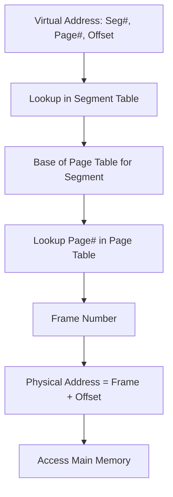

---

### نکات کلیدی

- آدرس مجازی در این مدل → `(Seg#, Page#, Offset)`
    
- **Segmentation** → به ما می‌گوید جدول صفحات مربوط به هر بخش کجاست.
    
- **Paging** → صفحه مورد نظر را به Frame در حافظه اصلی نگاشت می‌کند.
    
- در نهایت → **Physical Address = Frame + Offset**
    
- ترکیب این دو روش:
    
    - مزایای **Segmentation** (ماژولار بودن، حفاظت، اشتراک‌گذاری)
        
    - مزایای **Paging** (حذف External Fragmentation، مدیریت کارآمد حافظه)
        

---

# Operating System Software – Memory Management Design

**خلاصه:**  
طراحی بخش مدیریت حافظه در سیستم‌عامل به سه تصمیم کلیدی بستگی دارد:  
۱. استفاده یا عدم استفاده از حافظه مجازی،  
۲. انتخاب بین صفحه‌بندی (Paging)، قطعه‌بندی (Segmentation) یا ترکیب آن‌ها،  
۳. الگوریتم‌های مدیریت حافظه (مثل جایگزینی صفحه).

---

**توضیح کامل:**  
مدیریت حافظه یکی از مهم‌ترین وظایف سیستم‌عامل است چون تعیین می‌کند فرآیندها چطور از فضای حافظه استفاده کنند. طراحی این بخش به سه انتخاب اصلی بستگی دارد:

1. **استفاده از حافظهٔ مجازی (Virtual Memory):**  
   - در حافظهٔ مجازی، فرآیندها می‌توانند فضایی بزرگ‌تر از حافظهٔ فیزیکی درخواست کنند.  
   - سیستم‌عامل با استفاده از دیسک (swap space) بخشی از داده‌ها را موقتاً بیرون می‌برد.  
   - اگر از حافظه مجازی استفاده نشود، فرآیندها فقط به اندازهٔ حافظهٔ فیزیکی می‌توانند کار کنند.

2. **روش تخصیص حافظه – Paging یا Segmentation یا هر دو:**  
   - **Paging (صفحه‌بندی):** حافظه به بلوک‌های ثابت (صفحه‌ها/frames) تقسیم می‌شود. سادگی در مدیریت و عدم تکه‌تکه شدن خارجی (External Fragmentation) از مزایای آن است.  
   - **Segmentation (قطعه‌بندی):** حافظه بر اساس منطق برنامه (کد، داده، استک و...) به بخش‌هایی با اندازه متغیر تقسیم می‌شود. راحتی در مدیریت منطقی برنامه مزیت آن است.  
   - **Paging + Segmentation:** بسیاری از سیستم‌ها ترکیبی از هر دو را به‌کار می‌برند تا هم از سادگی Paging و هم از انعطاف Segmentation بهره ببرند.

3. **انتخاب الگوریتم‌ها:**  
   - برای مدیریت حافظه مجازی باید الگوریتم‌هایی برای **جایگزینی صفحه** (Page Replacement) انتخاب شود، مثل FIFO، LRU، یا Clock.  
   - همچنین الگوریتم‌هایی برای تخصیص و آزادسازی حافظه مورد نیاز است.  
   - انتخاب درست الگوریتم‌ها روی کارایی و سرعت سیستم‌عامل بسیار اثرگذار است.

---

**مثال ساده آموزشی:**  
فرض کن کامپیوتری ۸GB RAM دارد ولی یک برنامه ۱۲GB حافظه می‌خواهد.  
- اگر **حافظه مجازی** فعال باشد، سیستم‌عامل ۸GB را از RAM می‌دهد و ۴GB باقی‌مانده را روی دیسک قرار می‌دهد.  
- برای مدیریت آن، سیستم می‌تواند از **Paging** استفاده کند (تقسیم کل حافظه به بلوک‌های ۴KB) یا از **Segmentation** (کد، داده و استک هر کدام یک بخش جدا).  
- اگر برنامه بیش از حد بین RAM و دیسک جابجا شود، پدیده‌ای به نام **Thrashing** رخ می‌دهد.

---

**نمودار (Mermaid) – سه انتخاب اصلی:**
```mermaid
graph TD
    A[Memory Management Design] --> B[Virtual Memory?]
    A --> C[Paging / Segmentation]
    A --> D[Algorithms]
    
    C --> C1[Paging]
    C --> C2[Segmentation]
    C --> C3[Combination]
    
    D --> D1[Page Replacement]
    D --> D2[Allocation/Deallocation]
````

---

**نکات کلیدی:**

- طراحی مدیریت حافظه سه انتخاب محوری دارد: حافظه مجازی، روش تخصیص (Paging/Segmentation)، الگوریتم‌ها.
    
- Paging = بلوک‌های ثابت، Segmentation = بلوک‌های متغیر.
    
- حافظه مجازی امکان اجرای برنامه‌های بزرگ‌تر از RAM را فراهم می‌کند.
    
- انتخاب الگوریتم‌های جایگزینی صفحه روی کارایی سیستم بسیار حیاتی است.
    

---
# Operating System Policies for Virtual Memory

**خلاصه:**  
سیاست‌های سیستم‌عامل برای حافظه مجازی شامل تصمیماتی در مورد نحوهٔ بارگذاری صفحات (Fetch Policy)، انتخاب صفحه‌ها برای جایگزینی (Placement/Replacement Policy)، مدیریت مجموعهٔ مقیم (Resident Set Management)، پاک‌سازی (Cleaning Policy) و کنترل بار (Load Control) است.

---

**توضیح کامل:**

### 1. **Fetch Policy (سیاست واکشی صفحه)**
- **Demand (درخواست):** صفحه فقط زمانی به حافظه آورده می‌شود که واقعاً مورد نیاز شود (Page Fault رخ دهد).  
- **Prepaging (پیش‌واکشی):** چند صفحهٔ دیگر علاوه بر صفحهٔ مورد نیاز بارگذاری می‌شوند، به امید اینکه در آینده نزدیک استفاده شوند (برای کاهش تعداد Page Faultها).

---

### 2. **Placement Policy (سیاست قرارگیری)**
- تعیین می‌کند صفحهٔ جدید در کدام بخش از حافظه قرار گیرد.  
- در سیستم‌های Paging معمولاً ساده است (هر Frame آزاد می‌تواند استفاده شود).  
- در Segmentation مهم‌تر است چون اندازهٔ قطعات متغیر است.

---

### 3. **Replacement Policy (سیاست جایگزینی صفحه)**
وقتی حافظه پر است و صفحهٔ جدید نیاز داریم، باید یک صفحهٔ موجود جایگزین شود. الگوریتم‌ها:
- **Optimal:** کم‌مصرف‌ترین و ایده‌آل؛ صفحه‌ای که در دورترین آینده استفاده خواهد شد جایگزین می‌شود (عملی نیست چون نیاز به آینده‌نگری دارد).  
- **LRU (Least Recently Used):** صفحه‌ای که طولانی‌ترین زمان استفاده نشده است جایگزین می‌شود.  
- **FIFO (First-In, First-Out):** صفحه‌ای که زودتر از همه وارد حافظه شده بود، حذف می‌شود.  
- **Clock Algorithm:** نسخه‌ای بهینه‌تر از FIFO با استفاده از بیت استفاده (reference bit).  
- **Page Buffering:** چند صفحهٔ اضافی نگه‌داری می‌شود تا احتمال خطا کاهش یابد.

---

### 4. **Resident Set Management (مدیریت مجموعهٔ مقیم)**
- **Resident Set Size:** تعداد صفحاتی که یک فرآیند در حافظه دارد.  
  - *Fixed:* اندازه ثابت است.  
  - *Variable:* اندازه می‌تواند تغییر کند.  
- **Replacement Scope:** محدودهٔ انتخاب صفحه برای جایگزینی.  
  - *Global:* می‌توان صفحات هر فرآیند را جایگزین کرد.  
  - *Local:* فقط صفحات همان فرآیند جایگزین می‌شوند.

---

### 5. **Cleaning Policy (سیاست پاک‌سازی)**
- **Demand Cleaning:** صفحه فقط زمانی نوشته می‌شود (به دیسک) که باید جایگزین شود.  
- **Precleaning:** سیستم‌عامل زودتر صفحات تغییر یافته را به دیسک می‌نویسد تا در مواقع اضطراری آماده باشد.

---

### 6. **Load Control (کنترل بار)**
- تعداد فرآیندهایی که همزمان در حافظه هستند (degree of multiprogramming) باید مدیریت شود.  
- اگر فرآیندهای زیادی در حافظه باشند → Page Fault زیاد و **Thrashing** رخ می‌دهد.  
- اگر خیلی کم باشند → استفاده از CPU کاهش می‌یابد.

---

**مثال ساده آموزشی:**  
فرض کن سه برنامه در حال اجرا هستند و حافظه فقط ۵ Frame دارد.  
- اگر **FIFO** استفاده شود و برنامه مرتباً صفحات جدیدی نیاز داشته باشد، ممکن است صفحه‌ای که هنوز مورد نیاز است زود حذف شود.  
- اگر **LRU** استفاده شود، صفحه‌ای که مدت‌ها استفاده نشده حذف می‌شود (کارآمدتر).  
- با **Prepaging**، وقتی برنامه به صفحهٔ ۵ نیاز دارد، سیستم صفحهٔ ۶ را هم بارگذاری می‌کند چون احتمالاً بعداً استفاده می‌شود.  
- در مدیریت **Global Replacement**، یک فرآیند می‌تواند صفحه‌های فرآیند دیگر را بگیرد؛ ولی در **Local Replacement** فقط صفحه‌های خودش.

---

**نمودار (Mermaid) – سیاست‌های حافظه مجازی:**
```mermaid
mindmap
  root((Virtual Memory Policies))
    Fetch Policy
      Demand
      Prepaging
    Placement Policy
    Replacement Policy
      Optimal
      LRU
      FIFO
      Clock
      Page Buffering
    Resident Set Management
      Size
        Fixed
        Variable
      Scope
        Global
        Local
    Cleaning Policy
      Demand Cleaning
      Precleaning
    Load Control
      Degree of multiprogramming
````

---

**نکات کلیدی:**

- Fetch Policy مشخص می‌کند چه زمانی صفحه بارگذاری شود.
    
- Replacement Policy قلب عملکرد حافظه مجازی است (FIFO, LRU, Clock).
    
- Resident Set Management تعیین می‌کند هر فرآیند چند صفحه داشته باشد.
    
- Cleaning Policy مشخص می‌کند صفحات تغییر یافته چه زمانی روی دیسک نوشته شوند.
    
- Load Control از Thrashing جلوگیری می‌کند.
    

---
# Fetch Policy (سیاست واکشی صفحه)

**خلاصه:**  
سیاست Fetch تعیین می‌کند که چه زمانی یک صفحه باید به حافظه اصلی آورده شود. دو روش رایج آن عبارتند از **Demand Paging** (واکشی هنگام نیاز) و **Prepaging** (واکشی پیش‌دستانه).

---

**توضیح کامل:**  

### 1. تعریف
Fetch Policy بخشی از سیاست‌های حافظه مجازی است که مشخص می‌کند **چه زمانی یک صفحه از دیسک به حافظه اصلی منتقل شود**.  

### 2. روش‌ها
- **Demand Paging (واکشی بر اساس نیاز):**  
  - صفحه فقط وقتی به حافظه آورده می‌شود که اولین بار به آن ارجاع داده شود.  
  - این کار باعث می‌شود در ابتدای اجرای یک برنامه تعداد زیادی Page Fault ایجاد شود.  
  - مزیت: حافظه فقط برای صفحات واقعاً مورد نیاز استفاده می‌شود.  
  - عیب: ممکن است در شروع کار، اجرای فرآیند به شدت کند شود چون باید چندین بار منتظر Page Fault باشیم.

- **Prepaging (پیش‌واکشی):**  
  - علاوه بر صفحه‌ای که باعث Page Fault شده، تعدادی صفحهٔ دیگر نیز بارگذاری می‌شوند.  
  - هدف: کاهش تعداد Page Faultهای آینده.  
  - مزیت: اجرای روان‌تر برنامه در ادامه.  
  - عیب: اگر صفحات پیش‌واکشی شده استفاده نشوند، باعث هدر رفت حافظه و زمان I/O می‌شود.

---

**مثال ساده آموزشی:**  
فرض کن برنامه‌ای می‌خواهد از آرایه‌ای بزرگ (۱۰۰ عنصر) استفاده کند.  

- در **Demand Paging**:  
  ابتدا فقط صفحهٔ مربوط به عنصر اول بارگذاری می‌شود. وقتی به عنصر دوم برسیم، Page Fault رخ می‌دهد و صفحهٔ دوم بارگذاری می‌شود؛ این روند ادامه دارد → تعداد زیادی Page Fault.  

- در **Prepaging**:  
  وقتی عنصر اول باعث Page Fault شد، سیستم علاوه بر صفحهٔ اول، چند صفحهٔ بعدی (مثلاً ۴ صفحهٔ بعد) را هم بارگذاری می‌کند. بنابراین وقتی برنامه به عنصر دوم یا سوم رسید، دیگر Page Fault رخ نمی‌دهد.

---

**نمودار (Mermaid) – مقایسه Demand و Prepaging:**

```mermaid
sequenceDiagram
    participant CPU
    participant Memory
    participant Disk

    CPU->>Memory: Access Page 1
    Memory-->>CPU: Page Fault
    CPU->>Disk: Request Page 1

    alt Demand Paging
        Disk-->>Memory: Load Page 1 only
    else Prepaging
        Disk-->>Memory: Load Page 1 + Next Pages
    end
````

---

**نکات کلیدی:**

- Fetch Policy = تعیین زمان بارگذاری صفحه به حافظه.
    
- Demand Paging → فقط هنگام نیاز، اما Page Fault زیاد در شروع.
    
- Prepaging → پیش‌واکشی چند صفحه، کاهش Page Fault، اما احتمال هدررفت منابع.
    
- انتخاب سیاست مناسب به رفتار برنامه و طراحی سیستم‌عامل بستگی دارد.
    
---
# Placement Policy (سیاست قرارگیری صفحه/قطعه در حافظه)

**خلاصه:**  
Placement Policy مشخص می‌کند **یک قطعه یا صفحه از فرآیند دقیقاً در کجای حافظه اصلی قرار گیرد**. این سیاست در سیستم‌های **Segmentation** اهمیت بیشتری دارد، چون قطعات اندازه متغیر دارند. روش‌های رایج شامل **First-Fit** و **Best-Fit** هستند.

---

**توضیح کامل:**

### 1. تعریف
وقتی یک فرآیند یا بخشی از آن نیاز به قرارگیری در حافظه دارد، سیستم‌عامل باید تصمیم بگیرد **کدام فضای خالی حافظه به آن اختصاص داده شود**. این تصمیم توسط Placement Policy گرفته می‌شود.

### 2. اهمیت
- در **Paging (صفحه‌بندی):** نیاز به Placement Policy خیلی کم است، چون همه‌ی صفحات و فریم‌ها اندازهٔ ثابت دارند و هر فریم آزاد می‌تواند استفاده شود.  
- در **Segmentation (قطعه‌بندی):** هر قطعه اندازه متغیر دارد؛ بنابراین باید دقت کرد که قطعه در فضای مناسب قرار گیرد تا از **Fragmentation** (تکه‌تکه شدن حافظه) جلوگیری شود.

### 3. روش‌های متداول
- **First-Fit (اولین جا):** اولین فضای آزاد بزرگ‌تر یا مساوی اندازهٔ قطعه انتخاب می‌شود.  
  - سریع و ساده، ولی ممکن است فضاهای کوچک بلااستفاده بمانند.  

- **Best-Fit (بهترین جا):** کوچک‌ترین فضای آزاد که برای قطعه کافی باشد انتخاب می‌شود.  
  - حافظه بهینه‌تر استفاده می‌شود، اما ممکن است سرعت جستجو کند باشد و تکه‌های ریز زیادی تولید کند.  

- **Other Policies (سیاست‌های دیگر):**  
  - **Worst-Fit:** بزرگ‌ترین فضای آزاد انتخاب می‌شود (برای کاهش تکه‌های کوچک).  
  - **Next-Fit:** جستجو از محل آخرین تخصیص ادامه می‌یابد.

---

**مثال ساده آموزشی:**  
فرض کن حافظه شامل بلوک‌های خالی زیر باشد: `[10 KB] [20 KB] [15 KB] [40 KB]`  
و یک قطعه 18 KB باید جایگذاری شود:  

- **First-Fit:** اولین فضای کافی (20 KB) انتخاب می‌شود.  
- **Best-Fit:** کوچک‌ترین فضای کافی (20 KB) انتخاب می‌شود (اینجا مشابه First-Fit).  
- اگر قطعه 12 KB بود:  
  - **First-Fit:** بلوک 20 KB → 8 KB باقی می‌ماند.  
  - **Best-Fit:** بلوک 15 KB → 3 KB باقی می‌ماند.  

---

**نمودار (Mermaid) – مقایسه First-Fit و Best-Fit:**
```mermaid
flowchart TD
    A[Memory Blocks: 10KB, 20KB, 15KB, 40KB]
    P[Process needs 12KB]

    A --> F[First-Fit → chooses 20KB block]
    A --> B[Best-Fit → chooses 15KB block]
````

---

**نکات کلیدی:**

- Placement Policy = تصمیم‌گیری درباره محل قرارگیری قطعه در حافظه.
    
- اهمیت اصلی در **Segmentation** است (قطعات اندازه متغیر دارند).
    
- First-Fit → سریع، اما ممکن است فضای کوچک هدر برود.
    
- Best-Fit → استفاده بهینه‌تر، اما سرعت پایین‌تر و احتمال ایجاد تکه‌های کوچک.
    
- سیاست‌های دیگر مانند Worst-Fit و Next-Fit نیز وجود دارند.
    

---
# Replacement Policy (سیاست جایگزینی صفحه)

**خلاصه:**  
Replacement Policy مشخص می‌کند **کدام صفحه موجود در حافظه اصلی باید جایگزین شود** زمانی که صفحهٔ جدیدی نیاز است اما حافظه پر است. این تصمیم شامل سه موضوع کلیدی است: تعداد فریم‌های اختصاصی به هر فرآیند، محدودهٔ انتخاب صفحات برای جایگزینی (local/global)، و انتخاب صفحهٔ خاص برای حذف.

---

**توضیح کامل:**

### 1. تعریف
وقتی حافظهٔ اصلی پر است و یک فرآیند به صفحه‌ای جدید نیاز دارد (Page Fault)، سیستم‌عامل باید یک صفحه از حافظه را بیرون کند تا جای صفحهٔ جدید باز شود. این سیاست توسط **Replacement Policy** تعیین می‌شود.

### 2. مسائل کلیدی
- **تعداد فریم‌ها برای هر فرآیند (Frame Allocation):**  
  - آیا هر فرآیند تعداد ثابتی فریم دارد یا می‌تواند متغیر باشد؟  
  - تخصیص فریم بیشتر → Page Fault کمتر، اما حافظهٔ کمتری برای بقیهٔ فرآیندها می‌ماند.

- **دامنهٔ جایگزینی (Replacement Scope):**  
  - **Local Replacement:** فقط از صفحات همان فرآیند انتخاب می‌شود.  
  - **Global Replacement:** از تمام صفحات موجود در حافظه می‌توان انتخاب کرد (حتی از فرآیندهای دیگر).  

- **انتخاب صفحهٔ خاص برای حذف:**  
  - سیاست باید تصمیم بگیرد کدام یک از صفحات کاندید باید جایگزین شود.  
  - چون سیستم آینده را نمی‌داند، بیشتر الگوریتم‌ها سعی می‌کنند **از رفتار گذشته برای پیش‌بینی آینده** استفاده کنند.

---

### 3. سیاست‌های رایج
- **Optimal:** صفحه‌ای که دیرترین زمان در آینده نیاز خواهد شد. (ایده‌آل، اما غیرعملی)  
- **FIFO (First-In First-Out):** قدیمی‌ترین صفحهٔ بارگذاری‌شده جایگزین می‌شود.  
- **LRU (Least Recently Used):** صفحه‌ای که مدت زیادی استفاده نشده جایگزین می‌شود.  
- **Clock (Second Chance):** نسخهٔ بهبود یافته FIFO با استفاده از بیت استفاده (reference bit).  

---

**مثال ساده آموزشی:**  
فرض کن حافظه فقط ۳ فریم دارد و فرآیند دنبالهٔ صفحات زیر را تولید می‌کند:  
`1, 2, 3, 4, 1, 2, 5`  

- با **FIFO:**  
  - ابتدا 1, 2, 3 وارد می‌شوند.  
  - وقتی صفحهٔ 4 نیاز شد → صفحهٔ 1 بیرون می‌رود.  
  - وقتی دوباره صفحهٔ 1 نیاز شد → Page Fault (چون حذف شده بود).  

- با **LRU:**  
  - وقتی صفحهٔ 4 نیاز شد → صفحه‌ای که مدت طولانی استفاده نشده (یعنی 1) جایگزین می‌شود.  
  - دقت بالاتر نسبت به FIFO.

---

**نمودار (Mermaid) – روند Replacement Policy:**
```mermaid
flowchart TD
    A[Page Fault Occurs] --> B{Frames Full?}
    B -- No --> C[Load Page into Free Frame]
    B -- Yes --> D[Apply Replacement Policy]
    D --> E[Select Victim Page]
    E --> F[Replace with New Page]
````

---

**نکات کلیدی:**

- Replacement Policy زمانی فعال می‌شود که حافظه پر باشد و Page Fault رخ دهد.
    
- سه پرسش اساسی:
    
    1. چند فریم به هر فرآیند داده شود؟
        
    2. جایگزینی محلی باشد یا جهانی؟
        
    3. کدام صفحه دقیقاً جایگزین شود؟
        
- بیشتر الگوریتم‌ها از **رفتار گذشته برای پیش‌بینی آینده** استفاده می‌کنند.
    
- الگوریتم‌های مهم: Optimal (ایده‌آل)، FIFO (ساده)، LRU (کارآمد)، Clock (بهینه‌سازی‌شده).
    
---
### Frame Locking – قفل‌کردن قاب‌ها در حافظه

---

## توضیح کامل و دقیق

🔒 **Frame Locking (قفل‌کردن قاب‌ها)** به حالتی اشاره دارد که برخی قاب‌های حافظه اصلی (main memory frames) توسط سیستم‌عامل یا بخش‌های مهم برنامه قفل می‌شوند، به‌طوری‌که الگوریتم جایگزینی (replacement policy) اجازه ندارد محتوای آن قاب‌ها را تغییر دهد یا جایگزین کند.

این کار به دلایل زیر ضروری است:

1. **محافظت از هسته سیستم‌عامل (Kernel):**  
    بخش‌هایی از هسته سیستم‌عامل باید همواره در حافظه باقی بمانند، زیرا اگر جایگزین شوند، عملکرد سیستم مختل می‌شود.
    
2. **ساختارهای کنترلی مهم:**  
    جداول و داده‌های حیاتی مدیریت سیستم (مثل جدول فرآیندها یا جدول صفحه) نباید حذف شوند.
    
3. **بافرهای ورودی/خروجی (I/O Buffers):**  
    برخی داده‌ها در حال پردازش لحظه‌ای هستند (مثل اطلاعات در حال انتقال به دیسک یا شبکه) و حذف آن‌ها باعث بروز خطا یا از دست رفتن داده می‌شود.
    
4. **بخش‌های حساس به زمان (Time-Critical Areas):**  
    این بخش‌ها نیاز دارند که همیشه در دسترس سریع باشند و نباید با جایگزینی صفحات دچار تأخیر شوند.
    

بنابراین، الگوریتم‌های جایگزینی صفحه قبل از تصمیم‌گیری باید بررسی کنند که آیا قاب انتخاب‌شده "قفل" است یا خیر. اگر قفل باشد، آن قاب قابل جایگزینی نیست.

---

## مثال ساده آموزشی

فرض کنید در یک سیستم:

- 5 قاب حافظه وجود دارد.
    
- الگوریتم جایگزینی **LRU (Least Recently Used)** استفاده می‌شود.
    
- قاب شماره 2 و 4 قفل شده‌اند (چون شامل کد هسته و یک بافر I/O هستند).
    

📌 حال اگر سیستم نیاز به بارگذاری یک صفحه جدید داشته باشد:

- الگوریتم LRU می‌خواهد قاب "قدیمی‌ترین استفاده" را جایگزین کند.
    
- اما اگر این قاب در بین قاب‌های **قفل‌شده** باشد (مثلاً قاب شماره 2)، الگوریتم باید آن را نادیده بگیرد و به دنبال قاب دیگری بگردد.
    

---

## نمودار (Mermaid)

```mermaid
flowchart TD
    A[Page Fault رخ می‌دهد] --> B[انتخاب قاب برای جایگزینی]
    B --> C{آیا قاب قفل است؟}
    C -- بله --> D[رد قاب و جستجوی قاب دیگر]
    C -- خیر --> E[جایگزینی قاب با صفحه جدید]
    D --> B
```

---

## نکات کلیدی

- Frame Locking باعث می‌شود بخش‌های حساس سیستم‌عامل همیشه در حافظه باقی بمانند.
    
- قفل‌شدن قاب به معنی **محافظت در برابر الگوریتم‌های جایگزینی** است.
    
- این مکانیزم برای **پایداری، امنیت و سرعت سیستم** ضروری است.
    
- الگوریتم جایگزینی باید همیشه قاب‌های قفل‌شده را بررسی و رد کند.
    

---

### Basic Algorithms – الگوریتم‌های پایه جایگزینی صفحه

---

## توضیح کامل و دقیق

📌 صرف‌نظر از این‌که استراتژی مدیریت **Resident Set** (مجموعه صفحاتی که در حافظه اصلی نگهداری می‌شوند) چگونه باشد، سیستم‌عامل برای انتخاب صفحه‌ای که باید جایگزین شود از **الگوریتم‌های جایگزینی صفحه** استفاده می‌کند.

چهار الگوریتم پایه و پرکاربرد عبارت‌اند از:

---

### 1. Optimal (بهینه)

- **ایده:** همیشه صفحه‌ای جایگزین می‌شود که در آینده **بیشترین فاصله تا استفاده بعدی** را دارد یا اصلاً دیگر مورد استفاده قرار نخواهد گرفت.
    
- **مزیت:** کمترین تعداد page fault ممکن.
    
- **عیب:** در عمل غیرقابل‌اجراست، چون نیاز به دانستن آینده دارد.
    
- **کاربرد:** به‌عنوان **مبنای مقایسه** برای سایر الگوریتم‌ها استفاده می‌شود.
    

---

### 2. Least Recently Used (LRU – کم‌ترین استفاده اخیر)

- **ایده:** صفحه‌ای که **طی مدت زمان طولانی‌تری استفاده نشده است**، جایگزین می‌شود.
    
- **منطق:** گذشته معمولاً نشان‌دهنده آینده است؛ اگر صفحه‌ای مدتی استفاده نشده، احتمال استفاده مجدد آن کم است.
    
- **پیاده‌سازی:** می‌توان از شمارنده زمانی یا پشته استفاده کرد.
    
- **مزیت:** عملکرد خوب و نزدیک به Optimal.
    
- **عیب:** هزینه سخت‌افزاری/نرم‌افزاری بالا برای ردیابی زمان آخرین استفاده.
    

---

### 3. First-In-First-Out (FIFO – صف اول وارد، اول خارج)

- **ایده:** قدیمی‌ترین صفحه (که زودتر از همه وارد حافظه شده است) جایگزین می‌شود.
    
- **مزیت:** پیاده‌سازی ساده (یک صف کافی است).
    
- **عیب:** ممکن است صفحاتی که هنوز پرکاربرد هستند، حذف شوند → پدیده **Anomaly of Belady** رخ می‌دهد (افزایش قاب حافظه می‌تواند باعث افزایش Page Fault شود).
    

---

### 4. Clock (ساعت)

- **ایده:** شبیه FIFO است، اما از یک اشاره‌گر دایره‌ای (مثل عقربه ساعت) برای حرکت روی قاب‌ها استفاده می‌کند.
    
- **پیاده‌سازی:**
    
    - به هر صفحه یک بیت استفاده (use bit) اختصاص داده می‌شود.
        
    - هنگام Page Fault، الگوریتم به دنبال صفحه‌ای می‌گردد که بیت استفاده آن 0 باشد.
        
    - اگر بیت 1 باشد، آن را صفر کرده و عقربه به جلو حرکت می‌کند.
        
- **مزیت:** کارایی نزدیک به LRU با هزینه کمتر.
    
- **کاربرد:** پرکاربردترین الگوریتم عملی در سیستم‌عامل‌ها.
    

---

## مثال ساده آموزشی

فرض کنید حافظه 3 قاب دارد و رشته ارجاعات (Reference String) زیر است:

```
7, 0, 1, 2, 0, 3, 0, 4
```

- **FIFO:** صفحه‌های قدیمی (7 → 0 → 1) به ترتیب جایگزین می‌شوند.
    
- **LRU:** صفحه‌ای که مدت طولانی‌تر استفاده نشده (مثلاً 7) جایگزین می‌شود.
    
- **Optimal:** صفحه‌ای جایگزین می‌شود که در آینده دیرتر نیاز می‌شود.
    
- **Clock:** با حرکت عقربه و بیت استفاده تصمیم گرفته می‌شود.
    
---
## نکات کلیدی

- **Optimal** → بهترین حالت تئوری، اما عملی نیست.
    
- **LRU** → نزدیک به Optimal، اما پرهزینه‌تر.
    
- **FIFO** → ساده، اما ممکن است ناکارآمد شود.
    
- **Clock** → تعادل خوب بین سادگی و کارایی، پرکاربرد در عمل.
    

---

### Optimal Policy – سیاست جایگزینی بهینه

---

## توضیح کامل و دقیق

📌 **سیاست بهینه (Optimal Replacement Policy)** یکی از الگوریتم‌های مهم در مدیریت حافظه است که به‌عنوان یک **استاندارد تئوری** برای مقایسه سایر الگوریتم‌ها مطرح می‌شود.

- **ایده اصلی:**  
    هنگام وقوع **Page Fault**، باید آن صفحه‌ای از حافظه اصلی حذف شود که **بیشترین فاصله زمانی تا استفاده بعدی** را دارد.  
    به بیان ساده: اگر بدانیم کدام صفحه در آینده دیرتر از همه مورد نیاز قرار می‌گیرد، آن صفحه بهترین انتخاب برای حذف است.
    
- **مزیت:**  
    تعداد Page Faultها را به حداقل ممکن می‌رساند.
    
- **عیب بزرگ:**  
    در عمل **غیرقابل‌پیاده‌سازی** است، چون سیستم‌عامل نمی‌تواند از آینده خبر داشته باشد.
    

---

## مثال ساده آموزشی

فرض کنید حافظه 3 قاب دارد و رشته ارجاعات این است:

```
7, 0, 1, 2, 0, 3, 0, 4
```

در لحظه‌ای که نیاز به جایگزینی داریم (مثلاً بعد از پر شدن حافظه)، الگوریتم Optimal به این شکل عمل می‌کند:

- اگر قاب‌ها پر شده باشند (مثلاً شامل [7, 0, 1]) و عدد بعدی در رشته `2` باشد → باید یکی حذف شود.
    
- الگوریتم Optimal نگاه می‌کند که در آینده:
    
    - **7** دیگر تکرار نمی‌شود،
        
    - **0** به‌زودی تکرار می‌شود،
        
    - **1** بعداً دوباره می‌آید.  
        👉 بنابراین **صفحه 7** را حذف می‌کند، چون دیرترین یا هیچ‌وقت استفاده نمی‌شود.
        

---

## نمودار

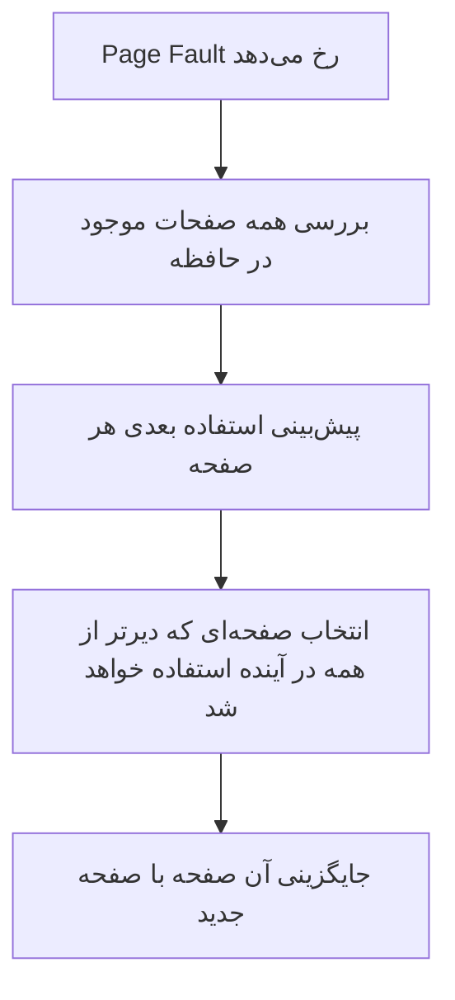

---

## نکات کلیدی

- Optimal → الگوریتمی تئوری و غیرقابل اجرا در عمل.
    
- معیار انتخاب: **بیشترین فاصله تا استفاده بعدی**.
    
- بهترین معیار برای **مقایسه سایر الگوریتم‌ها** (مثل FIFO و LRU).
    
- همیشه کمترین تعداد Page Fault را تضمین می‌کند.
    

---


## **Least Recently Used (LRU) Page Replacement Policy**

### توضیح:

- **هدف:** جایگزینی صفحه‌ای که **طولانی‌ترین زمان از آخرین استفاده آن گذشته است**.
    
- **اصل کار:** بر اساس **Principle of Locality** (اصل مکان‌یابی محلی):
    
    - صفحاتی که اخیراً استفاده نشده‌اند، احتمالاً در آینده نزدیک کمتر مورد استفاده قرار می‌گیرند.
        
- **عملکرد:** تقریباً به اندازه الگوریتم Optimal عمل می‌کند و تعداد Page Fault کمی ایجاد می‌کند.
    

### مشکلات و محدودیت‌ها:

1. **پیچیدگی پیاده‌سازی:**
    
    - هر صفحه باید با **زمان آخرین ارجاع** برچسب‌گذاری شود.
        
    - این برچسب‌گذاری باید در هر دسترسی به حافظه (دستورات و داده‌ها) انجام شود.
        
    - حتی اگر سخت‌افزار از این کار پشتیبانی کند، **بار پردازشی بسیار زیاد** خواهد بود.
        
2. **راه‌حل جایگزین:**
    
    - نگهداری یک **stack از ارجاعات صفحات**، که همیشه صفحات اخیراً استفاده شده در بالای stack باشند.
        
    - هنگام نیاز به جایگزینی، صفحه پایین‌ترین سطح stack (کمترین استفاده اخیر) انتخاب می‌شود.
        

---

### **مثال ساده آموزشی**

فرض کنید ترتیب دسترسی به صفحات:  
`1, 2, 3, 2, 4, 1, 5`  
و حافظه ظرفیت 3 صفحه دارد.

- وقتی نیاز به جایگزینی است، **صفحه‌ای که کمترین استفاده اخیر را داشته انتخاب می‌شود**.
    
- LRU معمولاً **Page Fault کمتر از FIFO** ایجاد می‌کند، چون از اطلاعات گذشته استفاده می‌کند.
    

---

### **نمودار Mermaid – نحوه کار LRU**

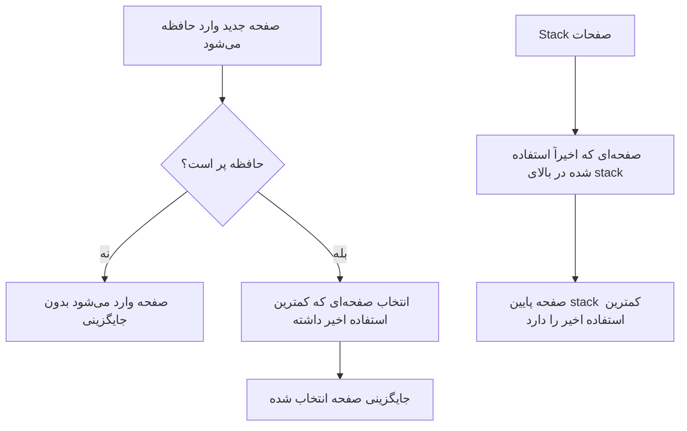

---

### **نکات کلیدی**

- **LRU:** جایگزینی کم‌استفاده‌ترین صفحه اخیر.
    
- **اصل:** Principle of Locality (صفحات اخیراً استفاده نشده احتمالاً کمتر استفاده می‌شوند).
    
- **عملکرد:** نزدیک به Optimal.
    
- **پیچیدگی پیاده‌سازی:** نیاز به ثبت زمان آخرین دسترسی یا نگهداری stack، بار پردازشی زیاد.
    

---
## **First-In-First-Out (FIFO) Page Replacement Policy**

### توضیح:

- **روش کار:**
    
    - فریم‌های صفحه اختصاص داده شده به یک فرآیند به صورت **حلقوی (Circular Buffer)** در نظر گرفته می‌شوند.
        
    - صفحات **به ترتیب ورود** و به سبک **Round-Robin** جایگزین می‌شوند.
        
- **مزیت اصلی:**
    
    - یکی از **ساده‌ترین الگوریتم‌ها برای پیاده‌سازی** است.
        
- **منطق انتخاب:**
    
    - صفحه‌ای که **طولانی‌ترین زمان در حافظه بوده** جایگزین می‌شود.
        
    - فرض بر این است که صفحه‌ای که مدت زیادی در حافظه بوده، ممکن است دیگر استفاده نشود.
        

---

### **مثال ساده آموزشی**

فرض کنید حافظه ظرفیت 3 صفحه دارد و دسترسی به صفحات به ترتیب زیر است:  
`1, 2, 3, 4, 1, 2, 5`

- وقتی صفحه جدید وارد می‌شود و حافظه پر است:
    
    - **FIFO:** اولین صفحه‌ای که وارد حافظه شده است، جایگزین می‌شود.
        
- در این مثال:
    
    - هنگام ورود صفحه 4، صفحه 1 جایگزین می‌شود.
        
    - هنگام ورود صفحه 5، صفحه 2 جایگزین می‌شود.
        

> ⚠️ مشکل مهم FIFO: ممکن است صفحه‌ای که هنوز زیاد استفاده می‌شود، زود جایگزین شود (**Belady’s anomaly**).

---

### **نمودار Mermaid – نحوه کار FIFO**

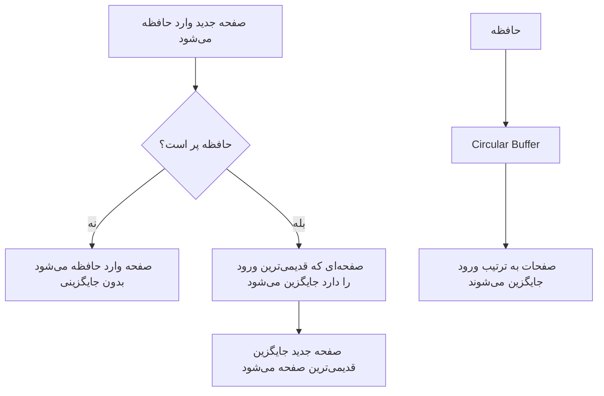

---

### **نکات کلیدی**

- **FIFO:** جایگزینی قدیمی‌ترین صفحه وارد شده در حافظه.
    
- **مزیت:** ساده و راحت برای پیاده‌سازی.
    
- **معایب:** ممکن است صفحه‌ای که هنوز استفاده می‌شود، زود جایگزین شود (Belady’s anomaly).
    
- **مکانیزم:** استفاده از Circular Buffer و Round-Robin.
    

---

## **Clock Page Replacement Policy**

### توضیح:

- **Clock** یکی از **پیاده‌سازی‌های عملی و کم‌هزینه LRU** است.
    
- **مکانیزم اصلی:**
    
    - به هر فریم حافظه یک **Use Bit (یا Referenced Bit)** اختصاص داده می‌شود.
        
    - وقتی صفحه‌ای وارد فریم می‌شود، **Use Bit آن 1** می‌شود.
        
    - هر بار که صفحه ارجاع داده شود (پس از Page Fault اولیه)، **Use Bit دوباره 1 می‌شود**.
        
- **انتخاب صفحه برای جایگزینی:**
    
    - فریم‌ها به صورت **دایره‌ای (Circular)** مرور می‌شوند.
        
    - هنگام نیاز به جایگزینی، سیستم به دنبال **فریمی با Use Bit = 0** می‌گردد.
        
    - اگر Use Bit = 1 باشد، آن را **به 0 تغییر می‌دهد و ادامه می‌دهد** تا فریم مناسب پیدا شود.
        
- **مزیت:**
    
    - نزدیک به LRU عمل می‌کند ولی **پیاده‌سازی ساده‌تر و کم‌هزینه‌تر** دارد.
        

---

### **مثال ساده آموزشی**

فرض کنید حافظه ظرفیت 4 صفحه دارد و دسترسی به صفحات به ترتیب زیر است:  
`1, 2, 3, 1, 4, 5`

- همه فریم‌ها به صورت دایره‌ای مرتب شده‌اند و **Use Bit** هر فریم مدیریت می‌شود.
    
- هنگام ورود صفحه جدید:
    
    1. سیستم از Pointer شروع به بررسی فریم‌ها می‌کند.
        
    2. اگر Use Bit = 0 باشد، آن فریم جایگزین می‌شود.
        
    3. اگر Use Bit = 1 باشد، آن را به 0 تغییر می‌دهد و به فریم بعدی می‌رود.
        

---

### **نمودار Mermaid – نحوه کار Clock**

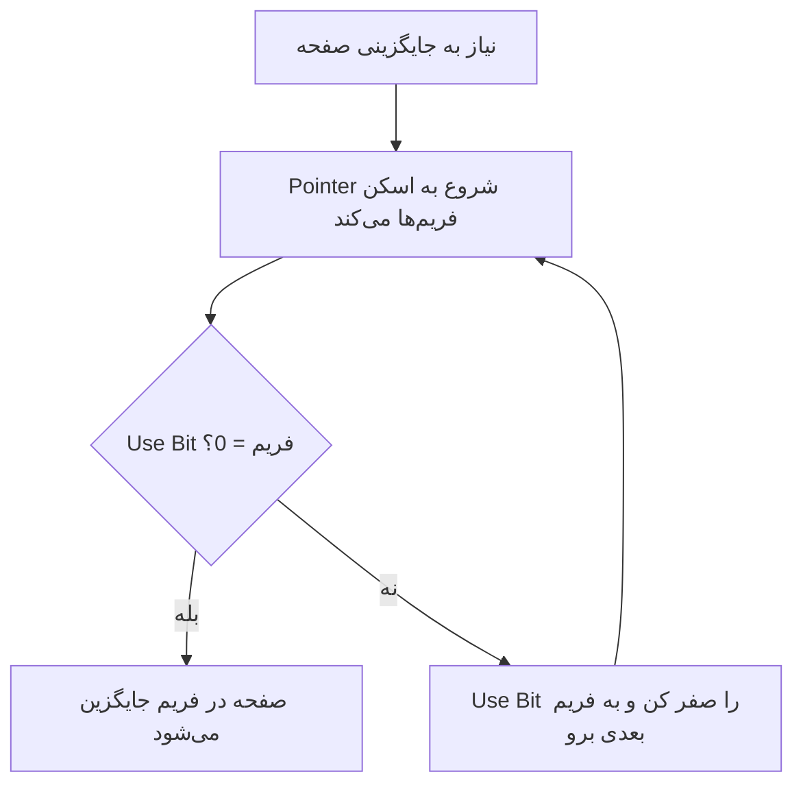

---

### **نکات کلیدی**

- **Clock Policy:** نسخه عملی LRU با Use Bit.
    
- **Use Bit:** نشان‌دهنده ارجاع اخیر صفحه.
    
- **مکانیزم:** اسکن دایره‌ای فریم‌ها و جایگزینی اولین فریم با Use Bit = 0.
    
- **مزیت:** کم‌هزینه و ساده نسبت به پیاده‌سازی کامل LRU.
    
- **کاربرد عملی:** در سیستم‌عامل‌های واقعی، الگوریتم Clock بسیار محبوب است.
    

---
![[Pasted image 20250908150125.png]]


## **Behavior of Four Page Replacement Algorithms**

### توضیح تصویر:

- **Page address stream:** رشته دسترسی به صفحات (2, 3, 2, 1, 5, 2, 4, 5, 3, 2, 5, 2).
    
- **حافظه:** ظرفیت 3 فریم دارد.
    
- **F (Fault):** نشان‌دهنده‌ی رخ دادن **Page Fault** (وقتی صفحه در حافظه موجود نیست و باید بارگذاری شود).
    

---

### 1. **Optimal (OPT)**

- صفحه‌ای که **دیرترین استفاده در آینده** دارد جایگزین می‌شود.
    
- نتیجه: **حداقل تعداد Page Fault** (در تصویر 5 بار).
    
- کارایی ایده‌آل اما در عمل غیرقابل پیاده‌سازی.
    

---

### 2. **Least Recently Used (LRU)**

- صفحه‌ای که **طولانی‌ترین زمان از آخرین استفاده‌اش گذشته** جایگزین می‌شود.
    
- عملکرد نزدیک به OPT.
    
- نتیجه: **6 Page Fault**.
    
- نسبت به FIFO بهتر است چون از اصل Locality استفاده می‌کند.
    

---

### 3. **First-In-First-Out (FIFO)**

- **قدیمی‌ترین صفحه واردشده** جایگزین می‌شود.
    
- نتیجه: **7 Page Fault**.
    
- مشکل: ممکن است صفحه‌ای که هنوز لازم است، حذف شود (**Belady’s anomaly**).
    

---

### 4. **Clock**

- شبیه LRU ولی ساده‌تر:
    
    - از **Use Bit** و Pointer دایره‌ای استفاده می‌کند.
        
    - نتیجه: **6 Page Fault** (در این مثال برابر با LRU).
        
- در عمل کاربردی‌تر از LRU به خاطر هزینه کمتر.
    

---

### **مقایسه تعداد Page Fault**

|الگوریتم|تعداد Page Fault|
|---|---|
|**OPT**|5 (کمترین)|
|**LRU**|6|
|**Clock**|6|
|**FIFO**|7 (بیشترین)|

---

### **نمودار Mermaid – مقایسه الگوریتم‌ها**

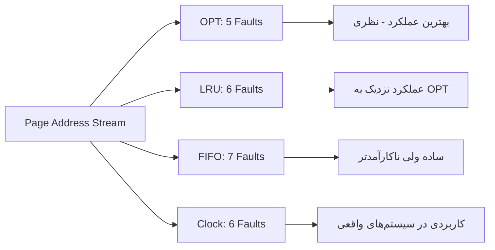

---

### **نکات کلیدی**

- **OPT:** کمترین خطا، اما غیرقابل پیاده‌سازی واقعی.
    
- **LRU:** بهترین الگوریتم عملی، نزدیک به OPT ولی پرهزینه.
    
- **FIFO:** ساده‌ترین، اما بیشترین Page Fault.
    
- **Clock:** الگوریتمی عملی و کارآمد، جایگزین خوب LRU در سیستم‌های واقعی.
    

---
![[Pasted image 20250908150324.png]]

## 🔄 توضیح شکل

در این شکل یک **بافر دایره‌ای از فریم‌های حافظه** داریم (شبیه عقربه ساعت):

- هر خانه یک **Frame** است که داخلش یک **Page** نگه‌داری می‌شود.
    
- هر صفحه علاوه بر شماره‌اش، یک **Use Bit (بیت استفاده)** هم دارد (0 یا 1).
    
- **Next Frame Pointer** مثل یک عقربه است که همیشه نشان می‌دهد **نوبت بررسی کدام فریم** رسیده.
    

---

### نحوه کار الگوریتم:

1. وقتی یک Page Fault رخ بدهد، OS باید تصمیم بگیرد **کدام صفحه را بیرون بیندازد**.
    
2. عقربه (Next Frame Pointer) شروع به حرکت در حلقه می‌کند:
    
    - اگر **Use Bit = 1** باشد → سیستم آن را به **0** تغییر می‌دهد و به فریم بعدی می‌رود.
        
    - اگر **Use Bit = 0** باشد → آن صفحه انتخاب می‌شود و جایگزینی انجام می‌شود.
        
3. پس از جایگزینی، عقربه یک خانه جلو می‌رود و همان‌جا می‌ماند تا برای دفعه بعد شروع کند.
    

---

### وضعیت تصویر:

- در فریم‌ها صفحاتی مثل Page 9، Page 19، Page 1، Page 45 و غیره قرار دارند.
    
- بیشتر Use Bitها برابر 1 هستند (یعنی اخیراً استفاده شده‌اند).
    
- تنها **Page 222 (Use = 0)** آماده جایگزینی است.
    
- **Pointer روی Page 45 ایستاده** و اگر لازم باشد صفحه‌ای جایگزین شود، pointer حرکت می‌کند تا اولین Use Bit = 0 را پیدا کند.
    
- پس از گذر از چند فریم، به Page 222 می‌رسد (Use = 0) → این صفحه انتخاب و جایگزین می‌شود.
    

---

## ✅ مزایا و معایب الگوریتم ساعت

- **مزایا:**
    
    - ساده‌تر و کم‌هزینه‌تر از LRU.
        
    - عملکرد نزدیک به LRU در عمل.
        
    - نیاز به نگه‌داری دقیق زمان یا صف ندارد، فقط یک بیت ساده کافی است.
        
- **معایب:**
    
    - همیشه به خوبی LRU عمل نمی‌کند.
        
    - اگر بیشتر بیت‌ها = 1 باشند، pointer باید کل حلقه را دور بزند تا یک 0 پیدا کند (کندتر می‌شود).
        

---

### 📊 نکات کلیدی

- الگوریتم ساعت نسخه‌ای ساده و کارآمد از LRU است.
    
- از **Use Bit** و **Pointer دایره‌ای** استفاده می‌کند.
    
- در هر جایگزینی → صفحه با Use Bit = 0 جایگزین می‌شود.
    
- عملکرد بین FIFO و LRU قرار دارد.
    

---

![[Pasted image 20250908150417.png]]


## توضیح شکل — حالت «just after the next page replacement»

- تصویر یک حلقه از فریم‌ها (مثل صفحه‌های ساعت) نشان می‌دهد که هر فریم شامل:
    
    - شماره صفحه (مثلاً Page 19, Page 1, Page 45, …)
        
    - **Use bit** آن (0 یا 1)
        
- **Pointer (عقربه)** مکان شروع اسکن برای جایگزینی بعدی را نشان می‌دهد.
    
- عنوان تصویر می‌گوید این تصویر **بلافاصله بعد از انجام یک جایگزینی صفحه** است — یعنی الگوریتم Clock تازه یک صفحه را جایگزین کرده و وضعیت فریم‌ها/بیت‌ها را به‌روزرسانی کرده است.
    

### آنچه معمولاً دقیقاً اتفاق افتاده (روند استاندارد Clock که منطبق با این شکل است):

1. هنگام Page Fault، سیستم از مکان Pointer شروع به اسکن دایره‌ای می‌کند.
    
2. برای هر فریمی که Use bit = 1 است:
    
    - آن را **ریست (به 0)** می‌کند و Pointer را به فریم بعدی می‌برد.
        
3. تا زمانی که فریمی با **Use bit = 0** پیدا شود.
    
4. وقتی فریم با Use bit = 0 یافت شد:
    
    - آن فریم **جایگزین** می‌شود (صفحه جدید در آن قرار می‌گیرد).
        
    - Use bit صفحه‌ی تازه‌وارد معمولاً **1** قرار داده می‌شود (زیرا همین الآن بارگذاری و احتمالاً استفاده خواهد شد).
        
    - Pointer پس از جایگزینی معمولاً به فریم **بعدی** منتقل می‌شود — و آن نقطه، نقطه شروع اسکن بعدی خواهد بود.
        
5. **حالت «just after replacement»** نشان می‌دهد که:
    
    - یک فریم با Use=0 انتخاب و جایگزین شده،
        
    - برخی فریم‌هایی که هنگام اسکن قبلی Use=1 داشته‌اند به 0 ریست شده‌اند،
        
    - Pointer الآن به اولین فریم بعد از آن جایگزینی اشاره می‌کند.
        

---

## تفسیر منطقیِ تصویر (چند نکتهٔ قابل نوشتن در جزوه)

- اگر در تصویر قبل از این یک یا چند Use=1 وجود داشتند، الگوریتم هنگام اسکن آن‌ها را به 0 ریست کرد تا بالاخره به یک Use=0 رسید — و آن Use=0 همان صفحه‌ای بود که حذف و با صفحهٔ جدید جایگزین شد.
    
- بعد از جایگزینی:
    
    - صفحهٔ جدید معمولاً Use=1 می‌گیرد (معمولاً در بسیاری پیاده‌سازی‌ها هنگام بارگذاری اولیه 1 می‌شود).
        
    - Pointer به فریم بعدی (برای اسکن بعدی) حرکت کرده است — همان نقطه‌ای که در تصویر دیده می‌شود.
        

---

## مثال گام‌به‌گام کوچک 

فرض کنید قبل از جایگزینی وضعیت (از موقعیت Pointer) به‌صورت زیر بوده:

```
Pointer -> [Page 45, Use=1] -> [Page 191, Use=1] -> [Page 556, Use=0] -> ...
```

الگوریتم اسکن می‌کند:

- می‌بیند Page45 Use=1 → آن را به 0 می‌کند و می‌رود جلو.
    
- Page191 Use=1 → آن را به 0 می‌کند و می‌رود جلو.
    
- Page556 Use=0 → این فریم انتخاب می‌شود و جایگزین می‌گردد (مثلاً با Page X).  
    پس از جایگزینی:
    
- Page X وارد می‌شود، Use(X) = 1
    
- Pointer روی فریم بعد از Page556 می‌ایستد (برای دفعهٔ بعد).
    

این همان چیزی است که نمودار «just after replacement» نشان می‌دهد: بعضی Useها ریست شده‌اند، یک فریم جایگزین شده و pointer جلوتر رفته است.

---

## نکات کلیدی 

- الگوریتم **Clock** با یک **Use bit** به‌ازای هر فریم کار می‌کند و اسکن دایره‌ای انجام می‌دهد.
    
- هنگام اسکن، اگر Use=1 باشد آن را به 0 ریست می‌کند؛ اگر Use=0 باشد آن فریم را جایگزین می‌کند.
    
- بعد از جایگزینی، صفحهٔ جدید معمولاً Use=1 می‌گیرد و pointer به فریم بعدی منتقل می‌شود.
    
- تصویر «just after replacement» نشان‌دهندهٔ این است که الگوریتم تازه یک فریم با Use=0 را یافته و جایگزین کرده و برخی Useها را نیز صفر کرده است.
    
- Clock یک پیاده‌سازی کم‌هزینه نزدیک به LRU است؛ نگهداری فقط 1 بیت برای هر فریم کافی است.
    

---
![[Pasted image 20250908150900.png]]
این شکل مقایسه‌ای بین **الگوریتم‌های جایگزینی صفحه (Page Replacement Algorithms)** نشون می‌ده.

---

## توضیح محورهای شکل

- **محور افقی (X-axis):** تعداد قاب‌های (Frames) اختصاص داده شده به یک فرآیند.
    
- **محور عمودی (Y-axis):** تعداد **Page Faults** (خطاهای صفحه) به ازای هر 1000 دسترسی.
    

---

## نکات کلیدی در شکل

1. **FIFO (First-In-First-Out):**
    
    - بالاترین نرخ Page Fault رو داره.
        
    - چون صرفاً قدیمی‌ترین صفحه حذف میشه، حتی اگر هنوز پرکاربرد باشه.
        
    - خط روی نمودار مربوط به FIFO بالاتر از همه است.
        
2. **CLOCK Algorithm:**
    
    - بهبود یافته‌ی FIFO هست.
        
    - از یک بیت مرجع استفاده می‌کنه تا بفهمه آیا صفحه اخیراً استفاده شده یا نه.
        
    - عملکردش بهتر از FIFO ولی هنوز ضعیف‌تر از LRU و OPT هست.
        
3. **LRU (Least Recently Used):**
    
    - صفحه‌ای که **قدیمی‌ترین استفاده** رو داشته حذف می‌کنه.
        
    - عملکردش نزدیک به حالت بهینه (OPT) هست.
        
    - نرخ Page Fault کمتر از FIFO و CLOCK.
        
4. **OPT (Optimal):**
    
    - الگوریتم ایده‌آل (تئوری).
        
    - همیشه صفحه‌ای رو حذف می‌کنه که در آینده دورترین زمان ممکن دوباره نیاز میشه.
        
    - در عمل پیاده‌سازی نمی‌شه چون نیاز به **دانستن آینده** داره، ولی به‌عنوان معیار مقایسه استفاده میشه.
        
    - کمترین Page Fault را دارد (پایین‌ترین خط روی نمودار).
        

---

## نتیجه‌گیری

- هرچه تعداد قاب‌های حافظه بیشتر باشه، **Page Fault** کاهش پیدا می‌کنه.
    
- **OPT بهترین عملکرد → LRU → CLOCK → FIFO**.
    
- FIFO ساده است ولی کارایی ضعیف‌تری داره.
    
- LRU نزدیک‌ترین عملکرد رو به الگوریتم بهینه (OPT) ارائه می‌ده.
    

---

خیلی خوب، توضیح می‌دم 👇

---

## Resident Set Size (اندازه مجموعه مقیم)

زمانی که از **Virtual Memory** و **Paging** استفاده می‌کنیم، هر پروسه برای اجرا نیاز به تعدادی **Frame** در حافظه اصلی داره.  
تعداد فریم‌هایی که به یک پروسه اختصاص داده می‌شه رو **Resident Set Size** می‌گیم.

---

### 1. **Fixed-allocation policy (سیاست تخصیص ثابت)**

- به یک فرآیند تعداد مشخصی فریم داده میشه (مثلاً 4 فریم).
    
- این تعداد فریم در طول اجرای فرآیند **تغییر نمی‌کنه**.
    
- اگه Page Fault رخ بده، یکی از صفحات فعلی پروسه باید جایگزین صفحه جدید بشه.
    
- **مزیت:** مدیریت ساده و سربار کمتر برای سیستم‌عامل.
    
- **عیب:** ممکنه فرآیند در بعضی لحظات نیاز به فریم بیشتری داشته باشه و نتونه کارآمد عمل کنه → افزایش Page Fault.
    

---

### 2. **Variable-allocation policy (سیاست تخصیص متغیر)**

- تعداد فریم‌های اختصاص داده شده به یک فرآیند می‌تونه در طول زمان تغییر کنه.
    
- سیستم‌عامل می‌تونه بر اساس **نیاز پروسه** یا **شرایط کلی حافظه** تعداد فریم‌ها رو افزایش یا کاهش بده.
    
- **مزیت:** استفاده بهتر از حافظه و کاهش Page Fault در مواقع نیاز.
    
- **عیب:** سربار نرم‌افزاری بیشتر برای سیستم‌عامل (چون باید مدام تصمیم‌گیری و مدیریت انجام بده).
    

---

🔑 **خلاصه:**

- **Fixed Allocation →** ساده‌تر ولی انعطاف‌ناپذیر.
    
- **Variable Allocation →** کارآمدتر ولی نیازمند مدیریت پیچیده‌تر توسط سیستم‌عامل.
    

---
## 🔄 Replacement Scope

### 1. **Local Replacement Policy (سیاست جایگزینی محلی)**

- فقط بین **صفحات همان پروسه‌ای** که Page Fault ایجاد کرده انتخاب می‌کنه.
    
- پس: هر پروسه فقط درون فریم‌های خودش جابه‌جایی انجام می‌ده.
    

📌 **مزیت:** پروسه‌ها روی همدیگه اثر نمی‌ذارن.  
📌 **عیب:** اگه پروسه نیاز به فریم بیشتری داشته باشه، نمی‌تونه از حافظه استفاده بهینه بکنه.

---

### 2. **Global Replacement Policy (سیاست جایگزینی سراسری)**

- می‌تونه **هر صفحه‌ای در حافظه اصلی** رو جایگزین کنه، حتی اگه متعلق به پروسه‌های دیگه باشه.
    
- صفحه‌ای که جایگزین میشه، ممکنه از یک پروسه متفاوت باشه.
    

📌 **مزیت:** استفاده بهینه‌تر از حافظه.  
📌 **عیب:** ممکنه باعث نوسان عملکرد پروسه‌ها بشه (یک پروسه باعث افزایش Page Fault پروسه دیگه بشه).

---

## 📊 جدول مقایسه (طبق تصویر)

|سیاست تخصیص|Local Replacement|Global Replacement|
|---|---|---|
|**Fixed Allocation**|تعداد فریم‌ها برای پروسه ثابت هست → فقط از بین همون فریم‌ها انتخاب میشه|غیرممکن|
|**Variable Allocation**|تعداد فریم‌ها می‌تونه تغییر کنه ولی باز هم جایگزینی فقط درون فریم‌های همون پروسه انجام میشه|از کل فریم‌های موجود حافظه انتخاب میشه → اندازه Resident Set پروسه‌ها تغییر می‌کنه|

---

🔑 **خلاصه:**

- **Local →** محدود، کنترل‌شده، پروسه‌ها مستقل.
    
- **Global →** آزاد، کارایی بیشتر، ولی ممکنه باعث تداخل بین پروسه‌ها بشه.
    

---
### توضیح کامل و قابل‌فهم از محتوای اسلاید

اسلاید ارائه‌شده درباره **استراتژی مجموعه کاری (Working Set Strategy)** صحبت می‌کنه که یکی از روش‌های مدیریت حافظه در سیستم‌های عامل به حساب میاد. این استراتژی بخشی از تکنیک‌های تخصیص متغیر و محلی (Variable-Allocation, Local-Scope Strategy) هست که برای تصمیم‌گیری درباره اندازه مجموعه ساکن (Resident Set) و زمان تغییرش استفاده می‌شه. مجموعه کاری (Working Set) در واقع مجموعه‌ای از صفحات حافظه‌ست که یه فرآیند در یه بازه زمانی مشخص بهشون نیاز داره.

در این اسلاید، چند نکته کلیدی مطرح شده:
- **مجموعه کاری (W(t, Δ))**: این مجموعه شامل صفحاتی از یه فرآیند هست که در آخرین واحدهای زمان مجازی (Virtual Time Units) بهشون مراجعه شده. پارامتر **Δ** اندازه پنجره زمانی رو مشخص می‌کنه که نشون می‌ده چقدر به عقب نگاه کنیم.
- **تأثیر اندازه پنجره (Δ)**: هر چی پنجره بزرگ‌تر باشه، مجموعه کاری هم بزرگ‌تر می‌شه. این یعنی اگر Δ رو یک واحد افزایش بدیم (Δ + 1)، مجموعه کاری جدید شامل مجموعه کاری قبلی به اضافه صفحات جدید می‌شه (W(t, Δ + 1) ⊇ W(t, Δ)).
- **رشد مجموعه کاری**: اگه یه فرآیند به صفحات زیادی به سرعت دسترسی پیدا کنه، مجموعه کاری می‌تونه تا تعداد کل صفحات فرآیند (N) رشد کنه، به شرطی که اندازه پنجره (Δ) به اندازه کافی بزرگ باشه.
- **محدوده مجموعه کاری**: اندازه مجموعه کاری همیشه بین 1 (حداقل) و حداقل از Δ یا N (تعداد کل صفحات) هست.

این مفاهیم در فصل مدیریت حافظه (Memory Management) کتاب Silberschatz, Galvin and Gagne، به‌خصوص در بخش‌هایی که به الگوریتم‌های جایگزینی صفحه (Page Replacement Algorithms) و استراتژی‌های محلی پرداخته شده، توضیح داده شده.


این دیاگرام نشون می‌ده که با افزایش پنجره زمانی، مجموعه کاری گسترش پیدا می‌کنه و تابع محدودیت‌های مشخصی (بین 1 و min(Δ, N)) هست.

### مثال ساده آموزشی

فرض کن یه فرآیند داره با 5 صفحه حافظه (N = 5) کار می‌کنه. اگه پنجره زمانی (Δ) رو 3 واحد تنظیم کنیم:
- در زمان t، فرض کنیم فرآیند فقط به صفحات 1، 2 و 3 مراجعه کرده. پس W(t, 3) = {1, 2, 3}.
- حالا اگه Δ رو به 4 افزایش بدیم، سیستم به 4 واحد زمان گذشته نگاه می‌کنه. اگه صفحه 4 هم استفاده شده باشه، W(t, 4) = {1, 2, 3, 4} می‌شه که بزرگ‌تر از قبل هست.
- اگه فرآیند به سرعت به همه 5 صفحه دسترسی پیدا کنه و Δ کافی بزرگ باشه (مثلاً 5)، مجموعه کاری می‌تونه به {1, 2, 3, 4, 5} برسه.

### نکات کلیدی
- مجموعه کاری (Working Set) شامل صفحاتی هست که فرآیند در یه بازه زمانی مشخص بهشون نیاز داره.
- اندازه پنجره (Δ) روی تعداد صفحات مجموعه کاری تأثیر مستقیم داره.
- مجموعه کاری می‌تونه از 1 صفحه شروع بشه و تا حداقل Δ یا تعداد کل صفحات (N) رشد کنه.
- افزایش Δ باعث بزرگ‌تر شدن مجموعه کاری می‌شه، به شرطی که صفحات جدید استفاده بشن.

---
![[Pasted image 20250908152012.png]]
### توضیح کامل و قابل‌فهم از محتوای اسلاید

این اسلاید به ادامه مبحث **استراتژی مجموعه کاری (Working Set Strategy)** در مدیریت حافظه سیستم‌عامل می‌پردازه و یه مثال عملی نشون می‌ده. در اینجا، یه دنباله از ارجاعات به صفحات حافظه (Page References) داده شده و برای اندازه‌های مختلف پنجره زمانی (Window Size, Δ) یعنی 2، 3 و 5، مجموعه کاری (Working Set) محاسبه شده. هدف این استراتژی اینه که ببینه با توجه به الگوی دسترسی به صفحات، کدوم صفحات توی یه بازه زمانی مشخص استفاده می‌شن تا مدیریت بهتری روی حافظه انجام بشه.

- **دنباله ارجاعات**: لیست ارجاعات به صفحات از 24 شروع می‌شه و با ترتیب خاصی تا 18 ادامه پیدا می‌کنه (مثل 15، 18، 23 و ...).
- **اندازه پنجره (Δ)**: این عدد نشون می‌ده که سیستم به چند ارجاع قبلی نگاه می‌کنه تا مجموعه کاری رو مشخص کنه. مثلاً اگه Δ = 2 باشه، فقط دو ارجاع آخر رو در نظر می‌گیریم.
- **مجموعه کاری**: ستون‌ها نشون می‌دن که برای هر لحظه، مجموعه کاری چیه. مثلاً برای Δ = 2، وقتی ارجاع به 24 و بعد 15 می‌رسه، مجموعه کاری {24، 15} می‌شه.

با بزرگ‌تر شدن Δ (مثلاً از 2 به 5)، مجموعه کاری می‌تونه شامل صفحات بیشتری بشه چون بازه زمانی بیشتری بررسی می‌شه. این با مفهوم فصل مدیریت حافظه در کتاب Silberschatz, Galvin and Gagne، که به الگوریتم‌های جایگزینی صفحه و استراتژی‌های محلی پرداخته، هم‌راستاست.

### مثال ساده آموزشی

فرض کن یه فرآیند دنباله ارجاعات 24، 15، 18 رو داره:
- اگه Δ = 2 باشه:
  - بعد از ارجاع اول (24): W = {24}
  - بعد از ارجاع دوم (15): W = {24، 15}
  - بعد از ارجاع سوم (18): W = {15، 18} (چون فقط دو ارجاع آخر رو می‌بینیم).
- اگه Δ = 3 باشه:
  - بعد از ارجاع سوم (18): W = {24، 15، 18} (سه ارجاع آخر رو شامل می‌شه).
این نشون می‌ده که با بزرگ‌تر شدن Δ، سیستم حافظه بیشتری رو برای فرآیند رزرو می‌کنه.

### نکات کلیدی
- مجموعه کاری (Working Set) بر اساس اندازه پنجره (Δ) و ارجاعات اخیر به صفحات تعیین می‌شه.
- با افزایش Δ، مجموعه کاری می‌تونه شامل صفحات بیشتری بشه.
- این استراتژی به سیستم کمک می‌کنه تا صفحاتی که واقعاً استفاده می‌شن رو توی حافظه نگه داره.
- اگه Δ خیلی کوچک باشه، ممکنه صفحات مهم از مجموعه کاری حذف بشن.
---
خیلی خوب ✨ این متن توضیح **استراتژی مجموعه کاری (Working Set Strategy)** رو تکمیل می‌کنه.

---

## 🔹 Working Set Strategy (استراتژی مجموعه کاری)

### ✅ ایده اصلی

- هدف اینه که **اندازه‌ی resident set** (تعداد فریم‌های داده‌شده به یک پروسه) رو بر اساس **مجموعه کاری واقعی پروسه** تنظیم کنیم.
    
- مجموعه کاری یعنی همون صفحاتی که پروسه اخیراً استفاده کرده و احتمال داره دوباره استفاده کنه.
    

---

### 📌 روش کار

1. **مانیتور کردن Working Set هر پروسه**  
    سیستم عامل پیگیری می‌کنه چه صفحاتی در بازه‌ی Δ اخیراً استفاده شدن.
    
2. **حذف صفحات غیر ضروری**  
    هر چند وقت یکبار، صفحاتی که دیگه توی Working Set نیستن از resident set پروسه حذف می‌شن.  
    ➝ این شبیه سیاست **LRU (Least Recently Used)** هست.
    
3. **اجرای پروسه فقط در صورت وجود Working Set**  
    یک پروسه اجازه اجرا پیدا می‌کنه فقط اگر **تمام صفحات Working Setش در حافظه اصلی** باشن.  
    ➝ این کار باعث کاهش page fault شدید (thrashing) میشه.
    

---

### ⚠️ مشکلات این استراتژی

1. **گذشته همیشه آینده رو پیش‌بینی نمی‌کنه**  
    یعنی اینکه صفحاتی که اخیراً استفاده شدن، الزاماً دوباره استفاده نشن.
    
2. **اندازه و ترکیب Working Set تغییر می‌کنه**  
    پروسه ممکنه در یک لحظه کوچک باشه (مثلاً حلقه‌ی کوچک) و لحظه‌ی بعد خیلی بزرگ بشه (پرش به بخش جدید برنامه).
    
3. **اندازه‌ی Δ (پنجره زمانی) مشخص نیست**  
    انتخاب مقدار بهینه برای Δ سخت هست چون:
    
    - مقدار مناسب از پروسه‌ای به پروسه دیگه فرق داره.
        
    - حتی در طول اجرای یک پروسه هم ممکنه تغییر کنه.
        

---

✅ نتیجه:  
Working Set Strategy خیلی ایده‌ی قدرتمندیه برای جلوگیری از thrashing،  
ولی پیاده‌سازی دقیق و بهینه‌ش **خیلی پرهزینه و پیچیده** هست چون نیاز به ردیابی دائمی صفحات و انتخاب Δ داره.

---

# End of Chapter 10 :)