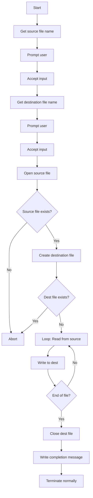

# فصل ۲: خدمات سیستم‌عامل  

---

## ✳️ ساختار کلی فصل دوم

این فصل به معرفی خدماتی که سیستم‌عامل ارائه می‌دهد و نحوه تعامل کاربران و برنامه‌ها با سیستم‌عامل می‌پردازد. در اینجا خلاصه‌ای از سرفصل‌های اصلی آن آمده است:

---

## 1. 🧰 Operating System Services (خدمات سیستم‌عامل)

سیستم‌عامل‌ها خدمات اصلی‌ای برای راحت‌تر کردن کار برنامه‌نویسان و کاربران فراهم می‌کنند. برخی از این خدمات عبارت‌اند از:

- اجرای برنامه‌ها (Program Execution)
- مدیریت ورودی/خروجی (I/O Operations)
- مدیریت فایل‌ها (File-System Manipulation)
- ارتباط بین فرآیندها (Interprocess Communication)
- مدیریت خطاها (Error Detection)
- تخصیص منابع (Resource Allocation)
- امنیت و کنترل دسترسی (Security and Protection)

---

## 2. 👤 User and Operating System Interface (رابط کاربر و سیستم‌عامل)

کاربران از طریق **رابط‌های کاربری** با سیستم‌عامل ارتباط برقرار می‌کنند:

- **Command Line Interface (CLI)**  
- **Graphical User Interface (GUI)**  
- **Touch Interface (در سیستم‌های همراه)**  

---

## 3. 📞 System Calls (سیستم‌کال‌ها)

سیستم‌کال‌ها واسط برنامه‌نویس (Application Programmer Interface) برای استفاده از قابلیت‌های سیستم‌عامل هستند. مثال‌ها:

- `read()`، `write()` برای I/O  
- `fork()` برای ایجاد فرآیند جدید  
- `exec()` برای اجرای یک برنامه جدید  
- `exit()` برای خاتمه یک فرآیند  

---

## 4. 🔧 System Services (سرویس‌های سیستم)

سرویس‌های سطح بالاتری نسبت به سیستم‌کال‌ها فراهم می‌شوند که استفاده از سیستم‌کال‌ها را ساده‌تر می‌کنند.

---

## 5. 🔗 Linkers and Loaders

- **Linker:** قطعات مختلف یک برنامه (object files, libraries) را به هم لینک می‌کند.
- **Loader:** برنامه لینک‌شده را به حافظه بارگذاری و اجرا می‌کند.

---

## 6. ❓ Why Applications are Operating System Specific

برنامه‌ها برای سیستم‌عامل خاصی کامپایل و طراحی می‌شوند زیرا:
- سیستم‌کال‌ها، ساختار فایل‌ها و مدیریت حافظه در سیستم‌عامل‌ها متفاوت است.
- APIهای استاندارد ممکن است وجود نداشته باشد یا تفاوت‌هایی در پیاده‌سازی داشته باشند.

---

## 7. 🛠 Design and Implementation

در طراحی سیستم‌عامل، باید تصمیم‌گیری‌هایی درباره ساختار، ماژولار بودن، سادگی، کارایی و قابلیت نگهداری انجام شود.

---

## 8. 🧱 Operating System Structure (ساختار سیستم‌عامل)

ساختارهای رایج عبارت‌اند از:
- Monolithic (تک‌بلوک)
- Layered (لایه‌ای)
- Microkernel
- Modular


---

## 9. 🧩 Building and Booting an OS

- **Booting:** فرآیند راه‌اندازی سیستم از زمان روشن شدن
    
- **Bootstrap Program:** در BIOS ذخیره شده و سیستم‌عامل را از حافظه بارگذاری می‌کند.
    

---

## 10. 🐞 Operating System Debugging

ابزارهایی برای اشکال‌زدایی رفتار سیستم‌عامل در هنگام توسعه استفاده می‌شوند مانند:

- Logs
    
- Kernel Debuggers
    
- Performance Monitors
    

---

## ✅ نکات کلیدی

- خدمات سیستم‌عامل پایه‌ای برای اجرای برنامه‌ها، مدیریت منابع و تعامل با سخت‌افزار هستند.
    
- سیستم‌کال‌ها ابزار اصلی برای تعامل برنامه‌ها با سیستم‌عامل‌اند.
    
- ساختار سیستم‌عامل می‌تواند تأثیر زیادی بر قابلیت نگهداری، امنیت و کارایی داشته باشد.
    
- بوت شدن سیستم شامل بارگذاری سیستم‌عامل از حافظه دائم به RAM است.
    

---
## 🎯 اهداف یادگیری فصل ۲: خدمات سیستم‌عامل

---

### ✅ 1. **شناسایی خدماتی که سیستم‌عامل ارائه می‌دهد**

- درک اینکه سیستم‌عامل چه کارهایی برای برنامه‌ها و کاربران انجام می‌دهد، مانند:
    
    - مدیریت حافظه، فرآیند، فایل‌ها و I/O
        
    - امنیت، ارتباط بین فرآیندها، مدیریت منابع و تشخیص خطاها
        

---

### ✅ 2. **نحوه استفاده از system callها برای دسترسی به این خدمات**

- یاد می‌گیرید که:
    
    - system call چیست و چرا نیاز داریم؟
        
    - چطور برنامه‌ها با استفاده از system callها با هسته (kernel) ارتباط برقرار می‌کنند
        
    - مثال‌هایی از system call مثل `read`, `write`, `fork`, `exec`
        

---

### ✅ 3. **مقایسه و تحلیل معماری‌های مختلف طراحی سیستم‌عامل**

- آشنایی با مزایا و معایب هر ساختار:
    
    - **Monolithic**: همه‌چیز در یک بلوک بزرگ
        
    - **Layered**: سیستم به لایه‌های جداگانه تقسیم می‌شود
        
    - **Microkernel**: هسته فقط خدمات ضروری را ارائه می‌دهد
        
    - **Modular**: ترکیبی از انعطاف و سادگی – ماژول‌ها قابل بارگذاری هستند
        
    - **Hybrid**: ترکیب microkernel و monolithic (مثلاً در ویندوز)
        

---

### ✅ 4. **شرح فرایند بوت شدن سیستم‌عامل**

- درک مراحل Booting:
    
    - اجرای BIOS/UEFI
        
    - بارگذاری Bootloader
        
    - بارگذاری Kernel سیستم‌عامل در حافظه اصلی
        

---

### ✅ 5. **استفاده از ابزارهای مانیتورینگ سیستم‌عامل**

- معرفی ابزارهایی برای تحلیل عملکرد سیستم‌عامل:
    
    - ابزارهایی مانند `top`, `vmstat`, `iostat`, `perf`, `htop` و غیره
        
    - مشاهده مصرف CPU، حافظه، و منابع توسط فرآیندها
        

---

### ✅ 6. **طراحی و پیاده‌سازی ماژول‌های هسته (Kernel Modules) برای لینوکس**

- آشنایی با نحوه توسعه و بارگذاری ماژول‌ها در کرنل لینوکس
    
    - استفاده از زبان C
        
    - نوشتن ماژول ساده (Hello Kernel)
        
    - دستورات `insmod`, `rmmod`, `lsmod`, `dmesg`
        

---

## 💡 Operating System Services – خدمات سیستم‌عامل

سیستم‌عامل محیطی فراهم می‌کند تا برنامه‌ها بتوانند به‌طور مؤثر و راحت اجرا شوند. این خدمات به دو گروه کلی تقسیم می‌شوند:

---

### 🧑‍💻 خدمات مرتبط با کاربر (User-Level Services)

این خدمات مستقیماً به برنامه‌ها و کاربران کمک می‌کنند:

---

### 1. **User Interface (رابط کاربری)**

- امکان تعامل کاربر با سیستم را فراهم می‌کند.
    
- انواع رابط‌ها:
    
    - **CLI** (رابط متنی مانند ترمینال یا Command Prompt)
        
    - **GUI** (رابط گرافیکی مانند ویندوز، macOS)
        
    - **Touch UI** (مثلاً در تبلت‌ها یا گوشی‌ها)
        
    - **Batch** (اجرای خودکار چند دستور بدون دخالت کاربر)
        

---

### 2. **Program Execution (اجرای برنامه‌ها)**

- بارگذاری برنامه به حافظه
    
- تخصیص منابع لازم
    
- اجرای برنامه
    
- پایان دادن به اجرای برنامه (موفق یا همراه با خطا)
    

---

### 3. **I/O Operations (عملیات ورودی/خروجی)**

- هر برنامه ممکن است نیاز به:
    
    - خواندن یا نوشتن فایل
        
    - ارتباط با دستگاه‌هایی مثل صفحه‌کلید، چاپگر، دیسک و...
        

---

### 4. **File System Manipulation (مدیریت سیستم فایل‌ها)**

- برنامه‌ها باید بتوانند:
    
    - فایل‌ها را بخوانند/بنویسند
        
    - آن‌ها را ایجاد یا حذف کنند
        
    - ساختار پوشه‌ها را مرور کنند (مانند `ls` یا `dir`)
        
    - مجوزها را بررسی یا تغییر دهند (مثل read/write permissions)
        

---

## 💡 ادامه خدمات سیستم‌عامل (Operating System Services – Continued)

---

### 5. **Communications (ارتباط بین فرآیندها یا سیستم‌ها)**

فرآیندها ممکن است نیاز داشته باشند که داده‌هایی را با یکدیگر رد و بدل کنند، که می‌تواند درون یک سیستم یا بین چند سیستم (از طریق شبکه) باشد.

🔹 روش‌های ارتباطی:

- **Shared Memory (حافظه مشترک):** فرآیندها از ناحیه‌ای مشترک از حافظه برای تبادل داده استفاده می‌کنند.
    
- **Message Passing (ارسال پیام):** فرآیندها پیام‌هایی را به یکدیگر می‌فرستند. OS وظیفه‌ی جابجایی این پیام‌ها را برعهده دارد (مثلاً از طریق بافرها یا بسته‌های شبکه).
    

---

### 6. **Error Detection (تشخیص خطا)**

سیستم‌عامل باید همیشه در حال نظارت بر خطاهای احتمالی باشد.

🔹 خطاها ممکن است در موارد زیر رخ دهند:

- **سخت‌افزار CPU یا حافظه (RAM)**
    
- **دستگاه‌های ورودی/خروجی (مانند دیسک یا پرینتر)**
    
- **برنامه‌های کاربر (مثلاً division by zero یا دسترسی به آدرس غیرمجاز)**
    

🔹 وظیفه سیستم‌عامل:

- تشخیص خطا
    
- انجام اقدامات لازم (مانند پایان برنامه، تخصیص مجدد منابع، گزارش به کاربر)
    

🔹 ابزارهای **دیباگینگ (Debugging)** نیز بخش مهمی از خدمات هستند که به برنامه‌نویسان و کاربران در عیب‌یابی کمک می‌کنند.

---

## 🧭 A View of Operating System Services – نمایی از خدمات سیستم‌عامل

---

![[Pasted image 20250518170114.png]]

### ✅ **توضیح کامل نمودار**

این تصویر، یک معماری لایه‌ای از تعامل اجزای مختلف در یک سیستم‌عامل را نمایش می‌دهد. از پایین‌ترین لایه (سخت‌افزار) تا بالاترین لایه (برنامه‌های کاربر)، نقش سیستم‌عامل به‌عنوان واسط میان سخت‌افزار و نرم‌افزار روشن شده است.

---

### 🔹 لایه‌ها از پایین به بالا:

#### 1. **Hardware (سخت‌افزار)**

- پایین‌ترین لایه که شامل CPU، حافظه، دیسک، دستگاه‌های ورودی/خروجی و... است.
    
- سیستم‌عامل باید این منابع فیزیکی را مدیریت کند.
    

---

#### 2. **Operating System (سیستم‌عامل)**

- لایه‌ی مدیریتی که به سخت‌افزار دسترسی مستقیم دارد.
    
- شامل دو بخش اصلی است:
    
    - **Services (خدمات)**: مثل زمان‌بندی، مدیریت حافظه، فایل‌سیستم و...
        
    - **System Calls (فراخوانی‌های سیستمی)**: رابط بین برنامه‌ها و سیستم‌عامل
        

---

#### 3. **System Calls (فراخوانی‌های سیستمی)**

این فراخوانی‌ها به برنامه‌ها اجازه می‌دهند که خدمات سیستم‌عامل را فراخوانی کنند. مثال‌هایی از خدمات:

- اجرای برنامه‌ها
    
- عملیات ورودی/خروجی
    
- فایل‌سیستم
    
- ارتباط میان فرآیندها
    
- تخصیص منابع
    
- حسابداری (logging)
    
- حفاظت و امنیت
    
- تشخیص خطاها
    

---

#### 4. **User Interfaces (رابط‌های کاربری)**

- کاربران برای تعامل با سیستم‌عامل از UI استفاده می‌کنند.
    
- انواع رابط کاربری:
    
    - **GUI**
        
    - **Command Line (CLI)**
        
    - **Touch Screen**
        

---

#### 5. **User and Other System Programs (برنامه‌های کاربر و سایر برنامه‌های سیستمی)**

- در بالاترین سطح، برنامه‌های کاربر و ابزارهای سیستمی قرار دارند که برای عملکرد نیاز به خدمات سیستم‌عامل دارند.
    


---

### ✅ نکات کلیدی

- سیستم‌عامل یک **واسط حیاتی** میان سخت‌افزار و برنامه‌های کاربردی است.
    
- خدمات سیستم‌عامل از طریق **System Calls** به برنامه‌ها ارائه می‌شوند.
    
- UI انواع مختلفی دارد (CLI، GUI، لمسی).
    
- مدیریت منابع، امنیت، ارتباط، و مدیریت خطا، همگی بخشی از مسئولیت‌های سیستم‌عامل هستند.
    
- این ساختار لایه‌ای باعث **جداسازی مسئولیت‌ها** و **قابلیت توسعه‌پذیری سیستم‌عامل** می‌شود.
    

---
## 📞 System Calls

**فراخوانی‌های سیستمی؛ واسط برنامه‌ها با سیستم‌عامل**

---

### 🔹 تعریف

- **System Call**‌ها واسط بین برنامه‌های کاربر و خدمات سیستم‌عامل هستند.
    
- یعنی زمانی که برنامه‌ای نیاز به کاری مثل خواندن از فایل، تخصیص حافظه یا اجرای فرآیند دارد، از طریق سیستم‌کال با سیستم‌عامل ارتباط برقرار می‌کند.
    

---

### 🔹 زبان پیاده‌سازی

- اغلب در زبان‌های **سطح بالا مانند C یا ++C** نوشته می‌شوند.
    
- برنامه‌ها معمولاً **مستقیماً با سیستم‌کال‌ها کار نمی‌کنند** بلکه از طریق API با آن‌ها در ارتباط‌اند.
    

---

### 🔹 API و فراخوانی سیستمی

- بیشتر برنامه‌ها از یک **Application Programming Interface (API)** برای استفاده از خدمات سیستم‌عامل بهره می‌برند.
    
- API در سطح بالاتری از abstraction است و به برنامه‌نویس اجازه می‌دهد بدون درگیر شدن با جزئیات سطح پایین سیستم‌کال، خدمات را فراخوانی کند.
    

---

### 🔹 انواع رایج API

|API|سیستم هدف|
|---|---|
|**Win32 API**|ویندوز|
|**POSIX API**|سیستم‌های UNIX, Linux, macOS|
|**Java API**|ماشین مجازی جاوا (JVM)|

> 📌 توجه: نام سیستم‌کال‌هایی که در کتاب آمده، **عمومی (generic)** هستند، نه وابسته به یک سیستم خاص.

---

### ✅ نکات کلیدی

- System Call واسط اصلی بین برنامه‌ها و سیستم‌عامل است.
    
- استفاده‌ی معمول از سیستم‌کال‌ها **غیرمستقیم و از طریق API** انجام می‌شود.
    
- شناخت APIهای مختلف در پلتفرم‌های مختلف برای توسعه‌ی نرم‌افزار اهمیت دارد.
    

---
## 📁 Example of System Calls

**مثالی از فراخوانی‌های سیستمی – کپی فایل**

---

### 🔹 هدف

کپی‌کردن محتوای یک فایل (source file) به فایل مقصد (destination file) با استفاده از System Callهای سیستم‌عامل.

---

### 🔹 ترتیب فراخوانی‌ها

1. گرفتن نام فایل ورودی از کاربر
    
2. نمایش پیغام به کاربر
    
3. دریافت ورودی از کاربر
    
4. گرفتن نام فایل خروجی
    
5. نمایش پیغام
    
6. دریافت نام فایل خروجی
    
7. باز کردن فایل ورودی
    
    - اگر وجود نداشت → پایان با خطا
        
8. ایجاد فایل خروجی
    
    - اگر وجود داشت → پایان با خطا
        
9. خواندن از فایل ورودی
    
10. نوشتن در فایل خروجی
    
11. تکرار تا پایان فایل
    
12. بستن فایل خروجی
    
13. نمایش پیغام پایان
    
14. خاتمه عادی برنامه
    

---

### 📊 دیاگرام دنباله عملیات (Mermaid Flowchart)



---

### ✅ نکات کلیدی

- System Callها در این فرایند شامل: `read()`, `write()`, `open()`, `close()`, `create()`, `exit()` هستند.
    
- همه عملیات I/O پایین‌سطحی از طریق فراخوانی سیستمی انجام می‌شود.
    
- سیستم‌عامل کنترل کامل روی فایل‌ها و عملیات دارد.
    

---
## 📚 Example of Standard API

**مثال: تابع `read()` در POSIX API**

---

### 🔹 تابع `read()`

تابع `read()` یکی از توابع سیستم‌عامل‌های یونیکس‌پایه است که برای **خواندن داده از فایل یا دستگاه** استفاده می‌شود.

```c
#include <unistd.h>

ssize_t read(int fd, void *buf, size_t count);
```

---

### 🔹 پارامترها

|پارامتر|توضیح|
|---|---|
|`int fd`|شناسه فایل که باید از آن خوانده شود|
|`void *buf`|آدرس بافری که داده‌ها در آن ذخیره می‌شوند|
|`size_t count`|حداکثر تعداد بایت‌هایی که باید خوانده شوند|

---

### 🔹 مقدار بازگشتی

- **>0**: تعداد بایت‌های خوانده‌شده
    
- **0**: پایان فایل (EOF)
    
- **-1**: خطا در خواندن
    

---

### 🔹 نکته مهم

برای استفاده از `read()` باید فایل **`unistd.h`** را **include** کنید؛ زیرا نوع داده‌های `ssize_t` و `size_t` در آن تعریف شده‌اند.

---

### ✅ نکات کلیدی

- تابع `read()` مثالی از یک **API سطح بالا** است که در واقع به یک **System Call** در سطح پایین‌تر متصل می‌شود.
    
- برنامه‌نویسان معمولاً از APIهایی مثل `read()` استفاده می‌کنند، نه مستقیم از خود system call.
    
- این API‌ها بخش کلیدی در نوشتن برنامه‌های چندسکویی و مستقل از سخت‌افزار هستند.
    

---
## 🛠️ System Call Implementation

**پیاده‌سازی فراخوانی سیستمی در سیستم‌عامل**

---

### 🔹 نحوه عملکرد

- هر **System Call** با یک **شماره یکتا** مشخص می‌شود.
    
- سیستم‌عامل یک **جدول داخلی** دارد که system callهای مختلف را با استفاده از این شماره‌ها نگه می‌دارد.
    
- وقتی برنامه‌ای system call انجام می‌دهد، **واسط system call (System Call Interface)**:
    
    - شماره system call را از برنامه دریافت می‌کند.
        
    - system call مربوطه را در **هسته سیستم‌عامل (Kernel)** اجرا می‌کند.
        
    - نتیجه یا مقدار بازگشتی را به برنامه بازمی‌گرداند.
        

---

### 🔹 انتزاع برای برنامه‌نویس

- برنامه‌نویس **نیازی به دانستن جزئیات داخلی** system call ندارد.
    
- تنها کافی‌ست از **API** استفاده کند و بداند این تابع چه کاری انجام می‌دهد.
    
- **جزئیات فنی** اجرای فراخوانی‌های سیستمی از دید برنامه‌نویس پنهان شده‌اند.
    

---

### 🔹 کتابخانه زمان اجرا (Run-time Support Library)

- پیاده‌سازی APIها معمولاً در **کتابخانه‌هایی است که همراه با کامپایلر ارائه می‌شوند**.
    
- این کتابخانه‌ها به برنامه‌نویس اجازه می‌دهند بدون تماس مستقیم با سیستم‌عامل، به‌راحتی از امکانات آن استفاده کند.
    

---

### ✅ نکات کلیدی

- هر system call یک شماره مخصوص دارد.
    
- اجرای system call از طریق واسطی در هسته سیستم‌عامل انجام می‌شود.
    
- برنامه‌نویس تنها با API سر و کار دارد، نه با کدهای درونی هسته.
    
- کتابخانه‌های زمان اجرا نقش واسطه بین برنامه و هسته را بازی می‌کنند.
    

---

## 🔁 API – System Call – OS Relationship


![[Pasted image 20250518171221.png]]

### 🔹 مراحل اجرای یک System Call (مثلاً `open()`)

1. **برنامه کاربر (User Application)** تابعی مثل `open()` را فراخوانی می‌کند.
    
2. این فراخوانی از طریق **رابط system call** به سیستم‌عامل منتقل می‌شود.
    
3. در سیستم‌عامل، یک **شماره مخصوص** برای system call تعیین شده است (در اینجا شماره `i`).
    
4. سیستم‌عامل از روی این شماره، کدی را اجرا می‌کند که پیاده‌سازی system call است.
    
5. پس از اجرا، **نتیجه به برنامه کاربر بازگردانده می‌شود**.
    

---

### 🔹 حالت‌های اجرا

- **User Mode**: جایی که برنامه‌های معمولی اجرا می‌شوند.
    
- **Kernel Mode**: جایی که system call اجرا می‌شود؛ دسترسی کامل به منابع دارد.
    

---

### ✅ نکات کلیدی

- APIها مثل `open()` فقط واسطی سطح بالا هستند.
    
- system call واقعی در **kernel** اجرا می‌شود.
    
- یک جدول system call در کرنل، system call مورد نظر را با استفاده از **شماره‌ی مخصوص (index)** پیدا می‌کند.
    
- بازگشت از system call نتیجه را به برنامه کاربر می‌فرستد.
    

---


## 🧾 System Call Parameter Passing

**نحوه ارسال پارامترها به system call در سیستم‌عامل**

---

### 🔹 چرا پارامتر نیاز است؟

فراخوانی‌های سیستمی (مانند `read`, `write`, `open`) معمولاً به **اطلاعات اضافه** نیاز دارند، نه فقط اسم تابع. مثلاً در `read` باید مشخص شود:

- از کدام فایل بخواند (شناسه فایل)
    
- چه مقدار داده بخواند
    
- کجا ذخیره کند (آدرس حافظه)
    

---

### 🔹 روش‌های ارسال پارامتر

سه روش کلی برای ارسال پارامتر به system call:

1. ✅ **از طریق ثبات‌ها (Registers):**
    
    - ساده‌ترین روش
        
    - اگر پارامترها زیاد باشند، کافی نیست
        
2. ✅ **استفاده از بلاک در حافظه (Block/Table):**
    
    - پارامترها در یک **ساختار حافظه‌ای** ذخیره می‌شوند
        
    - فقط آدرس این بلاک به سیستم‌عامل داده می‌شود
        
    - این روش در **Linux و Solaris** رایج است
        
3. ✅ **استفاده از پشته (Stack):**
    
    - برنامه پارامترها را روی **پشته** قرار می‌دهد
        
    - سیستم‌عامل آن‌ها را از روی پشته می‌خواند
        

---

### 📌 مزایای روش‌های بلاک و پشته

- محدود به تعداد ثبات‌ها نیستند
    
- مناسب برای پارامترهای زیاد یا با طول متغیر
    

---

### ✅ نکات کلیدی

- system callها معمولاً به پارامتر نیاز دارند.
    
- رایج‌ترین روش‌ها: استفاده از **ثبات‌ها، بلاک حافظه، یا پشته**.
    
- Linux و Solaris از روش **بلاک حافظه‌ای** استفاده می‌کنند.
    
- استفاده از پشته یا بلاک، محدودیت در تعداد پارامترها را از بین می‌برد.
    

---

## 📥 Parameter Passing via Table

**ارسال پارامترها از طریق جدول (بلاک حافظه‌ای)**

![[Pasted image 20250518180830.png]]

00---

### 🔹 مفهوم کلی

در این روش، پارامترهای موردنیاز برای system call در یک **جدول یا بلاک حافظه‌ای** (مثلاً `X`) قرار می‌گیرند. سپس **آدرس این جدول** در یکی از **ثبات‌ها (Register)** بارگذاری شده و به سیستم‌عامل داده می‌شود.

---

### 🔸 مراحل اجرای system call (مثلاً شماره ۱۳):

1. برنامه‌ی کاربر **پارامترها را در بلاک `X`** قرار می‌دهد.
    
2. آدرس `X` را در یک **ثبات** ذخیره می‌کند.
    
3. system call شماره ۱۳ را فراخوانی می‌کند.
    
4. سیستم‌عامل با استفاده از آدرس، **مقدار پارامترها را از جدول `X`** خوانده و اجرا می‌کند.
    

---

### 🧠 مزیت این روش

- انعطاف‌پذیر برای پارامترهای **زیاد یا با اندازه متغیر**
    
- نیازی به استفاده از چندین ثبات نیست
    
- ساده‌تر و تمیزتر از روش مستقیم با ثبات‌ها
    

---

### ✅ نکات کلیدی

- در این روش، فقط آدرس جدول به OS داده می‌شود.
    
- محتویات جدول توسط سیستم‌عامل استفاده می‌شود.
    
- **روشی رایج در Linux و Solaris** است.
    
- مناسب برای پارامترهای پیچیده یا زیاد.
    

---

## 🛠️ انواع System Call – کنترل فرآیند (Process Control)

---

## مدیریت اجرای **فرآیندها** (Processes) در سیستم عامل

### 🧩 مهم‌ترین system callهای مربوط به کنترل فرآیند:

|عملیات|توضیح کوتاه|
|---|---|
|`create process`|ایجاد فرآیند جدید|
|`terminate process` / `end` / `abort`|پایان یا توقف فرآیند|
|`load`, `execute`|بارگذاری و اجرای برنامه|
|`get/set process attributes`|خواندن یا تنظیم ویژگی‌های یک فرآیند (مثل ID، اولویت و...)|
|`wait for time`|توقف فرآیند برای مدت مشخص|
|`wait event`, `signal event`|همگام‌سازی بین فرآیندها از طریق رویداد|
|`allocate / free memory`|اختصاص یا آزادسازی حافظه برای فرآیند|
|`dump memory if error`|گرفتن خروجی از حافظه در صورت خطا برای تحلیل|
|`debugger`, `single step execution`|اجرای خط‌به‌خط برای پیدا کردن باگ‌ها|
|`locks`|مدیریت دسترسی چند فرآیند به داده‌ی مشترک (همگام‌سازی)|

---

### 📌 کاربردها:

- اجرای برنامه‌های جدید
    
- پایان دادن به فرآیندها
    
- دیباگ کردن برنامه‌ها
    
- همگام‌سازی فرآیندها در سیستم‌های چندوظیفه‌ای
    

---
## مدیریت فایل (File Management)

### 📌 عملکردهای اصلی:

|عملیات|توضیح کوتاه|
|---|---|
|`create file`, `delete file`|ساخت یا حذف فایل|
|`open`, `close file`|باز کردن یا بستن فایل|
|`read`, `write`, `reposition`|خواندن، نوشتن و جابجایی مکان فایل (seek)|
|`get/set file attributes`|دریافت یا تنظیم ویژگی‌های فایل (مثل مجوز دسترسی، سایز و...)|

---

## 🖥️  مدیریت دستگاه (Device Management)

### 📌 عملکردهای اصلی:

|عملیات|توضیح کوتاه|
|---|---|
|`request device`, `release device`|در خواست استفاده از یک دستگاه یا آزاد کردن آن|
|`read`, `write`, `reposition`|عملیات ورودی/خروجی با دستگاه|
|`get/set device attributes`|دریافت یا تغییر ویژگی‌های دستگاه (مثل سرعت انتقال، وضعیت)|
|`logically attach/detach device`|اتصال یا جدا کردن منطقی دستگاه به سیستم|

---

### 🧠 کاربرد:

- برای کار با فایل‌ها و دستگاه‌های سخت‌افزاری در برنامه‌ها (مثل خواندن از کیبورد یا نوشتن در پرینتر)
    
- کنترل دسترسی‌ها و هماهنگی بین چند برنامه
    

---
## 🧾 نگهداری اطلاعات (Information Maintenance)

### 📌 عملکردهای اصلی:

|عملیات|توضیح کوتاه|
|---|---|
|`get/set time or date`|دریافت یا تنظیم تاریخ و زمان سیستم|
|`get/set system data`|دسترسی یا تغییر داده‌های سیستمی|
|`get/set attributes (process/file/device)`|دریافت یا تنظیم ویژگی‌های فرآیند، فایل یا دستگاه|

---

## 🔗 ارتباطات (Communications)

### 📌 مدل‌های ارتباطی:

**الف) مدل تبادل پیام (Message-Passing):**

|عملیات|توضیح|
|---|---|
|`create/delete connection`|ایجاد یا حذف ارتباط بین دو برنامه|
|`send/receive message`|ارسال/دریافت پیام بین کلاینت و سرور|
|`transfer status info`|انتقال وضعیت یا پیام خطا بین فرایندها|
|`attach/detach remote device`|اتصال یا جدا کردن دستگاه‌های خارجی از راه دور|

**ب) مدل حافظه اشتراکی (Shared Memory):**

|عملیات|توضیح|
|---|---|
|`create/gain access to memory region`|ایجاد یا دسترسی به بخش مشترک حافظه برای ارتباط بین دو فرآیند|

---

### ✅ نکته:

این نوع system callها برای **هماهنگی بین پردازه‌ها (IPC)** و همچنین **مدیریت اطلاعات سیستمی** کاربرد دارند.

---
## 🔐 5. محافظت (Protection)

### 📌 عملکردهای اصلی:

|عملیات|توضیح|
|---|---|
|`control access to resources`|کنترل دسترسی به منابع (مثل فایل‌ها، حافظه، دستگاه‌ها)|
|`get/set permissions`|دریافت یا تنظیم سطح دسترسی (مانند read/write/execute)|
|`allow/deny user access`|مجوز دادن یا رد کردن دسترسی کاربران به منابع خاص|

---

### ✅ نکته:

این system callها برای حفظ امنیت سیستم و جلوگیری از دسترسی غیرمجاز به منابع استفاده می‌شوند.

---
## معادل‌های system call بین سیستم‌عامل‌های **Windows** و **Unix** :

---

### 🧠 **1. کنترل پردازش (Process Control)**

|Windows|Unix|
|---|---|
|`CreateProcess()`|`fork()`|
|`ExitProcess()`|`exit()`|
|`WaitForSingleObject()`|`wait()`|

---

### 📁 **2. مدیریت فایل (File Management)**

|Windows|Unix|
|---|---|
|`CreateFile()`|`open()`|
|`ReadFile()`|`read()`|
|`WriteFile()`|`write()`|
|`CloseHandle()`|`close()`|

---

### 🖥️ **3. مدیریت دستگاه (Device Management)**

|Windows|Unix|
|---|---|
|`SetConsoleMode()`|`ioctl()`|
|`ReadConsole()`|`read()`|
|`WriteConsole()`|`write()`|

---

### 🕓 **4. نگهداری اطلاعات (Information Maintenance)**

|Windows|Unix|
|---|---|
|`GetCurrentProcessID()`|`getpid()`|
|`SetTimer()`|`alarm()`|
|`Sleep()`|`sleep()`|

---

### 📡 **5. ارتباطات (Communications)**

|Windows|Unix|
|---|---|
|`CreatePipe()`|`pipe()`|
|`CreateFileMapping()`|`shm_open()`|
|`MapViewOfFile()`|`mmap()`|

---

### 🔐 **6. محافظت (Protection)**

|Windows|Unix|
|---|---|
|`SetFileSecurity()`|`chmod()`|
|`InitializeSecurityDescriptor()`|`umask()`|
|`SetSecurityDescriptorGroup()`|`chown()`|

---

## نحوه عملکرد یک **تابع کتابخانه‌ای استاندارد C** (مانند `printf()`) که در نهایت منجر به اجرای یک **system call** (مانند `write()`) در سیستم‌عامل می‌شود:

---
![[Pasted image 20250518172649.png]]
### 🔄 **جریان اجرای برنامه :**

1. **کد برنامه‌نویس:**
    
    ```c
    #include <stdio.h>
    int main() {
        printf("Greetings");
        return 0;
    }
    ```
    
2. **فراخوانی `printf()`**:
    
    - این تابع در **user mode** اجرا می‌شود.
        
    - `printf()` فقط یک تابع در کتابخانه C (standard C library) است.
        
3. **کتابخانه C (Libc)**:
    
    - `printf()` در واقع از طریق کتابخانه C، با system call `write()` ارتباط برقرار می‌کند.
        
    - `write()` به سیستم‌عامل می‌گوید که داده‌ها (مثلاً "Greetings") را در خروجی (مثل صفحه نمایش یا فایل) بنویسد.
        
4. **ورود به kernel mode:**
    
    - تابع `write()` وارد **kernel mode** می‌شود و عملیات نوشتن واقعی را انجام می‌دهد.
        
    - سپس مقدار بازگشتی (`return value`) را به برنامه برمی‌گرداند.
        

---

### 📌 نکته مهم:

- کاربر مستقیماً `write()` را فراخوانی نمی‌کند؛ بلکه با استفاده از تابعی ساده مثل `printf()`، که کاربرپسندتر است، به طور غیرمستقیم از قابلیت‌های سیستم‌عامل بهره‌مند می‌شود.
    
- این روش باعث **ساده‌تر شدن برنامه‌نویسی** و **پنهان شدن جزئیات پیاده‌سازی سیستم‌عامل** از دید برنامه‌نویس می‌شود.
    

---

### 🔹 **انواع خدمات سیستمی (System Services):**

1. **File Manipulation (مدیریت فایل):**
    
    - ایجاد، حذف، خواندن، نوشتن، کپی و جابجایی فایل‌ها.
        
    - دستکاری پوشه‌ها و تغییر مجوزهای دسترسی.
        
2. **Status Information (اطلاعات وضعیت):**
    
    - نمایش اطلاعات سیستم مانند استفاده از CPU، حافظه، فضای دیسک و وضعیت فرآیندها.
        
    - این اطلاعات می‌توانند در فایل‌هایی مانند `/proc` در لینوکس ذخیره شوند.
        
3. **Programming Language Support (پشتیبانی از زبان‌های برنامه‌نویسی):**
    
    - کامپایلرها، اسمبلرها، ویرایشگرهای کد، دیباگرها.
        
    - مثال: `gcc`, `make`, `gdb` در لینوکس.
        
4. **Program Loading and Execution (بارگذاری و اجرای برنامه):**
    
    - اجرای برنامه‌های باینری، بارگذاری به حافظه، تخصیص منابع مورد نیاز.
        
    - مثال: اجرای یک فایل اجرایی با دستور `./program`.
        
5. **Communications (ارتباطات):**
    
    - تبادل اطلاعات بین برنامه‌ها یا بین سیستم‌ها.
        
    - شامل **پیام‌رسانی بین پردازشی (IPC)**، سوکت‌ها، pipeها، و ارتباط با شبکه.
        
6. **Background Services (سرویس‌های پس‌زمینه):**
    
    - سرویس‌هایی مانند زمان‌بندی وظایف، بررسی چاپگر، مدیریت ایمیل، بروزرسانی سیستم.
        
    - اغلب به عنوان **daemon** یا **service** اجرا می‌شوند.
        
7. **Application Programs (برنامه‌های کاربردی):**
    
    - برنامه‌هایی که کاربران برای کارهای خاص اجرا می‌کنند (مرورگر، ویرایشگر متن، مدیاپلیر و...).
        
    - این برنامه‌ها با استفاده از رابط‌های سیستم‌عامل و کتابخانه‌ها، از خدمات سیستم بهره می‌برند.
        

---

### 🔸 **نکته کلیدی:**

> بسیاری از کاربران هرگز مستقیماً با system callها کار نمی‌کنند؛ آن‌ها تنها با **system programs** یا **application programs** سروکار دارند.  
> بنابراین، **تصویر کاربر از سیستم‌عامل** معمولاً از طریق این برنامه‌ها شکل می‌گیرد.

---

### 🔹 خدمات سیستمی (System Services) – ادامه:

#### ✅ **محیطی راحت برای توسعه و اجرای برنامه‌ها:**

- این سرویس‌ها باعث می‌شوند کاربران و برنامه‌نویسان نیازی به کار مستقیم با system callها نداشته باشند.
    
- برخی از این خدمات فقط رابط‌های کاربری ساده برای system callها هستند (مانند دستور `cp` در لینوکس که در پشت صحنه از system callهای `read()` و `write()` استفاده می‌کند).
    
- برخی دیگر بسیار پیچیده‌تر هستند و چندین system call و توابع سطح بالا را ترکیب می‌کنند.
    

---

### 🔸 **عملکردهای خاص خدمات سیستمی:**

#### 📁 **File Management (مدیریت فایل):**

- عملیات‌هایی مانند:
    
    - **ایجاد** و **حذف** فایل‌ها و دایرکتوری‌ها.
        
    - **کپی کردن**، **تغییر نام**، **چاپ** یا **لیست کردن** محتوا.
        
    - **dump**: نمایش محتوای باینری فایل‌ها یا حافظه برای بررسی و تحلیل.
        

#### 🖥️ **Status Information (اطلاعات وضعیت):**

- نمایش اطلاعات مربوط به سیستم:
    
    - تاریخ و زمان سیستم (`date`)
        
    - فضای آزاد حافظه و دیسک (`free`, `df`)
        
    - تعداد کاربران فعال (`who`)
        
- اطلاعات دقیق‌تر:
    
    - عملکرد سیستم (`top`, `htop`)
        
    - گزارش‌های ثبت شده (log files) در `/var/log`
        
    - اطلاعات دیباگ و لاگ کردن برنامه‌ها.
        
- در برخی سیستم‌ها مانند **Windows**، اطلاعات پیکربندی در **registry** ذخیره می‌شود:
    
    - رجیستری مجموعه‌ای از کلیدها و مقادیر برای تنظیمات نرم‌افزارها و سخت‌افزارهاست.
        
    - مسیر نمونه: `HKEY_LOCAL_MACHINE\SYSTEM`
        

---

### 📝 جمع‌بندی:

این بخش تأکید دارد که خدمات سیستمی فقط توابع ساده نیستند؛ بلکه برخی از آن‌ها **برنامه‌های پیچیده‌ای** هستند که ترکیب قدرتمندی از system callها و منطق سطح بالا را ارائه می‌دهند، و به همین دلیل نقش حیاتی در توسعه و استفاده از سیستم‌عامل دارند.

---

### 🔹 System Services (ادامه)

---

### 🛠 **Background Services (سرویس‌های پس‌زمینه)**

این سرویس‌ها به طور خودکار در هنگام **بوت سیستم** اجرا می‌شوند و می‌توانند:

- 🔁 **فوراً اجرا و متوقف شوند** (مانند اسکریپت‌های راه‌اندازی سیستم).
    
- 🔄 **در تمام مدت روشن بودن سیستم فعال بمانند** (مثل سیستم زمان‌بندی یا مدیریت لاگ).
    

#### 📌 ویژگی‌ها:

|ویژگی|توضیح|
|---|---|
|زمان اجرا|از لحظه‌ی boot تا shutdown|
|نقش‌ها|بررسی دیسک، زمان‌بندی پردازش‌ها، لاگ‌گیری خطاها، مدیریت چاپ|
|محل اجرا|در **user context** (نه kernel) اجرا می‌شوند|
|نام‌های رایج|در ویندوز: **Services**در یونیکس/لینوکس: **daemons** (مثل `cron`, `syslogd`, `cupsd`)در برخی سیستم‌ها: **subsystems**|

---

### 📱 **Application Programs (برنامه‌های کاربردی)**

این‌ها بخشی از سیستم‌عامل نیستند و توسط **کاربر نهایی** اجرا می‌شوند.

#### 📌 ویژگی‌ها:

|ویژگی|توضیح|
|---|---|
|اجرا توسط|کاربر (مثلاً از طریق CLI، آیکن، لمس صفحه)|
|هدف|رفع نیاز خاص کاربر (مثل مرورگر، پردازشگر متن، بازی)|
|مثال|`Firefox`, `MS Word`, `Calculator`, `gcc`|
|تفاوت با سیستم‌عامل|این برنامه‌ها بخشی از OS محسوب نمی‌شوند، اما ممکن است برای اجرا به **System Calls** یا **System Services** وابسته باشند|

---

### 🧩 جمع‌بندی تصویری:

```
┌────────────────────────────┐
│        Operating System    │
│                            │
│  ┌──────────────────────┐  │
│  │   System Services    │  │  ◄── فایل، وضعیت، دیباگ، ارتباطات، پس‌زمینه
│  └──────────────────────┘  │
│  ┌──────────────────────┐  │
│  │ Kernel + Sys Calls   │  │  ◄── سطح پایین؛ رابط مستقیم با سخت‌افزار
│  └──────────────────────┘  │
└────────────────────────────┘
         ▲
         │
         ▼
┌────────────────────────────┐
│   Application Programs     │  ◄── برنامه‌های اجراشده توسط کاربر
└────────────────────────────┘
```

---

### 🧱 **Operating System Structure**

> **سیستم‌عامل‌ها ساختارهای مختلفی دارند تا قابل مدیریت، توسعه‌پذیر و پایدار باشند.**

---

### ✅ دلایل نیاز به ساختار مناسب:

- سیستم‌عامل یک برنامه‌ی بسیار بزرگ و پیچیده است.
    
- بدون ساختار مناسب، نگهداری و توسعه‌ی آن بسیار سخت می‌شود.
    
- ساختار مناسب باعث جداسازی وظایف، افزایش امنیت، و آسان‌تر شدن تست و اشکال‌زدایی می‌شود.
    

---

### 🔸 **انواع ساختارهای سیستم‌عامل**

---

#### 1. **ساختار ساده (Simple Structure) – مانند MS-DOS**

|ویژگی|توضیح|
|---|---|
|معماری|تک‌لایه، بدون جداسازی واضح|
|مزایا|ساده، سبک، مناسب برای سیستم‌های قدیمی|
|معایب|مدیریت ضعیف منابع، انعطاف‌پذیری کم، امنیت پایین|
|مثال|**MS-DOS** – تمام اجزای اصلی در یک فایل واحد|

---

#### 2. **ساختار پیچیده‌تر (More Complex) – مانند UNIX**

|ویژگی|توضیح|
|---|---|
|معماری|به صورت ماژولار (Kernel + Utilities)|
|هسته (Kernel)|مدیریت فایل، پردازش، حافظه، I/O|
|لایه‌ی خارجی|شامل شل‌ها و ابزارهای کاربردی|
|مزایا|ماژولارتر از MS-DOS، قابل نگهداری|
|مثال|**UNIX**, **Linux**|

---

#### 3. **ساختار لایه‌ای (Layered Structure)**

|ویژگی|توضیح|
|---|---|
|طراحی|تقسیم سیستم‌عامل به **لایه‌های مجزا** (Layer 0, 1, 2, …)|
|مزایا|سادگی در توسعه، تست آسان، کنترل بالا روی تعاملات|
|معایب|اجرای کندتر (زیرا درخواست‌ها باید از چند لایه عبور کنند)|
|مثال|**THE operating system**، مفاهیم اولیه در سیستم‌عامل‌های مدرن|

---

#### 4. **ساختار میکروکرنل (Microkernel) – مانند Mach**

|ویژگی|توضیح|
|---|---|
|طراحی|فقط سرویس‌های اصلی (مانند مدیریت حافظه و زمان‌بندی) در کرنل|
|سرویس‌های دیگر|به صورت **برنامه‌های کاربری** (در فضای user mode) اجرا می‌شوند|
|مزایا|امنیت بالا، قابلیت حمل، crash ایزوله می‌شود|
|معایب|کارایی پایین‌تر نسبت به kernelهای monolithic|
|مثال|**Mach**, **Minix**, **QNX**|

---

### 📌 مقایسه‌ی خلاصه:

|ساختار|سادگی|امنیت|ماژولار بودن|سرعت|
|---|---|---|---|---|
|MS-DOS (ساده)|بالا|پایین|پایین|بالا|
|UNIX (پیچیده)|متوسط|متوسط|متوسط|خوب|
|لایه‌ای|متوسط|بالا|بالا|کندتر|
|میکروکرنل|متوسط|بسیار بالا|بسیار بالا|کندتر|

---
## 🧱 Monolithic Structure – ساختار تک‌لایه (مثال: UNIX اولیه)

### 💡 مفهوم اصلی:

ساختار مونولیتیک به این معناست که **تمام بخش‌های اصلی سیستم‌عامل در یک هسته‌ی بزرگ قرار دارند** که وظایف مختلف را در یک سطح اجرا می‌کند، بدون جداسازی لایه‌ای مشخص.

---

### ⚙️ اجزای اصلی UNIX اولیه:

#### 1. **System Programs (برنامه‌های سیستمی)**

- ابزارهایی که کاربران برای انجام وظایف از آن‌ها استفاده می‌کنند.
    
- مانند شل (shell)، کامپایلر، ابزارهای مدیریتی.
    

#### 2. **Kernel (هسته)**

- بخش مرکزی و اصلی سیستم‌عامل.
    
- شامل همه‌ی توابع سطح پایین:
    
    - مدیریت فایل (File System)
        
    - زمان‌بندی CPU
        
    - مدیریت حافظه
        
    - مدیریت I/O
        
- بین **سخت‌افزار** و **رابط system call** قرار دارد.
    

---

### 📌 ویژگی‌های ساختار Monolithic

|ویژگی|توضیح|
|---|---|
|یکپارچه|همه سرویس‌ها (مثل فایل، حافظه، زمان‌بندی) در یک سطح قرار دارند|
|پیچیدگی|در اجرا سریع است، اما نگهداری سخت‌تر|
|جداسازی وظایف|وجود ندارد یا خیلی کم است|
|امنیت|آسیب‌پذیرتر چون باگ در یک بخش ممکن است کل سیستم را مختل کند|
|انعطاف‌پذیری|کم؛ افزودن قابلیت جدید سخت‌تر است|

---

### 🎓 مثال ساده:

در UNIX اولیه، اگر بخواهید فایلی باز کنید:

- درخواست از برنامه کاربر → system call → هسته → انجام عملیات درایو دیسک → بازگشت نتیجه به برنامه.
    

---

### ✅ نکات کلیدی:

- ساختار مونولیتیک ساده اما سخت در نگهداری است.
    
- هسته شامل تمام سرویس‌های اصلی در یک سطح است.
    
- UNIX اولیه از این ساختار استفاده می‌کرد.
    
- مناسب سیستم‌های با سخت‌افزار محدود بود.

---
## 🧱 **Linux System Structure**

### Monolithic plus Modular Design

![[Pasted image 20250518173720.png]]

---

### 📌 ساختار کلی (از بالا به پایین):

#### 1. **Applications**

- برنامه‌های کاربر مانند ویرایشگر متن، مرورگر، IDE و غیره.
    
- این برنامه‌ها معمولاً از توابع استاندارد کتابخانه‌ای مانند **glibc** استفاده می‌کنند.
    

#### 2. **glibc standard C library**

- کتابخانه استاندارد زبان C که رابط بین برنامه‌های کاربردی و سیستم‌کال‌های سطح پایین را فراهم می‌کند.
    
- فراخوانی‌هایی مثل `printf()`, `malloc()` در نهایت به system call مربوطه مانند `write()` یا `brk()` تبدیل می‌شوند.
    

#### 3. **System-call interface**

- نقطه‌ی ورود برنامه‌های کاربر به هسته (kernel).
    
- مانند پلی بین حالت کاربر (user mode) و هسته (kernel mode).
    

#### 4. **Kernel Services** (Monolithic kernel)

- شامل اجزای کلیدی سیستم‌عامل است:
    
    - **file systems**: ext4, XFS, etc.
        
    - **networks (TCP/IP)**: برای ارتباطات شبکه
        
    - **block devices**: دیسک‌ها
        
    - **CPU scheduler**: زمان‌بندی فرایندها
        
    - **memory manager**: مدیریت حافظه (paging, allocation)
        
    - **character devices**: وسایلی مثل کیبورد و ترمینال
        

> این اجزا در یک فضای مشترک در کرنل اجرا می‌شوند → **Monolithic**.

#### 5. **Device Drivers**

- نرم‌افزارهایی برای ارتباط با سخت‌افزارهای خاص.
    
- در Linux به صورت **ماژولار** هستند: می‌توان در زمان اجرا بارگذاری (load) یا حذف (unload) شوند.
    
- مثلاً: `modprobe` یا `insmod`
    

#### 6. **Hardware**

- سخت‌افزار واقعی: CPU، RAM، دیسک، کارت شبکه و غیره.
    

---

### ✅ ویژگی‌های طراحی لینوکس:

|ویژگی|توضیح|
|---|---|
|**Monolithic Kernel**|تمام سرویس‌های کرنل در یک فضای آدرس اجرا می‌شوند|
|**Modular Design**|قابلیت افزودن یا حذف ماژول‌ها مانند درایورها در زمان اجرا|
|**High Performance**|به دلیل اجرا در فضای یکپارچه|
|**انعطاف‌پذیری بالا**|از طریق ماژول‌ها (مانند فایل سیستم جدید یا درایور جدید بدون ریبوت)|

---

### 🔁 مقایسه با UNIX اولیه:

|UNIX اولیه|Linux|
|---|---|
|فقط Monolithic|Monolithic + Modular|
|کرنل غیرقابل تغییر|کرنل قابل توسعه در زمان اجرا|
|کدها اغلب ثابت و توکار|استفاده از loadable kernel modules|

---
## 🧱 **Layered Approach – طراحی لایه‌ای سیستم‌عامل**

![[Pasted image 20250518174036.png]]
### 📌 مفاهیم اصلی:

1. **تقسیم به لایه‌ها (Layers):**
    
    - سیستم‌عامل به چندین لایه تقسیم می‌شود.
        
    - هر لایه تنها با لایه‌ی پایین‌تر خود در ارتباط است و از خدمات آن استفاده می‌کند.
        
    - هدف: ساده‌سازی طراحی، تست، نگهداری و امنیت.
        
2. **Layer 0 – سخت‌افزار (hardware):**
    
    - پایین‌ترین لایه
        
    - شامل پردازنده، حافظه، دیسک‌ها، کارت شبکه و سایر سخت‌افزارها
        
3. **Layer 1, 2, ..., N – لایه‌های میانی تا بالاترین لایه:**
    
    - شامل اجزای سیستم‌عامل مانند: مدیریت حافظه، زمان‌بندی CPU، فایل سیستم، و غیره.
        
    - هرچه به سمت بالا می‌رویم، انتزاع بیشتر و نزدیک‌تر به کاربر می‌شویم.
        
4. **Layer N – رابط کاربر (User Interface):**
    
    - بالاترین لایه
        
    - شامل پوسته (shell)، واسط گرافیکی (GUI)، یا ابزارهای خط فرمان
        
    - کاربران از این طریق با سیستم‌عامل تعامل دارند.
        

---

### ✅ **مزایا:**

|مزیت|توضیح|
|---|---|
|**ماژولار بودن**|هر لایه را می‌توان مستقل طراحی، تست و نگهداری کرد|
|**سادگی در اشکال‌زدایی (Debugging)**|اشکالات را می‌توان به لایه خاصی محدود کرد|
|**امنیت بیشتر**|دسترسی محدود به توابع لایه‌های پایین‌تر|
|**توسعه آسان‌تر**|لایه‌های جدید بدون تغییر در لایه‌های پایین‌تر اضافه می‌شوند|

---

### ⚠️ **معایب:**

|مشکل|توضیح|
|---|---|
|**کاهش کارایی**|به دلیل عبور درخواست از چندین لایه برای رسیدن به سخت‌افزار|
|**سختی در طراحی لایه‌ها**|لایه‌ها باید دقیق و به‌درستی تعریف شوند تا استقلال حفظ شود|
|**عدم انعطاف‌پذیری بالا**|وابستگی به ترتیب مشخص لایه‌ها ممکن است مانع بهینه‌سازی شود|

---

### 🎯 مثال از سیستم‌عامل با طراحی لایه‌ای:

- **THE OS** (اولین سیستم‌عامل با طراحی لایه‌ای)
    
- برخی پیاده‌سازی‌های **Multics** و **Windows NT** تا حدودی از این ساختار بهره گرفته‌اند.
    

---
## 🧱 **ساختار سنتی UNIX**


![[Pasted image 20250518174246.png]]

### 🔹 بخش‌های اصلی ساختار:

---

### 1. **User Space (فضای کاربر):**

- **(the users)**: کاربران نهایی سیستم
    
- **Shells and commands**: محیط‌های خط فرمان مانند Bash یا sh
    
- **Compilers and interpreters**: کامپایلرها (مثل gcc) و مفسرها (مثل Python)
    
- **System libraries**: توابع کتابخانه‌ای مانند `printf()` که فراخوانی سیستم را پنهان می‌کنند
    

---

### 2. **System-call interface to the kernel (رابط فراخوانی سیستم):**

- لایه‌ای که رابط بین برنامه‌های کاربر و هسته سیستم‌عامل (kernel) است
    
- برنامه‌ها برای استفاده از منابع سیستم (مثل فایل، حافظه، پردازنده) از طریق این رابط با کرنل ارتباط برقرار می‌کنند
    

---

### 3. **Kernel (هسته):**

- قلب سیستم‌عامل که وظایف حیاتی را مدیریت می‌کند:
    

|بخش‌ها|وظایف|
|---|---|
|**Signals, I/O**|مدیریت سیگنال‌ها، ورودی/خروجی کاراکتری و ترمینال‌ها|
|**File system & Block I/O**|فایل سیستم، تعویض (swapping)، درایور دیسک و نوار|
|**CPU scheduling & memory**|زمان‌بندی CPU، تعویض صفحه (page replacement)، حافظه مجازی|

---

### 4. **Kernel interface to the hardware (رابط کرنل با سخت‌افزار):**

- پایین‌ترین سطح تعامل با سخت‌افزار واقعی از طریق کنترلرها:
    

|نوع کنترلر|سخت‌افزار مربوطه|
|---|---|
|Terminal controllers|ترمینال‌ها|
|Device controllers|دیسک‌ها، نوارها|
|Memory controllers|حافظه فیزیکی|

---

## ✅ ویژگی‌ها:

- **نیمه‌لایه‌ای**: برخلاف ساختار لایه‌ای کلاسیک، برخی اجزای UNIX به‌طور افقی با هم تعامل دارند، نه صرفاً از بالا به پایین.
    
- **یکپارچگی کرنل**: تمامی اجزای هسته (مانند زمان‌بندی، مدیریت فایل، مدیریت حافظه) در یک فضای واحد اجرا می‌شوند.
    
- **سادگی و کارایی بالا**: طراحی ساده‌تر، کارایی خوب برای سخت‌افزارهای آن زمان
    
- **قابلیت توسعه**: برنامه‌نویسان می‌توانند بدون تغییر زیاد در کرنل، برنامه‌های جدید بنویسند
    

---

## ⚠️ محدودیت‌ها:

- **کاهش ماژولار بودن** نسبت به ساختار لایه‌ای یا microkernel
    
- **امنیت کمتر** چون همه‌ی سرویس‌ها در یک فضای آدرس اجرا می‌شوند
    

---

ا
## 🧠 **Microkernel چیست؟**

**Microkernel** یک ساختار سیستم‌عامل است که در آن:  
✅ تنها عملکردهای اصلی (پایه‌ای) در **هسته (Kernel)** باقی می‌مانند  
❌ سایر سرویس‌های سیستم‌عامل مانند مدیریت فایل، درایورهای دستگاه، و پروتکل‌های شبکه به **فضای کاربر (User Space)** منتقل می‌شوند.

---

## 🔍 اجزای باقی‌مانده در Microkernel:

- زمان‌بندی پردازنده (CPU Scheduling)
    
- مدیریت حافظه (Memory Management)
    
- ارتباط بین پردازه‌ها (IPC)
    
- سوییچ بین پردازه‌ها
    

---

## 📦 مثال:

- **Mach**: نمونه کلاسیک microkernel است
    
- **macOS (Darwin kernel)**: ترکیبی از Mach و BSD، طراحی نیمه-microkernel دارد
    

---

## ✉️ **ارتباط در Microkernel:**

- از طریق **message passing** بین اجزا صورت می‌گیرد  
    (ماژول‌های مختلف با پیام با هم ارتباط برقرار می‌کنند، نه با تماس مستقیم)
    

---

## ✅ **مزایا:**

|مزیت|توضیح|
|---|---|
|**قابل گسترش بودن (Extensibility)**|افزودن قابلیت‌ها بدون تغییر زیاد در هسته|
|**قابل انتقال (Portability)**|آسان‌تر برای انتقال به معماری‌های سخت‌افزاری جدید|
|**قابلیت اطمینان (Reliability)**|چون بیشتر کد در user space اجرا می‌شود، باگ‌ها باعث خرابی کل سیستم نمی‌شوند|
|**امنیت بیشتر (Security)**|چون سرویس‌ها جدا هستند، نفوذپذیری کمتر است|

---

## ❌ **معایب:**

|عیب|توضیح|
|---|---|
|**کاهش کارایی (Performance overhead)**|ارتباط زیاد بین user space و kernel space باعث سربار (overhead) می‌شود|
|**پیچیدگی در طراحی**|طراحی ماژولار و پیام‌محور می‌تواند سخت‌تر پیاده‌سازی شود|

---

## 📊 مقایسه با Monolithic Kernel:

|ویژگی|Monolithic Kernel|Microkernel|
|---|---|---|
|سرعت|بالا|کمتر (به دلیل message passing)|
|توسعه‌پذیری|سخت‌تر|آسان‌تر|
|امنیت|کمتر|بیشتر|
|پایداری|کمتر|بیشتر|

---

![[Pasted image 20250518174607.png]]

این تصویر **ساختار سیستم Microkernel** را نشان می‌دهد که از معماری ماژولار و تفکیک‌شده بین **kernel mode** و **user mode** بهره می‌برد.

---

## 🔧 اجزای تصویر:

### 🔹 **Kernel Mode (داخل microkernel)**:

شامل اجزای پایه‌ای و حیاتی سیستم‌عامل است:

- **Interprocess Communication (IPC)**: برای ارتباط بین اجزای مختلف
    
- **Memory Management**: مدیریت حافظه
    
- **CPU Scheduling**: زمان‌بندی اجرای فرآیندها
    

این اجزا مستقیماً با سخت‌افزار در ارتباط‌اند.

---

### 🔸 **User Mode**:

ماژول‌هایی که معمولاً در هسته‌ی monolithic وجود دارند، در اینجا به فضای کاربر منتقل شده‌اند:

- **Application Program**: برنامه‌ی کاربر
    
- **File System**: سیستم فایل (در فضای کاربر قرار گرفته است)
    
- **Device Driver**: درایورهای سخت‌افزاری مثل چاپگر، دیسک، کارت شبکه و...
    

ارتباط این اجزا با microkernel از طریق **پیام‌ها (Messages)** انجام می‌شود.

⬅️ این معماری باعث **جداسازی اجزا** و در نتیجه **پایداری و امنیت بیشتر** می‌شود.

---

## 📝 جمع‌بندی:

|بخش|اجرا در|
|---|---|
|زمان‌بند CPU، IPC، مدیریت حافظه|در microkernel (kernel mode)|
|فایل سیستم، درایورها، برنامه‌ها|در user space (بیرون از هسته)|
|روش ارتباطی|message passing بین ماژول‌ها|

---
## 🧩 Modules در سیستم‌عامل‌ها

### ✅ تعریف:

**ماژول‌های کرنل قابل بارگذاری (LKMs)** بخش‌هایی از کرنل هستند که می‌توانند:

- **در زمان اجرا** بارگذاری یا حذف شوند.
    
- **نیاز به ریبوت** سیستم برای افزودن قابلیت جدید نداشته باشند.
    

---

### 🛠 ویژگی‌ها:

- ✅ مبتنی بر **رویکرد شی‌ء‌گرایانه (Object-Oriented)**  
    هر جزء کرنل به‌عنوان یک واحد مستقل با عملکرد خاص در نظر گرفته می‌شود.
    
- ✅ **تفکیک اجزا**:
    
    - هر کامپوننت (مثلاً فایل سیستم، درایور، شبکه) مستقل است.
        
    - ارتباط بین آن‌ها از طریق **رابط‌های مشخص و استاندارد** انجام می‌شود.
        
- ✅ **انعطاف‌پذیری بالا** نسبت به ساختار لایه‌ای:
    
    - اجزا می‌توانند به صورت دلخواه و فقط در صورت نیاز بارگذاری شوند.
        
    - برخلاف لایه‌ای که ارتباط صرفاً بالا به پایین است، در ماژولار می‌توان اجزا را به صورت دینامیک و افقی نیز متصل کرد.
        

---

### 📌 مزایا:

|مزیت|توضیح|
|---|---|
|⚡ کارایی|نیازی به بارگذاری همه اجزا از ابتدا نیست|
|🔄 گسترش‌پذیری|افزودن قابلیت یا درایور بدون نیاز به تغییر کرنل|
|🔧 نگهداری|آسان‌تر برای اشکال‌زدایی و توسعه|
|🧱 ساختارپذیری|مشابه معماری لایه‌ای ولی با انعطاف بیشتر|

---

### 💡 نمونه سیستم‌عامل‌هایی با پشتیبانی از ماژول‌ها:

- **Linux** (ماژول‌های .ko)
    
- **Solaris**
    
- **Windows (از طریق .sys درایورها)**
    

---

# End of Chapter 2 :)