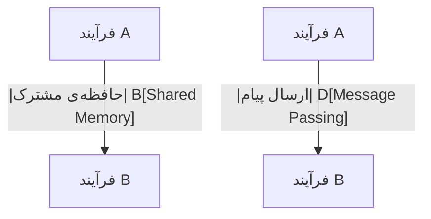

# فصل ۳: فرآیندها (Processes)

این فصل از کتاب به بررسی یکی از مهم‌ترین مفاهیم در سیستم‌عامل‌ها می‌پردازد: **فرآیند (Process)**. فرآیند اساس اجرای برنامه در سیستم‌عامل است. وقتی برنامه‌ای را اجرا می‌کنیم (مثلاً مرورگر یا ویرایشگر متن)، سیستم‌عامل آن را به یک فرآیند تبدیل می‌کند تا بتواند مدیریت و زمان‌بندی شود.

## ساختار کلی مطالب فصل

در این فصل، با مفاهیم زیر آشنا می‌شویم:

---

### 1. مفهوم فرآیند (Process Concept)
فرآیند، یک برنامه در حال اجرا است. اجرای برنامه شامل کد، داده، پشته، رجیسترها و شمارنده برنامه است. سیستم‌عامل‌ها باید فرآیندها را مدیریت کنند.

---

### 2. زمان‌بندی فرآیند (Process Scheduling)
زمان‌بندی فرآیند مشخص می‌کند کدام فرآیند توسط CPU اجرا شود. این بخش به **صف‌های آماده (Ready Queue)**، **بلوک‌شده (Blocked)**، و **در حال اجرا (Running)** می‌پردازد و الگوریتم‌های زمان‌بندی را معرفی می‌کند.

---

### 3. عملیات روی فرآیندها (Operations on Processes)

سیستم‌عامل می‌تواند فرآیند ایجاد یا نابود کند. این بخش به توابعی مثل `fork()`, `exec()`, `exit()` و مدیریت فرآیندهای پدر و فرزند می‌پردازد.

---

### 4. ارتباط بین فرآیندها (Interprocess Communication - IPC)

فرآیندها ممکن است نیاز به تبادل اطلاعات داشته باشند. این تبادل اطلاعات را IPC می‌نامند که در ادامه با دو روش اصلی آن آشنا می‌شویم:

---

### 5. ارتباط در سیستم‌های حافظه مشترک (Shared-Memory IPC)

در این روش، چند فرآیند بخشی از حافظه را به صورت مشترک استفاده می‌کنند و از طریق آن با هم ارتباط برقرار می‌کنند.

---

### 6. ارتباط در سیستم‌های ارسال پیام (Message-Passing IPC)

در این روش، فرآیندها پیام‌هایی را بین یکدیگر ارسال یا دریافت می‌کنند. این روش در سیستم‌های توزیع‌شده بسیار رایج است.

---

### 7. مثال‌هایی از سیستم‌های IPC (Examples of IPC Systems)

در این بخش نمونه‌هایی از پیاده‌سازی‌های IPC در سیستم‌عامل‌های واقعی مانند UNIX و Windows بررسی می‌شود.

---

### 8. ارتباط در سیستم‌های Client-Server

مدل سرویس‌گیرنده/سرویس‌دهنده (Client-Server) نوعی ارتباط است که در آن یک فرآیند سرویس‌دهنده به درخواست‌های فرآیندهای سرویس‌گیرنده پاسخ می‌دهد.

---
# اهداف فصل ۳: فرآیندها (Processes)

این فصل به دانشجویان کمک می‌کند تا درک عمیقی از فرآیندها و ارتباط بین آن‌ها در سیستم‌عامل به‌دست آورند. در ادامه، هر هدف آموزشی ذکر شده در اسلاید را به زبان ساده توضیح داده‌ایم:

---

## 🎯 هدف ۱: شناسایی اجزای مختلف یک فرآیند و نحوه‌ی نمایش و زمان‌بندی آن در سیستم‌عامل

هر فرآیند در سیستم‌عامل دارای بخش‌های مختلفی است:

- **کد (Text Segment)**: دستورات برنامه
- **داده‌ها (Data Segment)**: متغیرهای سراسری و مقداردهی‌شده
- **پشته (Stack)**: برای فراخوانی توابع و ذخیره متغیرهای محلی
- **هیپ (Heap)**: برای حافظه‌ی دینامیکی
- **وضعیت پردازشی (Process Control Block - PCB)**: اطلاعاتی مثل PID، وضعیت، رجیسترها، شمارنده برنامه و...

این اطلاعات در **جدول فرآیندها** ذخیره می‌شوند و سیستم‌عامل برای زمان‌بندی، از صف‌های آماده (Ready Queue)، در حال اجرا (Running) و... استفاده می‌کند.

---

## 🎯 هدف ۲: شرح نحوه‌ی ایجاد و خاتمه فرآیند، همراه با کدنویسی با system callهای مربوطه

### ایجاد فرآیند
در سیستم‌های UNIX/Linux، از `fork()` برای ساخت فرآیند جدید استفاده می‌شود.
### پایان فرآیند

از `exit()` برای پایان دادن به فرآیند و از `wait()` برای منتظر ماندن فرآیند پدر برای پایان یافتن فرزند استفاده می‌شود.

---

## 🎯 هدف ۳: مقایسه‌ی ارتباط بین‌فرآیندی با استفاده از حافظه‌ی مشترک و ارسال پیام

|ویژگی|حافظه‌ی مشترک (Shared Memory)|ارسال پیام (Message Passing)|
|---|---|---|
|کارایی|بسیار بالا|نسبتاً کمتر|
|پیاده‌سازی|پیچیده‌تر|ساده‌تر|
|هماهنگی (Sync)|نیازمند مکانیزم‌هایی مثل semaphore|درونی (در سیستم‌عامل)|
|کاربرد|در سیستم‌های یکپارچه (tight-coupled)|در سیستم‌های توزیع‌شده|

---

## 🎯 هدف ۴: طراحی برنامه‌هایی با استفاده از pipe و حافظه مشترک POSIX


---

## 🎯 هدف ۵: شرح ارتباط Client-Server با استفاده از socket و Remote Procedure Call (RPC)

### مدل socket

در این مدل، یک **server** درگاه مشخصی را گوش می‌دهد و **client** به آن متصل می‌شود.

- Server: `socket() → bind() → listen() → accept()`
    
- Client: `socket() → connect() → send()/recv()`
    

### RPC

در RPC، یک برنامه می‌تواند تابعی را در سیستم دیگری صدا بزند، بدون اینکه از جزئیات شبکه باخبر باشد. RPC باعث ساده‌تر شدن توزیع عملکرد بین چند سیستم می‌شود.

---

## 🎯 هدف ۶: طراحی ماژول‌های کرنل که با سیستم‌عامل لینوکس تعامل دارند

ماژول‌های کرنل، قطعه‌کدهایی هستند که می‌توان آن‌ها را در زمان اجرا به کرنل لینوکس اضافه کرد.

---
# مفهوم فرآیند (Process Concept)

در سیستم‌عامل‌ها، اجرای برنامه‌ها به شکل **فرآیند (Process)** صورت می‌گیرد. یک فرآیند، همان برنامه‌ای است که در حال اجراست. درک تفاوت بین «برنامه» و «فرآیند» برای دانشجویان بسیار مهم است.

---

## ✅ تعریف فرآیند

- **فرآیند (Process)**: یک **برنامه در حال اجرا** است.
- یک برنامه زمانی به فرآیند تبدیل می‌شود که در حافظه بارگذاری شده و شروع به اجرا کند.
- فرآیند یک موجودیت **فعال** است، در حالی که برنامه صرفاً یک فایل **غیرفعال** روی دیسک است (مثلاً فایل `.exe` یا یک فایل باینری).

---

## 📌 ویژگی‌های اجرای فرآیند

- اجرای فرآیند باید **به‌صورت ترتیبی (sequential)** انجام شود.
- دستورالعمل‌های یک فرآیند به صورت موازی اجرا نمی‌شوند (مگر در حالت multi-threading که موضوع بعدی است).
- هر فرآیند دارای مجموعه‌ای از اجزای مشخص است.

---

## 🧱 اجزای یک فرآیند

یک فرآیند در حافظه دارای بخش‌های زیر است:

![[Pasted image 20250518130612.png]]
- **Text section**: شامل کد برنامه است.
    
- **Program Counter (PC)** و **Registers**: نشان‌دهنده وضعیت فعلی اجرای برنامه.
    
- **Stack**: شامل پارامترهای تابع‌ها، آدرس برگشت و متغیرهای محلی.
    
- **Data section**: شامل متغیرهای سراسری.
    
- **Heap**: شامل داده‌هایی که در زمان اجرا به صورت پویا تخصیص داده می‌شوند (مثل استفاده از `malloc` در C).
    

---

## 💡 تفاوت برنامه و فرآیند

|برنامه (Program)|فرآیند (Process)|
|---|---|
|فایل ذخیره‌شده روی دیسک|موجودیتی فعال در حافظه|
|غیرفعال و بدون اجرا|دارای اجرای واقعی و وضعیت جاری|
|ممکن است هرگز اجرا نشود|در حال استفاده از CPU یا منتظر اجرا|

---

## 👥 یک برنامه، چند فرآیند؟

بله! ممکن است چندین کاربر یک برنامه را اجرا کنند. هر بار اجرا، یک **فرآیند مستقل** ایجاد می‌کند.

### مثال:

برنامه‌ی مرورگر `firefox`:

- اگر دو کاربر جداگانه در سیستم آن را اجرا کنند، سیستم‌عامل برای هر کدام یک فرآیند مستقل ایجاد می‌کند.
    
- حتی ممکن است در یک کاربر، دو پنجره‌ی مجزا از فایرفاکس به صورت دو فرآیند جداگانه اجرا شوند.
    

---

## 🧪 مثال ساده

فرض کنید برنامه‌ای داریم به نام `counter.exe` که از عدد 1 تا 10 را چاپ می‌کند. این فایل روی دیسک ذخیره شده است.

وقتی در ترمینال می‌زنید:

```bash
./counter
```

سیستم‌عامل فایل را از دیسک خوانده، در حافظه بارگذاری می‌کند و یک **فرآیند فعال** می‌سازد تا دستورات آن را اجرا کند.

---

## نکات کلیدی

- فرآیند، یک برنامه در حال اجراست که شامل کد، داده، پشته، هیپ و رجیسترهاست.
    
- یک برنامه بدون اجرا شدن، صرفاً یک موجودیت غیرفعال است.
    
- سیستم‌عامل هنگام اجرای برنامه، آن را به فرآیند تبدیل می‌کند.
    
- اجرای فرآیند ترتیبی است، نه موازی (در حالت تک‌ریسمانی).
    
- ممکن است چندین فرآیند از یک برنامه مشترک ایجاد شوند.
    

---
![[Pasted image 20250518130710.png]]

---
# حالت‌های فرآیند (Process State)

در طول چرخه‌ی حیات یک فرآیند، سیستم‌عامل آن را در وضعیت‌های مختلفی نگه می‌دارد. هر وضعیت نشان‌دهنده‌ی مرحله‌ای از اجرای فرآیند است.

---

## 🎯 حالت‌های پنج‌گانه‌ی استاندارد یک فرآیند

در مدل کلاسیک سیستم‌عامل‌ها، هر فرآیند در یکی از حالت‌های زیر قرار دارد:

| وضعیت | توضیح |
|-------|--------|
| **New** | فرآیند در حال ایجاد شدن است. |
| **Running** | فرآیند در حال اجرای دستورالعمل‌هاست (در حال استفاده از CPU). |
| **Waiting** | فرآیند منتظر وقوع یک رویداد است (مثلاً پایان عملیات I/O). |
| **Ready** | فرآیند آماده‌ی اجراست ولی هنوز CPU به آن اختصاص نیافته. |
| **Terminated** | فرآیند اجرا را به پایان رسانده است. |

---

## 🔄 دیاگرام وضعیت فرآیند


![[Pasted image 20250518130948.png]]

**توضیح دیاگرام:**

- فرآیند ابتدا در وضعیت **New** ایجاد می‌شود.
    
- پس از آماده‌سازی، وارد وضعیت **Ready** می‌شود.
    
- اگر CPU به آن اختصاص یابد، وارد وضعیت **Running** می‌شود.
    
- ممکن است در حین اجرا به عملیات ورودی/خروجی نیاز پیدا کند و به وضعیت **Waiting** برود.
    
- پس از پایان I/O دوباره به **Ready** بازمی‌گردد.
    
- در نهایت، پس از پایان اجرای کامل، به **Terminated** می‌رود.
    
- اگر سیستم‌عامل تصمیم بگیرد فرآیند دیگری را اجرا کند (در سیستم‌های چندوظیفه‌ای)، ممکن است فرآیند **Running** به **Ready** بازگردد (پیش‌دستی).
    

---

## 💡 مثال ساده برای درک بهتر

فرض کنید برنامه‌ای داریم که:

1. از کاربر ورودی می‌گیرد،
    
2. سپس آن را پردازش می‌کند،
    
3. و نتیجه را چاپ می‌کند.
    

🔹 وضعیت‌ها:

- **New**: کاربر برنامه را اجرا می‌کند.
    
- **Ready**: سیستم‌عامل منتظر زمان مناسب برای اجرای آن است.
    
- **Running**: CPU پردازش را انجام می‌دهد.
    
- **Waiting**: منتظر ورود کاربر از صفحه‌کلید.
    
- **Running**: ادامه‌ی پردازش و چاپ نتیجه.
    
- **Terminated**: برنامه به پایان رسیده است.
    

---

## نکات کلیدی

- فرآیند در طول عمر خود از چند وضعیت عبور می‌کند.
    
- حالت **Waiting** به معنای منتظر I/O یا event خاصی است.
    
- حالت **Ready** نشان می‌دهد که فرآیند آماده اجراست ولی هنوز انتخاب نشده.
    
- تغییر بین حالت‌ها با تصمیم سیستم‌عامل انجام می‌شود.
    
- در سیستم‌های **پیش‌دستی‌کننده (preemptive)**، فرآیند ممکن است در میانه‌ی اجرا متوقف شود و به حالت Ready برود.
    

---

# 📘 نمودار وضعیت‌های فرآیند (Process State Diagram)

در این بخش، وضعیت‌های ممکن برای یک فرآیند و انتقال‌های بین آن‌ها را به زبان ساده بررسی می‌کنیم. این مدل پایه برای درک نحوه مدیریت اجرای برنامه‌ها توسط سیستم‌عامل ضروری است.

---

## 🔁 وضعیت‌های ممکن برای فرآیند

| وضعیت (State)     | توضیح |
|------------------|--------|
| **New**          | فرآیند به تازگی ایجاد شده ولی هنوز آماده اجرا نیست. |
| **Ready**        | فرآیند آماده اجراست و منتظر تخصیص CPU می‌باشد. |
| **Running**      | فرآیند در حال اجرا و استفاده از CPU است. |
| **Waiting**      | فرآیند منتظر یک رویداد (مثلاً I/O) است. |
| **Terminated**   | فرآیند اجرا را به پایان رسانده و خاتمه یافته است. |

---

## 📈 انتقال‌های بین وضعیت‌ها (State Transitions)

- `New → Ready`: فرآیند توسط سیستم‌عامل پذیرفته شده است (admitted).
- `Ready → Running`: برنامه‌ریز (scheduler) فرآیند را برای اجرا انتخاب می‌کند (scheduler dispatch).
- `Running → Waiting`: فرآیند منتظر یک رویداد یا I/O است (I/O or event wait).
- `Waiting → Ready`: رویداد مورد نظر کامل شده و فرآیند دوباره آماده‌ی اجراست (I/O or event completion).
- `Running → Ready`: اجرای فرآیند متوقف شده و دوباره در صف آماده قرار گرفته (interrupt).
- `Running → Terminated`: فرآیند با موفقیت اجرا را به پایان رسانده (exit).

---

## 🎨 دیاگرام وضعیت
![[Pasted image 20250518131241.png]]

---

## 💡 مثال ساده

فرض کنید برنامه‌ای برای محاسبه میانگین نمرات دانش‌آموزان داریم:

1. **New**: کاربر برنامه را اجرا می‌کند.
    
2. **Ready**: برنامه آماده اجراست ولی منتظر CPU است.
    
3. **Running**: برنامه شروع به اجرا کرده است.
    
4. **Waiting**: منتظر وارد کردن نمرات توسط کاربر (ورودی).
    
5. **Ready**: ورودی دریافت شده و آماده ادامه اجراست.
    
6. **Running**: میانگین را محاسبه و چاپ می‌کند.
    
7. **Terminated**: اجرای برنامه پایان یافته است.
    

---

## ✨ نکات کلیدی

- یک فرآیند همیشه در یکی از این پنج وضعیت قرار دارد.
    
- مدیریت این وضعیت‌ها و انتقال بین آن‌ها توسط **سیستم‌عامل** انجام می‌شود.
    
- استفاده از **Interrupt** و **Dispatcher** به سیستم‌عامل اجازه می‌دهد که چند فرآیند را به‌صورت **چندوظیفه‌ای (multitasking)** اجرا کند.
    
- وضعیت **Waiting** مخصوص منتظر ماندن برای I/O یا event خاص است.
    
- این مدل پایه در طراحی زمان‌بندها (Schedulers) و مدیریت منابع بسیار مهم است.
    
---

# دیاگرام وضعیت فرآیند با وضعیت معلق (Suspend)

## 🧠 مفهوم کلی

مدل قبلی پنج وضعیت اصلی برای فرآیندها داشت. اما این مدل **یک وضعیت جدید به نام "Suspend"** را معرفی می‌کند که امکان **توقف موقتی فرآیندها** به دلایل خاص (مثلاً کمبود RAM یا ملاحظات مدیریتی) را فراهم می‌سازد.

### وضعیت‌های اضافی:
- **Blocked (مسدود):** فرآیند منتظر وقوع یک رویداد خارجی (مثلاً تکمیل I/O) است.
- **Suspend:** فرآیند به طور موقت از حافظه خارج شده (مثلاً به دیسک) تا منابع آزاد شوند. این حالت ممکن است برای فرآیندهای در حالت Blocked یا Ready رخ دهد.

---

## 🧭 شرح انتقال وضعیت‌ها

| مبدأ | مقصد | دلیل انتقال |
|------|-------|--------------|
| New | Ready | فرآیند ایجاد شده و آماده اجراست. |
| Ready | Running | نوبت اجرای فرآیند رسیده است. |
| Running | Blocked | فرآیند منتظر I/O یا یک رویداد خارجی است. |
| Blocked | Ready | رویداد مورد انتظار رخ داده است. |
| Running | Ready | به علت پایان سهم زمانی (Time Slice) به صف آماده برمی‌گردد. |
| Running | Exit | فرآیند اجرا را به پایان رسانده است. |
| Blocked | Suspend | فرآیند در حالت انتظار قرار دارد ولی به دلایلی مانند کمبود RAM، موقتاً معلق می‌شود. |
| Suspend | Ready | فرآیند دوباره به حافظه بازگردانده شده و آماده‌ی اجراست. |

---

## 📊 ترسیم دیاگرام فرآیند (با حالت Suspend)

![[Pasted image 20250518131936.png]]
---

## 🧪 مثال آموزشی

تصور کنید فرآیندی قصد دارد فایلی را از دیسک بخواند:

1. ابتدا در حالت **Ready** قرار دارد.
    
2. با اختصاص CPU به **Running** می‌رود.
    
3. وقتی درخواست I/O می‌دهد، وارد **Blocked** می‌شود.
    
4. چون حافظه RAM کم است، سیستم‌عامل آن را به دیسک منتقل می‌کند ⇒ وارد **Suspend** می‌شود.
    
5. بعد از آزاد شدن حافظه، سیستم‌عامل دوباره آن را **Activate** کرده و به **Ready** بازمی‌گرداند.
    
6. دوباره می‌تواند به حالت **Running** برود.
    

---

## ✅ نکات کلیدی

- افزودن حالت **Suspend** امکان مدیریت بهتر منابع سیستم را می‌دهد.
    
- فرآیندهای در حالت Blocked یا Ready می‌توانند به Suspend منتقل شوند.
    
- انتقال به Suspend باعث خارج شدن فرآیند از حافظه اصلی (به فضای ثانویه مانند دیسک) می‌شود.
    
- این مدل در سیستم‌عامل‌های چندوظیفه‌ای پیچیده‌تر (مانند UNIX یا Windows) کاربرد دارد.
    

---

# دیاگرام انتقال وضعیت فرآیند با دو حالت Suspend

## 🧠 توضیح کامل

در این مدل، فرآیندها می‌توانند نه‌تنها در حالت‌های معمول (Ready, Running, Blocked)، بلکه در نسخه‌ی "معلق‌شده"‌ی این حالت‌ها نیز قرار گیرند.

### وضعیت‌های جدید:

| وضعیت | توضیح |
|--------|--------|
| **Ready/Suspend** | فرآیند آماده‌ی اجراست، ولی در حافظه‌ی اصلی نیست (در دیسک ذخیره شده). |
| **Blocked/Suspend** | فرآیند منتظر وقوع رویداد است، ولی به دلیل کمبود منابع، از حافظه اصلی خارج شده است. |

---

## 🔄 انتقال وضعیت‌ها

| مبدأ | مقصد | دلیل انتقال |
|------|-------|--------------|
| New | Ready / Ready/Suspend | فرآیند تازه ایجاد شده، و بسته به وضعیت حافظه، مستقیماً آماده اجرا یا آماده‌ی معلق می‌شود. |
| Ready | Running | سیستم‌عامل CPU را به فرآیند تخصیص می‌دهد. |
| Running | Blocked | فرآیند منتظر یک رویداد مانند I/O می‌ماند. |
| Running | Ready | زمان اجرای تخصیص‌یافته به پایان رسیده است. |
| Running | Exit | فرآیند به پایان می‌رسد. |
| Ready | Ready/Suspend | حافظه کافی نیست، فرآیند به دیسک منتقل می‌شود. |
| Blocked | Blocked/Suspend | حافظه آزاد نیست، فرآیند منتظر نیز از حافظه خارج می‌شود. |
| Blocked/Suspend | Blocked | حافظه آزاد شده، فرآیند دوباره وارد RAM می‌شود. |
| Ready/Suspend | Ready | فرآیند دوباره از دیسک به حافظه اصلی بازمی‌گردد. |
| Blocked | Ready | رویداد منتظرشده رخ داده است. |
| Blocked/Suspend | Ready/Suspend | رویداد رخ داده ولی هنوز حافظه آزاد نشده است. |

---

## 📊 ترسیم دیاگرام وضعیت فرآیند (با دو حالت Suspend)
![[Pasted image 20250518132149.png]]

> 💡 توجه: انتقال مستقیم از `Ready_suspend` به `Running` (بدون بازگشت به `Ready`) معمولاً انجام نمی‌شود، مگر در شرایط خاص.

---

## 🧪 مثال ساده

فرض کنید یک مرورگر وب در حال بارگذاری یک صفحه است:

1. فرآیند `Ready` است و در نوبت CPU قرار دارد.
    
2. وارد `Running` می‌شود و درخواست بارگذاری را ارسال می‌کند.
    
3. حالا برای پاسخ منتظر است ⇒ `Blocked`
    
4. سیستم‌عامل حافظه کم دارد ⇒ به `Blocked/Suspend` منتقل می‌شود.
    
5. پاسخ دریافت می‌شود، ولی حافظه هنوز آزاد نشده ⇒ `Ready/Suspend`
    
6. بعد از آزاد شدن حافظه ⇒ `Ready`
    
7. سپس دوباره وارد `Running` می‌شود.
    

---

## ✅ نکات کلیدی

- این مدل امکان نگه‌داری فرآیندها در حالت **انتظار/آماده ولی خارج از RAM** را فراهم می‌کند.
    
- حالت‌های **Suspend** برای افزایش کارایی در استفاده از حافظه‌ی اصلی مفیدند.
    
- انتقال بین حالت‌های Suspend و Active نیازمند **swap-in / swap-out** است که هزینه‌بر است.
    
- سیستم‌عامل باید بین کارایی و استفاده‌ی بهینه از منابع تعادل برقرار کند.
    

---

# Process Control Block (PCB)

## 🧠 تعریف کلی

هنگامی که یک فرآیند در سیستم‌عامل ایجاد می‌شود، سیستم‌عامل اطلاعات مربوط به آن را در یک ساختار خاص به نام **بلوک کنترل فرآیند (PCB)** ذخیره می‌کند.

PCB در واقع **نماینده‌ی دیجیتالی یک فرآیند** است و تمام اطلاعات موردنیاز برای مدیریت، اجرا، تعلیق یا ازسرگیری یک فرآیند را در خود نگه می‌دارد.

---

## 📦 اجزای تشکیل‌دهنده‌ی PCB

| بخش | توضیح |
|------|--------|
| **Identifier** | شناسه‌ی یکتا برای هر فرآیند (مثلاً PID) |
| **Process State** | وضعیت فعلی فرآیند (Running, Ready, Blocked و...) |
| **Program Counter** | آدرس دستورالعمل بعدی که باید اجرا شود |
| **CPU Registers** | وضعیت تمام ثبات‌های CPU هنگام تعلیق فرآیند (برای ازسرگیری لازم است) |
| **CPU Scheduling Info** | اطلاعات مربوط به اولویت، صف زمان‌بندی و سایر پارامترهای زمان‌بندی |
| **Memory Management Info** | شامل جداول صفحه، جدول قطعه‌بندی، base و limit register |
| **Accounting Info** | میزان استفاده از CPU، زمان اجرا، محدودیت‌های زمانی و اطلاعات آماری |
| **I/O Status Info** | لیست دستگاه‌های I/O اختصاص داده‌شده و فایل‌های باز فرآیند |

---

## 📊 دیاگرام ساختار PCB
![[Pasted image 20250518132421.png]]

---

## 🧪 مثال ساده

تصور کنید یک فرآیند ساده مانند اجرای برنامه‌ی ماشین‌حساب در حال اجراست:

- **PID**: 1042
    
- **Process State**: Running
    
- **PC**: آدرس دستور بعدی در برنامه
    
- **Registers**: مقدار فعلی ثبات‌ها
    
- **Scheduling Info**: اولویت 5، در صف round-robin
    
- **Memory Info**: آدرس‌هایی که در RAM رزرو کرده
    
- **Accounting**: 8 ثانیه از CPU استفاده شده
    
- **I/O Info**: فایل log.txt باز شده، به کیبورد دسترسی دارد
    

همه‌ی این اطلاعات در **PCB** ذخیره شده‌اند و هنگام تعویض فرآیند (context switch) از آن استفاده می‌شود.

---

## ✅ نکات کلیدی

- **PCB نماینده‌ی رسمی هر فرآیند در سیستم‌عامل است.**
    
- هنگام هرگونه عملیات مدیریتی (اجرای مجدد، تعویض، تعلیق)، سیستم‌عامل به PCB رجوع می‌کند.
    
- عملیات **context switch** دقیقاً با استفاده از اطلاعات PCB انجام می‌شود.
    
- هر فرآیند **دقیقاً یک PCB** در سیستم دارد.
    

---
# نمایش فرآیند در لینوکس با استفاده از ساختار `task_struct`

## 🧠 توضیح کامل

در سیستم‌عامل Linux، هر فرآیند با ساختار C به نام `struct task_struct` نمایش داده می‌شود. این ساختار در کرنل لینوکس تعریف شده و شامل تمام اطلاعات مورد نیاز برای مدیریت یک فرآیند است.

---

## 🔍 اجزای مهم `task_struct`

| فیلد | نوع داده | توضیح |
|------|-----------|--------|
| `pid_t pid` | عدد صحیح | شناسه یکتا برای فرآیند |
| `long state` | عدد صحیح بلند | وضعیت فعلی فرآیند (مانند Running, Sleeping و...) |
| `unsigned int time_slice` | عدد صحیح بدون علامت | مدت زمانی که این فرآیند مجاز به استفاده از CPU است (در الگوریتم‌های زمان‌بندی) |
| `struct task_struct *parent` | اشاره‌گر | اشاره‌گر به فرآیند والد |
| `struct list_head children` | لیست پیوندی | لیستی از فرآیندهای فرزند |
| `struct files_struct *files` | اشاره‌گر | لیست فایل‌های باز توسط این فرآیند |
| `struct mm_struct *mm` | اشاره‌گر | ساختار مدیریت حافظه (آدرس‌های مجازی، جداول صفحه و...) |

---

## 🧪 مثال شماتیک از یک فرآیند

تصور کنید فرآیندی با شناسه 1024 در حال اجراست:

```c
struct task_struct p;
p.pid = 1024;
p.state = TASK_RUNNING;
p.time_slice = 100;
p.parent = &init_task; // اشاره به فرآیند init
p.files = &open_file_list;
p.mm = &memory_map;
````

---

## 📊 نمودار ساده ساختار `task_struct`

![[Pasted image 20250518132729.png]]

---

## 🏗 تفاوت با PCB عمومی

|ویژگی|PCB کلاسیک|`task_struct` در لینوکس|
|---|---|---|
|نوع داده|مفهومی/انتزاعی|ساختار C واقعی در کرنل|
|پیاده‌سازی|مستقل از پلتفرم|مخصوص کرنل لینوکس|
|انعطاف‌پذیری|پایه‌ای|بسیار گسترده و قابل توسعه|

---

## ✅ نکات کلیدی

- `task_struct` قلب مدیریت فرآیندها در کرنل لینوکس است.
    
- هر فرآیند (و حتی نخ – thread) دارای یک نمونه از این ساختار است.
    
- این ساختار معمولاً به صورت درختی به هم متصل‌اند (از طریق فیلد parent و children).
    
- لینوکس اطلاعات مربوط به حافظه، فایل‌ها و زمان‌بندی را نیز در همین ساختار نگه می‌دارد.
    

---
# تعویض زمینه (Context Switch)

## 🔁 تعریف Context Switch

هنگامی که CPU از اجرای یک فرآیند به اجرای فرآیند دیگری تغییر وضعیت می‌دهد، عملیات مهمی به نام **تعویض زمینه (Context Switch)** انجام می‌شود.

در این فرآیند، وضعیت جاری فرآیند فعلی (ثبات‌ها، شمارنده برنامه، وضعیت حافظه و...) ذخیره می‌شود و سپس وضعیت فرآیند جدید بارگذاری می‌گردد.

---

## 🔧 مراحل کلی در Context Switch

1. **ذخیره وضعیت فرآیند جاری** در PCB آن (مثل Program Counter، ثبات‌ها، حافظه و...)
2. **بارگذاری وضعیت فرآیند جدید** از PCB مربوطه
3. **تخصیص CPU** به فرآیند جدید برای ادامه اجرا

---

## 📊 دیاگرام Context Switch

![[Pasted image 20250518133029.png]]

---

## 🧠 چرا Context Switch مهم است؟

- باعث **چندوظیفگی (Multitasking)** می‌شود.
    
- به **عدالت در زمان‌بندی** کمک می‌کند.
    
- در پیاده‌سازی **فرآیندهای هم‌زمان و threadها** حیاتی است.
    

---

## 🧪 مثال ساده

فرض کنید دو فرآیند داریم: `P1` و `P2`.

1. CPU در حال اجرای `P1` است.
    
2. یک وقفه (interrupt) رخ می‌دهد یا زمان `P1` تمام می‌شود.
    
3. سیستم‌عامل وضعیت `P1` را در PCB آن ذخیره می‌کند.
    
4. سپس وضعیت `P2` را از PCB آن بارگذاری می‌کند.
    
5. حالا `P2` توسط CPU اجرا می‌شود.
    

---

## ⚠️ نکته مهم: سربار (Overhead)

عملیات Context Switch **هیچ کاری برای کاربر انجام نمی‌دهد** (یعنی کار مفیدی مانند محاسبه یا I/O نیست)، اما برای مدیریت سیستم ضروری است. بنابراین:

- باید **تا حد ممکن سریع** انجام شود.
    
- سیستم‌عامل‌ها سعی می‌کنند زمان Context Switch را **حداقل** کنند.
    

---

## ✅ نکات کلیدی

- Context Switch انتقال کنترل CPU از یک فرآیند به دیگری است.
    
- اطلاعات فرآیندها در PCB ذخیره و بازیابی می‌شوند.
    
- Context Switch عامل اصلی امکان اجرای چندفرآیندی (Multiprogramming) است.
    
- این عملیات نوعی **سربار سیستمی (System Overhead)** محسوب می‌شود.
    

---

# اجرای فرآیند (Process Execution)

![[Pasted image 20250518133247.png]]
## 🧠 توضیح کامل تصویر

این شکل تصویری از حافظه اصلی (Main Memory) را در یک لحظه خاص از اجرای سیستم نشان می‌دهد:

### اجزای موجود در تصویر:

- **Dispatcher**: وظیفه دارد فرآیند جدیدی را برای اجرا انتخاب کرده و Context Switch را مدیریت کند.
- **Process A, B, C**: سه فرآیند جداگانه هستند که در حافظه اصلی بارگذاری شده‌اند.
- **Program Counter (PC)**: نشان‌دهنده آدرس دستوری است که قرار است در مرحله بعد اجرا شود. در اینجا مقدار آن `8000` است.

### تحلیل:

در این لحظه، مقدار PC برابر با `8000` است. از روی نمودار حافظه می‌بینیم که آدرس `8000` مربوط به **آغاز فرآیند B** است.

پس:
> ✅ در حال حاضر، **فرآیند B** در حال اجرا است.

---

## 🧪 مثال توضیحی

فرض کنیم:

- Dispatcher در ابتدای حافظه قرار دارد (0–100)
- فرآیند A در آدرس 5000 تا 7999
- فرآیند B در آدرس 8000 تا 11999
- فرآیند C در آدرس 12000 به بعد

اگر مقدار PC برابر 5000 بود، یعنی فرآیند A اجرا می‌شد. ولی در این تصویر PC = 8000 است، پس سیستم‌عامل فرآیند B را برای اجرا انتخاب کرده است.


---

## ✅ نکات کلیدی

- Program Counter همیشه نشان‌دهنده آدرس دستور بعدی برای اجرا است.
    
- آدرس PC می‌تواند مشخص کند کدام فرآیند در حال اجراست (با بررسی موقعیت آن در حافظه).
    
- Dispatcher نقش کلیدی در انتخاب فرآیند بعدی برای اجرا دارد.
    
- مدیریت حافظه و تخصیص ناحیه‌ای به هر فرآیند برای ایزوله‌سازی و امنیت بسیار مهم است.
    

---
![[Pasted image 20250518133533.png]]

---

## 🌀 Context Switch (تعویض زمینه)

### 🧾 توضیح ساده و دقیق

هنگامی که سیستم‌عامل تصمیم می‌گیرد CPU را از یک فرایند (Process) گرفته و به فرایند دیگری اختصاص دهد، باید ابتدا **وضعیت فعلی فرایند قبلی را ذخیره** کرده و سپس **وضعیت فرایند جدید را بارگذاری** کند. این فرآیند، به نام **Context Switch (تعویض زمینه)** شناخته می‌شود.

### 🔧 زمینه (Context) یک فرایند چیست؟

زمینه‌ی یک فرایند شامل تمام اطلاعات مورد نیاز برای ادامه‌ی اجرای آن در آینده است، مثل:

- مقادیر ثبات‌ها (Registers)
    
- شمارنده برنامه (Program Counter)
    
- وضعیت حافظه
    
- اطلاعات مربوط به مدیریت منابع
    

تمام این اطلاعات در ساختاری به نام **Process Control Block (PCB)** ذخیره می‌شود.

### ⚠️ هزینه‌ی Context Switch

- تعویض زمینه **هیچ کار مفیدی انجام نمی‌دهد**؛ یعنی سیستم‌عامل در این لحظه فقط در حال تعویض اطلاعات بین دو فرایند است، نه اجرای برنامه واقعی.
    
- بنابراین، این زمان یک **هزینه‌ی اضافی (Overhead)** محسوب می‌شود.
    
- **هر چه سیستم‌عامل پیچیده‌تر باشد** و اطلاعات بیشتری در PCB ذخیره کند، زمان تعویض زمینه بیشتر خواهد بود.
    

### 💡 وابستگی به سخت‌افزار

- برخی از پردازنده‌ها (CPUها) **قابلیت داشتن چند مجموعه ثبات** به صورت هم‌زمان را دارند. این ویژگی باعث می‌شود تعویض زمینه سریع‌تر انجام شود، چون سیستم‌عامل می‌تواند بین این مجموعه‌ها سوئیچ کند بدون اینکه اطلاعات را هر بار بارگذاری یا ذخیره کند.
    


---

### 🎓 مثال ساده

فرض کنید در حال اجرای یک برنامه ماشین‌حساب هستید (فرایند A)، و سیستم تصمیم می‌گیرد موقتا برنامه دانلود شما را (فرایند B) اجرا کند. سیستم‌عامل باید:

1. اطلاعات ماشین‌حساب را (شامل موقعیت فعلی محاسبه، داده‌های وارد شده و...) ذخیره کند.
    
2. اطلاعات برنامه دانلود را بارگذاری کند.
    
3. سپس CPU را به برنامه دانلود اختصاص دهد.
    

---

### ✅ نکات کلیدی

- **Context Switch** یعنی تعویض اجرای CPU بین دو فرایند.
    
- اطلاعات هر فرایند در **PCB** ذخیره می‌شود.
    
- زمان Context Switch یک **هزینه‌ی سیستمی** است.
    
- استفاده از سخت‌افزار پیشرفته (مثل چند مجموعه ثبات) می‌تواند این هزینه را کاهش دهد.
    

---
## ⚙️ Process Scheduling (زمان‌بندی فرایندها)

### 🧾 توضیح ساده و دقیق

سیستم‌عامل برای استفاده‌ی بهینه از CPU باید تصمیم بگیرد که در هر لحظه **کدام فرایند باید اجرا شود**. این تصمیم‌گیری توسط یک مؤلفه به نام **Process Scheduler (زمان‌بند فرایند)** انجام می‌شود.

### 🎯 هدف از زمان‌بندی

- **افزایش بهره‌وری CPU**: یعنی CPU تا جای ممکن بیکار نماند.
    
- **واکنش سریع به فرایندها**: فرایندها بدون تأخیر طولانی اجرا شوند.
    

### 🪣 صف‌های زمان‌بندی (Scheduling Queues)

سیستم‌عامل برای مدیریت فرایندها، آن‌ها را در صف‌هایی دسته‌بندی می‌کند:

1. **Ready Queue (صف آماده)**:
    
    - شامل فرایندهایی است که در حافظه اصلی هستند و آماده‌ی اجرا روی CPU می‌باشند.
        
    - منتظر تخصیص CPU هستند.
        
2. **Wait Queues (صف انتظار / صف دستگاه)**:
    
    - شامل فرایندهایی است که منتظر رخ دادن یک رویداد خاص هستند.
        
    - معمولاً برای عملیات **I/O** (مثل خواندن از دیسک، ورود از صفحه‌کلید و...) منتظر می‌مانند.
        

### 🔁 مهاجرت بین صف‌ها

فرایندها می‌توانند **بین صف‌های مختلف جابه‌جا شوند**:

- مثلاً یک فرایند از صف آماده به CPU می‌رود.
    
- پس از اجرای بخشی از آن، ممکن است به صف انتظار برود تا ورودی/خروجی تمام شود.
    
- بعد از آن دوباره به صف آماده بازگردد.
    

---

### 📊 نمودار

نمودار زیر مدل صف‌های زمان‌بندی را نشان می‌دهد:

![[Pasted image 20250518134642.png]]

---

### 🎓 مثال ساده

فرض کنید سه فرایند در سیستم داریم:

- **فرایند A**: در صف آماده منتظر اجرای CPU است.
    
- **فرایند B**: در حال خواندن فایل است و در صف انتظار I/O قرار دارد.
    
- **فرایند C**: در حال اجرا روی CPU است.
    

اگر فرایند C تمام شود یا I/O بخواهد، سیستم‌عامل تصمیم می‌گیرد بین A و B (اگر I/O‌اش تمام شده باشد) کدام را روی CPU اجرا کند.

---

### ✅ نکات کلیدی

- زمان‌بند فرایند، **فرایند بعدی برای اجرای CPU** را انتخاب می‌کند.
    
- فرایندها در **صف‌هایی مانند Ready و Wait Queue** نگهداری می‌شوند.
    
- **مهاجرت بین صف‌ها** بسته به وضعیت فرایند (آماده، در حال اجرا، منتظر I/O و...) انجام می‌شود.
    
- هدف اصلی: **استفاده حداکثری از CPU و پاسخ‌دهی سریع به فرایندها**.
    

---
## 🖼️ Representation of Process Scheduling (نمایش گرافیکی زمان‌بندی فرایند)

### 🧾 توضیح ساده و دقیق

این دیاگرام، یک دید کلی از نحوه‌ی **جابه‌جایی فرایندها بین اجزای مختلف سیستم‌عامل** در فرآیند زمان‌بندی را نشان می‌دهد. هر فرایند از لحظه‌ای که آماده‌ی اجرا می‌شود، ممکن است بین اجزای مختلف مانند CPU، صف‌های انتظار I/O، وقفه‌ها، ایجاد فرزند و... حرکت کند.

### 📍 اجزای اصلی دیاگرام

- **Ready Queue (صف آماده)**: شامل فرایندهایی است که آماده‌ی اجرا هستند.
    
- **CPU**: جایی که فرایند فعال در حال اجراست.
    
- **I/O Wait Queue**: صفی برای فرایندهایی که منتظر عملیات ورودی/خروجی هستند.
    
- **Interrupt Wait Queue**: صفی برای فرایندهایی که منتظر وقوع وقفه‌اند.
    
- **Child Termination Wait Queue**: صفی برای فرایندهایی که منتظر اتمام فرزند خود هستند.
    

### 🔁 مسیرهای مهم در دیاگرام

1. **فرایند از Ready Queue به CPU می‌رود** وقتی زمان‌بند تصمیم به اجرای آن بگیرد.
    
2. **فرایند در حال اجرا ممکن است:**
    
    - درخواست I/O دهد → به **I/O Wait Queue** برود.
        
    - منتظر یک وقفه بماند → به **Interrupt Wait Queue** برود.
        
    - فرایند فرزند ایجاد کند → به **Child Termination Wait Queue** منتقل شود.
        
    - زمان تخصیص داده‌شده‌اش تمام شود → به **Ready Queue** بازگردد.
        
3. زمانی که یک رویداد خاص اتفاق می‌افتد (مثلاً I/O تمام می‌شود یا وقفه اتفاق می‌افتد)، فرایند از صف انتظار مربوطه دوباره به **Ready Queue** بازمی‌گردد.
    

---

### 📊 دیاگرام معادل در قالب

![[Pasted image 20250518134847.png]]

---
### 🎓 مثال آموزشی

فرض کنید یک برنامه پخش موسیقی در حال اجراست:

1. ابتدا در **Ready Queue** قرار دارد.
    
2. سپس به CPU تخصیص داده می‌شود.
    
3. بعد از چند ثانیه، درخواست خواندن آهنگ جدید از دیسک می‌دهد → به **I/O Wait Queue** منتقل می‌شود.
    
4. وقتی فایل خوانده شد، مجدد به **Ready Queue** باز می‌گردد تا ادامه پخش انجام شود.
    

---

### ✅ نکات کلیدی

- فرایندها دائماً بین CPU و انواع صف‌های انتظار جابه‌جا می‌شوند.
    
- سیستم‌عامل براساس رویدادهایی مانند درخواست I/O، پایان زمان، یا وقفه، تصمیم می‌گیرد فرایند به کجا منتقل شود.
    
- هدف: **مدیریت مؤثر اجرای فرایندها و استفاده‌ی بهینه از CPU و منابع دیگر.**
    

---
## 🧵 Representation of Process Scheduling (نمایش زمان‌بندی فرایندها)

### 🧾 توضیح ساده و دقیق

این اسلاید دو مدل مهم از نحوه‌ی مدیریت صف‌های انتظار در زمان‌بندی فرایندها را مقایسه می‌کند:

---

### 🧩 (الف) Single Blocked Queue (یک صف مسدود برای همه رویدادها)

![[Pasted image 20250518135232.png]]


در این مدل:

- همه‌ی فرایندهایی که منتظر رخ دادن یک رویداد هستند (مثلاً تکمیل عملیات I/O یا دریافت وقفه)، **در یک صف مشترک به نام Blocked Queue** قرار می‌گیرند.
    
- هرگاه رویدادی اتفاق بیفتد (event occurs)، فرایندهایی که منتظر آن رویداد بودند از صف خارج شده و به **Ready Queue** بازمی‌گردند.
    

🔁 فرآیندها از Ready Queue به CPU می‌روند، اگر:

- اجرا تمام شود → به Release می‌روند.
    
- زمان اختصاص‌یافته تمام شود → به Ready Queue بازگردند.
    
- منتظر یک رویداد شوند → به Blocked Queue بروند.
    

---

### 🧩 (ب) Multiple Blocked Queues (چند صف مسدود مخصوص رویداد)


![[Pasted image 20250518135339.png]]

---


در این مدل:

- برای **هر رویداد خاص** (مانند "پایان خواندن از دیسک"، "اتصال شبکه"، یا "ورود کاربر")، یک صف انتظار جداگانه وجود دارد:
    
    - Event 1 Queue, Event 2 Queue, ..., Event n Queue.
        
- این تفکیک باعث مدیریت بهینه‌تر و تشخیص سریع‌تر فرایندهای منتظر برای هر نوع رویداد می‌شود.
    

✅ این روش پیچیده‌تر اما **کارآمدتر** از مدل قبلی است، چون صف‌ها اختصاصی و دقیق‌تر هستند.

## 🎓 مثال آموزشی

فرض کنید یک سیستم سه نوع رویداد دارد:  
۱. ورودی از صفحه‌کلید، ۲. خواندن از دیسک، ۳. دریافت داده از شبکه.

- در **مدل اول**، همه‌ی فرایندهایی که منتظر هرکدام از این‌ها هستند، در یک صف مشترک منتظر می‌مانند.
    
- در **مدل دوم**، هر دسته از فرایندها، در صف مربوط به رویداد خاص خود نگهداری می‌شوند؛ مثلاً منتظران دیسک در Event 2 Queue.
    

---

## ✅ نکات کلیدی

- مدل اول (Single Queue): ساده ولی ممکن است کند باشد در شناسایی فرایند مناسب.
    
- مدل دوم (Multiple Queues): پیچیده‌تر ولی کارآمدتر برای سیستم‌هایی با چند رویداد همزمان.
    
- این مدل‌ها بخش مهمی از **فصل زمان‌بندی فرایندها (Process Scheduling)** در کتاب استالینگز هستند.
    
- استفاده از صف‌های جداگانه به سیستم‌عامل کمک می‌کند که **بازیابی سریع‌تری از حالت مسدود داشته باشد.**
    

---

## ⚙️ عملیات روی فرآیندها (Operations on Processes)

سیستم‌عامل برای مدیریت اجرای برنامه‌ها نیاز دارد تا عملیات‌هایی روی فرآیندها انجام دهد. دو عملیات اصلی عبارت‌اند از:

1. **ایجاد فرآیند (Process Creation)**
    
2. **خاتمه‌ی فرآیند (Process Termination)**
    

---

### 🌱 ایجاد فرآیند (Process Creation)

در بسیاری از سیستم‌ها، یک فرآیند می‌تواند **فرآیندهای فرزند** ایجاد کند. این فرآیندها ممکن است خودشان نیز فرزندان دیگری ایجاد کنند و به این ترتیب یک **درخت فرآیندها** تشکیل می‌شود.

#### 🧾 ویژگی‌های فرآیندها:

- **PID (Process Identifier):** هر فرآیند با یک شناسه منحصربه‌فرد شناسایی می‌شود.
    

---

### 🧩 مدل‌های اشتراک منابع

در زمان ایجاد فرآیند جدید، سیستم‌عامل می‌تواند یکی از این سیاست‌های اشتراک منابع را اتخاذ کند:

|مدل اشتراک|توضیح|
|---|---|
|اشتراک کامل|فرزند و والد همه منابع (مثل فایل‌ها) را به اشتراک می‌گذارند|
|اشتراک جزئی|فرزند تنها بخشی از منابع والد را به ارث می‌برد|
|بدون اشتراک|هیچ منبعی بین والد و فرزند به اشتراک گذاشته نمی‌شود|

---

### 🔁 نحوه اجرای والد و فرزند

پس از ایجاد فرزند، دو سناریو برای اجرا ممکن است:

1. **اجرای همزمان:** والد و فرزند به‌صورت موازی اجرا می‌شوند.
    
2. **اجرای ترتیبی:** والد تا پایان اجرای فرزند صبر می‌کند.
    

---

### 🧠 فضای آدرس (Address Space)

در زمان ایجاد فرزند، فضای آدرس آن می‌تواند:

- **کپی کاملی از فضای آدرس والد** باشد.
    
- **برنامه‌ی جدیدی** در فضای آدرس آن بارگذاری شود.
    

---

### 🖥️ مثال در سیستم‌عامل UNIX

در سیستم‌عامل‌های شبه UNIX، ایجاد و مدیریت فرآیندها با توابع زیر انجام می‌شود:

- `fork()` → یک کپی از فرآیند جاری ایجاد می‌کند.
    
- `exec()` → محتوای حافظه‌ی فرآیند را با یک برنامه‌ی جدید جایگزین می‌کند.
    
- `wait()` → والد منتظر می‌ماند تا فرزند پایان یابد.

![[Pasted image 20250518140614.png]]

---

### 📊 نمودار ساده از ساختار درختی فرآیندها

![[Pasted image 20250518140651.png]]

---

### 🎓 مثال ساده

فرض کنید در ترمینال لینوکس دستور زیر را اجرا می‌کنید:

```bash
gedit
```

1. ترمینال یک `fork()` انجام می‌دهد → فرآیند فرزند ایجاد می‌شود.
    
2. سپس فرزند `exec()` می‌کند تا برنامه‌ی gedit را اجرا کند.
    
3. ترمینال ممکن است تا زمان بستن gedit با `wait()` صبر کند.
    

---

### ✅ نکات کلیدی

- فرآیندها ساختار درختی دارند که از فرآیندهای والد و فرزند تشکیل شده است.
    
- منابع بین والد و فرزند می‌توانند به روش‌های مختلفی به اشتراک گذاشته شوند.
    
- در UNIX، توابع `fork()`, `exec()` و `wait()` ابزار اصلی برای ایجاد و مدیریت فرآیندها هستند.
    
- ایجاد و خاتمه‌ی فرآیند دو عملیات اساسی در سیستم‌عامل هستند.
    

---

## 🧪 اجرای یک برنامه با فرآیند فرزند در C

### 💻 کد C برای ایجاد فرآیند جداگانه

```c
#include <sys/types.h>
#include <stdio.h>
#include <unistd.h>
#include <stdlib.h>  // برای استفاده از exit()
#include <sys/wait.h> // برای wait()

int main() {
    pid_t pid;

    /* fork a child process */
    pid = fork();

    if (pid < 0) {
        // خطا در ایجاد فرآیند
        fprintf(stderr, "Fork Failed");
        return 1;
    }
    else if (pid == 0) {
        // کد مربوط به فرآیند فرزند
        execlp("/bin/ls", "ls", NULL);  // اجرای دستور ls
        // اگر execlp موفق نباشد، کد زیر اجرا می‌شود
        fprintf(stderr, "Exec Failed");
        exit(1);
    }
    else {
        // کد مربوط به فرآیند والد
        wait(NULL);  // والد منتظر پایان فرزند می‌ماند
        printf("Child Complete\n");
    }

    return 0;
}
```

---

### 🧾 توضیح گام‌به‌گام کد

|بخش کد|توضیح|
|---|---|
|`fork()`|ایجاد یک فرآیند جدید (فرزند) از والد. بازگشتی متفاوت در والد و فرزند دارد.|
|`pid == 0`|اگر مقدار بازگشتی صفر باشد، داخل فرآیند فرزند هستیم.|
|`execlp()`|در فرآیند فرزند، این تابع برنامه‌ی فعلی را با برنامه‌ی دیگری (در اینجا `ls`) جایگزین می‌کند.|
|`wait(NULL)`|فرآیند والد این تابع را فراخوانی می‌کند تا تا پایان اجرای فرزند منتظر بماند.|
|`printf("Child Complete")`|پس از اتمام اجرای فرزند، پیام در خروجی والد چاپ می‌شود.|

---

### 🧠 چه اتفاقی می‌افتد؟

1. برنامه اجرا می‌شود و یک `fork()` انجام می‌دهد.
    
2. حالا دو فرآیند داریم: والد و فرزند.
    
3. فرزند تلاش می‌کند با استفاده از `execlp()` دستور `ls` را اجرا کند.
    
4. والد با `wait()` منتظر پایان فرزند می‌ماند.
    
5. پس از پایان، پیام `"Child Complete"` توسط والد چاپ می‌شود.
    


---

## ✅ نکات کلیدی

- `fork()` تابعی بسیار مهم در سیستم‌عامل‌های شبه UNIX برای ایجاد فرآیند است.
    
- `execlp()` باعث جایگزینی کد فعلی با یک برنامه‌ی جدید می‌شود (بدون بازگشت).
    
- `wait()` موجب **همزمانی (synchronization)** بین والد و فرزند می‌شود.
    
- همیشه بررسی کنید که `fork()` و `execlp()` موفق بوده‌اند یا نه.
    
- `stderr` برای چاپ پیام خطا به‌کار می‌رود.
    

---

## 🧪 ایجاد یک فرآیند جدید با Windows API

### 💻 کد اصلاح‌شده C برای ایجاد فرآیند در ویندوز

```c
#include <windows.h>
#include <stdio.h>

int main(void) {
    STARTUPINFO si;
    PROCESS_INFORMATION pi;

    // مقداردهی اولیه به ساختارها
    ZeroMemory(&si, sizeof(si));
    si.cb = sizeof(si);
    ZeroMemory(&pi, sizeof(pi));

    // ایجاد فرآیند فرزند
    if (!CreateProcess(
            NULL,                         // برنامه اجرایی (NULL = استفاده از آرگومان دوم)
            "C:\\Windows\\System32\\mspaint.exe", // دستور اجرای برنامه (با مسیر کامل)
            NULL,                         // عدم ارث‌بری از دسته‌های امنیتی
            NULL,                         // عدم ارث‌بری از دسته‌های نخ
            FALSE,                        // غیرفعال‌سازی ارث‌بری دسته‌ها
            0,                            // بدون فلگ خاص
            NULL,                         // استفاده از بلوک محیطی والد
            NULL,                         // استفاده از دایرکتوری جاری والد
            &si,                          // اطلاعات مربوط به اجرای برنامه
            &pi))                         // ساختار اطلاعات فرآیند ایجاد شده
    {
        fprintf(stderr, "Create Process Failed\n");
        return 1;
    }

    // والد منتظر پایان اجرای فرزند می‌ماند
    WaitForSingleObject(pi.hProcess, INFINITE);
    printf("Child Complete\n");

    // آزادسازی دسته‌ها
    CloseHandle(pi.hProcess);
    CloseHandle(pi.hThread);

    return 0;
}
```

---

### 📘 توضیح کامل کد

|بخش|شرح|
|---|---|
|`STARTUPINFO`|ساختاری برای تنظیم نحوه‌ی اجرای پنجره‌ی برنامه‌ی فرزند|
|`PROCESS_INFORMATION`|اطلاعاتی مانند شناسه و دسته‌های فرآیند و نخ ایجاد شده را نگه‌ می‌دارد|
|`ZeroMemory(...)`|پاک‌سازی فضای حافظه اختصاص داده‌شده به ساختارها|
|`CreateProcess(...)`|ایجاد یک فرآیند جدید|
|`"C:\\Windows\\System32\\mspaint.exe"`|مسیر کامل به برنامه‌ای که اجرا می‌شود|
|`WaitForSingleObject(...)`|منتظر ماندن تا فرآیند فرزند پایان یابد|
|`CloseHandle(...)`|بستن دسته‌ها برای آزادسازی منابع سیستم|


---

### 🧠 مثال ساده: چه اتفاقی می‌افتد؟

اگر این برنامه را اجرا کنید، سیستم عامل ویندوز یک کپی از برنامه **Paint** را اجرا خواهد کرد. والد تا زمانی که کاربر پنجره Paint را نبندد، منتظر می‌ماند. پس از بسته شدن برنامه، پیام `"Child Complete"` نمایش داده می‌شود.

---

### ✅ نکات کلیدی

- `CreateProcess()` یکی از اصلی‌ترین توابع API برای ایجاد فرآیند در ویندوز است.
    
- پارامترهای `NULL` برای ساده‌سازی استفاده می‌شوند اما در برنامه‌های پیچیده‌تر می‌توانند با مقادیر امنیتی خاص جایگزین شوند.
    
- برخلاف `fork()` در UNIX، در ویندوز از یک API واحد برای ایجاد فرآیند استفاده می‌شود.
    
- `WaitForSingleObject()` برای همزمانی بین والد و فرزند به‌کار می‌رود.
    
- همیشه بعد از پایان کار با `CloseHandle()` منابع را آزاد کنید.
    

---
## 🧵 پایان‌یافتن فرآیندها (Process Termination)

### 🟢 ۱. پایان طبیعی فرآیند

یک فرآیند زمانی پایان می‌یابد که **آخرین دستور خود را اجرا کرده** و از سیستم‌عامل درخواست حذف می‌کند. این کار معمولاً با فراخوانی `exit()` انجام می‌شود.

### ✴️ کاربرد `exit()`

- فرآیند پیغام یا کدی از وضعیت نهایی خود به والد بازمی‌گرداند.
    
- سیستم‌عامل منابع اختصاص داده‌شده به آن را **آزاد** می‌کند (حافظه، فایل‌ها، دسته‌ها و ...).
    
- فرآیند والد با استفاده از `wait()` می‌تواند منتظر پایان فرزند شود و **کد وضعیت** را دریافت کند.
    

### 🔴 ۲. پایان اجباری فرآیند فرزند توسط والد

گاهی اوقات والد تصمیم می‌گیرد که فرآیند فرزند را **اجباری متوقف** کند. این کار معمولاً با استفاده از فراخوانی `abort()` یا توابع مشابه انجام می‌شود.

#### 🔺 دلایل معمول برای پایان اجباری فرزند:

- کودک (فرآیند فرزند) از **منابع تخصیص‌داده‌شده فراتر رفته است** (مثلاً بیش از حد از حافظه یا CPU استفاده کرده).
    
- کاری که به کودک محول شده، **دیگر مورد نیاز نیست**.
    
- والد در حال پایان یافتن است و سیستم‌عامل اجازه نمی‌دهد **فرزند بدون والد ادامه دهد** (در برخی سیستم‌ها مانند UNIX، فرآیند یتیم به `init` منتقل می‌شود، اما در برخی دیگر پایان می‌یابد).
    

---

### ✅ نکات کلیدی

- `exit()` فراخوانی سیستم برای پایان طبیعی فرآیند است.
    
- `wait()` توسط والد استفاده می‌شود تا منتظر اتمام فرزند بماند و وضعیت خروج را دریافت کند.
    
- فرآیند فرزند ممکن است توسط والد به دلایل خاصی با `abort()` یا معادل آن متوقف شود.
    
- در سیستم‌های چندفرایندی، مدیریت صحیح پایان فرآیند برای جلوگیری از **زامبی‌ها (zombie processes)** ضروری است.
    
- سیستم‌عامل مسئول **آزادسازی منابع** پس از پایان فرآیند است.
    
---
## 💀 پایان فرآیند و شرایط خاص آن

### 🔄 پایان آبشاری (Cascading Termination)

برخی از سیستم‌عامل‌ها اجازه نمی‌دهند **فرآیند فرزند** پس از پایان والد همچنان به کار خود ادامه دهد.

- اگر **والد بمیرد**، تمام فرزندان (و نوه‌ها و...) نیز **توسط سیستم‌عامل متوقف** می‌شوند.
    
- این نوع پایان به شکل خودکار و **آبشاری** توسط سیستم‌عامل انجام می‌شود.
    

> ✴️ کاربرد در سیستم‌هایی که امنیت یا انسجام داده‌ها مهم است (مثلاً فرزند نباید بدون والد به فایل‌ها دسترسی داشته باشد).

---

### 🧟 فرآیند زامبی (Zombie Process)

- اگر یک **فرزند پایان یابد** ولی والد هنوز `wait()` را صدا نزده باشد، وضعیت فرزند (کد خروج) در جدول فرآیندها باقی می‌ماند.
    
- در این حالت، فرزند به یک **فرآیند زامبی** تبدیل می‌شود.
    

> 🧠 هدف سیستم‌عامل از نگه‌داشتن زامبی: والد بتواند وضعیت خروج را دریافت کند.

---

### 🧒 فرآیند یتیم (Orphan Process)

- اگر **فرزند زنده بماند** ولی **والد پیش از آن بمیرد** و `wait()` را هم صدا نزده باشد:
    
    - فرزند به **یتیم (Orphan)** تبدیل می‌شود.
        
    - در سیستم‌های یونیکسی، یتیم‌ها معمولاً به فرآیند والد عمومی (مانند `init` یا `systemd`) سپرده می‌شوند.
        

> ✳️ این کار از تولید زامبی‌های بی‌پدر (پ ن : چت جی پی تی اینجور ترجمه کرده) جلوگیری می‌کند.

---

## ✅ نکات کلیدی

- **Cascading termination**: پایان خودکار فرزندان پس از مرگ والد در برخی OSها.
    
- **Zombie process**: فرزندی که پایان یافته ولی وضعیتش توسط والد بازیابی نشده است.
    
- **Orphan process**: فرزندی که والدش پیش از او مرده است.
    
- در سیستم‌عامل‌های مدرن (مانند UNIX)، یتیم‌ها به فرآیند init منتقل می‌شوند و زامبی‌ها پس از `wait()` پاک می‌شوند.
    

---

# 📡 ارتباط بین‌فرآیندی (Interprocess Communication)

## 🔹 فرآیندهای مستقل و همکاری‌کننده

- **فرآیند مستقل (Independent)**: اجرای آن تأثیری روی دیگر فرآیندها ندارد.
    
- **فرآیند همکاری‌کننده (Cooperating)**: می‌تواند روی دیگر فرآیندها تأثیر بگذارد یا از آن‌ها تأثیر بگیرد (مثلاً از طریق **اشتراک‌گذاری داده**).
    

---

## 🎯 دلایل نیاز به همکاری بین فرآیندها

1. **اشتراک‌گذاری اطلاعات (Information Sharing)**  
    مثال: یک پایگاه‌داده که چند برنامه همزمان از آن استفاده می‌کنند.
    
2. **افزایش سرعت محاسبات (Computation Speedup)**  
    تقسیم یک کار سنگین بین چند فرآیند → اجرای موازی و سریع‌تر.
    
3. **مدولار بودن (Modularity)**  
    تقسیم برنامه بزرگ به زیرواحدها یا ماژول‌ها (مثل کلاینت و سرور).
    
4. **سهولت (Convenience)**  
    بعضی عملکردها بهتر است در قالب فرآیندهای جداگانه انجام شوند (مثلاً فایل‌گردانی، ورودی/خروجی و...)
    

---

## 🔧 مدل‌های IPC

برای اینکه فرآیندهای همکاری‌کننده بتوانند با هم تعامل داشته باشند، از دو مدل اصلی **ارتباط بین‌فرآیندی** استفاده می‌شود:

### 🧠 1. حافظه‌ی اشتراکی (Shared Memory)

- یک ناحیه حافظه‌ی مشترک بین چند فرآیند ایجاد می‌شود.
    
- هر فرآیند مستقیماً می‌تواند به داده‌ها دسترسی پیدا کند.
    
- نیاز به **همگام‌سازی (synchronization)** برای جلوگیری از تداخل داده‌ها (مثلاً با استفاده از semaphore یا mutex).
    

### ✉️ 2. ارسال پیام (Message Passing)

- فرآیندها از طریق ارسال و دریافت پیام با هم ارتباط برقرار می‌کنند.
    
- نیازی به حافظه‌ی مشترک نیست.
    
- مناسب برای سیستم‌های توزیع‌شده یا ایزوله.
    

---

## 📌 نمودار مقایسه‌ای IPC



---

## ✅ نکات کلیدی

- **IPC** برای هماهنگی بین فرآیندهای همکاری‌کننده ضروری است.
    
- دو مدل اصلی IPC:
    
    - **حافظه‌ی اشتراکی** (سریع‌تر ولی نیازمند همگام‌سازی)
        
    - **ارسال پیام** (ایزوله‌تر و مناسب سیستم‌های توزیع‌شده)
        
- کاربرد IPC شامل به اشتراک‌گذاری داده، افزایش سرعت، مدولار بودن و سادگی توسعه است.
    

---
# 📡 Communications Models — مدل‌های ارتباط بین فرآیندها

## 🔹 (a) حافظه‌ی اشتراکی (Shared Memory)
![[Pasted image 20250518142858.png]]

در این مدل:

- فرآیند A و فرآیند B هر دو به **یک ناحیه‌ی مشترک از حافظه** دسترسی دارند.
    
- این ناحیه توسط سیستم‌عامل (کرنل) ایجاد و مدیریت می‌شود.
    
- دسترسی به این حافظه بسیار سریع است، زیرا مستقیماً از طریق حافظه اصلی انجام می‌شود.
    
- با این حال، لازم است فرآیندها برای جلوگیری از تداخل (race condition) از **مکانیزم‌های همگام‌سازی** مثل **mutex**، **semaphore** یا **monitor** استفاده کنند.
    

---

## 🔹 (b) ارسال پیام (Message Passing)
![[Pasted image 20250518142929.png]]

در این مدل:

- فرآیندها داده‌ها را از طریق **پیام‌ها** و با استفاده از یک **صف پیام (message queue)** که توسط **کرنل** مدیریت می‌شود، ارسال و دریافت می‌کنند.
    
- این روش شامل دو عملیات اصلی است: `send()` و `receive()`.
    
- مزیت این روش:
    
    - فرآیندها ایزوله هستند و نیازی به همگام‌سازی دستی نیست.
        
- عیب: سرعت کمتر نسبت به حافظه‌ی اشتراکی، چون تعامل با کرنل زمان‌بر است.
    
## ✅ نکات کلیدی

- دو مدل اصلی IPC عبارت‌اند از:
    
    - **Shared Memory**: سریع‌تر ولی نیازمند همگام‌سازی.
        
    - **Message Passing**: ساده‌تر از نظر طراحی، مناسب برای سیستم‌های توزیع‌شده.
        
- در مدل ارسال پیام، داده‌ها از طریق کرنل رد و بدل می‌شوند.
    
- در حافظه‌ی اشتراکی، داده‌ها مستقیماً بین فرآیندها جابه‌جا می‌شوند.
    

---

# 🏭 مسئله‌ی Producer-Consumer

## ✅ تعریف کلی

در این الگو:

- یک **فرآیند تولیدکننده (Producer)** داده یا آیتم‌هایی تولید می‌کند و در یک **بافر اشتراکی** قرار می‌دهد.
    
- یک **فرآیند مصرف‌کننده (Consumer)** این داده‌ها را از همان بافر دریافت و پردازش می‌کند.
    
- لازم است دسترسی به این بافر **همگام‌سازی شود** تا از بروز مشکلاتی مثل **Race Condition** یا **overwriting** جلوگیری گردد.
    

---

## ✳️ دو نوع رایج

### 🔹 Unbounded Buffer (بافر نامحدود)

- فرض می‌شود که بافر ظرفیت نامحدود دارد.
    
- **تولیدکننده هیچ‌گاه متوقف نمی‌شود** (همیشه می‌تواند تولید کند).
    
- **مصرف‌کننده ممکن است منتظر بماند** تا آیتمی برای مصرف در بافر قرار گیرد.
    

> ✅ این مدل ساده‌تر ولی در عمل غیرواقعی است، زیرا حافظه‌ی نامحدود نداریم.

---

### 🔸 Bounded Buffer (بافر محدود)

- بافر اندازه‌ی ثابتی دارد (مثلاً ۵ آیتم).
    
- **تولیدکننده باید صبر کند** اگر بافر پر شده باشد.
    
- **مصرف‌کننده باید صبر کند** اگر بافر خالی باشد.
    

> ✅ این مدل در سیستم‌های واقعی بیشتر مورد استفاده قرار می‌گیرد.

---

## 🧠 نکات کلیدی

- مسئله‌ی Producer-Consumer نیازمند همگام‌سازی برای دسترسی ایمن به بافر اشتراکی است.
    
- در مدل نامحدود: تنها مصرف‌کننده ممکن است منتظر بماند.
    
- در مدل محدود: هر دو ممکن است منتظر بمانند بسته به وضعیت بافر.
    
- برای حل این مسئله معمولاً از ابزارهای همگام‌سازی مانند **Semaphore**، **Monitor** یا **Condition Variables** استفاده می‌شود.
    

---
## 🧩 IPC از نوع Shared Memory

### ✅ تعریف:

در مدل حافظه‌ی اشتراکی:

- یک **ناحیه‌ای از حافظه** در اختیار چند فرآیند قرار داده می‌شود.
    
- این فرآیندها می‌توانند مستقیماً به آن حافظه **دسترسی خواندن/نوشتن** داشته باشند.
    
- برخلاف مدل **Message Passing**، این نوع ارتباط تحت کنترل مستقیم سیستم‌عامل نیست، بلکه کنترل آن بر عهده‌ی **خود برنامه‌ها (user processes)** است.
    

---

## 🔒 چالش اصلی: **همگام‌سازی (Synchronization)**

- چون چندین فرآیند ممکن است همزمان به حافظه‌ی مشترک دسترسی داشته باشند، خطر بروز شرایطی مانند:
    
    - Race Condition
        
    - Inconsistent Data
        
    - Overwriting
        
- برای حل این مسائل باید از **مکانیسم‌های همگام‌سازی** استفاده کرد، مثل:
    
    - **Semaphores**
        
    - **Mutex Locks**
        
    - **Monitors**
        
    - **Condition Variables**
        

> این موارد در فصل‌های ۶ و ۷ کتاب Operating System Concepts (Silberschatz) به تفصیل شرح داده می‌شود.

---

## 🧠 مثال مفهومی

فرض کنید دو فرآیند زیر داریم:

- فرآیند A: عددی را در حافظه مشترک می‌نویسد.
    
- فرآیند B: آن عدد را می‌خواند و پردازش می‌کند.
    

در absence of synchronization:

- فرآیند B ممکن است قبل از اینکه A عدد را بنویسد، بخواهد آن را بخواند.
    
- یا هر دو فرآیند به‌طور هم‌زمان حافظه را تغییر دهند.
    

---

## 📝 Summary

|ویژگی|Shared Memory|
|---|---|
|سرعت|بسیار بالا (به دلیل دسترسی مستقیم به حافظه)|
|کنترل|برعهده‌ی فرآیندها، نه سیستم‌عامل|
|نیاز به همگام‌سازی|بالا|
|مثال‌ها|استفاده در سیستم‌های real-time، بازی‌ها، پایگاه داده‌ها|

---
## 🧩 شرح کامل مسئله و کد

### ✅ صورت مسئله:

در مدل **Bounded Buffer**:

- فرآیند **تولیدکننده (Producer)** اقلامی را تولید و در یک **بافر محدود** ذخیره می‌کند.
    
- فرآیند **مصرف‌کننده (Consumer)** این اقلام را مصرف می‌کند.
    
- بافر دارای اندازه‌ی محدود `BUFFER_SIZE` است، و اگر:
    
    - بافر پر باشد، تولیدکننده باید منتظر بماند.
        
    - بافر خالی باشد، مصرف‌کننده باید منتظر بماند.
        

---

## 📦 داده‌های مشترک (Shared Data)

```c
#define BUFFER_SIZE 10

typedef struct {
    // تعریف ساختار آیتم‌ها
    ...
} item;

item buffer[BUFFER_SIZE];  // بافر مشترک

int in = 0;   // اندیس درج در بافر
int out = 0;  // اندیس خواندن از بافر
```

- `in` اشاره به اندیسی دارد که تولیدکننده مقدار بعدی را درج می‌کند.
    
- `out` اشاره به اندیسی دارد که مصرف‌کننده مقدار بعدی را از آن می‌خواند.
    

---

## ✅ نکته‌ی کلیدی: چرا فقط می‌توان از `BUFFER_SIZE - 1` خانه استفاده کرد؟

برای جلوگیری از **درهم‌ریزی اندیس‌ها (index collision)** بین `in` و `out` (یعنی زمانی که تولیدکننده و مصرف‌کننده در یک خانه‌ی بافر باشند)، یک خانه همیشه **خالی نگه داشته می‌شود**.

### 🔁 شرط‌های کنترل بافر:

- **بافر پر است اگر:**  
    `(in + 1) % BUFFER_SIZE == out`
    
- **بافر خالی است اگر:**  
    `in == out`
    

این ساختار اجازه می‌دهد به راحتی وضعیت بافر را تنها با مقایسه‌ی `in` و `out` تشخیص دهیم، اما هزینه‌ی آن از دست دادن یک خانه‌ی حافظه است.

---

## 🧠 مثال ساده‌ی مفهومی

فرض کنید:

- `BUFFER_SIZE = 4`
    
- `in = 2`, `out = 1`
    

بافر این‌گونه است:

|Index|Value|
|---|---|
|0|item1|
|1|item2|
|2|-|
|3|-|

حالا اگر `in = 3` و سپس `(in+1)%4 == out` یعنی `(4%4 = 0) == 1 → false`، پس تولیدکننده می‌تواند ادامه دهد.

ولی اگر `in = 0`, `out = 1`, و `(in+1)%4 == out → 1 == 1 → true`، یعنی بافر **پر است** و تولیدکننده باید منتظر بماند.

---

## 🟡 نکات کلیدی

- برای تشخیص راحت وضعیت بافر، همیشه یک خانه از بافر خالی می‌ماند.
    
- `in` و `out` به صورت **دایره‌ای (مدولار)** حرکت می‌کنند: `(index + 1) % BUFFER_SIZE`
    
- برای هماهنگ‌سازی واقعی بین producer/consumer نیاز به **مکانیسم همگام‌سازی** مثل semaphore یا mutex داریم (در فصل‌های ۶ و ۷).
    

---
### 🔄 کد Producer به زبان C

```c
item next_produced;

while (true) {
    /* produce an item in next_produced */
    
    while (((in + 1) % BUFFER_SIZE) == out)
        ; /* do nothing (busy wait) */

    buffer[in] = next_produced;
    in = (in + 1) % BUFFER_SIZE;
}
```

---

## 🧠 توضیح خط به خط

### 🔹 `item next_produced;`

متغیری که آیتم تولید شده‌ی بعدی را نگه می‌دارد.

---

### 🔹 `while (true) { ... }`

تولیدکننده در یک حلقه‌ی بی‌نهایت مشغول تولید آیتم‌های جدید است.

---

### 🔹 تولید آیتم

```c
/* produce an item in next_produced */
```

در اینجا فرض می‌شود که فرآیند تولید انجام شده و مقدار تولیدی در `next_produced` قرار گرفته است.

---

### 🔹 بررسی پر بودن بافر

```c
while (((in + 1) % BUFFER_SIZE) == out)
    ; // busy wait
```

- این شرط بررسی می‌کند که اگر اندیس بعدی درج (in+1) برابر با out باشد، یعنی بافر پر است.
    
- در این صورت، تولیدکننده منتظر می‌ماند (busy-waiting) تا مصرف‌کننده آیتمی را مصرف کند.
    

---

### 🔹 درج آیتم در بافر

```c
buffer[in] = next_produced;
```

آیتم تولید شده در محل فعلی `in` در بافر قرار می‌گیرد.

---

### 🔹 به‌روزرسانی اندیس درج

```c
in = (in + 1) % BUFFER_SIZE;
```

- `in` یک اندیس دایره‌ای است. پس اگر به انتهای بافر برسد، دوباره از اول شروع می‌شود.
    

---

## ⚠️ مشکل همگام‌سازی (Synchronization Issue)

این نسخه‌ی ساده‌ی کد، **فاقد مکانیزم همگام‌سازی** است و در صورت اجرای هم‌زمان چند فرآیند تولیدکننده یا مصرف‌کننده، احتمال برخورد و شرایط رقابتی (race condition) وجود دارد.

---

## 🎯 خلاصه:

|مرحله|شرح|
|---|---|
|تولید|تولید آیتم در `next_produced`|
|بررسی پر بودن|اگر بافر پر باشد، صبر می‌کند|
|درج در بافر|آیتم را در موقعیت `in` قرار می‌دهد|
|حرکت اندیس `in`|به موقعیت بعدی (دایره‌ای) می‌رود|

---
# فرآیند مصرف‌کننده (Consumer Process) در مسئله بافر محدود با حافظه مشترک

---

### کد فرآیند مصرف‌کننده (به زبان C)

```c
item next_consumed;

while (true) {
    /* منتظر بمان تا داده‌ای برای مصرف وجود داشته باشد */
    while (in == out)
        ; /* do nothing - busy wait */
    
    /* برداشتن داده از بافر */
    next_consumed = buffer[out];
    
    /* به‌روزرسانی اندیس out به صورت مدول BUFFER_SIZE */
    out = (out + 1) % BUFFER_SIZE;
    
    /* مصرف داده موجود در next_consumed */
}
````

---

### توضیح کامل به زبان ساده

- **بررسی وجود داده:** ابتدا با شرط `while (in == out)` چک می‌شود که آیا داده‌ای برای مصرف وجود دارد یا نه.
    
    - اگر اندیس `in` و `out` برابر باشند، یعنی بافر خالی است و مصرف‌کننده باید منتظر بماند (busy waiting) تا تولیدکننده داده‌ای تولید کند.
        
- **برداشتن داده:** وقتی داده‌ای وجود داشت، مصرف‌کننده داده را از خانه‌ای که `out` اشاره می‌کند می‌خواند و در متغیر `next_consumed` ذخیره می‌کند.
    
- **به‌روزرسانی اندیس:** سپس اندیس `out` به خانه بعدی منتقل می‌شود (مدول BUFFER_SIZE برای حرکت چرخشی).
    
- **مصرف داده:** در نهایت داده‌ای که خوانده شده می‌تواند پردازش یا استفاده شود.
    

---

### نکته مهم

- مانند تولیدکننده، این کد نیز از **busy waiting** استفاده می‌کند که مصرف CPU بالایی دارد.
    
- در سیستم‌های واقعی برای بهینه‌سازی، از مکانیزم‌هایی مثل سیمافورها یا قفل‌ها استفاده می‌شود تا مصرف‌کننده فقط هنگام وجود داده فعال شود.
    

---

### نمودار ساده جریان کار مصرف‌کننده

```mermaid
flowchart TD
    Start[شروع] --> CheckData{آیا داده‌ای برای مصرف هست؟}
    CheckData -- خیر --> Wait[منتظر بمان]
    CheckData -- بله --> Read[خواندن داده از buffer[out]]
    Read --> Update[به‌روزرسانی out]
    Update --> Consume[مصرف داده]
    Consume --> CheckData
```

---

## نکات کلیدی

- مصرف‌کننده داده‌ها را از بافر خوانده و مصرف می‌کند.
    
- وقتی بافر خالی است، مصرف‌کننده منتظر می‌ماند تا تولیدکننده داده‌ای تولید کند.
    
- اندیس `out` به صورت مدولاری برای چرخش در بافر به‌روزرسانی می‌شود.
    
- استفاده از busy waiting ساده ولی ناکارآمد است و در عمل بهتر است از مکانیزم‌های همزمانی پیشرفته‌تر استفاده شود.
    

---
# پر کردن کامل بافرها در مسئله تولیدکننده-مصرف‌کننده

---

### هدف مسئله
معمولاً در پیاده‌سازی بافر محدود، یک خانه از بافر به‌صورت رزرو شده باقی می‌ماند تا تمایز بین بافر **پر** و بافر **خالی** حفظ شود.  
اما اگر بخواهیم **تمام خانه‌های بافر را پر کنیم و استفاده کنیم**، باید مکانیزم متفاوتی به کار ببریم.

---

### استفاده از شمارنده (Counter)

- برای استفاده از تمام خانه‌های بافر، یک متغیر عدد صحیح (integer counter) تعریف می‌کنیم که تعداد خانه‌های پر شده را نگه می‌دارد.  
- این شمارنده در ابتدا مقدار 0 می‌گیرد (یعنی بافر خالی است).

---

### نحوه کار شمارنده

| عملیات        | کاری که انجام می‌شود                 |
|---------------|------------------------------------|
| تولیدکننده   | پس از تولید هر خانه بافر، مقدار شمارنده را افزایش می‌دهد (increment). |
| مصرف‌کننده   | پس از مصرف هر خانه بافر، مقدار شمارنده را کاهش می‌دهد (decrement). |

---

### مزیت این روش

- با شمارنده، می‌توان بدون اینکه یک خانه از بافر را رزرو کنیم، دقیقاً تعداد خانه‌های پر را مدیریت کرد.  
- این باعث می‌شود بتوانیم **از کل ظرفیت بافر استفاده کنیم**.

---

### مثال ساده آموزشی

فرض کنید بافر 5 خانه دارد:  
- اگر شمارنده مقدار 3 باشد یعنی 3 خانه پر شده‌اند و 2 خانه خالی است.  
- تولیدکننده اجازه دارد تا شمارنده به 5 برسد (همه خانه‌ها پر شوند).  
- مصرف‌کننده هر بار که داده‌ای مصرف می‌کند شمارنده را کاهش می‌دهد و فضای جدیدی آزاد می‌شود.


---

## نکات کلیدی

- برای استفاده کامل از ظرفیت بافر، یک شمارنده تعداد خانه‌های پر شده تعریف می‌شود.
    
- تولیدکننده بعد از تولید داده شمارنده را افزایش می‌دهد.
    
- مصرف‌کننده بعد از مصرف داده شمارنده را کاهش می‌دهد.
    
- این روش امکان استفاده از تمام فضای بافر را فراهم می‌کند بدون اینکه دو حالت پر و خالی با مشکل تشخیص مواجه شوند.
    

---
# فرآیند تولیدکننده با استفاده از شمارنده (Counter) برای پر کردن کامل بافر

---

### کد نمونه فرآیند تولیدکننده (Producer)

```c
while (true) {
    /* تولید یک داده در next_produced */

    /* منتظر بمان تا فضای خالی در بافر وجود داشته باشد */
    while (counter == BUFFER_SIZE)
        ; /* busy wait (منتظر بمان) */

    /* قرار دادن داده تولید شده در بافر */
    buffer[in] = next_produced;

    /* به‌روزرسانی اندیس in به صورت مدول BUFFER_SIZE */
    in = (in + 1) % BUFFER_SIZE;

    /* افزایش شمارنده تعداد خانه‌های پر شده */
    counter++;
}
````

---

### توضیح ساده و گام‌به‌گام

- ابتدا تولیدکننده یک داده جدید تولید می‌کند.
    
- سپس با شرط `while (counter == BUFFER_SIZE)` بررسی می‌کند که آیا بافر کاملاً پر است یا خیر.
    
    - اگر پر باشد، منتظر می‌ماند تا مصرف‌کننده داده‌ای مصرف کند و فضای خالی ایجاد شود.
        
- وقتی فضای خالی موجود بود، داده را در خانه `in` قرار می‌دهد.
    
- سپس اندیس `in` را به خانه بعدی منتقل می‌کند (چرخه‌ای با استفاده از عملگر مدول).
    
- در نهایت شمارنده `counter` که تعداد خانه‌های پر را نگه می‌دارد، یک واحد افزایش می‌یابد.
    

---

### نکته مهم

- این کد از **busy waiting** استفاده می‌کند که مصرف CPU بالایی دارد؛ در سیستم‌های واقعی بهتر است از مکانیزم‌های همزمانی کارآمدتری (مثل سیمافورها) استفاده شود.
    
- متغیر `counter` باید به صورت اتمیک (Atomic) یا با قفل محافظت شود تا از بروز مشکلات همزمانی جلوگیری شود.
    


---

## نکات کلیدی

- شمارنده تعداد خانه‌های پر بافر را ذخیره می‌کند.
    
- تولیدکننده قبل از قرار دادن داده، بررسی می‌کند که بافر پر نشده باشد.
    
- استفاده از شمارنده امکان استفاده از کل ظرفیت بافر را فراهم می‌کند.
    
- مراقب همزمانی در به‌روزرسانی شمارنده باشید (استفاده از اتمیک یا قفل‌ها ضروری است).
    

---
# فرآیند مصرف‌کننده (Consumer) با استفاده از شمارنده (Counter) برای پر کردن کامل بافر

---

### کد نمونه فرآیند مصرف‌کننده (Consumer)

```c
while (true) {
    /* منتظر بمان تا داده‌ای برای مصرف وجود داشته باشد */
    while (counter == 0)
        ; /* busy wait */

    /* برداشتن داده از بافر */
    next_consumed = buffer[out];

    /* به‌روزرسانی اندیس out به صورت مدول BUFFER_SIZE */
    out = (out + 1) % BUFFER_SIZE;

    /* کاهش شمارنده تعداد خانه‌های پر شده */
    counter--;

    /* مصرف داده موجود در next_consumed */
}
````

---

### توضیح ساده و گام‌به‌گام

- مصرف‌کننده ابتدا چک می‌کند که آیا داده‌ای برای مصرف وجود دارد یا خیر (یعنی آیا شمارنده بزرگ‌تر از صفر است).
    
- اگر شمارنده صفر باشد، یعنی بافر خالی است و مصرف‌کننده منتظر می‌ماند (busy waiting).
    
- در صورت وجود داده، داده را از خانه‌ای که `out` نشان می‌دهد می‌خواند و در متغیر `next_consumed` ذخیره می‌کند.
    
- سپس اندیس `out` را به خانه بعدی منتقل می‌کند (با استفاده از عملگر مدول).
    
- شمارنده `counter` را یک واحد کاهش می‌دهد تا نشان دهد یک خانه از بافر خالی شده است.
    
- در نهایت داده خوانده شده را مصرف می‌کند (مثلاً پردازش یا استفاده).
    

---

### نکات مهم

- مانند تولیدکننده، این کد نیز از busy waiting استفاده می‌کند که مصرف CPU را بالا می‌برد.
    
- متغیر `counter` باید به صورت اتمیک یا با استفاده از قفل محافظت شود تا مشکلات همزمانی پیش نیاید.
    

---

## نکات کلیدی

- مصرف‌کننده قبل از خواندن داده، بررسی می‌کند که داده‌ای موجود باشد (counter > 0).
    
- اندیس `out` به صورت چرخشی (مدول BUFFER_SIZE) به‌روزرسانی می‌شود.
    
- شمارنده تعداد خانه‌های پر شده را مدیریت می‌کند و پس از مصرف کاهش می‌یابد.
    
- به همزمانی در تغییر مقدار `counter` باید دقت شود.
    

---
# Race Condition در بروزرسانی متغیر شمارنده (counter)

---

### مشکل Race Condition چیست؟

در سیستم‌های چندپردازشی یا چندنخی، وقتی چندین پردازش یا نخ به صورت همزمان به یک متغیر مشترک دسترسی و تغییر می‌دهند، اگر عملیات تغییر به صورت اتمیک (یکجا و بدون وقفه) انجام نشود، ممکن است نتیجه نهایی نادرست باشد.

---

### مثال روی متغیر `counter`

فرض کنیم `counter` عددی است که تعداد خانه‌های پر بافر را نگه می‌دارد و مقدار اولیه آن ۵ است.

عملیات افزایش و کاهش شمارنده معمولاً به صورت زیر اجرا می‌شوند:

- **افزایش (`counter++`)**

```c
register1 = counter;          // S0: خواندن مقدار counter (مثلاً 5)
register1 = register1 + 1;    // S1: اضافه کردن 1 (مقدار now 6)
counter = register1;          // S4: نوشتن مقدار جدید در counter
````

- **کاهش (`counter--`)**
    

```c
register2 = counter;          // S2: خواندن مقدار counter (هنوز 5، چون S4 هنوز اجرا نشده)
register2 = register2 - 1;    // S3: کم کردن 1 (مقدار now 4)
counter = register2;          // S5: نوشتن مقدار جدید در counter
```

---

### ترتیب اجرای دستورات (Interleaving) در سیستم واقعی

|مرحله|عملیات|شرح|
|---|---|---|
|S0|producer: register1 = counter|register1 = 5|
|S1|producer: register1 = 6|مقدار register1 افزایش یافته|
|S2|consumer: register2 = counter|register2 = 5 (هنوز counter تغییر نکرده)|
|S3|consumer: register2 = 4|register2 کاهش یافته|
|S4|producer: counter = 6|producer مقدار 6 را در counter می‌نویسد|
|S5|consumer: counter = 4|consumer مقدار 4 را در counter می‌نویسد|

---

### نتیجه مشکل

- در پایان مقدار `counter` برابر با ۴ خواهد بود، در حالی که اگر عملیات به صورت سری و بدون تداخل اجرا می‌شد، مقدار نهایی باید ۵ + 1 - 1 = 5 می‌بود.
    
- یعنی مقدار افزایش تولیدکننده (6) توسط مصرف‌کننده بازنویسی شده و در نتیجه **تعدادی داده ممکن است از دست برود**.
    
- این یک نمونه واضح از **Race Condition** است که باعث به وجود آمدن نتایج نادرست در برنامه می‌شود.
    

---

### راهکار جلوگیری از Race Condition

برای جلوگیری از این مشکل باید عملیات روی متغیرهای مشترک **به صورت اتمیک** انجام شود یا از مکانیزم‌های همزمانی استفاده کنیم مثل:

- **قفل‌ها (Locks/Mutexes)**
    
- **سیمافورها (Semaphores)**
    
- **عملیات اتمیک سخت‌افزاری (Atomic instructions)**
    


---

## نکات کلیدی

- عملیات `counter++` و `counter--` در زبان‌های سطح بالا ممکن است چند دستور ماشین باشند و نه یک دستور اتمیک.
    
- اجرای همزمان این دستورات بدون هماهنگی باعث **Race Condition** و نتایج نادرست می‌شود.
    
- برای رفع این مشکل باید از مکانیزم‌های همزمانی استفاده شود تا دسترسی به متغیر مشترک ایمن شود.
    

# ادامه بحث Race Condition در مسئله تولیدکننده-مصرف‌کننده

---

### سؤال مطرح شده

> چرا در راه‌حل اولیه که فقط اجازه می‌دادیم حداکثر **N - 1** خانه از بافر پر شود، مشکل **Race Condition** پیش نیامد؟

---

### پاسخ مختصر

- در راه‌حل اولیه (که فقط از **N-1** خانه بافر استفاده می‌کردیم)، دیگر به متغیر شمارنده (counter) جداگانه نیاز نداشتیم.  
- وضعیت بافر را با مقایسه‌ی مستقیم دو اندیس `in` و `out` مدیریت می‌کردیم.  
- یعنی شرط پر بودن یا خالی بودن بافر به کمک همین دو اندیس **بدون تغییر همزمان و جداگانه‌ی یک متغیر مشترک** انجام می‌شد.  
- بنابراین هیچ متغیر مشترک که به صورت غیر اتمیک تغییر کند، وجود نداشت که باعث Race Condition شود.

---

### نکته کلیدی

- وقتی متغیری وجود داشته باشد که چند نخ یا فرایند بخواهند آن را به صورت غیر اتمیک و همزمان تغییر دهند (مانند شمارنده‌ی تعداد خانه‌های پر در راه‌حل دوم)، **احتمال Race Condition وجود دارد**.  
- اما وقتی فقط دو اندیس حلقه‌ای (مثل `in` و `out`) داریم که هرکدام فقط توسط یک فرایند نوشته می‌شوند (تولیدکننده فقط `in` را تغییر می‌دهد و مصرف‌کننده فقط `out` را)، این مشکل به صورت طبیعی برطرف می‌شود.

---

### بیشتر بخوانید

- این موضوع و نحوه مدیریت همزمانی و Race Condition در فصل ۶ کتاب سیستم‌عامل استالینگز با جزئیات کامل شرح داده شده است.  
- فصل ۶ به بررسی **سینکرون‌سازی فرآیندها**، **سیمافورها**، **قفل‌ها** و روش‌های جلوگیری از Race Condition می‌پردازد.

---

## نکات کلیدی
- راه‌حل با استفاده از دو اندیس `in` و `out` بدون شمارنده‌ی اضافی، به دلیل اختصاص کنترل هر اندیس به یک فرایند، race condition ندارد.  
- اضافه کردن شمارنده‌ی مشترک نیازمند مکانیزم همزمانی برای جلوگیری از race condition است.  
- شناخت درست ساختار داده و نحوه دسترسی به آن، کلید جلوگیری از race condition است.
---
# ارتباط بین فرآیندها (IPC) – پیام‌گذاری (Message Passing)

---

### تعریف و کاربرد پیام‌گذاری در IPC

- **IPC (Inter-Process Communication)** یا ارتباط بین فرآیندها، به فرایندهایی گفته می‌شود که برای تبادل اطلاعات و هماهنگی بین یکدیگر نیاز به ارتباط دارند.  
- **پیام‌گذاری** یکی از روش‌های رایج IPC است که در آن فرآیندها بدون استفاده از متغیرهای مشترک (shared variables)، پیام‌هایی را ارسال و دریافت می‌کنند.  

---

### عملیات اصلی پیام‌گذاری

- سیستم پیام‌گذاری معمولاً دو عملیات اصلی را فراهم می‌کند:
  - `send(message)` : ارسال پیام از یک فرآیند  
  - `receive(message)` : دریافت پیام توسط فرآیند دیگر  

- اندازه پیام‌ها می‌تواند:
  - **ثابت (Fixed size)** باشد، یا  
  - **متغیر (Variable size)** باشد.

---

### ارتباط بین دو فرآیند P و Q

برای اینکه دو فرآیند با هم پیام رد و بدل کنند باید:  
1. یک **لینک ارتباطی (Communication link)** بین آن‌ها برقرار شود.  
2. پیام‌ها با استفاده از عملیات `send` و `receive` رد و بدل شوند.

---

### مسائل مهم در پیاده‌سازی پیام‌گذاری

هنگام پیاده‌سازی پیام‌گذاری باید به سوالات زیر پاسخ داده شود:

| سؤال | توضیح |
|-|-|
| **چگونه لینک‌ها برقرار می‌شوند؟** | آیا سیستم به صورت دینامیک لینک ایجاد می‌کند یا لینک‌ها از قبل تعریف شده‌اند؟ |
| **آیا لینک فقط بین دو فرآیند است یا چند فرآیند می‌توانند به یک لینک متصل شوند؟** | امکان ارتباط چند طرفه (multicast) وجود دارد یا فقط ارتباط دوجهته (point-to-point)؟ |
| **تعداد لینک‌ها بین هر جفت فرآیند چقدر است؟** | آیا هر جفت فرآیند فقط یک لینک دارد یا چند لینک موازی؟ |
| **ظرفیت لینک چقدر است؟** | ظرفیت حافظه یا تعداد پیام‌هایی که لینک می‌تواند نگهداری کند چقدر است؟ |
| **آیا اندازه پیام‌ها ثابت است یا متغیر؟** | پیام‌ها همیشه اندازه مشخص دارند یا می‌توانند متفاوت باشند؟ |
| **لینک‌ها یک‌طرفه‌اند یا دوطرفه؟** | ارتباط فقط یک‌طرفه است یا هر دو فرآیند می‌توانند پیام ارسال کنند؟ |

---

### خلاصه مفاهیم پیام‌گذاری

- پیام‌گذاری ابزاری مهم برای ارتباط فرآیندها بدون نیاز به حافظه مشترک است.  
- عملکرد صحیح آن وابسته به نحوه پیاده‌سازی لینک‌ها، اندازه پیام‌ها و نحوه همزمانی ارسال/دریافت پیام‌هاست.

---

## نکات کلیدی
- در پیام‌گذاری، ارسال و دریافت پیام جایگزین دسترسی مستقیم به حافظه مشترک می‌شود.  
- ایجاد و مدیریت لینک‌های ارتباطی یکی از چالش‌های اصلی پیاده‌سازی پیام‌گذاری است.  
- مشخصات لینک‌ها (ظرفیت، تعداد، جهت ارتباط) و اندازه پیام‌ها، روی طراحی و عملکرد سیستم تأثیرگذارند.

---
# پیاده‌سازی لینک ارتباطی در پیام‌گذاری (Implementation of Communication Link)

---

### انواع پیاده‌سازی لینک ارتباطی

برای برقراری ارتباط بین فرآیندها، لینک‌های ارتباطی می‌توانند به دو صورت **فیزیکی** و **منطقی** پیاده‌سازی شوند:

---

## 1. پیاده‌سازی فیزیکی (Physical Implementation)

- **حافظه مشترک (Shared Memory):**  
  یک بخش از حافظه که توسط چند فرآیند قابل دسترسی است. فرآیندها پیام‌ها را در این حافظه می‌نویسند و می‌خوانند.

- **اتوبوس سخت‌افزاری (Hardware Bus):**  
  استفاده از باس‌های داده سخت‌افزاری که اجازه می‌دهد پردازنده‌ها یا دستگاه‌ها اطلاعات را رد و بدل کنند.

- **شبکه (Network):**  
  استفاده از شبکه‌های کامپیوتری برای ارتباط بین فرآیندهایی که ممکن است روی سیستم‌های مختلف اجرا شوند.

---

## 2. پیاده‌سازی منطقی (Logical Implementation)

- **مستقیم یا غیرمستقیم (Direct or Indirect):**  
  - *ارتباط مستقیم:* پیام‌ها مستقیماً بین فرآیندهای ارسال‌کننده و گیرنده رد و بدل می‌شوند.  
  - *ارتباط غیرمستقیم:* پیام‌ها از طریق یک واسط یا صف پیام (message queue) منتقل می‌شوند.

- **همزمان یا ناهمزمان (Synchronous or Asynchronous):**  
  - *همزمان:* ارسال‌کننده منتظر می‌ماند تا پیام دریافت شود.  
  - *ناهمزمان:* ارسال‌کننده پیام را ارسال می‌کند و بلافاصله ادامه می‌دهد بدون انتظار.

- **بافرینگ خودکار یا صریح (Automatic or Explicit Buffering):**  
  - *بافرینگ خودکار:* سیستم به صورت خودکار فضای لازم برای نگهداری پیام‌ها را مدیریت می‌کند.  
  - *بافرینگ صریح:* کاربر یا فرآیندها باید فضای لازم را برای پیام‌ها تخصیص دهند.

---

## نکات کلیدی

- لینک ارتباطی می‌تواند از طریق روش‌های مختلف سخت‌افزاری یا نرم‌افزاری پیاده‌سازی شود.
    
- نحوه ارسال و دریافت پیام (مستقیم/غیرمستقیم، همزمان/ناهمزمان) تاثیر زیادی روی رفتار سیستم دارد.
    
- مدیریت بافرینگ پیام‌ها یکی از مسائل مهم در عملکرد لینک است.
    

---
# ارتباط مستقیم (Direct Communication) در IPC پیام‌گذاری

---

### ویژگی‌ها و نحوه کار ارتباط مستقیم

در ارتباط مستقیم، فرآیندها برای ارسال و دریافت پیام‌ها باید نام یکدیگر را **صراحتاً** مشخص کنند:

- **ارسال پیام:**  
  ```send(P, message)```  
  پیام به فرآیند مشخص شده با شناسه یا نام `P` ارسال می‌شود.

- **دریافت پیام:**  
  ```receive(Q, message)```  
  پیام از فرآیند مشخص شده `Q` دریافت می‌شود.

---

### ویژگی‌های لینک ارتباطی در حالت مستقیم

| ویژگی                          | توضیح                                                      |
|-------------------------------|------------------------------------------------------------|
| **ایجاد لینک‌ها به صورت خودکار** | سیستم عامل به صورت خودکار لینک بین دو فرآیند را برقرار می‌کند.  |
| **هر لینک بین یک جفت فرآیند**     | هر لینک ارتباطی به طور اختصاصی بین دقیقاً دو فرآیند برقرار می‌شود. |
| **تعداد لینک‌ها**                | بین هر جفت فرآیند فقط یک لینک وجود دارد.                       |
| **جهت لینک**                   | لینک ممکن است یک‌طرفه باشد، اما معمولاً دوطرفه (bidirectional) است. |

---

### خلاصه بصورت نمودار

```mermaid
graph LR
    P1[Process P] <--> P2[Process Q]

    P1 -- send(P2, message) --> P2
    P2 -- receive(P1, message) --> P1
````

- هر دو فرآیند به طور مستقیم یکدیگر را می‌شناسند.
    
- لینک اختصاصی و معمولاً دوطرفه است که امکان ارسال و دریافت پیام در هر دو جهت را فراهم می‌کند.
    

---

## نکات کلیدی

- در ارتباط مستقیم، فرآیندها باید نام یکدیگر را بدانند و صریحاً پیام بفرستند یا دریافت کنند.
    
- لینک‌ها به صورت خودکار توسط سیستم عامل ایجاد شده و فقط بین دو فرآیند برقرار می‌شوند.
    
- هر جفت فرآیند فقط یک لینک اختصاصی دارند که معمولاً دوطرفه است.
---
# ارتباط غیرمستقیم (Indirect Communication) در IPC پیام‌گذاری

---

### مفهوم ارتباط غیرمستقیم

- در این مدل، پیام‌ها به جای ارسال مستقیم به فرآیند گیرنده، به **صندوق‌های پستی (mailboxes)** یا **پورت‌ها (ports)** ارسال و از آن‌ها دریافت می‌شوند.  
- هر صندوق پستی یک شناسه (ID) منحصر به فرد دارد.  
- فرآیندها فقط در صورتی می‌توانند با هم ارتباط برقرار کنند که صندوق پستی مشترکی داشته باشند.

---

### ویژگی‌های لینک ارتباطی در حالت غیرمستقیم

| ویژگی                             | توضیح                                                   |
|----------------------------------|---------------------------------------------------------|
| **ایجاد لینک فقط با اشتراک صندوق پستی** | لینک ارتباطی زمانی برقرار می‌شود که فرآیندها صندوق پستی مشترک داشته باشند. |
| **لینک می‌تواند بین چند فرآیند باشد**      | یک صندوق پستی می‌تواند توسط چند فرآیند مشترک استفاده شود. |
| **امکان داشتن چند لینک بین یک جفت فرآیند** | هر جفت فرآیند ممکن است چندین لینک (صندوق پستی مختلف) داشته باشد. |
| **جهت لینک**                     | لینک می‌تواند یک‌طرفه یا دوطرفه باشد.                   |

---

### نحوه کارکرد

- فرآیند فرستنده پیام را به یک صندوق پستی مشخص می‌فرستد.  
- فرآیند گیرنده پیام را از همان صندوق پستی دریافت می‌کند.  
- این باعث جداسازی ارسال‌کننده و گیرنده از هم می‌شود و ارتباط غیرمستقیم را فراهم می‌آورد.

---

### نمودار نمونه ارتباط غیرمستقیم

```mermaid
graph LR
    P1[Process P1] -->|send to mailbox M| M[Mailbox M]
    P2[Process P2] -->|receive from mailbox M| M

    subgraph "Mailbox M (ID: M)"
        direction TB
        M
    end
````

- چند فرآیند می‌توانند به یک صندوق پستی مشترک پیام ارسال و دریافت کنند.
    
- این مدل امکان انعطاف بیشتر و اشتراک‌گذاری لینک‌ها بین چند فرآیند را فراهم می‌کند.
    

---

## نکات کلیدی

- پیام‌ها به صورت غیرمستقیم از طریق صندوق‌های پستی بین فرآیندها رد و بدل می‌شوند.
    
- صندوق پستی نقش واسط را بازی می‌کند و دارای شناسه‌ی یکتا است.
    
- لینک‌های ارتباطی در این مدل می‌توانند بین چند فرآیند مشترک باشند و چند لینک همزمان برای یک جفت فرآیند ممکن است وجود داشته باشد.
    

---
# ارتباط غیرمستقیم (Indirect Communication) - عملیات و دستورات اصلی

---

### عملیات اصلی در ارتباط غیرمستقیم

برای استفاده از صندوق‌های پستی (mailboxes یا ports) چند عملیات پایه وجود دارد:

- **ایجاد صندوق پستی جدید:**  
  فرآیندها می‌توانند یک صندوق پستی جدید با شناسه‌ای منحصر به فرد ایجاد کنند تا پیام‌ها را از طریق آن ارسال و دریافت کنند.

- **ارسال و دریافت پیام:**  
  پیام‌ها از طریق صندوق پستی ارسال و دریافت می‌شوند.

- **حذف صندوق پستی:**  
  پس از اتمام کار یا عدم نیاز، صندوق پستی می‌تواند حذف شود.

---

### دستورات پایه پیام‌گذاری با ارتباط غیرمستقیم

| دستور                  | توضیح                                         |
|------------------------|-----------------------------------------------|
| `send(A, message)`     | ارسال پیام به صندوق پستی با شناسه `A`        |
| `receive(A, message)`  | دریافت پیام از صندوق پستی با شناسه `A`       |

---

### نحوه کارکرد

- فرآیند فرستنده پیام را با دستور `send` به صندوق پستی مشخصی می‌فرستد.  
- فرآیند گیرنده با دستور `receive` پیام را از همان صندوق پستی دریافت می‌کند.  
- این دستورات دسترسی غیرمستقیم و مدیریت پیام‌ها از طریق صندوق‌های پستی را ساده و منظم می‌کند.

---

## نکات کلیدی
- صندوق پستی (Mailbox) یک فضای واسط برای ارسال و دریافت پیام‌ها بین فرآیندهاست.  
- عملیات اصلی شامل ایجاد، ارسال، دریافت و حذف صندوق پستی می‌باشد.  
- دستورات `send` و `receive` پیام‌ها را از طریق شناسه صندوق پستی هدایت می‌کنند، نه مستقیماً بین فرآیندها.

---
# اشتراک‌گذاری صندوق پستی در ارتباط غیرمستقیم (Mailbox Sharing)

---

### سناریو

- فرض کنید سه فرآیند `P1`، `P2` و `P3` یک صندوق پستی مشترک به نام `A` را به اشتراک گذاشته‌اند.  
- فرآیند `P1` پیام ارسال می‌کند و فرآیندهای `P2` و `P3` آماده دریافت پیام هستند.

---

### سوال مهم

- **پیام به کدام یک از گیرنده‌ها (P2 یا P3) می‌رسد؟**

---

### راهکارهای پیشنهادی برای مدیریت این وضعیت

| راهکار                               | توضیح                                                        |
|------------------------------------|--------------------------------------------------------------|
| ۱. محدود کردن لینک به دو فرآیند    | هر لینک (صندوق پستی) فقط بین دو فرآیند باشد تا ابهام برطرف شود.  |
| ۲. دریافت به صورت نوبتی (Exclusive receive) | فقط یک فرآیند در هر لحظه مجاز به انجام عملیات دریافت باشد.     |
| ۳. انتخاب گیرنده به صورت تصادفی (Arbitrary selection) | سیستم به صورت دلخواه یکی از فرآیندهای دریافت‌کننده را انتخاب می‌کند و به فرستنده اطلاع می‌دهد که پیام به کدام گیرنده رسید. |

---

### نکته مهم

- در روش سوم، فرستنده پیام بعد از ارسال، اطلاع پیدا می‌کند که پیام به کدام گیرنده تحویل شده است.

---

### نمودار ساده اشتراک صندوق پستی

```mermaid
graph LR
    P1[Sender P1] -->|send to mailbox A| A[Mailbox A]
    A --> P2[Receiver P2]
    A --> P3[Receiver P3]

    click A "mailto:?subject=Mailbox%20Sharing" "Mailbox Sharing"
````

---

## نکات کلیدی

- اشتراک صندوق پستی بین چند فرآیند می‌تواند باعث ابهام در دریافت پیام شود.
    
- برای حل این مشکل راهکارهایی مانند محدود کردن تعداد فرآیندها، نوبت‌دهی یا انتخاب تصادفی گیرنده وجود دارد.
    
- اطلاع رسانی به فرستنده درباره گیرنده پیام، به هماهنگی بیشتر کمک می‌کند.
    

---
# هم‌زمان‌سازی در پیام‌گذاری (Synchronization in Message Passing)

---

### مفاهیم پایه

هم‌زمان‌سازی در ارتباطات پیام‌گذاری به نحوه رفتار فرآیندها هنگام ارسال و دریافت پیام مربوط می‌شود. دو حالت اصلی وجود دارد:

---

### ۱. حالت **مسدود (Blocking)** – هم‌زمان (Synchronous)

- **ارسال مسدود (Blocking send):**  
  فرستنده تا زمانی که پیام توسط گیرنده دریافت نشود، در حالت انتظار (مسدود) باقی می‌ماند.

- **دریافت مسدود (Blocking receive):**  
  گیرنده تا زمانی که پیامی در دسترس نباشد، مسدود می‌شود و منتظر می‌ماند.

---

### ۲. حالت **غیرمسدود (Non-blocking)** – ناهم‌زمان (Asynchronous)

- **ارسال غیرمسدود (Non-blocking send):**  
  فرستنده پیام را ارسال می‌کند و بلافاصله ادامه می‌دهد (منتظر تایید دریافت نمی‌ماند).

- **دریافت غیرمسدود (Non-blocking receive):**  
  گیرنده یا پیام معتبر دریافت می‌کند یا یک پیام تهی (null message) دریافت می‌کند که نشان‌دهنده نبود پیام است.

---

### ترکیب حالات

| نوع ارسال     | نوع دریافت     | توضیح                                   |
|---------------|----------------|-----------------------------------------|
| Blocking send | Blocking receive | حالت rendezvous: فرستنده و گیرنده هم‌زمان منتظر هم می‌مانند. |
| Blocking send | Non-blocking receive | فرستنده مسدود می‌شود، گیرنده بدون انتظار پیام را دریافت می‌کند (اگر موجود باشد). |
| Non-blocking send | Blocking receive | فرستنده پیام را ارسال و ادامه می‌دهد، گیرنده منتظر پیام می‌ماند. |
| Non-blocking send | Non-blocking receive | هر دو بدون مسدود شدن عمل می‌کنند.                  |

---

### مفهوم Rendezvous (قرار ملاقات)

- زمانی که هم ارسال و هم دریافت **مسدود** باشند، فرستنده و گیرنده باید هر دو آماده باشند تا پیام رد و بدل شود.  
- این حالت تضمین می‌کند که پیام دقیقا در لحظه‌ای که گیرنده آماده است ارسال شود.

---

## نکات کلیدی
- حالت مسدود به معنای انتظار فرآیند برای ارسال یا دریافت پیام است.  
- حالت غیرمسدود فرآیند را منتظر نمی‌گذارد و عملیات را سریع انجام می‌دهد.  
- ترکیب این دو حالت باعث ایجاد مدل‌های ارتباطی مختلف (از جمله rendezvous) می‌شود.

---
# مسئله تولیدکننده-مصرف‌کننده با پیام‌گذاری (Producer-Consumer: Message Passing)

---

### فرآیند تولیدکننده (Producer)

```c
message next_produced;
while (true) {
    /* تولید یک آیتم جدید در next_produced */
    send(next_produced);  // ارسال پیام (آیتم تولید شده)
}
````

- تولیدکننده به طور مداوم آیتم‌ها را تولید می‌کند.
    
- هر آیتم تولید شده را به صورت پیام با دستور `send` ارسال می‌کند.
    
- این مدل فرض می‌کند پیام به طور ایمن به مصرف‌کننده تحویل داده می‌شود.
    

---

### فرآیند مصرف‌کننده (Consumer)

```c
message next_consumed;
while (true) {
    receive(next_consumed);  // دریافت پیام (آیتم برای مصرف)
    /* مصرف آیتم دریافت شده */
}
```

- مصرف‌کننده در حلقه بی‌نهایت منتظر دریافت پیام است.
    
- هر آیتم دریافتی را مصرف می‌کند.
    

---

### نکات مهم

- ارتباط بین تولیدکننده و مصرف‌کننده به صورت پیام‌گذاری (Message Passing) است.
    
- در این مدل **با فرض کانال ارتباطی ایمن**، نیازی به اشتراک حافظه یا سنکرونیزاسیون پیچیده نیست.
    
- ساده‌ترین شکل IPC برای مسئله تولیدکننده-مصرف‌کننده به شمار می‌رود.
    

---

## نکات کلیدی

- پیام‌ها به صورت مستقیم بین تولیدکننده و مصرف‌کننده ارسال و دریافت می‌شوند.
    
- کد هر دو فرآیند ساده و بدون نیاز به مدیریت پیچیده حافظه مشترک است.
    
- این روش به خوبی در سیستم‌های توزیع‌شده یا فرآیندهای جداگانه که دسترسی به حافظه مشترک ندارند کاربرد دارد.
    

---
# بافرینگ (Buffering) در پیام‌گذاری

---

### مفهوم بافرینگ

- بافرینگ به صف پیام‌هایی گفته می‌شود که به لینک ارتباطی متصل هستند و پیام‌ها را تا زمان دریافت ذخیره می‌کنند.  
- بسته به ظرفیت صف، رفتار ارسال و دریافت پیام متفاوت خواهد بود.

---

### سه نوع پیاده‌سازی بافرینگ

| نوع بافرینگ          | توضیح                                                                                 | رفتار ارسال (Sender)            |
|----------------------|---------------------------------------------------------------------------------------|--------------------------------|
| **ظرفیت صفر (Zero capacity)**  | هیچ پیامی روی لینک صف نمی‌شود؛ پیام فقط در لحظه ارسال به گیرنده تحویل می‌شود. (ر rendezvous) | فرستنده باید منتظر گیرنده بماند (مسدود می‌شود). |
| **ظرفیت محدود (Bounded capacity)** | صفی با طول محدود (n پیام)؛ اگر صف پر باشد، فرستنده باید منتظر خالی شدن صف باشد.              | فرستنده وقتی صف پر است، مسدود می‌شود.          |
| **ظرفیت نامحدود (Unbounded capacity)** | صفی با طول نامحدود؛ فرستنده هرگز منتظر نمی‌ماند چون همیشه فضای کافی برای پیام جدید وجود دارد.  | فرستنده هیچ‌گاه مسدود نمی‌شود و همیشه ارسال می‌کند.|

---

## نکات کلیدی

- بافرینگ صف پیام‌ها را ذخیره می‌کند و رفتار مسدود یا غیرمسدود فرستنده را تعیین می‌کند.
    
- بافرینگ با ظرفیت صفر همان حالت rendezvous است که فرستنده منتظر گیرنده می‌ماند.
    
- بافرینگ محدود به صف پیام‌های با اندازه مشخص محدود می‌شود که باعث انتظار فرستنده هنگام پر بودن صف می‌شود.
    
- بافرینگ نامحدود صفی بزرگ و بدون محدودیت دارد که در آن فرستنده هرگز منتظر نمی‌ماند.
    
---
# نمونه‌هایی از سیستم‌های IPC: POSIX Shared Memory

---

### مراحل استفاده از حافظه مشترک در POSIX

POSIX Shared Memory یکی از روش‌های متداول برای اشتراک‌گذاری حافظه بین فرآیندها است. مراحل اصلی کار به شرح زیر است:

---

### 1. ایجاد یا باز کردن بخش حافظه مشترک

```c
int shm_fd = shm_open(name, O_CREAT | O_RDWR, 0666);
````

- `name`: نام یکتای بخش حافظه مشترک
    
- `O_CREAT | O_RDWR`: اگر بخش حافظه وجود نداشت، ایجاد شود؛ دسترسی خواندن و نوشتن فعال باشد
    
- `0666`: سطح دسترسی به حافظه (خواندن و نوشتن برای همه)
    

---

### 2. تعیین اندازه بخش حافظه مشترک

```c
ftruncate(shm_fd, 4096);
```

- در اینجا اندازه بخش حافظه مشترک روی 4096 بایت تنظیم می‌شود (معمولاً اندازه صفحه حافظه)
    

---

### 3. نگاشت حافظه مشترک به فضای آدرس فرآیند

```c
void *ptr = mmap(0, 4096, PROT_READ | PROT_WRITE, MAP_SHARED, shm_fd, 0);
```

- `mmap` یک اشاره‌گر به حافظه مشترک باز می‌گرداند
    
- با استفاده از این اشاره‌گر، فرآیند می‌تواند مستقیماً به حافظه مشترک خواندن و نوشتن کند
    

---

### 4. خواندن و نوشتن روی حافظه مشترک

- با اشاره‌گر برگشتی از `mmap` داده‌ها در حافظه مشترک دستکاری می‌شوند؛ مانند یک آرایه یا ساختار معمولی در حافظه
    


---

## نکات کلیدی

- POSIX Shared Memory به فرآیندها امکان اشتراک مستقیم بخشی از حافظه را می‌دهد.
    
- نیاز به هماهنگی (Synchronization) دارد چون چند فرآیند ممکن است همزمان به حافظه دسترسی داشته باشند.
    
- `shm_open` برای ایجاد یا باز کردن بخش حافظه، `ftruncate` برای تعیین اندازه و `mmap` برای نگاشت به فضای آدرس فرآیند استفاده می‌شود.
    
---
# مثال برنامه تولیدکننده (Producer) در POSIX Shared Memory

---

این کد نمونه، نحوه ایجاد حافظه مشترک POSIX، نوشتن داده در آن و آماده‌سازی برای ارتباط بین فرآیندها را نشان می‌دهد.

---

### کد کامل با اصلاحات و توضیحات

```c
#include <stdio.h>
#include <stdlib.h>
#include <string.h>
#include <fcntl.h>      // For O_CREAT, O_RDWR
#include <sys/mman.h>   // For shm_open, mmap
#include <sys/stat.h>   // For mode constants
#include <unistd.h>     // For ftruncate

int main() {
    /* اندازه حافظه مشترک (بایت) */
    const int SIZE = 4096;

    /* نام بخش حافظه مشترک */
    const char *name = "OS";

    /* رشته‌هایی که نوشته می‌شوند */
    const char *message0 = "Hello";
    const char *message1 = "World!";

    /* توصیف‌کننده فایل حافظه مشترک */
    int shm_fd;

    /* اشاره‌گر به حافظه مشترک */
    void *ptr;

    /* ایجاد یا باز کردن بخش حافظه مشترک */
    shm_fd = shm_open(name, O_CREAT | O_RDWR, 0666);
    if (shm_fd == -1) {
        perror("shm_open");
        exit(1);
    }

    /* تنظیم اندازه بخش حافظه مشترک */
    if (ftruncate(shm_fd, SIZE) == -1) {
        perror("ftruncate");
        exit(1);
    }

    /* نگاشت حافظه مشترک به فضای آدرس پروسس */
    ptr = mmap(0, SIZE, PROT_WRITE, MAP_SHARED, shm_fd, 0);
    if (ptr == MAP_FAILED) {
        perror("mmap");
        exit(1);
    }

    /* نوشتن داده‌ها در حافظه مشترک */
    sprintf(ptr, "%s", message0);
    ptr += strlen(message0);
    sprintf(ptr, "%s", message1);
    ptr += strlen(message1);

    /* پایان برنامه */
    return 0;
}
````

---

### نکات مهم:

- `shm_open`: ایجاد یا باز کردن یک بخش حافظه مشترک با نام `OS`.
    
- `ftruncate`: تعیین اندازه حافظه مشترک (4096 بایت).
    
- `mmap`: نگاشت حافظه مشترک به فضای آدرس فرآیند با دسترسی نوشتن.
    
- داده‌ها به صورت رشته در حافظه مشترک نوشته می‌شوند.
    
- حتما چک کردن خطا (مثل `-1` برای `shm_open` و `MAP_FAILED` برای `mmap`) انجام شود.
    

---

## نکات کلیدی

- حافظه مشترک POSIX روشی سریع برای ارتباط بین فرآیندها است.
    
- قبل از استفاده باید اندازه حافظه مشخص شود.
    
- حافظه مشترک باید توسط فرآیندهای دیگر با همان نام باز و خوانده شود.
    
- در پایان استفاده، بهتر است حافظه مشترک حذف شود (در کد حذف نشده است).
    

---
# مثال برنامه مصرف‌کننده (Consumer) در POSIX Shared Memory

---

کد زیر نحوه باز کردن یک بخش حافظه مشترک POSIX، خواندن داده‌ها از آن و سپس حذف بخش حافظه مشترک را نشان می‌دهد.

---

### کد کامل اصلاح شده و توضیح داده شده

```c
#include <stdio.h>
#include <stdlib.h>
#include <fcntl.h>      // For O_RDONLY
#include <sys/mman.h>   // For shm_open, mmap
#include <sys/stat.h>   // For mode constants
#include <unistd.h>     // For shm_unlink

int main() {
    /* اندازه حافظه مشترک (بایت) */
    const int SIZE = 4096;

    /* نام بخش حافظه مشترک */
    const char *name = "OS";

    /* توصیف‌کننده فایل حافظه مشترک */
    int shm_fd;

    /* اشاره‌گر به حافظه مشترک */
    void *ptr;

    /* باز کردن بخش حافظه مشترک */
    shm_fd = shm_open(name, O_RDONLY, 0666);
    if (shm_fd == -1) {
        perror("shm_open");
        exit(1);
    }

    /* نگاشت حافظه مشترک به فضای آدرس فرآیند با دسترسی خواندن */
    ptr = mmap(0, SIZE, PROT_READ, MAP_SHARED, shm_fd, 0);
    if (ptr == MAP_FAILED) {
        perror("mmap");
        exit(1);
    }

    /* خواندن داده از حافظه مشترک و چاپ آن */
    printf("Read from shared memory: %s\n", (char *)ptr);

    /* حذف بخش حافظه مشترک */
    if (shm_unlink(name) == -1) {
        perror("shm_unlink");
        exit(1);
    }

    return 0;
}
````

---

### نکات مهم:

- `shm_open` با پرچم `O_RDONLY` بخش حافظه مشترک را فقط برای خواندن باز می‌کند.
    
- `mmap` با پرچم `PROT_READ` حافظه را فقط خواندنی نگاشت می‌کند.
    
- `shm_unlink` باعث حذف دائمی بخش حافظه مشترک از سیستم می‌شود (معمولاً بعد از اینکه همه فرآیندها آن را بستند).
    
- حتما خطاها در باز کردن و نگاشت حافظه چک شود.
    

---

## نکات کلیدی

- مصرف‌کننده داده‌ها را از حافظه مشترک می‌خواند که تولیدکننده در آن نوشته است.
    
- حذف بخش حافظه مشترک در پایان کار اهمیت دارد تا فضای سیستم آزاد شود.
    
- هماهنگی و همزمانی در خواندن و نوشتن باید توسط برنامه‌نویس مدیریت شود (مثلاً با سِمافورها).
    

---
# نمونه‌ای از سیستم‌های IPC: Mach

---

### مقدمه

سیستم Mach یکی از سیستم‌های عامل پیشرفته است که مکانیزم ارتباط بین فرآیندی (IPC) در آن بر مبنای **ارسال پیام (message-based communication)** طراحی شده است. در این سیستم حتی درخواست‌های سیستم (system calls) نیز به شکل پیام ارسال می‌شوند.

---

### ویژگی‌های اصلی IPC در Mach

- **پیام‌محور بودن:**  
  تمام ارتباطات بین فرآیندی با ارسال و دریافت پیام انجام می‌شود.

- **پورت‌ها (Ports):**  
  - هر Task (فرآیند) هنگام ایجاد دو پورت دریافت می‌کند:  
    1. **Kernel port** — برای ارتباط با کرنل  
    2. **Notify port** — برای اطلاع‌رسانی و رخدادها  
  - پورت‌ها نقش آدرس‌ها یا کانال‌های ارتباطی را دارند.  
  - پورت‌ها توسط تابع `mach_port_allocate()` ساخته می‌شوند.

- **ارسال و دریافت پیام:**  
  برای ارسال و دریافت پیام‌ها از تابع `mach_msg()` استفاده می‌شود که امکانات متنوعی دارد.

---

### گزینه‌های ارسال پیام در صورت پر بودن بافر پورت (Mailbox Full)

Mach اجازه می‌دهد رفتار ارسال پیام در صورت پر بودن بافر را به دلخواه تعیین کنیم، از جمله:

| رفتار ارسال پیام در صورت پر بودن بافر  | توضیح                                            |
|-------------------------------------|-------------------------------------------------|
| **منتظر ماندن نامحدود (Wait indefinitely)** | ارسال‌کننده تا زمان آزاد شدن فضا منتظر می‌ماند.  |
| **منتظر ماندن به مدت n میلی‌ثانیه**           | ارسال‌کننده فقط به مدت مشخص منتظر می‌ماند.      |
| **بازگشت فوری (Return immediately)**          | ارسال پیام فوراً بازمی‌گردد و ارسال انجام نمی‌شود. |
| **ذخیره موقت پیام (Temporarily cache a message)** | پیام به طور موقت در کش نگهداری می‌شود.          |

---

## نکات کلیدی

- Mach از مدل پیام‌محور برای IPC استفاده می‌کند که بسیار انعطاف‌پذیر و قدرتمند است.
    
- پورت‌ها کانال‌های اصلی ارتباطی بین فرآیندها هستند.
    
- ارسال پیام با تابع `mach_msg()` انجام می‌شود که گزینه‌های متعددی برای مدیریت صف و بافر دارد.
    
- این مدل امکان پیاده‌سازی ارتباطات پیچیده، شامل پیام‌های همزمان یا غیرهمزمان را فراهم می‌کند.
    

---

# نمونه کد Mach IPC – ارسال و دریافت پیام

---

### ساختار پیام در Mach

در Mach، پیام‌ها دارای یک هدر مشخص به نام `mach_msg_header_t` هستند که اطلاعات مدیریت پیام مثل آدرس فرستنده، اندازه پیام و... را در خود دارد.

```c
#include <mach/mach.h>

/* تعریف ساختار پیام */
struct message {
    mach_msg_header_t header;  // هدر استاندارد پیام Mach
    int data;                  // داده‌ای که می‌خواهیم ارسال کنیم (مثال: عدد صحیح)
};

/* تعریف پورت‌های Mach */
mach_port_t client;
mach_port_t server;
````

---

### توضیحات

- `mach_msg_header_t header`  
    هدر اصلی پیام است که توسط سیستم Mach برای مدیریت پیام استفاده می‌شود. این هدر باید در ابتدای هر پیام قرار بگیرد.
    
- `int data`  
    داده ساده‌ای است که در این مثال به پیام افزوده شده است.
    
- `mach_port_t client, server`  
    متغیرهایی از نوع پورت که برای ارسال و دریافت پیام بین فرایندها یا بین کلاینت و سرور استفاده می‌شوند.
    

---

### روند کلی استفاده از این ساختار

1. **ایجاد و تخصیص پورت‌ها** (مثلاً با `mach_port_allocate`)
    
2. **ساخت پیام:** مقداردهی به `header` و `data`
    
3. **ارسال پیام:** با استفاده از `mach_msg()` و پورت مقصد
    
4. **دریافت پیام:** بازخوانی پیام از پورت با `mach_msg()`
    

---

### مثال شماتیک (ارسال پیام)

```c
struct message msg;
msg.header.msgh_size = sizeof(msg);
msg.header.msgh_remote_port = server;    // پورت مقصد (سرور)
msg.header.msgh_local_port = MACH_PORT_NULL;
msg.header.msgh_bits = MACH_MSGH_BITS_REMOTE(MACH_MSG_TYPE_COPY_SEND);
msg.header.msgh_id = 0;                   // شناسه پیام دلخواه

msg.data = 123;  // داده‌ای که ارسال می‌کنیم

mach_msg(&msg.header, MACH_SEND_MSG, msg.header.msgh_size, 0, MACH_PORT_NULL, MACH_MSG_TIMEOUT_NONE, MACH_PORT_NULL);
```

---

## نکات کلیدی

- پیام‌ها در Mach دارای هدر مخصوص هستند که باید به درستی مقداردهی شوند.
    
- ارسال و دریافت پیام با تابع `mach_msg()` انجام می‌شود که همزمان امکان ارسال و دریافت را فراهم می‌کند.
    
- پورت‌ها نقش آدرس‌ها را برای ارسال پیام دارند و باید قبل از ارسال، اختصاص داده شوند.
    

---
# نمونه کد ارسال پیام در Mach (Client)

---

### کد Client برای ارسال پیام

```c
/* تعریف ساختار پیام */
struct message message;

/* مقداردهی هدر پیام */
message.header.msgh_size = sizeof(message);          // اندازه کل پیام (هدر + داده)
message.header.msgh_remote_port = server;            // پورت مقصد (سرور)
message.header.msgh_local_port = client;             // پورت محلی فرستنده (کلاینت)
message.header.msgh_bits = MACH_MSGH_BITS_REMOTE(MACH_MSG_TYPE_COPY_SEND); // تنظیم بیت‌ها (ضروری)

// ارسال پیام با mach_msg
mach_msg(
    &message.header,        // آدرس هدر پیام
    MACH_SEND_MSG,          // نوع عملیات: ارسال پیام
    sizeof(message),        // اندازه پیام ارسالی
    0,                     // اندازه پیام دریافتی (نیاز نیست)
    MACH_PORT_NULL,         // پورت دریافت (نیاز نیست)
    MACH_MSG_TIMEOUT_NONE,  // بدون تایم‌اوت
    MACH_PORT_NULL          // بدون پورت notify
);
````

---

### توضیحات

- `mach_msg()` تابع اصلی ارسال/دریافت پیام در Mach است.
    
- آرگومان‌ها:
    
    - اشاره‌گر به هدر پیام
        
    - نوع عملیات (اینجا فقط ارسال)
        
    - اندازه پیام ارسالی
        
    - اندازه پیام دریافتی (در ارسال تنها صفر است)
        
    - پورت دریافت (برای ارسال لازم نیست)
        
    - تایم‌اوت (بی‌نهایت منتظر می‌ماند)
        
    - پورت نوتیفیکیشن (معمولاً NULL)
        
- مقداردهی `msgh_bits` برای مشخص کردن نوع دسترسی و رفتار پیام لازم است (در اینجا فقط برای ارسال پیام کپی‌ای).
    

---

## نکات کلیدی

- همیشه باید اندازه کل پیام (شامل هدر و داده) به `msgh_size` داده شود.
    
- `msgh_remote_port` پورت مقصد (گیرنده پیام) است و باید از قبل تنظیم شده باشد.
    
- برای ارسال پیام نیازی به مشخص کردن پورت دریافت یا تایم‌اوت نیست (مقادیر مربوطه را صفر یا NULL قرار می‌دهیم).
    
- این کد فقط ارسال پیام را انجام می‌دهد، دریافت پاسخ نیازمند کد جداگانه است.
    


---
# نمونه کد دریافت پیام در Mach (Server)

---

### کد Server برای دریافت پیام

```c
/* تعریف ساختار پیام */
struct message message;

/* دریافت پیام با mach_msg */
mach_msg(
    &message.header,        // آدرس هدر پیام برای دریافت
    MACH_RCV_MSG,           // نوع عملیات: دریافت پیام
    0,                      // اندازه پیام ارسالی (نیاز نیست)
    sizeof(message),        // حداکثر اندازه پیام دریافتی
    server,                 // پورت دریافت (سرور)
    MACH_MSG_TIMEOUT_NONE,  // بدون تایم‌اوت (منتظر تا رسیدن پیام می‌ماند)
    MACH_PORT_NULL          // بدون پورت notify
);
````

---

### توضیحات

- `mach_msg()` این بار با `MACH_RCV_MSG` به عنوان نوع عملیات فراخوانی می‌شود تا پیام دریافت شود.
    
- پارامترهای مهم:
    
    - اندازه پیام ارسالی صفر است چون در دریافت ارسال نداریم.
        
    - اندازه پیام دریافتی برابر با حداکثر اندازه پیام است (ساختار پیام).
        
    - پورت دریافتی سرور که منتظر پیام می‌ماند.
        
- پس از برگشت از `mach_msg`، پیام دریافتی در متغیر `message` موجود است و می‌توان با دسترسی به داده‌هایش از آن استفاده کرد.
    

---

### نکات کلیدی

- دریافت پیام در Mach با `mach_msg()` و پرچم `MACH_RCV_MSG` انجام می‌شود.
    
- تابع بلاک می‌شود تا زمانی که پیام برسد (اگر تایم‌اوت نگذاریم).
    
- باید پورت دریافت (مثلاً `server`) از قبل ایجاد و آماده باشد.
    
- پیام دریافت شده شامل هدر و داده‌هاست و می‌توان آنها را بعد از برگشت از `mach_msg` پردازش کرد.
    

---
# مثال‌هایی از سیستم‌های IPC در ویندوز (Windows IPC Systems)

---

### ویژگی‌ها و معماری IPC در ویندوز

- **IPC مبتنی بر پیام (Message Passing):**  
  ویندوز از یک سازوکار پیشرفته به نام **Local Procedure Call (LPC)** استفاده می‌کند که برای ارتباط بین فرآیندها در یک سیستم محلی طراحی شده است.

- **محدودیت:**  
  فقط فرآیندهایی که روی یک سیستم (کامپیوتر) اجرا می‌شوند، قادر به استفاده از این روش هستند و ارتباط بین سیستم‌های مختلف را پوشش نمی‌دهد.

- **مکانیسم ارتباط: استفاده از پورت‌ها (مانند Mailbox‌ها):**  
  پورت‌ها برای ایجاد و نگهداری کانال‌های ارتباطی بین کلاینت و سرور استفاده می‌شوند.

---

### روند ارتباط کلاینت و سرور در ویندوز با LPC

1. **کلاینت** یک هندل (handle) به پورت اتصال سیستم‌عامل (subsystem’s connection port) باز می‌کند.  
2. **کلاینت** یک درخواست اتصال (connection request) ارسال می‌کند.  
3. **سرور** دو پورت ارتباطی خصوصی (private communication ports) ایجاد می‌کند و یکی از هندل‌ها را به کلاینت باز می‌گرداند.  
4. حال کلاینت و سرور از طریق هندل‌های پورت متناظر، پیام‌ها را ارسال و دریافت می‌کنند و همچنین می‌توانند به پیام‌های پاسخ (callback) گوش دهند.

---

### نکات کلیدی

- ویندوز از مدل پیام‌گذاری پیشرفته و مبتنی بر پورت‌ها استفاده می‌کند.  
- ارتباط به‌صورت محلی و فقط بین فرآیندهای یک سیستم است.  
- ایجاد و مدیریت کانال‌های ارتباطی توسط LPC و پورت‌های اختصاصی انجام می‌شود.  
- ارتباطات به صورت دوطرفه و قابل ارسال و دریافت پیام هستند.  

---

![[Pasted image 20250518151058.png]]


# End of Chapter 3 :)