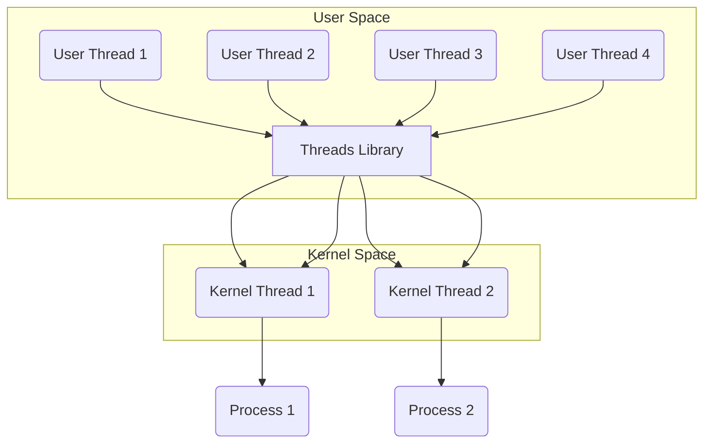
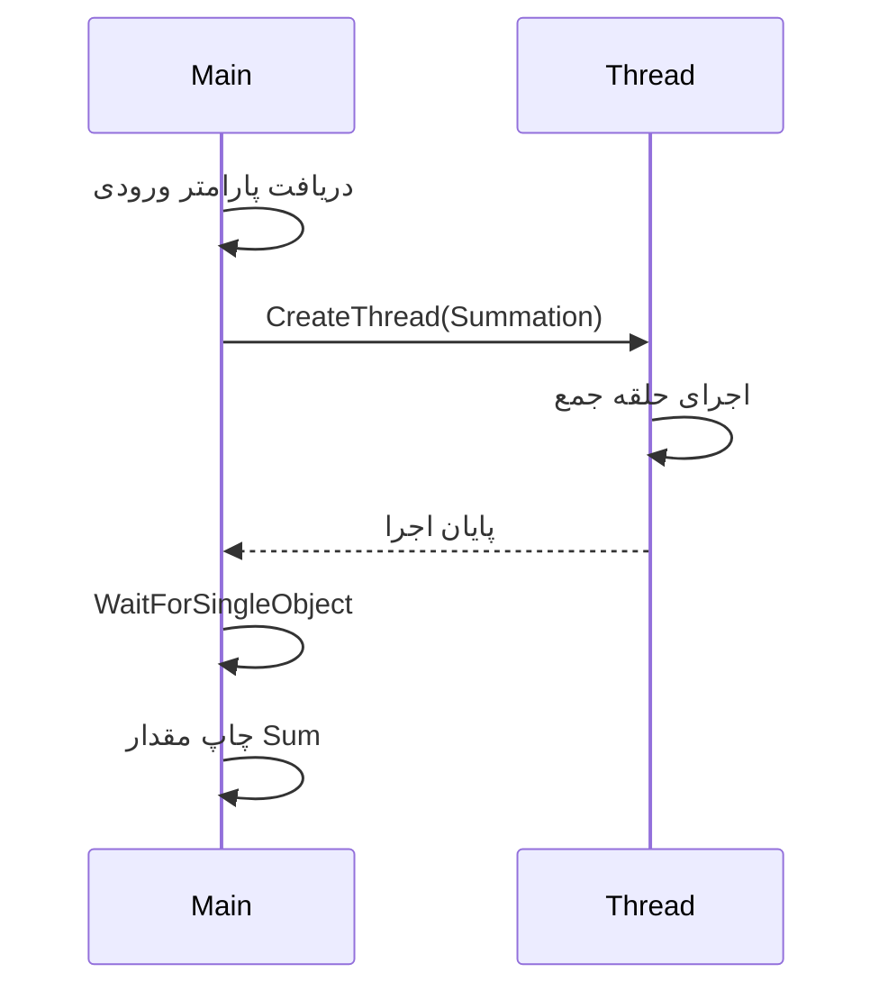

# 📘 فصل ۴: نخ‌ها و هم‌زمانی (Threads & Concurrency)

---

## 🧭 سرفصل‌های اصلی

در این فصل با مفاهیم کلیدی مربوط به نخ‌ها (Threads) و برنامه‌نویسی هم‌زمان (Concurrency) آشنا می‌شویم. مباحث اصلی عبارتند از:

---

### ✅ Overview (مروری کلی)
معرفی مفاهیم اولیه نخ (Thread)، تفاوت آن با فرآیند (Process)، و دلایل استفاده از نخ‌ها در طراحی سیستم‌ها.

---

### 🧠 Multicore Programming (برنامه‌نویسی چند‌هسته‌ای)
چالش‌ها و مزایای استفاده از چند هسته‌ی پردازنده به‌صورت هم‌زمان برای بهبود کارایی و پاسخ‌گویی برنامه‌ها.

---

### 🧵 Multithreading Models (مدل‌های چند‌نخی)
بررسی مدل‌های مختلف پیاده‌سازی نخ‌ها:
- مدل تک به تک (One-to-One)
- مدل چند به یک (Many-to-One)
- مدل چند به چند (Many-to-Many)

---

### 📚 Thread Libraries (کتابخانه‌های نخ)
معرفی ابزارهایی مانند:
- POSIX Pthreads
- Windows threads
- Java threads

---

### 🤖 Implicit Threading (نخ‌دهی ضمنی)
استفاده از ابزارها و تکنیک‌هایی مانند OpenMP یا Thread pools برای مدیریت نخ‌ها بدون نیاز به ایجاد مستقیم آن‌ها توسط برنامه‌نویس.

---

### ⚠️ Threading Issues (چالش‌های چندنخی)
بررسی مشکلاتی مانند:
- شرایط رقابتی (Race Conditions)
- بن‌بست (Deadlock)
- داده‌ی مشترک و همگام‌سازی (Synchronization)

---

### 🧪 Operating System Examples (مثال‌هایی از سیستم‌عامل‌ها)
نحوه‌ی مدیریت و پشتیبانی از نخ‌ها در سیستم‌عامل‌های مختلف مانند:
- Windows
- Linux
- Solaris

---

## 🎯 هدف فصل
درک اهمیت نخ‌ها در طراحی نرم‌افزارهای مدرن و آشنایی با ابزارها، تکنیک‌ها، و مشکلات مربوط به برنامه‌نویسی هم‌زمان.

---
# 🎯 اهداف یادگیری فصل ۴: نخ‌ها و هم‌زمانی (Threads & Concurrency)

---

## 🔹 ۱. شناسایی مؤلفه‌های اصلی نخ (Thread)
- درک اجزای پایه‌ای یک نخ مانند شناسه نخ، شمارنده برنامه (PC)، پشته، و ثبات‌ها.
- مقایسه نخ‌ها با فرآیندها از لحاظ **منابع اشتراکی**، **زمان ایجاد**، و **بهره‌وری**.

---

## 🔹 ۲. مزایا و چالش‌های برنامه‌های چندنخی
### ✅ مزایا:
- کارایی بالاتر در سیستم‌های چند‌هسته‌ای
- پاسخ‌گویی بهتر در برنامه‌های تعاملی
- استفاده بهینه از منابع

### ⚠️ چالش‌ها:
- پیچیدگی در طراحی
- مدیریت صحیح داده‌های مشترک
- جلوگیری از شرایط رقابتی و بن‌بست

---

## 🔹 ۳. نخ‌دهی ضمنی (Implicit Threading)
معرفی رویکردهای مدیریت نخ‌ها بدون ساخت صریح:
- **Thread Pools**: مجموعه‌ای از نخ‌های آماده برای اجرای وظایف
- **Fork-Join Model**: شکستن وظایف به زیرفرآیندهای موازی و ترکیب نتایج
- **Grand Central Dispatch (GCD)**: فناوری اپل برای زمان‌بندی موازی خودکار

---

## 🔹 ۴. مدیریت نخ در سیستم‌عامل‌ها
نحوه نمایش و مدیریت نخ‌ها در:
- **Windows**: استفاده از Thread Object و APIهای اختصاصی
- **Linux**: استفاده از نخ‌های سطح کاربر و کتابخانه `pthread`

---

## 🔹 ۵. طراحی برنامه‌های چندنخی
استفاده از APIهای مختلف برای ایجاد و مدیریت نخ‌ها:
- **Pthreads** (در C/C++ در سیستم‌های یونیکس‌مانند)
- **Java Threads** (کلاس `Thread` و `Runnable`)
- **Windows Threads** (توابع `CreateThread`, `WaitForSingleObject` و ...)

---

## 📌 نتیجه‌گیری
این فصل پایه‌ای برای درک نحوه طراحی، پیاده‌سازی، و اشکال‌زدایی برنامه‌های چندنخی است و نقش کلیدی در بهره‌گیری کامل از سخت‌افزارهای چند‌هسته‌ای دارد.

---
# 💡 انگیزه استفاده از نخ‌ها (Motivation)

---

## 🔄 چرا بیشتر برنامه‌های امروزی چندنخی هستند؟

اکثر نرم‌افزارهای مدرن از **چند نخ (Multithreading)** استفاده می‌کنند. دلایل اصلی عبارتند از:

---

## 🧩 ۱. اجرای هم‌زمان وظایف مختلف در یک برنامه

در یک برنامه، می‌توان وظایف مختلف را در **نخ‌های جداگانه** پیاده‌سازی کرد:

- 🖥️ به‌روزرسانی رابط گرافیکی (UI)
- 📡 دریافت داده از اینترنت
- 📝 بررسی املای کلمات در پس‌زمینه
- 🌐 پاسخ به درخواست‌های شبکه

---

## ⚖️ ۲. مقایسه پردازه و نخ

| ویژگی             | Process (فرآیند) | Thread (نخ)       |
|------------------|------------------|-------------------|
| هزینه ایجاد      | زیاد             | کم (سبک)          |
| حافظه اختصاصی    | دارد             | مشترک با دیگر نخ‌های همان فرآیند |
| کارایی           | کمتر             | بیشتر در چندوظیفگی |

> نخ‌ها سبک‌تر از پردازه‌ها هستند و زمان ایجاد، سوییچ، و مدیریت آن‌ها کمتر است.

---

## 🔧 ۳. مزایای استفاده از نخ‌ها

- ✅ **افزایش بازدهی** با استفاده از چند هسته پردازنده
- ✅ **ساده‌سازی کد** از طریق تفکیک وظایف
- ✅ **پاسخ‌گویی بهتر** در برنامه‌های تعاملی
- ✅ **استفاده بهتر از منابع سخت‌افزاری**

---

## 🧠 ۴. کرنل سیستم‌عامل‌ها نیز چندنخی هستند

هسته بسیاری از سیستم‌عامل‌های مدرن مانند **Linux**, **Windows**, و **macOS** به صورت چندنخی طراحی شده‌اند تا:

- هم‌زمانی بالا داشته باشند
- عملیات I/O را به صورت غیرمسدود انجام دهند
- بهتر با سخت‌افزارهای چند‌هسته‌ای تعامل کنند

---

## 🎯 جمع‌بندی

استفاده از نخ‌ها در برنامه‌نویسی مدرن باعث:
- کارایی بیشتر،
- طراحی ساده‌تر،
- و تجربه کاربری روان‌تر می‌شود.

به همین دلیل، یادگیری نخ‌ها برای هر توسعه‌دهنده‌ای ضروری است.

---
# 🔀 پردازه‌های تک‌نخی و چندنخی (Single and Multithreaded Processes)

---

## 🧵 پردازه تک‌نخی (Single-Threaded Process)

یک پردازه‌ی تک‌نخی تنها شامل یک نخ اجرایی است و همه منابع را به‌صورت مشترک استفاده می‌کند:

### اجزای مشترک:
- `code` (کد برنامه)
- `data` (داده‌ها)
- `files` (فایل‌های باز)
- `registers` (ثبات‌ها)
- `PC` (شمارنده برنامه)
- `stack` (پشته)

> تنها یک مسیر اجرایی در برنامه وجود دارد.

![[Pasted image 20250514213950.png]]

---

## 🧶 پردازه چندنخی (Multithreaded Process)

در یک پردازه چندنخی، چند مسیر اجرایی هم‌زمان با اشتراک منابع عمل می‌کنند.

### منابع مشترک بین نخ‌ها:
- `code`
- `data`
- `files`

### منابع اختصاصی هر نخ:
- `registers`
- `PC`
- `stack`

![[Pasted image 20250514214043.png]]

---

## 🔍 تفاوت کلیدی

| ویژگی                     | تک‌نخی                    | چندنخی                     |
|--------------------------|---------------------------|----------------------------|
| تعداد نخ‌ها              | ۱                         | چند نخ                    |
| اشتراک منابع             | همه منابع برای یک نخ است  | منابع برنامه مشترک ولی ثبات‌ها، پشته و PC جداگانه |
| کارایی در چندوظیفگی       | کم                        | زیاد                      |
| مناسب برای               | وظایف ساده               | وظایف پیچیده و هم‌زمان     |

> ✅ چندنخی بودن برنامه باعث افزایش کارایی و پاسخ‌گویی سیستم در برنامه‌های تعاملی یا پردازشی می‌شود.

---
# 🧵 معماری سرور چندنخی (Multithreaded Server Architecture)

در معماری سرور چندنخی، سرور قادر است هم‌زمان به درخواست‌های متعددی پاسخ دهد، چرا که برای هر درخواست یک نخ جدید ایجاد می‌شود.

---

## 🧭 مراحل عملکرد سرور:

1️⃣ **دریافت درخواست از کلاینت**
- کلاینت یک درخواست برای سرور ارسال می‌کند.

2️⃣ **ایجاد نخ جدید برای رسیدگی به درخواست**
- سرور برای رسیدگی به درخواست، یک نخ (Thread) جدید ایجاد می‌کند.
- این نخ به‌صورت مستقل وظیفه پاسخ به کلاینت را برعهده می‌گیرد.

3️⃣ **بازگشت به حالت گوش‌دادن**
- سرور به‌سرعت به حالت انتظار برای دریافت درخواست‌های بعدی بازمی‌گردد.

---

## 🧊 دیاگرام:

![[Pasted image 20250514214346.png]]

---

## 🎯 مزایا:

- 📶 پاسخ‌گویی بالا به کاربران هم‌زمان
- 🔄 افزایش بهره‌وری با پردازش موازی
- ⚡ کاهش زمان پاسخگویی (Response Time)
- 💡 مناسب برای سیستم‌هایی با بار زیاد مانند وب‌سرورها

---
## ✅ **مزایای Threadها (Benefits of Threads)**

|مزیت|توضیح|
|---|---|
|🧠 **Responsiveness (پاسخ‌گویی)**|امکان ادامه اجرای بخش‌هایی از برنامه حتی زمانی که یک نخ مسدود شده است؛ به‌ویژه برای رابط‌های کاربری بسیار مهم است.|
|🔗 **Resource Sharing (اشتراک منابع)**|نخ‌ها منابع یکسانی (مثل حافظه و فایل‌ها) را به‌راحتی با هم به اشتراک می‌گذارند؛ آسان‌تر از مدل‌هایی مثل message passing یا shared memory بین پردازه‌ها.|
|💸 **Economy (اقتصادی بودن)**|ایجاد نخ بسیار ارزان‌تر از ایجاد پردازه است؛ همچنین زمان تعویض نخ (thread switching) کمتر از زمان تعویض زمینه (context switching) بین پردازه‌هاست.|
|📈 **Scalability (مقیاس‌پذیری)**|استفاده بهینه از سیستم‌های چند‌هسته‌ای با اجرای موازی چند نخ؛ افزایش بهره‌وری و کارایی.|

---
# User Threads and Kernel Threads

## User Threads
- **مدیریت نخ‌های کاربر** توسط کتابخانه‌های نخ در سطح کاربر انجام می‌شود. در این مدل، فرآیند مدیریت نخ‌ها خارج از هسته (Kernel) انجام می‌شود.
- **کتابخانه‌های نخ کاربر**:
  - **POSIX Pthreads**: یکی از مشهورترین کتابخانه‌ها برای مدیریت نخ‌ها در سیستم‌های یونیکس و لینوکس است.
  - **Windows threads**: در سیستم‌عامل ویندوز برای ایجاد و مدیریت نخ‌ها استفاده می‌شود.
  - **Java threads**: در زبان برنامه‌نویسی جاوا برای پیاده‌سازی نخ‌ها و انجام عملیات چندنخی استفاده می‌شود.

## Kernel Threads
- **نخ‌های هسته** توسط خود هسته (Kernel) مدیریت می‌شوند. این نخ‌ها به‌طور مستقیم توسط سیستم‌عامل و هسته ایجاد و مدیریت می‌شوند.
- **مثال‌ها**: تقریباً تمام سیستم‌عامل‌های عمومی از نخ‌های هسته‌ای پشتیبانی می‌کنند:
  - **Windows**
  - **Linux**
  - **Mac OS X**
  - **iOS**
  - **Android**

### تفاوت‌ها:
- **مدیریت**: در نخ‌های کاربر، مدیریت نخ‌ها توسط برنامه‌نویس و کتابخانه‌های سطح کاربر انجام می‌شود. در نخ‌های هسته، مدیریت نخ‌ها توسط هسته سیستم‌عامل صورت می‌گیرد.
- **عملکرد**: نخ‌های کاربر معمولاً سریع‌تر هستند زیرا نیازی به تماس با هسته سیستم‌عامل ندارند، ولی نخ‌های هسته‌ای انعطاف‌پذیری بیشتری دارند و می‌توانند از قابلیت‌های پیشرفته هسته مانند چند هسته‌ای استفاده کنند.

---
# User-Level vs. Kernel-Level Threads

در سیستم‌های چندریسمانی (Multithreaded)، نخ‌ها (Threads) می‌توانند در دو سطح مدیریت شوند: سطح کاربر (User-Level) و سطح هسته (Kernel-Level). همچنین ترکیبی از این دو هم وجود دارد.

---

## 1. User-Level Threads (نخ‌های سطح کاربر)

### ویژگی‌ها:
- مدیریت نخ‌ها در **فضای کاربر** انجام می‌شود.
- سیستم‌عامل از وجود این نخ‌ها آگاه نیست.
- مدیریت نخ‌ها توسط **کتابخانه‌های نخی** مثل POSIX Threads انجام می‌شود.

### مزایا:
- سریع‌تر: تغییر (Context Switch) بین نخ‌ها بدون دخالت سیستم‌عامل انجام می‌شود.
- قابل حمل: نیازی به پشتیبانی خاص از طرف سیستم‌عامل نیست.

### معایب:
- اگر یک نخ منتظر I/O بماند، کل فرآیند منتظر می‌ماند (Blocking).
- نمی‌توان از چند هسته CPU به‌طور کامل بهره برد.

### دیاگرام:
نخ‌های کاربر روی یک نخ کرنل سوار هستند:
```mermaid
graph TD
    subgraph User Space
        T1(User Thread 1)
        T2(User Thread 2)
        T3(User Thread 3)
        Lib[Threads Library]
    end
    subgraph Kernel Space
        K(Kernel Thread)
    end
    P(Process)
    T1 --> Lib --> K --> P
    T2 --> Lib
    T3 --> Lib
````

---

## 2. Kernel-Level Threads (نخ‌های سطح هسته)

### ویژگی‌ها:

- مدیریت نخ‌ها توسط **سیستم‌عامل** در فضای کرنل انجام می‌شود.
    
- سیستم‌عامل هر نخ را جداگانه زمان‌بندی می‌کند.
    

### مزایا:

- پشتیبانی بهتر از چندپردازنده (Multiprocessing).
    
- اگر یک نخ مسدود شود، بقیه می‌توانند به اجرا ادامه دهند.
    

### معایب:

- سربار بیشتر: هر عملیات نخ نیاز به تعامل با کرنل دارد.
    
- تغییر نخ (Context Switch) کندتر از حالت کاربر است.
    

### دیاگرام:

هر نخ کاربر معادل یک نخ کرنل دارد:

```mermaid
graph TD
    subgraph User Space
        P(Process)
    end
    subgraph Kernel Space
        K1(Kernel Thread 1)
        K2(Kernel Thread 2)
        K3(Kernel Thread 3)
    end
    K1 --> P
    K2 --> P
    K3 --> P
```

---

## 3. Combined / Hybrid Threads (مدل ترکیبی)

### ویژگی‌ها:

- ترکیبی از دو مدل بالا است.
    
- چند نخ کاربر می‌توانند روی چند نخ کرنل نگاشت شوند (Many-to-Many model).
    

### مزایا:

- انعطاف‌پذیر و مقیاس‌پذیر.
    
- مزایای مدل کاربر و هسته را هم‌زمان دارد.
    

### معایب:

- پیاده‌سازی پیچیده‌تر.
    
- نیازمند پشتیبانی توسط سیستم‌عامل و کتابخانه.
    

### دیاگرام:



---

# مقایسه اجمالی

|ویژگی|User-Level Threads|Kernel-Level Threads|Combined Threads|
|---|---|---|---|
|سرعت سوئیچ|بالا|پایین|متوسط|
|نیاز به کرنل|ندارد|دارد|دارد|
|مدیریت|کتابخانه کاربر|سیستم‌عامل|هر دو|
|بهره‌وری چند CPU|پایین|بالا|بالا|
|پیاده‌سازی|ساده|متوسط|پیچیده|

---

> **نتیجه‌گیری:**  
> هر مدل مزایا و معایب خاص خودش را دارد و بسته به نوع کاربرد، انتخاب مناسب متفاوت است.

---
# مدل ارتباطی نخ‌های کاربر و هسته

## فضای کاربر (User Space)
در این بخش از سیستم، **نخ‌های کاربر (User Threads)** توسط برنامه‌ها یا کتابخانه‌هایی مانند `pthreads` مدیریت می‌شوند. سیستم‌عامل از وجود این نخ‌ها بی‌اطلاع است مگر اینکه از مدل‌هایی استفاده شود که آن‌ها را نگاشت می‌دهند.

## فضای هسته (Kernel Space)
در اینجا، **نخ‌های هسته (Kernel Threads)** مستقیماً توسط سیستم‌عامل مدیریت می‌شوند. سیستم‌عامل می‌تواند این نخ‌ها را در پردازنده‌ها زمان‌بندی کرده و به منابع دسترسی دهد.

---

## سه مدل نگاشت اصلی بین این دو نوع نخ:

| مدل           | توضیح | مثال |
|----------------|--------|-------|
| **1 به 1**     | هر نخ کاربر با یک نخ کرنل نگاشت می‌شود. | Windows, Linux (modern) |
| **چند به یک**  | چند نخ کاربر روی یک نخ کرنل نگاشت داده می‌شوند. | سیستم‌های ساده یا کتابخانه‌های سبک |
| **چند به چند** | چند نخ کاربر می‌توانند روی چند نخ کرنل نگاشت یابند. | Solaris، برخی نسخه‌های NetBSD |

---
![[Pasted image 20250514220422.png]]
## تفسیر تصویر:

- در بخش بالایی، **user threads** نمایش داده شده‌اند که در فضای کاربر اجرا می‌شوند.
- در بخش پایینی، **kernel threads** قرار دارند که نشان‌دهنده نخی است که سیستم‌عامل آن‌ها را زمان‌بندی می‌کند.
- ارتباط میان این دو در مدل‌های مختلف می‌تواند متفاوت باشد:

  - **اگر نگاشت انجام نشود**: سیستم‌عامل تنها یک نخ می‌بیند → ناکارآمد برای چند هسته.
  - **اگر نگاشت یک به یک باشد**: عملکرد بهتر ولی هزینه بیشتر برای هر نخ.
  - **در مدل ترکیبی**: انعطاف‌پذیری بالا، ولی پیاده‌سازی پیچیده‌تر.

---

📌 **نکته:**  
یکی از دلایل مهم استفاده از مدل‌های ترکیبی این است که بتوان بین کارایی و پیچیدگی یک تعادل ایجاد کرد.

---
## مدل Many-to-One (چند به یک)

در این مدل، چندین نخ (thread) در سطح کاربر به **یک نخ در سطح هسته** (kernel thread) نگاشت داده می‌شوند.

### ویژگی‌ها:
- ✅ **مدیریت ساده‌تر**: نخ‌ها توسط کتابخانه‌ای در فضای کاربر مدیریت می‌شوند.
- ❌ **بلوک شدن همزمان**: اگر یکی از نخ‌های کاربر یک عملیات بلوکه‌کننده (blocking) انجام دهد (مثل خواندن از دیسک)، تمامی نخ‌ها متوقف می‌شوند.
- ❌ **عدم استفاده از چند هسته**: چون تنها یک نخ هسته وجود دارد، حتی در صورت وجود چند هسته، اجرای همزمان (parallelism) اتفاق نمی‌افتد.

### مزایا:
- ساده و سبک برای پیاده‌سازی.
- نیازی به پشتیبانی خاص از هسته سیستم‌عامل ندارد.

### معایب:
- عدم استفاده از توان محاسباتی سیستم‌های چند‌هسته‌ای.
- آسیب‌پذیری در برابر عملیات‌های بلوکه‌کننده.

![[Pasted image 20250514220714.png]]

### کاربردها و نمونه‌ها:
- **Solaris Green Threads**: نسخه‌ای از سولاریس که از این مدل استفاده می‌کرد.
- **GNU Portable Threads (GNU Pth)**: کتابخانه‌ای در لینوکس که این مدل را پیاده‌سازی می‌کند.

---

📌 **جمع‌بندی**:  
مدل Many-to-One برای سیستم‌هایی با پردازش‌های ساده و تک‌هسته‌ای مناسب است، اما برای استفاده مؤثر از منابع در سیستم‌های چند‌هسته‌ای مناسب نیست.

---
## مدل One-to-One (یک به یک)

در این مدل، **هر نخ در سطح کاربر به یک نخ در سطح هسته** نگاشت داده می‌شود. به عبارتی، با ایجاد هر نخ کاربر، یک نخ متناظر در هسته نیز ایجاد می‌گردد.

### ویژگی‌ها:
- ✅ **پشتیبانی از اجرای همزمان (concurrency)**: چندین نخ می‌توانند به‌صورت موازی روی هسته‌های مختلف اجرا شوند.
- ✅ **عدم تأثیر نخ بلوکه شده بر سایر نخ‌ها**: چون هر نخ کاربر معادل یک نخ کرنل است، بلوکه شدن یک نخ باعث توقف سایر نخ‌ها نمی‌شود.
- ❌ **هزینه بالا**: ایجاد نخ‌های هسته‌ای هزینه‌بر است و در نتیجه ممکن است تعداد نخ‌های قابل ایجاد برای هر فرایند محدود باشد.

![[Pasted image 20250514220900.png]]
### مزایا:
- امکان بهره‌گیری مؤثر از چند‌هسته‌ای بودن سیستم.
- عملکرد بالا برای برنامه‌هایی که نیاز به همزمانی واقعی دارند.

### معایب:
- افزایش بار پردازشی و مصرف منابع به‌دلیل نگاشت یک‌به‌یک.
- ایجاد محدودیت در تعداد نخ‌ها به‌دلیل هزینه زیاد مدیریت نخ‌های کرنل.

### کاربردها و نمونه‌ها:
- **Windows** (سیستم‌عامل ویندوز)
- **Linux** (هسته لینوکس)

---

📌 **جمع‌بندی**:  
مدل One-to-One برای سیستم‌هایی که نیاز به اجرای همزمان واقعی دارند (مانند سرورها و برنامه‌های گرافیکی پیچیده) بسیار مناسب است، اما باید مراقب سربار ناشی از تعداد بالای نخ‌های کرنل بود.

---
# Many-to-Many Model

در مدل **Many-to-Many**، تعداد زیادی نخ کاربر می‌توانند به تعداد زیادی نخ هسته‌ای نگاشت شوند. این مدل به سیستم‌عامل این امکان را می‌دهد که تعداد کافی نخ هسته‌ای را ایجاد کند تا بتواند مدیریت مناسب نخ‌ها را انجام دهد.

## ویژگی‌ها:
- **نخ‌های کاربر به نخ‌های هسته‌ای نگاشت می‌شوند**: در این مدل، چندین نخ کاربر می‌توانند به نخ‌های هسته‌ای مختلف نگاشت شوند، به این معنا که سیستم‌عامل به‌طور همزمان می‌تواند تعداد زیادی نخ هسته‌ای ایجاد کند تا منابع را به‌صورت بهینه مدیریت کند.
- **سیستم‌عامل می‌تواند نخ‌های کافی ایجاد کند**: سیستم‌عامل می‌تواند به‌طور داینامیک نخ‌های هسته‌ای را بسته به نیاز برنامه‌های در حال اجرا، ایجاد کند.
  
## مثال‌ها:
- **Windows با بسته ThreadFiber**: ویندوز از این مدل با استفاده از بسته ThreadFiber پشتیبانی می‌کند. در این حالت، نخ‌های کاربر به نخ‌های هسته‌ای مختلف نگاشت می‌شوند و این امکان را فراهم می‌آورد تا منابع بیشتری استفاده شود.

![[Pasted image 20250514221006.png]]

## استفاده محدود:
- **این مدل در اکثر سیستم‌عامل‌ها بسیار رایج نیست**: مدل Many-to-Many به دلیل پیچیدگی‌ها و نیاز به مدیریت دقیق نخ‌ها معمولاً در سیستم‌های عام و عمومی استفاده نمی‌شود. در عوض، مدل‌هایی مانند **Many-to-One** یا **One-to-One** بیشتر رایج هستند.

---
# Two-level Model

مدل **Two-level** شبیه به مدل **Many-to-Many** است، با این تفاوت که این مدل اجازه می‌دهد یک نخ کاربر به یک نخ هسته‌ای خاص متصل (bind) شود.

![[Pasted image 20250514221117.png]]
## ویژگی‌ها:
- **اتصال نخ کاربر به نخ هسته‌ای**: در این مدل، هر نخ کاربر به طور مشخص به یک نخ هسته‌ای خاص متصل می‌شود. این اتصال موجب می‌شود که نخ کاربر بتواند از امکانات هسته استفاده کند، در حالی که همچنان بخشی از فرآیند مدیریت نخ در سطح کاربر باقی می‌ماند.
- **ترکیبی از ویژگی‌های M:M و One-to-One**: این مدل در واقع ترکیبی از مدل‌های **Many-to-Many** و **One-to-One** است که همزمان مزایای هر دو مدل را ارائه می‌دهد.
  - مشابه با مدل **Many-to-Many**، این مدل می‌تواند چند نخ کاربر را به چند نخ هسته‌ای نگاشت کند.
  - مشابه با مدل **One-to-One**، یک نخ کاربر به یک نخ هسته‌ای اختصاص داده می‌شود.

## مزایا:
- این مدل می‌تواند کارایی بهتری نسبت به مدل‌های دیگر مانند **Many-to-Many** ارائه دهد زیرا نخ‌های کاربر و هسته به طور خاصی به یکدیگر متصل شده‌اند و از این رو هماهنگی بهتری بین آنها وجود دارد.
  
## مثال:
- استفاده در **سیستم‌عامل‌هایی که نیاز به هماهنگی دقیق بین نخ‌های کاربر و هسته دارند**، و در مواردی که ترکیب این دو مدل مفید باشد.

---
# Thread Libraries

کتابخانه‌های نخ (Thread Libraries) به برنامه‌نویس API برای ایجاد و مدیریت نخ‌ها ارائه می‌دهند. این کتابخانه‌ها ابزارهایی را برای تسهیل ایجاد نخ‌ها و کنترل آنها در برنامه‌ها فراهم می‌کنند.

## دو روش اصلی پیاده‌سازی:
1. **کتابخانه تماماً در فضای کاربر (User Space)**:
   - در این حالت، کتابخانه نخ‌ها در فضای کاربر پیاده‌سازی می‌شود و تمام عملیات مدیریت نخ (مانند ایجاد، خاتمه، و زمان‌بندی) توسط کتابخانه‌ای که در سطح کاربر قرار دارد انجام می‌شود.
   - این روش سریع‌تر است زیرا هیچ تماس مستقیم با هسته نیاز ندارد، اما ممکن است برخی محدودیت‌ها در دسترسی به منابع سیستم و هماهنگی بین نخ‌ها وجود داشته باشد.
  
2. **کتابخانه سطح هسته‌ای (Kernel-level library)**:
   - در این حالت، کتابخانه نخ‌ها توسط خود سیستم‌عامل و هسته پشتیبانی می‌شود. این کتابخانه‌ها عملیات مدیریت نخ را در سطح هسته انجام می‌دهند و به طور مستقیم با منابع سیستم در ارتباط هستند.
   - پیاده‌سازی نخ‌ها در سطح هسته به این معنی است که نخ‌ها به صورت همزمان توسط هسته زمان‌بندی می‌شوند و می‌توانند از قابلیت‌های پیشرفته‌ای مانند هماهنگی نخ‌ها و استفاده بهینه از هسته‌های چندگانه بهره‌برداری کنند.

## مزایا و معایب:
- **کتابخانه‌های فضای کاربر** معمولاً سریع‌تر هستند و بار کمتری روی هسته وارد می‌کنند، اما محدودیت‌هایی در امکانات پیشرفته مانند استفاده از چند هسته و مدیریت منابع دارند.
- **کتابخانه‌های سطح هسته‌ای** امکانات بیشتری برای مدیریت نخ‌ها و بهینه‌سازی منابع سیستم دارند، اما هزینه بیشتری دارند چون برای هر عملیات باید با هسته تماس گرفته شود.

---
```c
#include <pthread.h>
#include <stdio.h>
#include <stdlib.h>

int sum; /* این داده توسط تردها به اشتراک گذاشته می‌شود */

/* تابعی که ترد آن را اجرا می‌کند */
void *runner(void *param);

int main(int argc, char *argv[])
{
    pthread_t tid;             /* شناسه ترد */
    pthread_attr_t attr;       /* مجموعه‌ای از ویژگی‌های ترد */

    /* مقداردهی اولیه ویژگی‌های پیش‌فرض ترد */
    pthread_attr_init(&attr);

    /* ایجاد ترد */
    pthread_create(&tid, &attr, runner, argv[1]);

    /* منتظر بمان تا ترد تمام شود */
    pthread_join(tid, NULL);

    printf("sum = %d\n", sum);

    return 0;
}

/* تابعی که توسط ترد اجرا می‌شود */
void *runner(void *param)
{
    int i, upper = atoi(param);
    sum = 0;

    for (i = 1; i <= upper; i++)
        sum += i;

    pthread_exit(0);
}
```

---

### 🧠 **توضیح مختصر:**

- این برنامه عدد صحیحی را از ورودی می‌گیرد و مجموع اعداد از 1 تا آن عدد را در یک ترد جداگانه محاسبه می‌کند.
    
- `pthread_create` ترد جدیدی را اجرا می‌کند که تابع `runner` را با پارامتر ورودی اجرا می‌کند.
    
- `pthread_join` باعث می‌شود که برنامه‌ی اصلی تا اتمام اجرای ترد صبر کند.
    
- مقدار نهایی مجموع در متغیر سراسری `sum` ذخیره می‌شود و در پایان چاپ می‌شود.
    
---

```c
#define NUM_THREADS 10

/* آرایه‌ای از شناسه‌های ترد */
pthread_t workers[NUM_THREADS];

/* پیوستن به هر ترد پس از اجرای آن */
for (int i = 0; i < NUM_THREADS; i++)
    pthread_join(workers[i], NULL);
```

---

### 🧠 **توضیح عملکرد:**

- `pthread_t workers[NUM_THREADS];`  
    یک آرایه از نوع `pthread_t` تعریف می‌کند که شناسه‌ی ۱۰ ترد را نگه می‌دارد.
    
- حلقه‌ی `for` با استفاده از `pthread_join` به هر یک از تردها می‌پیوندد (یعنی منتظر می‌ماند تا ترد مربوطه کار خود را تمام کند).
    

> اگر این کد در کنار کد `pthread_create` استفاده شود، مطمئن می‌شویم که برنامه اصلی قبل از پایان، منتظر تکمیل همه‌ی تردها می‌ماند.

---
# برنامه C چند نخی در ویندوز (Windows Multithreaded C Program)

در این مثال، ما یک برنامه ساده‌ی چندریسمانی در ویندوز را بررسی می‌کنیم. در این برنامه، یک رشته (thread) ساخته می‌شود که وظیفه‌اش جمع‌کردن اعداد از ۱ تا یک عدد داده‌شده (مثلاً ۱۰) است.

## تابع اجرایی برای رشته

```c
#include <windows.h>
#include <stdio.h>

DWORD Sum; // متغیر مشترک بین رشته‌ها

// تابعی که رشته اجرا خواهد کرد
DWORD WINAPI Summation(LPVOID Param)
{
    DWORD Upper = *(DWORD*)Param;
    for (DWORD i = 1; i <= Upper; i++)
        Sum += i;

    return 0;
}
````

- `Sum` متغیری مشترک است که بین رشته‌ها به اشتراک گذاشته شده.
    
- `Summation` تابعی است که توسط `CreateThread` به عنوان بدنه‌ی رشته اجرا می‌شود.
    
- مقدار `Param` به عنوان عدد بالایی محدوده جمع دریافت می‌شود.
    
- جمع اعداد از ۱ تا `Upper` انجام می‌شود و نتیجه در `Sum` ذخیره می‌شود.
    

---

## تابع main: ایجاد و اجرای رشته

```c
int main(int argc, char *argv[])
{
    DWORD ThreadId;
    HANDLE ThreadHandle;
    int Param;

    Param = atoi(argv[1]); // تبدیل آرگومان ورودی به عدد صحیح

    // ایجاد رشته
    ThreadHandle = CreateThread(
        NULL,       // ویژگی‌های امنیتی پیش‌فرض
        0,          // اندازه پشته پیش‌فرض
        Summation,  // تابعی که رشته اجرا می‌کند
        &Param,     // پارامتر ورودی برای تابع رشته
        0,          // فلگ‌های ایجاد پیش‌فرض
        &ThreadId   // شناسه رشته ایجاد شده
    );

    // منتظر بمان تا رشته تمام شود
    WaitForSingleObject(ThreadHandle, INFINITE);

    // بستن دسته رشته
    CloseHandle(ThreadHandle);

    // چاپ نتیجه
    printf("sum = %d\n", Sum);
}
```

### نکات مهم:

- `CreateThread` رشته‌ای ایجاد می‌کند و اجرای آن را با تابع `Summation` آغاز می‌کند.
    
- با استفاده از `WaitForSingleObject` منتظر می‌مانیم تا رشته به پایان برسد.
    
- در پایان، دسته‌ی مربوط به رشته بسته می‌شود تا منابع آزاد شوند.
    
- خروجی نهایی، مجموع اعداد از ۱ تا عدد ورودی است.
    

---

## دیاگرام اجرایی (Mermaid)



---

## جمع‌بندی

این مثال نشان می‌دهد که چگونه می‌توان با استفاده از API ویندوز یک رشته ایجاد کرده و تابع دلخواهی را در آن اجرا کرد. این مدل برنامه‌نویسی می‌تواند به صورت هم‌زمان چندین وظیفه را انجام دهد و از منابع سیستم به شکلی مؤثرتر استفاده کند.

---
## **رشته‌ها (Threads) در زبان جاوا**

### ✅ نکات کلیدی:

- **رشته‌های جاوا توسط JVM (ماشین مجازی جاوا) مدیریت می‌شوند.**
    
- این رشته‌ها معمولاً **با استفاده از مدل نخ‌های سیستم‌عامل پایه** پیاده‌سازی می‌شوند.
    
- ایجاد رشته‌ها در جاوا به دو روش امکان‌پذیر است:
    
    1. **ارث‌بری از کلاس `Thread`**
        
    2. **پیاده‌سازی واسط `Runnable`**
        

---

### 🔷 پیاده‌سازی واسط Runnable

```java
public interface Runnable {
    public abstract void run();
}
```

این واسط دارای یک متد به نام `run()` است که باید در کلاس پیاده‌سازی‌شده تعریف شود.

---

### 🎯 نکته مهم:

✅ **روش استاندارد و توصیه‌شده، پیاده‌سازی واسط `Runnable` است**، چون این روش اجازه می‌دهد کلاس شما از کلاس‌های دیگر نیز ارث‌بری کند (برخلاف ارث‌بری از `Thread` که از ارث‌بری چندگانه جلوگیری می‌کند).

---
## **رشته‌ها در جاوا (Java Threads)**

### ✅ پیاده‌سازی واسط Runnable:

برای ساخت یک Thread با استفاده از واسط `Runnable`، ابتدا باید یک کلاس بسازید که این واسط را پیاده‌سازی کند:

```java
class Task implements Runnable {
    public void run() {
        System.out.println("I am a thread.");
    }
}
```

🔹 این کلاس `Task` دارای متد `run()` است که وظایف نخ (Thread) در آن تعریف می‌شود. در اینجا فقط یک پیام چاپ می‌شود:  
👉 «من یک نخ هستم.»

---

### ✅ ایجاد یک نخ (Creating a thread):

برای اجرای این وظیفه در یک نخ جدید:

```java
Thread worker = new Thread(new Task());
worker.start();
```

🔹 ابتدا یک شیء از کلاس `Thread` ساخته می‌شود و به آن یک شیء از کلاس `Task` (که واسط `Runnable` را پیاده کرده) داده می‌شود.  
🔹 با استفاده از `start()`، نخ آغاز به کار می‌کند و متد `run()` به صورت غیرهمزمان اجرا خواهد شد.

---

### ✅ منتظر ماندن برای پایان نخ (Waiting on a thread):

برای اینکه نخ اصلی منتظر پایان یافتن نخ `worker` بماند:

```java
try {
    worker.join();
} catch (InterruptedException ie) {
    // مدیریت خطا
}
```

🔹 متد `join()` باعث می‌شود که برنامه فعلی منتظر بماند تا نخ `worker` اجرا و به پایان برسد.  
🔹 ممکن است این عملیات به دلایل مختلفی متوقف شود (مثلاً قطع‌شدن نخ)، که در آن صورت `InterruptedException` پرتاب می‌شود و باید مدیریت شود.

---
## **چارچوب اجرایی جاوا (Java Executor Framework)**

### ✅ تعریف:

🔸 به جای اینکه نخ‌ها را به‌صورت مستقیم و دستی ایجاد کنیم (با استفاده از کلاس `Thread`)، جاوا مکانیزمی به نام **Executor** فراهم کرده که فرآیند ایجاد و مدیریت نخ‌ها را ساده‌تر می‌کند.

---

### ✅ واسط Executor:

```java
public interface Executor {
    void execute(Runnable command);
}
```

🔹 این واسط دارای یک متد به نام `execute` است که یک شیء از نوع `Runnable` را به عنوان ورودی می‌گیرد و آن را اجرا می‌کند.

---

### ✅ نحوه استفاده از Executor:

```java
Executor service = new Executor();
service.execute(new Task());
```

🔹 در این مثال، یک شیء از نوع `Executor` ساخته شده و با استفاده از متد `execute()`، وظیفه‌ی مربوطه (کلاس `Task`) اجرا می‌شود.

---
در این اسلاید، یک استفاده پیشرفته‌تر از چارچوب اجرایی جاوا (Java Executor Framework) با استفاده از واسط **Callable** نمایش داده شده است.

---

## **Java Executor Framework - استفاده از Callable**

### ✅ هدف:

گاهی نیاز داریم که نخ (Thread) نه تنها کاری را انجام دهد، بلکه **نتیجه‌ای هم بازگرداند**. در این مواقع به جای `Runnable`، از **واسط Callable** استفاده می‌کنیم.

---

### ✅ کد توضیحی:

```java
import java.util.concurrent.*;

class Summation implements Callable<Integer> {
    private int upper;

    public Summation(int upper) {
        this.upper = upper;
    }

    public Integer call() {
        int sum = 0;
        for (int i = 1; i <= upper; i++)
            sum += i;
        return new Integer(sum);
    }
}
```

---

### ✅ توضیحات:

🔹 `Callable<T>` مشابه `Runnable` است اما:

- متدی به نام `call()` دارد که می‌تواند خروجی داشته باشد (برخلاف `run()`).
    
- می‌تواند **استثنا (Exception)** هم پرتاب کند.
    

🔹 در اینجا، کلاس `Summation` از `Callable<Integer>` پیروی می‌کند که جمع اعداد از ۱ تا مقدار `upper` را محاسبه و بازمی‌گرداند.

🔹 متد `call()` همان متدی است که توسط نخ اجرا می‌شود و نتیجه‌اش را می‌توان دریافت کرد.

---
ا
## ✅ Java Executor Framework (ادامه)

در اینجا، کلاس `Driver` برای اجرای نخ‌هایی که از `Callable` استفاده می‌کنند پیاده‌سازی شده است.

---

### ✅ کد توضیحی:

```java
public class Driver {
    public static void main(String[] args) {
        int upper = Integer.parseInt(args[0]);

        ExecutorService pool = Executors.newSingleThreadExecutor();
        Future<Integer> result = pool.submit(new Summation(upper));

        try {
            System.out.println("sum = " + result.get());
        } catch (InterruptedException | ExecutionException ie) {
        }
    }
}
```

---

### ✅ توضیحات:

🔹 `ExecutorService pool = Executors.newSingleThreadExecutor();`  
ایجاد یک نخ اجرایی (thread pool) با تنها یک نخ.

🔹 `pool.submit(new Summation(upper));`  
وظیفه (task) `Summation` که یک شی از `Callable<Integer>` است، به نخ اجرایی ارسال می‌شود.

🔹 `Future<Integer> result = ...`  
شی `Future` برای پیگیری وضعیت اجرای نخ و دریافت نتیجه استفاده می‌شود.

🔹 `result.get();`  
منتظر می‌ماند تا محاسبه کامل شود و سپس مقدار نهایی را بازمی‌گرداند. این فراخوانی **مسدودکننده** است، یعنی تا زمان دریافت نتیجه ادامه نمی‌دهد.

🔹 `try-catch`  
به دلیل اینکه `get()` ممکن است استثناهایی مانند `InterruptedException` یا `ExecutionException` ایجاد کند، باید با بلوک `try-catch` مدیریت شود.

---

### ✅ کاربرد نهایی:

این برنامه یک عدد صحیح از آرگومان خط فرمان می‌گیرد، آن را به عنوان بالاترین عدد برای جمع از ۱ تا آن عدد استفاده کرده، نخ را اجرا می‌کند و حاصل جمع را نمایش می‌دهد.

---
# End of Chapter 4 :)