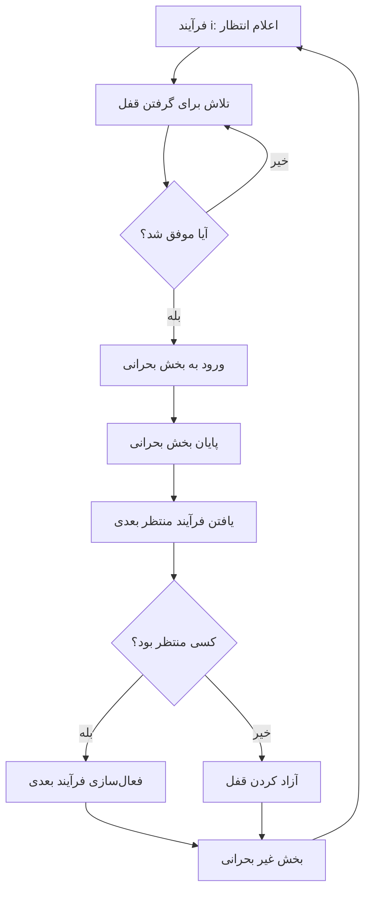
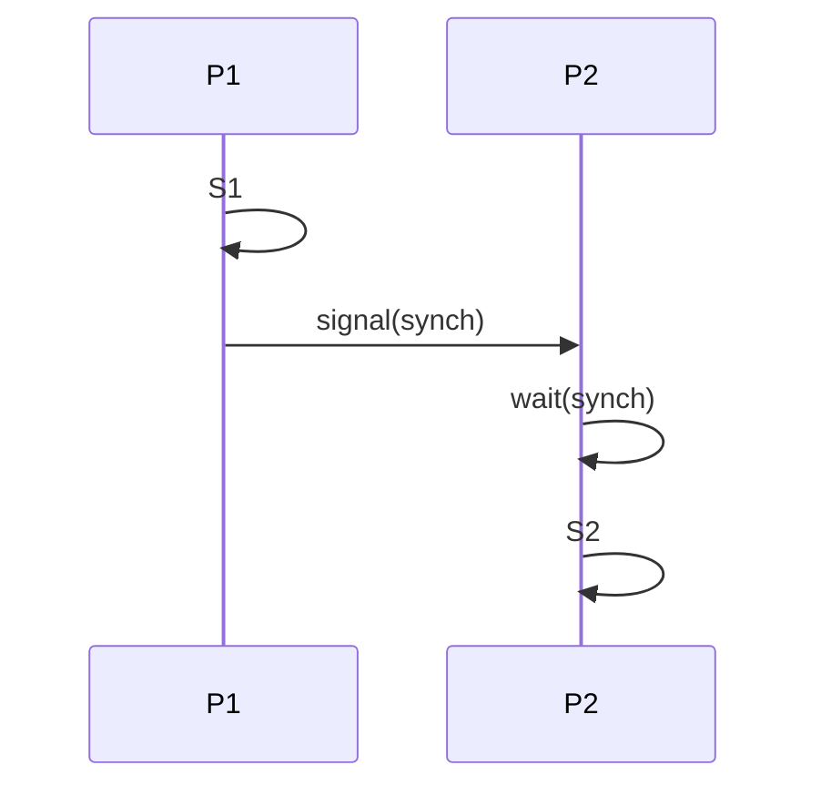

# 🔐 فصل 6: ابزارهای هم‌زمان‌سازی (Synchronization Tools)

در سیستم‌های چندپردازه‌ای، پردازه‌ها و نخ‌ها اغلب نیاز دارند به داده‌های مشترک دسترسی پیدا کنند. اگر این دسترسی به‌درستی مدیریت نشود، منجر به **شرایط رقابتی (Race Conditions)** و رفتارهای پیش‌بینی‌ناپذیر خواهد شد. در این فصل ابزارهایی برای حل این مسئله بررسی می‌شود.

---

## 🧭 فهرست مطالب فصل:

### 1. 🧱 Background (پیش‌زمینه)
- چرا هم‌زمان‌سازی در سیستم‌عامل‌ها ضروری است؟
- بررسی مفاهیم اولیه مثل Race Condition، Thread Interleaving و Atomicity

---

### 2. 🔒 The Critical-Section Problem (مسئله بخش بحرانی)
- هر پردازه دارای بخش بحرانی است که در آن به منابع مشترک دسترسی دارد.
- هدف: طراحی الگوریتمی که **انحصار متقابل (Mutual Exclusion)** را تضمین کند.
- بررسی شرایط لازم:
  - Mutual Exclusion
  - Progress
  - Bounded Waiting

---

### 3. 📏 Peterson’s Solution (راه‌حل پترسون)
- یک راه‌حل نرم‌افزاری کلاسیک برای دو پردازه.
- استفاده از متغیرهای اشتراکی مانند `flag[]` و `turn`

---

### 4. 🧮 Hardware Support for Synchronization (پشتیبانی سخت‌افزاری)
- دستورهای اتمی سطح پایین مانند:
  - TestAndSet
  - Swap
  - CompareAndSwap
- بررسی مزایا و محدودیت‌ها

---

### 5. 🧩 Mutex Locks (قفل‌های متقابل)
- ساده‌ترین ابزار برای کنترل دسترسی متقابل
- شامل توابع `lock()` و `unlock()`
- معرفی مفهوم busy waiting

---

### 6. ⚖️ Semaphores (سمافورها)
- ابزار قدرتمند و عمومی برای هم‌زمان‌سازی
- دو نوع:
  - Counting Semaphore
  - Binary Semaphore (معادل Mutex)
- توابع `wait()` و `signal()`
- خطرات: deadlock و starvation

---

### 7. 👮‍♀️ Monitors (نظارت‌گرها)
- ساختار سطح بالا برای هم‌زمان‌سازی در زبان‌های برنامه‌نویسی
- تسهیل‌کننده‌ی مدیریت منابع اشتراکی بدون مدیریت صریح قفل‌ها توسط برنامه‌نویس

---

### 8. 🧬 Liveness (زنده‌مانی)
- بررسی مشکلاتی مانند:
  - Deadlock (بن‌بست)
  - Starvation (قحطی)
  - Bounded Waiting (محدودیت انتظار)

---

### 9. 📊 Evaluation (ارزیابی نهایی)
- مقایسه ابزارهای مختلف از نظر:
  - سادگی پیاده‌سازی
  - کارایی
  - قابلیت اطمینان
  - تطبیق‌پذیری با سیستم‌های چندپردازه‌ای

---

## ✅ هدف کلی فصل:

> آشنایی با ابزارها و تکنیک‌هایی برای تضمین **اجرای ایمن و قابل پیش‌بینی** برنامه‌ها در محیط‌های هم‌زمان و چندنخی (Multithreaded).

---
# 🎯 اهداف فصل 6: ابزارهای هم‌زمان‌سازی (Synchronization Tools)

این فصل به بررسی ابزارها و تکنیک‌های مهمی می‌پردازد که برای مدیریت هم‌زمانی (Synchronization) در سیستم‌های چندنخی یا چندپردازه‌ای استفاده می‌شوند. اهداف اصلی فصل به شرح زیر است:

---

## 1. 🧩 توصیف مسئله‌ی **Critical Section** و شرایط رقابتی

- تعریف **Critical Section**: بخشی از کد که در آن پردازه به **منابع اشتراکی** (مثل حافظه یا فایل) دسترسی دارد.
- اگر چند پردازه هم‌زمان به این منابع دسترسی پیدا کنند، ممکن است **Race Condition** رخ دهد.
- Race Condition باعث رفتارهای ناسازگار، داده‌های ناقص یا خروجی نادرست می‌شود.

> 🎯 هدف: اطمینان از اینکه در هر لحظه فقط **یک پردازه در بخش بحرانی** قرار دارد.

---

## 2. ⚙️ نمایش راه‌حل‌های سخت‌افزاری

- استفاده از ابزارهای سطح پایین برای کنترل اتمی بودن عملیات:
  - **Memory Barriers** (موانع حافظه)
  - **Compare-and-Swap**
  - **Atomic Variables**
  
> ✅ این ابزارها اغلب توسط زبان‌های سطح بالا یا سیستم‌عامل‌ها برای ساخت ابزارهای هم‌زمان‌سازی استفاده می‌شوند.

---

## 3. 🔒 استفاده از ابزارهای هم‌زمان‌سازی برای حل مسئله:

- **Mutex Locks**: قفل‌های ساده برای ورود و خروج از بخش بحرانی.
- **Semaphores**: ابزار عمومی‌تر که می‌توانند منابع شمارشی را کنترل کنند.
- **Monitors**: ساختاری سطح بالا که به‌صورت خودکار قفل‌ها و شرایط را مدیریت می‌کند.
- **Condition Variables**: مکانیزم‌هایی برای همگام‌سازی با وضعیت مشخص (مثلاً انتظار برای رخداد یک شرط خاص)

> 📌 هر یک از این ابزارها می‌تواند در سناریوهای خاصی مؤثرتر باشد.

---

## 4. 📊 ارزیابی ابزارها در سناریوهای مختلف

- **Low Contention**: تعداد کمی از پردازه‌ها هم‌زمان به منبع دسترسی دارند.
- **Moderate Contention**: رقابت متوسط برای دسترسی به منابع.
- **High Contention**: رقابت شدید میان پردازه‌ها، مانند سرورهای چندنخی با بار سنگین.

> 🎯 انتخاب ابزار مناسب با توجه به میزان رقابت بین پردازه‌ها بسیار حیاتی است.

---

## 🧾 نتیجه‌گیری:

این فصل به شما کمک می‌کند تا:

- درک عمیقی از **مشکلات هم‌زمانی** پیدا کنید،
- ابزارهای **سیستم‌عاملی و سخت‌افزاری** لازم برای مدیریت آن را بیاموزید،
- و در نهایت، راه‌حل‌هایی **مناسب با شرایط رقابتی متفاوت** را تحلیل و انتخاب کنید.
---
# 🔍 پیش‌زمینه (Background)

در سیستم‌عامل‌هایی که از چندنخی یا چندپردازه‌ای پشتیبانی می‌کنند، امکان اجرای هم‌زمان (Concurrency) برای چندین پردازه یا نخ وجود دارد. این ویژگی مزایایی دارد اما چالش‌هایی نیز به همراه می‌آورد.

---

## ⚙️ اجرای هم‌زمان پردازه‌ها

- پردازه‌ها می‌توانند **به‌صورت هم‌زمان اجرا شوند**.
- سیستم‌عامل ممکن است **هر لحظه یکی از آن‌ها را متوقف** کند (interrupt)، حتی زمانی که اجرای آن هنوز کامل نشده است.
- بنابراین، ممکن است عملیات ناتمام روی منابع اشتراکی بماند.

---

## ⚠️ مشکل دسترسی هم‌زمان به داده‌های مشترک

- زمانی که چند پردازه به **داده‌ای مشترک** (مثل متغیر، بافر، فایل) دسترسی هم‌زمان دارند، ممکن است داده‌ها دچار **ناهم‌خوانی (Inconsistency)** شوند.
- این مشکل زمانی رخ می‌دهد که عملیات خواندن/نوشتن توسط پردازه‌ها به‌صورت **بینابینی (Interleaved)** انجام شود.

---

## 🛡️ نیاز به هماهنگی

برای حفظ **سازگاری داده‌ها (Data Consistency)**، سیستم باید مکانیزم‌هایی فراهم کند که:

- **ترتیب اجرای پردازه‌های وابسته به یکدیگر** حفظ شود.
- پردازه‌ها در هنگام دسترسی به منابع اشتراکی، تداخل ایجاد نکنند.

---

## 🧪 مثال: مسئله بافر محدود (Bounded Buffer Problem)

- در فصل 4 این مشکل را دیدیم:
  - **تولیدکننده (Producer)** و **مصرف‌کننده (Consumer)** به‌صورت هم‌زمان به یک **شمارنده مشترک (counter)** دسترسی داشتند.
  - هر دو پردازه این شمارنده را به‌روزرسانی می‌کردند.
  - چون این عملیات **اتمی (Atomic)** نبود، گاهی به‌جای افزایش یا کاهش درست، مقدار آن **ناهم‌خوان (Race Condition)** می‌شد.

> 🎯 نتیجه: دسترسی هم‌زمان بدون هماهنگی → رفتار نادرست و غیرقابل پیش‌بینی

---

## 📌 جمع‌بندی

> در سیستم‌های چندنخی یا چندپردازه‌ای، بدون کنترل مناسب، دسترسی هم‌زمان به داده‌های مشترک می‌تواند منجر به **شرایط رقابتی** شود.  
> بنابراین، نیاز به ابزارهایی برای **هم‌زمان‌سازی و ترتیب‌دهی اجرای پردازه‌ها** داریم.

---
# ⚠️ Race Condition در Producer/Consumer

## 👷 کد تولیدکننده (Producer)

```c
while (true) {
    /* produce an item in next_produced */
    while (counter == BUFFER_SIZE) ;  // بافر پر است؛ صبر کن
    buffer[in] = next_produced;
    in = (in + 1) % BUFFER_SIZE;
    counter++;  // 🔴 افزایش شمارنده
}
````

---

## 🧍‍♂️ کد مصرف‌کننده (Consumer)

```c
while (true) {
    while (counter == 0) ;  // بافر خالی است؛ صبر کن
    next_consumed = buffer[out];
    out = (out + 1) % BUFFER_SIZE;
    counter--;  // 🔴 کاهش شمارنده
    /* consume the item in next_consumed */
}
```

---

## 🧬 مسئله اصلی: به‌روزرسانی هم‌زمان متغیر `counter`

- متغیر `counter` توسط هر دو پردازه (تولیدکننده و مصرف‌کننده) به‌صورت هم‌زمان و بدون هماهنگی تغییر می‌کند.
    
- عملیات `counter++` و `counter--` در ظاهر یک خط هستند، اما در واقع به چند **مرحله‌ داخلی** در سطح سخت‌افزار شکسته می‌شوند.
    

---

## ⚙️ نحوه عملکرد داخلی عملیات‌ها:

### 🔼 افزایش (`counter++`)

```asm
register1 = counter
register1 = register1 + 1
counter = register1
```

### 🔽 کاهش (`counter--`)

```asm
register2 = counter
register2 = register2 - 1
counter = register2
```

---

## 🧪 مثال از تداخل اجرای تولیدکننده و مصرف‌کننده:

فرض کنیم مقدار اولیه `counter = 5` است و پردازه‌ها به‌صورت زیر اجرا شوند:

|گام|عملیات|توضیح|
|---|---|---|
|S0|Producer → `register1 = counter`|register1 = 5|
|S1|Producer → `register1 = register1 + 1`|register1 = 6|
|S2|Consumer → `register2 = counter`|register2 = 5|
|S3|Consumer → `register2 = register2 - 1`|register2 = 4|
|S4|Producer → `counter = register1`|counter = 6 (در ظاهر درست است)|
|S5|Consumer → `counter = register2`|❌ counter = 4 (اشتباه!)|

---

## ❗ نتیجه: بروز شرایط رقابتی (Race Condition)

> هر دو پردازه فکر می‌کنند عملیات خود را درست انجام داده‌اند، اما مقدار نهایی `counter` نادرست است و منجر به اختلال در منطق برنامه می‌شود.

---

## ✅ راه‌حل چیست؟

برای جلوگیری از چنین وضعیتی باید:

- بخش‌هایی از کد که به داده‌های مشترک دسترسی دارند، در **بخش بحرانی (Critical Section)** قرار گیرند.
    
- از ابزارهایی مانند:
    
    - Mutex Lock
        
    - Semaphore
        
    - Monitor  
        استفاده شود تا در هر لحظه فقط **یک پردازه** به آن بخش دسترسی داشته باشد.
        
---

# ⚠️ Race Condition در فراخوانی fork()

در این مثال، شرایط رقابتی (Race Condition) در زمان ساخت فرآیندهای فرزند توسط چند پردازه هم‌زمان بررسی می‌شود.

---

## 🔧 وضعیت مسئله

- دو پردازه به نام‌های `P₀` و `P₁` به‌طور هم‌زمان از تابع سیستمی `fork()` برای ایجاد فرزند استفاده می‌کنند.
- هسته سیستم‌عامل (Kernel) از متغیر **`next_available_pid`** برای تخصیص شناسه پردازه (PID) جدید استفاده می‌کند.
- این متغیر **اشتراکی** است و اگر هم‌زمان توسط چند پردازه استفاده شود، منجر به تخصیص **PID تکراری** می‌شود.

---

## 🧪 ترتیب وقوع مشکل

### فرض: مقدار اولیه `next_available_pid = 2615`

| زمان | پردازه `P₀`                     | پردازه `P₁`                     |
|------|----------------------------------|----------------------------------|
| t₀   | درخواست PID می‌دهد               |                                  |
| t₁   | `next_available_pid = 2615`      |                                  |
| t₂   |                                  | درخواست PID می‌دهد               |
| t₃   |                                  | `next_available_pid = 2615`      |
| t₄   | PID = 2615 به `P₀` داده می‌شود   | PID = 2615 به `P₁` داده می‌شود   |

🎯 در نتیجه، **هر دو پردازه، یک PID یکسان (2615)** به فرزندان خود اختصاص می‌دهند، که **غیرمجاز و خطرناک** است.

---

## ❌ پیامد

> اگر مکانیزمی برای جلوگیری از دسترسی هم‌زمان `P₀` و `P₁` به `next_available_pid` وجود نداشته باشد، ممکن است دو پردازه مختلف PID یکسان دریافت کنند.

---

## ✅ راه‌حل

برای جلوگیری از این شرایط رقابتی، باید:

- از ابزارهای **هم‌زمان‌سازی در سطح هسته (Kernel Synchronization)** مانند:
  - قفل‌های چرخشی (Spinlocks)
  - Semaphores در کرنل
  - عملیات اتمی (Atomic Instructions)
  استفاده شود.

---

## 📊 نمودار ترتیب زمان اجرای عملیات (Mermaid)

![[Pasted image 20250513170822.png]]

---

## 🧾 جمع‌بندی

> برای هر منبع مشترک در سیستم‌عامل (مثل `next_available_pid`) باید دسترسی هم‌زمان کنترل شود، در غیر این صورت ممکن است وضعیت بحرانی و ناپایدار به‌وجود آید.

---

# 🔒 مسئله بخش بحرانی (Critical Section Problem)

---

## 🧩 تعریف مسئله

در یک سیستم با چند پردازه هم‌زمان:

```

P₀, P₁, P₂, ..., Pₙ₋₁

```

هر پردازه ممکن است دارای بخشی از کد باشد که در آن با منابع **مشترک** کار می‌کند:

- تغییر مقدار متغیرهای مشترک
- نوشتن در فایل‌ها
- به‌روزرسانی جداول حافظه یا اشتراکی

این بخش‌ها را **بخش بحرانی (Critical Section)** می‌نامیم.

---

## 🚨 قانون اصلی بخش بحرانی

> در هر لحظه **فقط یک پردازه** مجاز به ورود به بخش بحرانی است.

یعنی اگر پردازه‌ای داخل بخش بحرانی است، پردازه‌های دیگر باید صبر کنند تا از آن خارج شود.

---

## 🧠 هدف مسئله

هدف اصلی این مسئله طراحی **پروتکلی** است که سه شرط را فراهم کند:

1. ✅ **Mutual Exclusion (排‌مانع بودن)**: فقط یک پردازه در هر زمان می‌تواند وارد بخش بحرانی شود.
2. 🔁 **Progress (پیشرفت)**: اگر هیچ پردازه‌ای در بخش بحرانی نیست، باید امکان ورود برای یکی از پردازه‌های منتظر وجود داشته باشد.
3. ♻️ **Bounded Waiting (انتظار محدود)**: هر پردازه‌ای که درخواست ورود به بخش بحرانی دارد، باید در زمان محدودی بتواند وارد شود (گره نخورد!).

---

## 🧱 ساختار کلی اجرای پردازه

کد هر پردازه به چهار بخش تقسیم می‌شود:

```

while (true) {  
Entry Section // درخواست ورود به بخش بحرانی  
Critical Section // بخش بحرانی: دسترسی به منابع مشترک  
Exit Section // خروج و آزادسازی منابع  
Remainder Section // بقیه کد پردازه  
}

```

---

## 📌 جمع‌بندی

> مسئله بخش بحرانی یکی از مهم‌ترین مفاهیم در طراحی سیستم‌های عامل و برنامه‌های چندنخی است.  
> راه‌حل‌های متنوعی برای حل این مسئله ارائه شده‌اند که شامل **راه‌حل‌های نرم‌افزاری، سخت‌افزاری، و ابزارهای هم‌زمان‌سازی** مثل Mutex، Semaphore، و Monitor می‌شود.

---
# 🔐 Critical Section – ساختار و شرایط حل مسئله

---

## 🧱 ساختار عمومی یک پردازه Pi

هر پردازه‌ای که در سیستم هم‌زمان اجرا می‌شود، معمولا به صورت یک حلقه بی‌نهایت است که شامل چهار بخش اصلی است:

```cpp
while (true) {
    entry section       // ورود و بررسی شرایط بخش بحرانی
    critical section    // کد مربوط به منابع مشترک
    exit section        // خروج و آزادسازی منابع
    remainder section   // بقیه برنامه
}
````

---

## 🎯 هدف مسئله بخش بحرانی

هدف، طراحی یک **پروتکل هماهنگ‌کننده** است که به پردازه‌ها اجازه دهد به شکلی امن وارد بخش بحرانی شوند، بدون تداخل با پردازه‌های دیگر.

---

## ✅ شرایط لازم برای یک راه‌حل درست

### 1. **Mutual Exclusion (排‌مانع بودن)**

اگر پردازه `Pᵢ` در حال اجرا در بخش بحرانی باشد، هیچ پردازه‌ای نباید در همان زمان وارد بخش بحرانی شود.

---

### 2. **Progress (پیشرفت)**

اگر هیچ پردازه‌ای داخل بخش بحرانی نباشد و برخی پردازه‌ها مایل به ورود باشند، انتخاب یکی از آن‌ها برای ورود نباید به تأخیر بی‌نهایت بیفتد.

---

### 3. **Bounded Waiting (انتظار محدود)**

زمانی که پردازه‌ای درخواست ورود به بخش بحرانی را می‌دهد، باید **حداکثر تعداد مشخصی** از پردازه‌ها قبل از آن وارد بخش بحرانی شوند. یعنی نباید پردازه‌ای برای همیشه پشت صف بماند.

---

## ⚙️ فرضیات پایه

- هر پردازه در مدت زمان غیر صفر اجرا می‌شود (یعنی متوقف یا قفل نشده نیست).
    
- هیچ فرضی درباره سرعت نسبی پردازه‌ها یا ترتیب اجرای آن‌ها نداریم (کاملا نابرابر ممکن است باشند).
    

---

## 🧾 جمع‌بندی

> هر پروتکلی برای حل مسئله بخش بحرانی باید این سه شرط مهم را **همزمان** برقرار کند. در غیر این صورت، یا ممکن است تداخل داده ایجاد شود، یا برخی پردازه‌ها هرگز وارد بخش بحرانی نشوند (Starvation).

---
# 🧠 راه‌حل نرم‌افزاری اول (Software Solution 1)

---

## 🔢 شرایط مسئله

- این راه‌حل فقط برای **دو پردازه** (P₀ و P₁) قابل استفاده است.
- فرض می‌شود که **دستورات load و store اتمی هستند**؛ یعنی در میانه اجرا قابل قطع‌شدن نیستند.

---

## 🧮 متغیر مشترک بین پردازه‌ها

پردازه‌ها فقط یک متغیر مشترک دارند:

```c
int turn;
````

- مقدار این متغیر مشخص می‌کند که **نوبت کدام پردازه** است که وارد بخش بحرانی شود.
    
- مقدار اولیه متغیر به `i` تنظیم می‌شود، که نشان می‌دهد پردازه `Pᵢ` حق ورود دارد.
    

---

## 📜 الگوریتم برای پردازه Pi

```c
while (true) {
    while (turn == j);        // در صورتی که نوبت پردازه j باشد، منتظر بمان
    // بخش بحرانی
    turn = j;                 // نوبت را به پردازه j بده
    // بخش باقی‌مانده
}
```

---

## ✅ بررسی صحت الگوریتم

### 1. **Mutual Exclusion**

- در هر لحظه فقط یکی از پردازه‌ها می‌تواند وارد بخش بحرانی شود، چرا که مقدار متغیر `turn` فقط می‌تواند یکی از دو مقدار `0` یا `1` را داشته باشد.
    
- اگر `Pᵢ` داخل بخش بحرانی است، یعنی `turn == i`، پس `Pⱼ` باید منتظر بماند چون `turn != j`.
    

---

### 2. ❓ **Progress** (پیشرفت)

- در این راه‌حل، امکان دارد یک پردازه به صورت متوالی وارد بخش بحرانی شود و پردازه دیگر منتظر بماند تا نوبتش برسد.
    
- اما هیچ شرطی برای **اولویت یا انتخاب هوشمندانه پردازه‌ها** وجود ندارد، بنابراین ممکن است به طور ناخواسته پیشرفت دچار اشکال شود.
    

---

### 3. ❌ **Bounded Waiting** (انتظار محدود)

- هیچ مکانیزمی وجود ندارد که تضمین کند پردازه‌ای که درخواست ورود داده، بعد از حداکثر چند بار اجرا شدن پردازه مقابل وارد بخش بحرانی شود.
    
- بنابراین امکان **Starvation** (گرسنگی پردازه) وجود دارد.
    

---

## 🧾 جمع‌بندی

|ویژگی|وضعیت|
|---|---|
|Mutual Exclusion|✅ برقرار است|
|Progress|⚠️ ممکن است نقض شود|
|Bounded Waiting|❌ برقرار نیست|

این الگوریتم ساده و شهودی است، اما برای سیستم‌های واقعی کافی نیست.

---
# 🚩 Flag-Based Algorithm – راه‌حل ساده برای دو پردازه

---

## ⚙️ ساختار الگوریتم

این الگوریتم نیز برای **دو پردازه** (P₀ و P₁) طراحی شده است.

ایده اصلی این است که هر پردازه با استفاده از یک **پرچم منطقی (Boolean Flag)** اعلام می‌کند که قصد ورود به بخش بحرانی را دارد.

---

## 🧮 متغیرهای مشترک

```c
bool flag[2];  // برای هر پردازه یک پرچم (false به معنی اینکه قصد ورود ندارد)
````

---

## 📜 کد الگوریتم برای پردازه Pi

```c
while (true) {
    flag[i] = true;            // اعلام تمایل به ورود به بخش بحرانی
    while (flag[j]) ;          // اگر پردازه دیگر نیز قصد ورود داشته باشد، منتظر بمان
    // --- بخش بحرانی ---
    flag[i] = false;           // خروج از بخش بحرانی
    // --- بخش باقی‌مانده ---
}
```

---

## ✅ بررسی ویژگی‌های الگوریتم

### 1. **Mutual Exclusion (排‌مانع بودن)** ✅

- اگر هر دو پردازه بخواهند هم‌زمان وارد بخش بحرانی شوند، فقط یکی از آن‌ها می‌تواند وارد شود. چون پردازه دوم شرط `while (flag[j])` را بررسی می‌کند و منتظر می‌ماند.
    

---

### 2. **Progress (پیشرفت)** ❌

- در صورتی که هر دو پردازه هم‌زمان مقدار پرچم خود را `true` کنند، هر دو وارد حلقه `while (flag[j])` می‌شوند و **در حالت انتظار بی‌پایان (Deadlock) می‌مانند**. پس الگوریتم شرط پیشرفت را نقض می‌کند.
    

---

### 3. **Bounded Waiting (انتظار محدود)** ❌

- ممکن است پردازه‌ای بارها تلاش کند وارد شود، اما به دلیل عدم کنترل نوبت یا اولویت، همیشه منتظر بماند. پس انتظار محدود هم برقرار نیست.
    

---

## 🧾 جمع‌بندی

|ویژگی|وضعیت|
|---|---|
|Mutual Exclusion|✅ برقرار است|
|Progress|❌ امکان بن‌بست وجود دارد|
|Bounded Waiting|❌ امکان گرسنگی وجود دارد|

---

## 📌 نکته مهم

> این الگوریتم ساده، شروع خوبی برای درک همزمانی (Concurrency) و کنترل دسترسی به منابع مشترک است، اما در عمل قابل اطمینان نیست. راه‌حل‌هایی مانند **Peterson’s Algorithm** یا **Mutex** و **Semaphore**‌ها، نسخه‌های بهبود یافته آن هستند.

---
# 🔐 راه‌حل پترسون (Peterson’s Solution)


## 📌 ویژگی‌ها

Peterson’s Solution یک الگوریتم کلاسیک برای حل مسئله‌ی بخش بحرانی در **سیستم‌های دارای دو پردازه (Process)** است.

این راه‌حل:
- تنها به **دو متغیر اشتراکی** نیاز دارد.
- فرض می‌کند که دستورات `load` و `store` در سطح سخت‌افزار **اتمی** هستند (یعنی نمی‌توانند توسط پردازه‌ای دیگر قطع شوند).

---

## 🧮 متغیرهای مشترک

```c
int turn;            // نوبت ورود به بخش بحرانی
bool flag[2];        // flag[i] = true یعنی Pi قصد ورود به بخش بحرانی را دارد
````

---

## 👨‍💻 الگوریتم برای پردازه Pi

```c
while (true) {
    flag[i] = true;      // پردازه i تمایل خود را اعلام می‌کند
    turn = j;            // نوبت را به پردازه مقابل می‌دهد

    while (flag[j] && turn == j)
        ;                // اگر پردازه j نیز تمایل دارد و نوبت اوست، منتظر بمان

    // --- بخش بحرانی ---

    flag[i] = false;     // پردازه i از بخش بحرانی خارج می‌شود

    // --- بخش باقی‌مانده ---
}
```

---

## ✅ تحلیل ویژگی‌ها

### 1. Mutual Exclusion (排‌مانع بودن)

- اگر هر دو پردازه بخواهند هم‌زمان وارد شوند، تنها **یکی** موفق می‌شود. چون شرط `turn == j` باعث می‌شود یکی منتظر بماند.
    

---

### 2. Progress (پیشرفت)

- اگر تنها یک پردازه قصد ورود داشته باشد، منتظر نخواهد ماند و سریع وارد می‌شود.
    

---

### 3. Bounded Waiting (انتظار محدود)

- نوبت‌ها بین پردازه‌ها **عادلانه تقسیم** می‌شود، و هر پردازه در نهایت می‌تواند وارد شود.
    

---

## ✅ نتیجه‌گیری

|ویژگی|وضعیت|
|---|---|
|Mutual Exclusion|✅ برقرار است|
|Progress|✅ برقرار است|
|Bounded Waiting|✅ برقرار است|

---

## 💡 یادآوری

> الگوریتم پترسون یکی از معدود راه‌حل‌های نرم‌افزاری است که می‌تواند بدون کمک سخت‌افزار، مسئله‌ی بخش بحرانی را برای دو پردازه حل کند. با این حال، در سیستم‌های مدرن با پردازنده‌های چند هسته‌ای، از روش‌های سخت‌افزاری و قفل‌های پیشرفته‌تر (مانند Mutex و Semaphore) استفاده می‌شود.

---
# 🖥️ سخت‌افزار همگام‌سازی (Synchronization Hardware)


## 🎯 هدف

بسیاری از سیستم‌ها از **پشتیبانی سخت‌افزاری** برای پیاده‌سازی کد **critical section** استفاده می‌کنند تا مطمئن شوند که تنها یک پردازه در هر زمان می‌تواند به بخش بحرانی دسترسی پیدا کند.

---

## 🖱️ سیستم‌های تک‌پردازه (Uniprocessors)

- در سیستم‌های **تک‌پردازه (Uniprocessor)**، برای جلوگیری از **پیش‌مقاطعه (Preemption)** می‌توان **قطعی کردن (Interrupts)** را غیرفعال کرد.
  - در این حالت، کد در حال اجرا تا اتمام اجرا بدون مداخله ادامه پیدا می‌کند.
  
- **محدودیت‌ها**:
  - این روش به دلیل **عدم مقیاس‌پذیری** (Scalability) مناسب برای سیستم‌های چندپردازه‌ای (Multiprocessor) نیست.
  - سیستم‌های عامل که از این روش استفاده می‌کنند، معمولاً به خوبی مقیاس‌پذیر نیستند.

---

## 🔧 انواع پشتیبانی سخت‌افزاری

### 1. **دستورات سخت‌افزاری (Hardware Instructions)**

- برخی از سیستم‌ها دستورات خاصی دارند که برای پیاده‌سازی عملیات همگام‌سازی طراحی شده‌اند. این دستورات می‌توانند عملیات‌هایی مانند **تست و تنظیم** (Test and Set) یا **سوئیچ کردن و بستن** (Swap) را انجام دهند تا دسترسی به بخش‌های بحرانی را کنترل کنند.

### 2. **متغیرهای اتمیک (Atomic Variables)**

- **متغیرهای اتمیک** به طور خاص برای جلوگیری از شرایط رقابتی طراحی شده‌اند. این متغیرها فقط توسط یک پردازه در یک زمان قابل تغییر هستند و تضمین می‌کنند که تغییرات بر روی آن‌ها از خارج قابل تغییر نباشد.

---

## 📋 نتیجه‌گیری

- استفاده از **پشتیبانی سخت‌افزاری** همگام‌سازی می‌تواند از بروز **مشکلات رقابتی** در دسترسی به منابع مشترک جلوگیری کند.
- در سیستم‌های چندپردازه‌ای، روش‌هایی مانند **دستورات سخت‌افزاری** و **متغیرهای اتمیک** می‌توانند از **موانع بهینه‌سازی** جلوگیری کنند.
---
# 🔒 قفل‌های متقارن (Mutex Locks)


## 🎯 هدف

راه‌حل‌های قبلی برای حل مسئله **critical section** پیچیده و معمولاً غیرقابل دسترس برای برنامه‌نویسان اپلیکیشن هستند.  
برای این منظور، طراحان سیستم‌عامل ابزارهایی نرم‌افزاری برای حل این مشکل ایجاد کرده‌اند.

---

## 🧰 ساده‌ترین ابزار: قفل متقارن (Mutex Lock)

- **قفل متقارن (Mutex Lock)**، ساده‌ترین راه‌حل است که توسط طراحان سیستم‌عامل پیاده‌سازی می‌شود.
- یک متغیر بولی (Boolean variable) نشان می‌دهد که آیا قفل در دسترس است یا خیر.

### ✅ نحوه عملکرد قفل متقارن

1. **دریافت قفل (acquire())**: 
   - پردازه ابتدا قفل را **دریافت** می‌کند.
   
2. **آزاد کردن قفل (release())**: 
   - پس از اتمام کار در بخش بحرانی، قفل باید **آزاد** شود.
   
### 🔒 ویژگی‌ها:

- **دریافت و آزاد کردن قفل باید به صورت اتمیک** انجام شود.
- معمولاً این عملیات با استفاده از دستورهای سخت‌افزاری اتمیک مانند **مقایسه و جایگزینی (compare-and-swap)** پیاده‌سازی می‌شود.

---

## ⚠️ مشکل اصلی: **منتظر بودن مشغول (Busy Waiting)**

- این راه‌حل **منتظر بودن مشغول (Busy Waiting)** ایجاد می‌کند.
- زمانی که پردازه‌ای نتواند قفل را بدست آورد، باید منتظر بماند و در حال منتظر بودن، **CPU را مصرف می‌کند**.

---

## 🔄 قفل اسپین (Spinlock)

- به دلیل استفاده از **منتظر بودن مشغول**، این قفل به **قفل اسپین (Spinlock)** معروف است.
- در این قفل، پردازه به طور مداوم بررسی می‌کند که آیا قفل آزاد شده است یا نه.

---

## 📋 نتیجه‌گیری

- **قفل‌های متقارن** روش ساده‌ای برای جلوگیری از دسترسی همزمان به بخش بحرانی هستند.
- با این حال، این روش نیازمند **منتظر بودن مشغول** است که ممکن است **کارایی سیستم** را تحت تأثیر قرار دهد.

---
# 🛠️ راه‌حل مسئله بخش بحرانی با استفاده از قفل‌های متقارن (Mutex Locks)


## 🎯 هدف

استفاده از **قفل‌های متقارن** برای جلوگیری از دسترسی همزمان به بخش بحرانی و اطمینان از اینکه تنها یک پردازه در هر زمان می‌تواند به آن دسترسی پیدا کند.

---

## 🔒 الگوریتم

برای حل مشکل **بخش بحرانی (Critical Section)** با استفاده از قفل متقارن، یک پردازه به صورت مداوم در یک حلقه به دنبال قفل می‌گردد و زمانی که قفل در دسترس باشد، وارد بخش بحرانی می‌شود.

### ✅ کد مثال:

```c
while (true) {
    acquire(lock);        // درخواست قفل
    critical_section();    // اجرای بخش بحرانی
    release(lock);        // آزادسازی قفل
    remainder_section();   // اجرای بخش باقی‌مانده
}
````

### ✅ توضیحات:

- **acquire(lock)**: پردازه درخواست قفل می‌کند. اگر قفل آزاد باشد، آن را بدست می‌آورد، در غیر این صورت منتظر می‌ماند.
    
- **critical_section()**: پردازه وارد بخش بحرانی می‌شود و عملیات مربوطه را انجام می‌دهد.
    
- **release(lock)**: پس از اتمام کار در بخش بحرانی، قفل آزاد می‌شود تا دیگر پردازه‌ها بتوانند از آن استفاده کنند.
    
- **remainder_section()**: پردازه به انجام سایر عملیات‌های غیر بحرانی می‌پردازد.
    

---

## ⚠️ نکات مهم:

- **منتظر بودن مشغول (Busy Waiting)**: این الگوریتم از منتظر بودن مشغول برای بررسی در دسترس بودن قفل استفاده می‌کند.
    
- این ممکن است باعث **اتلاف منابع سیستم** به ویژه در شرایطی با تعداد پردازه‌های زیاد شود.
    

---

## 📋 نتیجه‌گیری

استفاده از **قفل‌های متقارن (Mutex Locks)** یکی از ساده‌ترین روش‌ها برای حل مشکل دسترسی همزمان به بخش بحرانی است، اما باید مراقب **اتلاف منابع** ناشی از منتظر بودن مشغول باشیم.

---
# 💻 راه‌حل مبتنی بر وقفه‌ها (Interrupt-based Solution)

## 🎯 هدف

در این روش، برای حل مسئله **دسترسی همزمان به بخش بحرانی**، از وقفه‌ها استفاده می‌شود.

---

## 🔑 بخش‌های اصلی:

- **بخش ورودی (Entry Section)**: وقفه‌ها غیرفعال می‌شوند تا پردازه در هنگام دسترسی به بخش بحرانی مورد پیش‌مقاطعه قرار نگیرد.
- **بخش خروجی (Exit Section)**: پس از اتمام کار در بخش بحرانی، وقفه‌ها دوباره فعال می‌شوند.

---

## ⚠️ آیا این راه‌حل مشکل را حل می‌کند؟

1. **اگر بخش بحرانی مدت زمان زیادی (مثل یک ساعت) طول بکشد، آیا این راه‌حل کارآمد خواهد بود؟**
   - اگر کد بخش بحرانی زمان زیادی طول بکشد، استفاده از این روش منجر به **اتلاف طولانی مدت منابع** می‌شود و پردازه‌های دیگر نمی‌توانند وارد بخش بحرانی شوند.

2. **آیا ممکن است برخی پردازه‌ها هیچ‌گاه وارد بخش بحرانی خود نشوند؟**
   - بله، اگر پردازه‌ای نتواند به موقع وارد بخش بحرانی شود، ممکن است به دلیل غیرفعال بودن وقفه‌ها، **به طور دائم منتظر بماند**.

3. **اگر سیستم دارای دو پردازنده باشد، آیا این راه‌حل کار می‌کند؟**
   - در سیستم‌های چندپردازه‌ای (Multiprocessor)، غیرفعال کردن وقفه‌ها به طور کامل روی هر پردازنده **مؤثر نخواهد بود**. این راه‌حل برای سیستم‌های تک‌پردازه‌ای مناسب است، اما برای سیستم‌های چندپردازه‌ای نمی‌تواند اطمینان دهد که تنها یک پردازه وارد بخش بحرانی شود.

---

# 🛠️ دستورات سخت‌افزاری (Hardware Instructions)

برای حل مسئله **دسترسی همزمان** و جلوگیری از مشکلاتی مانند **منتظر بودن مشغول** یا **اتلاف منابع**، از دستورات سخت‌افزاری استفاده می‌شود که به صورت اتمیک و بدون وقفه عمل می‌کنند.

### ✅ دستورات اصلی:

1. **Test-and-Set**:
   - این دستور یک کلمه حافظه را تست و تغییر می‌دهد به صورت اتمیک.
   
2. **Compare-and-Swap**:
   - این دستور به صورت اتمیک دو کلمه را مقایسه کرده و در صورت تطابق، محتوای آن‌ها را جابجا می‌کند.

این دستورات به سیستم کمک می‌کنند تا عملیات‌های دسترسی به بخش بحرانی به صورت **اتمی** انجام شوند، بدون اینکه نیازی به منتظر بودن مشغول باشد.

---

## 📋 نتیجه‌گیری

- استفاده از **غیرفعال کردن وقفه‌ها** برای جلوگیری از پیش‌مقاطعه، ممکن است در سیستم‌های تک‌پردازه‌ای مفید باشد، اما در سیستم‌های چندپردازه‌ای مشکلاتی به وجود می‌آید.
- برای حل این مشکلات، دستورات **Test-and-Set** و **Compare-and-Swap** برای اطمینان از **دسترس‌پذیری به بخش بحرانی به صورت اتمیک** استفاده می‌شوند.


---

# 🔐 دستور **test_and_set**


## 🎯 تعریف دستور **test_and_set**

دستور **test_and_set** یک دستور اتمیک است که یک متغیر بولی را بررسی کرده و مقدار جدید آن را به `true` تغییر می‌دهد. این دستور همزمان، بدون وقفه و به‌طور اتمیک اجرا می‌شود.

### ✅ تعریف:

```c
boolean test_and_set (boolean *target) {
    boolean rv = *target;
    *target = true;
    return rv;
}
````

- **rv**: مقدار اصلی متغیر ورودی `*target` را ذخیره می‌کند.
    
- مقدار `*target` به `true` تغییر می‌یابد.
    
- در نهایت، مقدار اولیه `*target` (قبل از تغییر) بازگشت داده می‌شود.
    

---

## ⚙️ ویژگی‌ها و خصوصیات دستور **test_and_set**

- **اجرا به‌صورت اتمیک**: یعنی این دستور به طور کامل اجرا می‌شود و هیچ پردازه دیگری نمی‌تواند در حین اجرای آن وارد عمل شود.
    
- **مقدار بازگشتی**: مقدار اصلی متغیر ورودی قبل از تغییر به `true` بازگشت داده می‌شود.
    
- **تغییر مقدار**: پس از اجرای دستور، مقدار متغیر به `true` تغییر می‌کند.
    

---

# 💡 راه‌حل با استفاده از **test_and_set()**

در این روش، از یک متغیر بولی به نام `lock` استفاده می‌شود که به طور مشترک در میان پردازه‌ها قرار می‌گیرد. این متغیر ابتدا به مقدار `false` تنظیم می‌شود.

### ✅ راه‌حل:

```c
do {
    while (test_and_set(&lock))
        ; /* do nothing */
    /* critical section */
    lock = false;
    /* remainder section */
} while (true);
```

1. پردازه ابتدا به‌طور مداوم از **test_and_set** برای بررسی قفل استفاده می‌کند.
    
2. اگر قفل در دسترس نباشد (`test_and_set(&lock)` مقدار `true` باز می‌گرداند)، پردازه در حالت **منتظر بودن مشغول (busy waiting)** می‌ماند.
    
3. هنگامی که قفل آزاد می‌شود، پردازه وارد بخش بحرانی شده و پس از اتمام کار، قفل را آزاد می‌کند.
    

---

## ⚠️ آیا این راه‌حل مسئله بخش بحرانی را حل می‌کند؟

### ❓ مشکلات این راه‌حل:

1. **منتظر بودن مشغول (Busy Waiting)**:
    
    - پردازه‌ها باید برای دریافت قفل در حالت **منتظر بودن مشغول** بمانند که باعث **اتلاف منابع** می‌شود. این روش ممکن است کارایی سیستم را پایین آورد.
        
2. **Starvation**:
    
    - اگر تعدادی پردازه همواره در تلاش برای دریافت قفل باشند، ممکن است برخی از آن‌ها هیچ‌گاه نتوانند وارد بخش بحرانی شوند و به اصطلاح دچار **گرسنگی (Starvation)** شوند.
        
3. **مقیاس‌پذیری در سیستم‌های چندپردازه‌ای (Multiprocessor)**:
    
    - در سیستم‌های چندپردازه‌ای، این روش ممکن است مشکلاتی ایجاد کند، زیرا **در هر پردازنده** عملیات `test_and_set` به صورت اتمیک انجام می‌شود، اما از آنجا که همه پردازه‌ها ممکن است بر روی منابع مشترک دسترسی داشته باشند، ممکن است برخی از پردازه‌ها به صورت دائمی منتظر بمانند.
        

---

## 📋 نتیجه‌گیری

دستور **test_and_set** یکی از روش‌های رایج برای پیاده‌سازی **قفل‌ها** در بخش‌های بحرانی است. این روش از ویژگی‌های اتمیک بودن بهره می‌برد، اما به دلیل **منتظر بودن مشغول** و **گرسنگی پردازه‌ها** ممکن است کارایی سیستم را تحت تأثیر قرار دهد.

---

# 🔄 دستور **compare_and_swap**


## 🎯 تعریف دستور **compare_and_swap**

دستور **compare_and_swap** یک دستور اتمیک است که به شما اجازه می‌دهد یک مقدار را با یک شرط خاص تغییر دهید. این دستور مقدار ورودی را مقایسه کرده و در صورتی که مقدار متغیر برابر با مقدار مورد انتظار باشد، آن را با مقدار جدید جایگزین می‌کند.

### ✅ تعریف:

```c
int compare_and_swap(int *value, int expected, int new_value) {
    int temp = *value;
    if (*value == expected)
        *value = new_value;
    return temp;
}
````

- **value**: آدرس متغیری که باید تغییر کند.
    
- **expected**: مقداری که می‌خواهیم با آن مقایسه کنیم.
    
- **new_value**: مقداری که باید به متغیر `value` تخصیص داده شود در صورتی که مقدار فعلی برابر با `expected` باشد.
    

---

## ⚙️ ویژگی‌ها و خصوصیات دستور **compare_and_swap**

- **اجرا به‌صورت اتمیک**: این دستور به طور کامل و بدون وقفه اجرا می‌شود.
    
- **مقدار بازگشتی**: مقدار اصلی متغیر ورودی **value** قبل از تغییر به `new_value` بازگشت داده می‌شود.
    
- **شرط تغییر**: تغییر مقدار متغیر تنها زمانی انجام می‌شود که مقدار فعلی **value** برابر با **expected** باشد.
    

---

# 💡 راه‌حل با استفاده از **compare_and_swap**

در این روش، از یک متغیر **lock** به عنوان قفل استفاده می‌شود. این متغیر ابتدا به مقدار ۰ (قفل آزاد) تنظیم می‌شود.

### ✅ راه‌حل:

```c
while (true) {
    while (compare_and_swap(&lock, 0, 1) != 0)
        ; /* do nothing */
    /* critical section */
    lock = 0;
    /* remainder section */
}
```

1. **`compare_and_swap(&lock, 0, 1)`**: ابتدا پردازه بررسی می‌کند که آیا مقدار `lock` برابر با ۰ است (قفل آزاد است). اگر بله، آن را به ۱ تغییر می‌دهد (قفل را می‌گیرد).
    
2. اگر مقدار `lock` برابر با ۰ نباشد، پردازه وارد **منتظر بودن مشغول (busy waiting)** می‌شود و تا زمان آزاد شدن قفل منتظر می‌ماند.
    
3. پس از اتمام بخش بحرانی، قفل آزاد می‌شود (`lock = 0`).
    

---

## ⚠️ آیا این راه‌حل مسئله بخش بحرانی را حل می‌کند؟

### ❓ مشکلات و نکات:

1. **منتظر بودن مشغول (Busy Waiting)**:
    
    - همانند دستور **test_and_set**، این روش نیز از **منتظر بودن مشغول** استفاده می‌کند که ممکن است باعث **اتلاف منابع** شود.
        
2. **Starvation (گرسنگی پردازه‌ها)**:
    
    - در صورتی که پردازه‌ها به‌طور مداوم نتوانند قفل را بدست آورند، ممکن است برخی از پردازه‌ها **هیچ‌گاه** وارد بخش بحرانی نشوند (گرسنگی).
        
3. **مقیاس‌پذیری**:
    
    - این روش ممکن است در سیستم‌های **چندپردازه‌ای (Multiprocessor)** مشکلاتی ایجاد کند، زیرا تمامی پردازه‌ها از همین قفل برای دسترسی به بخش بحرانی استفاده می‌کنند.
        

---

# ✳️ راه‌حل `compare_and_swap` با پشتیبانی از **انتظار محدود (Bounded Waiting)**

---

## 📌 هدف:
حل مشکل اصلی نسخه ساده `compare_and_swap` که از **گرسنگی (starvation)** رنج می‌برد. در این نسخه‌ی اصلاح‌شده، هر فرآیند نهایتاً پس از تعداد محدودی تلاش وارد بخش بحرانی می‌شود.

---

## 📋 توضیح خط به خط کد:

```c
while (true) {
    waiting[i] = true;         // اعلام می‌کند که فرآیند i منتظر ورود است.
    key = 1;

    // تلاش برای گرفتن قفل تا زمانی که هم قفل گرفته نشده باشد
    // و هم فرآیند هنوز منتظر باشد.
    while (waiting[i] && key == 1)
        key = compare_and_swap(&lock, 0, 1);

    waiting[i] = false;        // وارد بخش بحرانی شد، دیگر منتظر نیست.

    /* --- بخش بحرانی --- */

    // بعد از اتمام بخش بحرانی، به دنبال فرآیند منتظر بعدی می‌گردد.
    j = (i + 1) % n;
    while ((j != i) && !waiting[j])
        j = (j + 1) % n;

    // اگر هیچ‌کس منتظر نبود، قفل را آزاد کن.
    if (j == i)
        lock = 0;
    else
        waiting[j] = false;    // به فرآیند منتظر بعدی اجازه ورود بده.

    /* --- بخش غیر بحرانی --- */
}
````

---

## 📊 نمودار Mermaid برای درک بهتر الگوریتم



---

## 🧠 مثال آموزشی:

فرض کنید ۳ فرآیند داریم: P0، P1، P2.

1. همه‌ی فرآیندها `waiting[i]` خود را true می‌کنند.
    
2. اولین فرآیندی که موفق به گرفتن `lock` شود (مثلاً P1) وارد بخش بحرانی می‌شود.
    
3. پس از خروج، `waiting[]` بقیه فرآیندها را چک می‌کند، و به فرآیند بعدی اجازه می‌دهد.
    
4. این روند باعث می‌شود که همیشه یکی‌یکی و به نوبت وارد شوند.
    

---

## ✅ تحلیل بر اساس سه شرط مسئله بخش بحرانی:

|شرط|وضعیت|
|---|---|
|**Mutual Exclusion**|✅ حفظ می‌شود، چون فقط یک فرآیند می‌تواند `lock` را بگیرد.|
|**Progress**|✅ اگر هیچ فرآیندی در بخش بحرانی نباشد، یک فرآیند از منتظرها وارد می‌شود.|
|**Bounded Waiting**|✅ چون از طریق `waiting[]` و حلقه‌ی گردشی `j` نوبت‌دهی انجام می‌شود.|

---

## 💡 تفاوت مهم با نسخه ساده:

|ویژگی|نسخه ساده|نسخه با Bounded Waiting|
|---|---|---|
|Starvation|ممکن است رخ دهد|جلوگیری شده|
|عدالت (fairness)|ندارد|دارد|
|پیچیدگی|کمتر|بیشتر اما کاربردی‌تر|

---

## 🔑 نکات کلیدی:

- با ترکیب متغیر `waiting[]` و `compare_and_swap` می‌توان **نوبت‌دهی منصفانه** انجام داد.
    
- این الگوریتم برای محیط‌های **چندپردازه‌ای (multi-process)** مناسب است.
    
- همچنان از **busy waiting** استفاده می‌کند، ولی از گرسنگی جلوگیری می‌کند.
    

---

# 🔐 متغیرهای اتمی (Atomic Variables)

---

## 📌 هدف:
استفاده از ابزارهای سخت‌افزاری مانند `compare_and_swap` برای ساخت ابزارهای سطح بالاتر هم‌زمانی (Synchronization)، مثل متغیرهای اتمی که به برنامه‌نویسان کمک می‌کنند بدون درگیر شدن مستقیم با جزئیات سخت‌افزار، از هم‌زمانی استفاده کنند.

---

## 🧩 تعریف متغیر اتمی

**متغیر اتمی** (Atomic Variable) نوعی داده است که عملیات روی آن **به‌صورت غیرقابل‌وقفه (Atomic / Uninterruptible)** انجام می‌شود. یعنی مثلاً اگر `increment()` روی آن انجام شود، هیچ فرآیند یا نخی (thread) دیگر نمی‌تواند آن را در حین تغییر مقدار مشاهده یا دست‌کاری کند.

### ✳️ ویژگی‌ها:
- عملیات روی آن **اتمی** هستند.
- مناسب برای محیط‌های **چندپردازه‌ای یا چندنخی**.
- معمولاً روی نوع‌هایی مانند `int` یا `bool` استفاده می‌شود.

---

## 💻 مثال: افزایش مقدار متغیر اتمی

### فرض کنیم:
```c
atomic_int sequence;
increment(&sequence);
````

### تضمین می‌شود که:

- مقدار `sequence` دقیقاً **یک واحد افزایش** می‌یابد.
    
- هیچ فرآیند یا نخ دیگری نمی‌تواند این عملیات را **در وسط کار** مشاهده یا مختل کند.
    

---

## ⚙️ پیاده‌سازی تابع `increment()`

### تابع به صورت زیر پیاده‌سازی می‌شود:

```c
void increment(atomic_int *v) {
    int temp;
    do {
        temp = *v;
    } while (temp != compare_and_swap(v, temp, temp + 1));
}
```

### توضیح مراحل:

1. مقدار فعلی متغیر را می‌خوانیم و در `temp` ذخیره می‌کنیم.
    
2. تلاش می‌کنیم مقدار متغیر را به `temp + 1` تغییر دهیم، **اما فقط اگر مقدار اولیه‌ی آن همچنان برابر `temp` باشد**.
    
3. اگر در حین این زمان متغیر تغییر کرده باشد، حلقه تکرار می‌شود تا موفق شود.
    

---

## 🧠 مثال ساده:

فرض کنید چند نخ قصد دارند به ترتیب شمارنده‌ای را افزایش دهند:

```c
atomic_int counter = 0;

Thread1: increment(&counter);
Thread2: increment(&counter);
Thread3: increment(&counter);
```

خروجی قطعی خواهد بود:

```
counter == 3
```

چرا؟ چون `increment()` تضمین می‌کند هر افزایشی بدون تداخل انجام شود.

## ✅ مزایا

|ویژگی|توضیح|
|---|---|
|ایمن در مقابل Race Condition|به دلیل Atomic بودن|
|استفاده آسان‌تر|در مقایسه با کار مستقیم با قفل‌ها|
|قابل استفاده در سطح برنامه‌نویسی|برای ساخت شمارنده‌ها، صف‌ها و...|

---

## ⚠️ نکته

گرچه atomic variables ابزار قدرتمندی هستند، اما در مواردی که به **هماهنگی پیچیده‌تر** بین چند نخ نیاز باشد (مانند انتظار شرطی یا اولویت‌دهی)، باید از ابزارهایی مانند **Semaphore** یا **Monitor** استفاده کرد.

---

## 🔑 نکات کلیدی

- متغیرهای اتمی عملیات غیرقابل‌وقفه روی داده‌های ساده مانند `int` و `bool` ارائه می‌دهند.
    
- می‌توان با استفاده از `compare_and_swap` روی آن‌ها عملیات‌هایی مثل `increment()` پیاده‌سازی کرد.
    
- برای حل بسیاری از مشکلات race condition در برنامه‌های چندنخی مفید هستند.
    
- در عمل، این متغیرها در استانداردهایی مثل `std::atomic` در ++C یا `AtomicInteger` در Java نیز پیاده‌سازی شده‌اند.
    

---

# 🔄 سمَفور (Semaphore)

---

## 🧩 تعریف سمفور

**سمفور (Semaphore)** یک ابزار هم‌زمان‌سازی است که **کنترل پیچیده‌تر و انعطاف‌پذیرتری نسبت به قفل‌های ساده (Mutex)** فراهم می‌کند.

- نوع داده‌ای از جنس **عدد صحیح** (`int`)
- فقط از طریق دو عملیات **اتمی (Atomic)** قابل دسترسی است:
  - `wait(S)` — که گاهی به آن `P(S)` نیز گفته می‌شود.
  - `signal(S)` — که گاهی به آن `V(S)` نیز گفته می‌شود.

---

## ⚙️ ساختار عملیات‌ها

### 🛑 `wait(S)`

```c
wait(S) {
  while (S <= 0)
    ; // منتظر بمان (busy waiting)
  S--;
}
````

> در صورتی که مقدار `S` صفر یا منفی باشد، فرآیند منتظر می‌ماند تا `S > 0` شود. پس از آن مقدار را کم می‌کند و وارد بخش بحرانی می‌شود.

---

### ✅ `signal(S)`

```c
signal(S) {
  S++;
}
```

> زمانی که فرآیند از بخش بحرانی خارج می‌شود، با `signal()` مقدار `S` را افزایش می‌دهد تا به فرآیندهای دیگر اجازه ورود بدهد.

---

## 💡 چرا سمفور؟

- ابزار ساده مثل Mutex فقط می‌گوید: "در حال حاضر قفل هست یا نه؟"
    
- ولی **Semaphore می‌تواند چند مقدار را دنبال کند**. مثلا اگر `S = 3`، تا سه فرآیند می‌توانند هم‌زمان وارد شوند.
    
- مناسب برای مدل‌های **تولیدکننده/مصرف‌کننده**، **محدودیت منابع** و **هم‌زمانی پیچیده‌تر**.
    

---

## 🧠 مثال ساده: محدود کردن دسترسی

فرض کنید فقط 2 نخ به یک منبع خاص دسترسی داشته باشند:

```c
semaphore S = 2;

Thread:
  wait(S);
  // بخش بحرانی: استفاده از منبع
  signal(S);
```

- فقط دو نخ می‌توانند هم‌زمان وارد شوند.
    
- نخ سوم باید منتظر بماند تا یکی از نخ‌ها `signal(S)` اجرا کند.
    

---

## ✳️ نوع‌های سمفور

|نوع|مقدار اولیه|کاربرد|
|---|---|---|
|**Binary Semaphore**|0 یا 1|مشابه Mutex – فقط یک فرآیند اجازه ورود دارد|
|**Counting Semaphore**|عدد دلخواه ≥ 0|برای کنترل دسترسی به چند واحد از منبع|

---

## ⚠️ ایراد `busy waiting`

در این پیاده‌سازی، `wait()` حلقه‌ای بی‌پایان (Busy Wait) دارد که منابع CPU را بیهوده مصرف می‌کند. سیستم‌عامل‌ها برای بهبود این وضعیت، از **صف انتظار (Queue)** استفاده می‌کنند:

- اگر `S <= 0`، فرآیند به صف مسدودها می‌رود.
    
- پس از `signal()`، یکی از فرآیندهای صف از حالت انتظار خارج می‌شود.
    

---

## 🔑 نکات کلیدی

- **سمفور** ابزار هم‌زمان‌سازی قدرتمند با عملیات `wait()` و `signal()` است.
    
- می‌توان از آن برای محدود کردن تعداد ورود به بخش بحرانی استفاده کرد.
    
- نسخه‌ی اولیه‌ی آن از busy waiting استفاده می‌کند که ناکارآمد است.
    
- سیستم‌عامل‌های پیشرفته پیاده‌سازی غیرمشغول‌گرایانه (non-busy-wait) دارند.
    
- پایه‌ای برای حل مسائل کلاسیک مانند تولیدکننده/مصرف‌کننده و خواننده/نویسنده است.
    

---

# 🧮 انواع سمفور (Types of Semaphores)

---

## 1. ✅ Counting Semaphore (سمفور شمارشی)

- مقدار آن یک عدد صحیح **بدون محدودیت بالا** (مثلاً `S = 5`، `S = 10` و...)
- کاربرد:
  - کنترل دسترسی هم‌زمان چند فرآیند به تعداد محدود منابع (مثل چاپگر، اتصال شبکه، کانکشن DB و...)
- عملیات:
  - `wait(S)` مقدار را کم می‌کند.
  - `signal(S)` مقدار را افزایش می‌دهد.

📌 **مثال:** اگر `S = 3` باشد، فقط 3 فرآیند می‌توانند هم‌زمان وارد بخش بحرانی شوند.

---

## 2. 🔘 Binary Semaphore (سمفور دودویی)

- مقدار آن فقط می‌تواند **0 یا 1** باشد.
- دقیقاً معادل یک **mutex lock**
- مناسب برای هم‌زمان‌سازی بین دو فرآیند

📌 **رفتار:**
- اگر `S = 1`، یک فرآیند وارد می‌شود → مقدار `S = 0` می‌شود.
- فرآیند دوم منتظر می‌ماند.
- بعد از خروج فرآیند اول → `signal()` → مقدار `S = 1` می‌شود.

---

## 🔁 تبدیل Counting Semaphore به Binary Semaphore

با استفاده از یک **صف انتظار** و چند **binary semaphore** می‌توان یک counting semaphore را شبیه‌سازی کرد. ولی این کار پیچیده‌تر است و در عمل معمولاً سیستم‌عامل‌ها هر دو را به صورت جداگانه پشتیبانی می‌کنند.

---

## 🧩 کاربرد سمفورها

با استفاده از سمفورهای دودویی و شمارشی می‌توان مشکلات کلاسیک هم‌زمان‌سازی را حل کرد:

| مشکل کلاسیک | نوع سمفور مورد استفاده |
|-------------|--------------------------|
| تولیدکننده/مصرف‌کننده | هردو |
| خواننده/نویسنده       | هردو |
| مسئله‌ی ناهارخوری فیلسوف‌ها | بیشتر binary |

---

## 📊 نمودار تفاوت دو نوع سمفور

```mermaid
classDiagram
class CountingSemaphore {
  - int value (0..∞)
  + wait()
  + signal()
}

class BinarySemaphore {
  - int value (0 or 1)
  + wait()
  + signal()
}

CountingSemaphore <|-- BinarySemaphore
````

---

## 🔑 نکات کلیدی

- سمفور دودویی شبیه Mutex است و فقط ورود یک فرآیند را هم‌زمان مجاز می‌داند.
    
- سمفور شمارشی برای مدیریت چند دسترسی هم‌زمان به منابع مشترک کاربرد دارد.
    
- ابزار پایه برای حل مسائل هم‌زمانی در سیستم‌عامل‌ها هستند.
    
- پیاده‌سازی به صورت atomic تضمین می‌کند که تداخلی بین فرآیندها رخ ندهد.
    

---
# 📌 مثال‌هایی از استفاده از Semaphore

---

## 🧩 مثال اول: حل مسئله‌ی بخش بحرانی (Critical Section)

### ✳️ هدف: فقط یک فرآیند در یک زمان بتواند وارد بخش بحرانی شود.

### 🔧 پیاده‌سازی:

```c
// مقدار اولیه: mutex = 1
wait(mutex);
// بخش بحرانی (Critical Section)
signal(mutex);
````

### 📌 توضیح:

- `mutex` یک **سمفور دودویی (binary semaphore)** است.
    
- اگر مقدار `mutex = 1` باشد، فرآیند می‌تواند وارد شود و مقدار را 0 می‌کند.
    
- سایر فرآیندها منتظر می‌مانند تا `signal(mutex)` زده شود و مقدار به 1 برگردد.
    

---

## 🧩 مثال دوم: ترتیب اجرای دستورات بین دو فرآیند (Synchronization)

### ✳️ هدف: اطمینان حاصل شود که **دستور `S1` در فرآیند `P1` قبل از دستور `S2` در `P2` اجرا شود**.

### 🔧 پیاده‌سازی:

```c
// مقدار اولیه: synch = 0

// در فرآیند P1:
S1;
signal(synch);

// در فرآیند P2:
wait(synch);
S2;
```

### 📌 توضیح:

- فرآیند `P2` تا زمانی که `P1` `signal(synch)` را اجرا نکند، در `wait(synch)` گیر می‌افتد.
    
- وقتی `P1` دستور `S1` را اجرا کرد و `signal(synch)` زد، فرآیند `P2` می‌تواند ادامه دهد و `S2` را اجرا کند.
    

---

## 📊 نمودار دنباله‌ی اجرا



---

## 💡 نکات کلیدی

- از سمفور می‌توان برای **هم‌زمان‌سازی اجرای فرآیندها** و جلوگیری از **شرایط مسابقه (race condition)** استفاده کرد.
    
- در حل مسئله‌ی بخش بحرانی، از یک سمفور دودویی استفاده می‌شود.
    
- در هماهنگی بین دو فرآیند (که یکی باید قبل از دیگری کاری انجام دهد)، از یک سمفور شمارشی با مقدار اولیه ۰ استفاده می‌شود.
    
- `wait()` و `signal()` باید **به صورت اتمی (atomic)** اجرا شوند تا اختلال ایجاد نشود.
    

---
# ⚙️ پیاده‌سازی Semaphore

---

## 📌 مشکل اصلی

برای اینکه سمفورها به درستی کار کنند، باید اطمینان حاصل شود که:

> ❗ **هیچ دو فرآیندی به‌طور هم‌زمان نتوانند `wait()` یا `signal()` را روی یک سمفور واحد اجرا کنند.**

---

## 💡 نکته کلیدی:

به همین دلیل، **پیاده‌سازی خودِ سمفور** (یعنی کدهای `wait()` و `signal()`) **خودش به یک مسئله‌ی بخش بحرانی (Critical Section Problem)** تبدیل می‌شود.

---

## ⚠️ راه‌حل اولیه: استفاده از **Busy Waiting**

در بسیاری از سیستم‌ها، پیاده‌سازی اولیه‌ی `wait()` و `signal()` از **بلاکینگ استفاده نمی‌کند**، بلکه از **Busy Waiting** یا همان «انتظار فعال» استفاده می‌کند.

### ✅ مزایا:
- کد `wait()` و `signal()` بسیار کوتاه است.
- اگر بخش بحرانی سمفور به‌ندرت اشغال باشد، **هدر رفت منابع کم خواهد بود**.

### ❌ معایب:
- در صورتی که برنامه‌ها زمان زیادی را در بخش بحرانی بگذرانند، **Busy Waiting باعث اتلاف CPU** می‌شود.
- این روش برای برنامه‌هایی با رقابت زیاد بر سر منابع **مقیاس‌پذیر نیست**.

---

## 📌 نتیجه‌گیری:

> 🚫 استفاده از Busy Waiting برای پیاده‌سازی سمفور در سیستم‌هایی با بار زیاد و رقابت زیاد **مناسب نیست**.

---

## 📊 نمودار وضعیت رقابت روی سمفور

```mermaid
stateDiagram-v2
    state "Process A\n(waiting)" as A
    state "Semaphore\n(wait)" as S
    state "Process B\n(running)" as B

    A --> S : busy wait (S=0)
    B --> S : signal() => S=1
    S --> A : A enters CS
````

---

## ✅ نکات کلیدی

- پیاده‌سازی `wait()` و `signal()` نیز نیاز به هم‌زمان‌سازی دارد.
    
- اگر `wait()` و `signal()` در بخش بحرانی قرار گیرند، باز هم خطر رقابت وجود دارد.
    
- راه‌حل اولیه‌ی این مسئله، استفاده از **دستورهای اتمی** مثل `test-and-set` یا `compare-and-swap` برای محافظت از سمفور است.
    
- Busy waiting ساده ولی پرهزینه است؛ راه‌حل بهتر استفاده از **بلاکینگ فرآیندها** در سیستم‌عامل‌هاست (که در ادامه با Semaphores پیشرفته‌تر و مانیتورها معرفی می‌شود).
    

---
# 🧵 پیاده‌سازی Semaphore بدون استفاده از Busy Waiting

---

## 🧠 مشکل Busy Waiting چیست؟

در پیاده‌سازی ساده‌ی سمفورها، اگر مقدار سمفور صفر یا کمتر باشد، فرآیند منتظر با یک حلقه‌ی بی‌پایان (Busy Waiting) در حال بررسی وضعیت می‌ماند، که منجر به اتلاف منابع CPU می‌شود.

---

## ✅ راه‌حل: استفاده از صف انتظار و مسدودسازی (Blocking)

به جای Busy Waiting، از یک **صف انتظار (Waiting Queue)** برای نگهداری فرآیندهایی که نمی‌توانند وارد بخش بحرانی شوند، استفاده می‌کنیم.

### 🔸 ساختار داده‌ی سمفور به این شکل تغییر می‌کند:

```c
typedef struct {
    int value;             // مقدار فعلی سمفور
    struct process *list;  // لیست فرآیندهای منتظر
} semaphore;
````

---

## 🔄 دو عملیات مهم

### 📌 تابع `wait(semaphore *S)`

```c
wait(semaphore *S) {
    S->value--;
    if (S->value < 0) {
        add this process to S->list;
        block(); // فرآیند در حالت انتظار قرار می‌گیرد
    }
}
```

📘 عملکرد:

- اگر مقدار سمفور ≥ 1 باشد، فرآیند می‌تواند وارد بخش بحرانی شود.
    
- اگر مقدار سمفور < 0 شد، فرآیند به صف انتظار اضافه شده و مسدود می‌شود.
    

---

### 📌 تابع `signal(semaphore *S)`

```c
signal(semaphore *S) {
    S->value++;
    if (S->value <= 0) {
        remove a process P from S->list;
        wakeup(P); // فرآیند از حالت انتظار خارج می‌شود
    }
}
```

📘 عملکرد:

- اگر فرآیندی در صف انتظار باشد، یکی از آن‌ها را بیدار کرده و به صف آماده می‌فرستد.
    

---

## 🎓 مثال ساده

فرض کنید `S` یک سمفور با مقدار اولیه‌ی 1 است و سه فرآیند `P1`, `P2`, `P3` می‌خواهند به بخش بحرانی وارد شوند:

1. `P1` وارد می‌شود (`S=0`)
    
2. `P2` و `P3` به صف انتظار می‌روند (`S=-1`, `S=-2`)
    
3. وقتی `P1` `signal(S)` را صدا می‌زند، `P2` بیدار می‌شود.
    

---

## ✅ نکات کلیدی

- این پیاده‌سازی از **Busy Waiting جلوگیری** می‌کند و بهره‌وری CPU را افزایش می‌دهد.
    
- از **Blocking/Unblocking** سیستم‌عامل برای مدیریت صف انتظار استفاده می‌شود.
    
- با این روش، سمفور به یک ابزار هم‌زمان‌سازی **مقیاس‌پذیرتر** و **بهینه‌تر** تبدیل می‌شود.
    
- عملیات `wait()` و `signal()` هنوز باید **اتمی (atomic)** اجرا شوند تا شرایط مسابقه (Race Condition) رخ ندهد.
    

---
## پیاده‌سازی سمفور (Semaphore Implementation)

---

![[Pasted image 20250606191139.png]]
## 🧠 تحلیل گام‌به‌گام نمودار

در این مثال، سه فرآیند A، B و C قصد ورود به بخش بحرانی (Critical Section) دارند. از سمفوری به نام `lock` برای کنترل این دسترسی استفاده شده است.

### 🔹 مقدار اولیه سمفور:
```

lock = 1

```

---

## ✅ مراحل اجرا

### 🟢 گام ۱: ورود A به بخش بحرانی
- A → `semWait(lock)`  
- چون `lock = 1` است، A وارد بخش بحرانی می‌شود.
- مقدار `lock` کاهش یافته و به `0` می‌رسد.

### 🟠 گام ۲: B درخواست ورود می‌دهد
- B → `semWait(lock)`  
- چون `lock = 0` است، B نمی‌تواند وارد شود و در صف انتظار قرار می‌گیرد.
- مقدار `lock` به `-1` کاهش می‌یابد.

### 🔴 گام ۳: C همزمان با B درخواست می‌دهد
- C → `semWait(lock)`  
- `lock = -1`، بنابراین C هم پشت سر B وارد صف انتظار می‌شود.
- مقدار `lock = -2`

### 🟢 گام ۴: A از بخش بحرانی خارج می‌شود
- A → `semSignal(lock)`  
- مقدار `lock = -1`  
- فرآیند بعدی در صف (یعنی B) از حالت انتظار خارج می‌شود و وارد بخش بحرانی می‌گردد.

### 🟠 گام ۵: B از بخش بحرانی خارج می‌شود
- B → `semSignal(lock)`  
- مقدار `lock = 0`  
- فرآیند بعدی در صف (یعنی C) بیدار شده و وارد بخش بحرانی می‌شود.

### 🔚 گام ۶: خروج C
- C → `semSignal(lock)`  
- مقدار نهایی `lock = 1` باز می‌گردد.

---

## 📝 توضیح شکل

- **مربع‌ها**: نشان‌دهنده فرآیندهای در صف انتظار هستند.
- **فلش‌های عمودی**: اجرای هر فرآیند را نمایش می‌دهند.
- **مستطیل‌های توپر**: نشان‌دهنده اجرای بخش بحرانی هستند.
- **کلمات `semWait()` و `semSignal()`**: فراخوانی توابع wait و signal توسط هر فرآیند.

---

## 📌 نکته مهم

> **"Normal execution can proceed in parallel, but critical regions are serialized."**

یعنی:
- اجرای کلی برنامه‌ها می‌تواند موازی باشد،
- اما **بخش‌های بحرانی تنها به صورت ترتیبی (سریالی)** قابل اجرا هستند.

---

## 📚 نتیجه‌گیری

✅ با استفاده از سمفور:
- از ورود هم‌زمان چند فرآیند به منابع اشتراکی جلوگیری می‌شود.
- امکان ایجاد صف و حفظ ترتیب اجرا فراهم می‌گردد.
- پیاده‌سازی مؤثری از همزمانی فراهم می‌شود.

---
# سایر اشکال بن‌بست و مشکلات مرتبط

---

## 1. **گرسنگی (Starvation) یا مسدود شدن نامحدود**

- **تعریف:**  
  فرآیندی ممکن است برای مدت نامحدودی در صف انتظار سمفور یا قفل بماند و هرگز اجازه اجرا یا ورود به بخش بحرانی را پیدا نکند.

- **علت:**  
  اولویت‌ها یا ترتیب ناعادلانه‌ی تخصیص منابع باعث می‌شود که بعضی فرآیندها همیشه پشت سر دیگران قرار بگیرند و به آنها اجازه ادامه داده نشود.

- **مثال ساده:**  
  اگر یک فرآیند همیشه در صف انتظار باشد و سایر فرآیندها با اولویت بالاتر مرتباً اجرا شوند، فرآیند با اولویت پایین هیچگاه اجرا نمی‌شود.

---

## 2. **برعکس‌اولویتی (Priority Inversion)**

- **تعریف:**  
  مشکلی در زمان‌بندی رخ می‌دهد زمانی که یک فرآیند با اولویت پایین قفلی را گرفته که فرآیند با اولویت بالاتر نیاز دارد، ولی فرآیند با اولویت پایین هنوز قفل را آزاد نکرده است.

- **مشکل:**  
  این وضعیت باعث می‌شود فرآیند با اولویت بالا معطل فرآیند پایین‌تر بماند و سیستم نتواند به‌درستی اولویت‌ها را رعایت کند.

- **راه حل رایج:**  
  استفاده از **پروتکل ارث‌بری اولویت (Priority Inheritance Protocol)**  
  - فرآیند پایین‌اولویت هنگام نگهداری قفل، موقتا اولویت خود را به اولویت فرآیند بالا می‌رساند تا سریع‌تر قفل را آزاد کند و فرآیند بالاتر اجرا شود.

---

## خلاصه تفاوت‌ها

| مشکل               | تعریف                             | علت اصلی                 | راه حل پیشنهادی                        |
|--------------------|---------------------------------|--------------------------|--------------------------------------|
| بن‌بست (Deadlock)  | انتظار متقابل و بی‌نهایت        | چرخه انتظار منابع       | پیشگیری، اجتناب، تشخیص و بازیابی    |
| گرسنگی (Starvation)| انتظار نامحدود یک فرآیند        | تخصیص ناعادلانه منابع   | الگوریتم‌های زمان‌بندی منصفانه       |
| برعکس‌اولویتی      | فرآیند پایین اولویت مانع بالا   | نگهداری قفل توسط فرآیند کم‌اولویت | پروتکل ارث‌بری اولویت               |

---

## نکات کلیدی

- گرسنگی (Starvation) معمولاً نتیجه طراحی نامناسب الگوریتم‌های زمان‌بندی و تخصیص منابع است.
- برعکس‌اولویتی (Priority Inversion) مشکل رایج در سیستم‌های بلادرنگ (real-time systems) است و باید با دقت مدیریت شود.
- پروتکل‌های اولویت‌بخشی و الگوریتم‌های زمان‌بندی منصفانه برای جلوگیری از این مشکلات طراحی شده‌اند.

---
# مسائل کلاسیک همزمانی (Classical Problems of Synchronization)

---

## مقدمه

مسائل کلاسیک همزمانی نمونه‌هایی هستند که در آن‌ها چند فرآیند (Process) یا نخ (Thread) با هم به صورت همزمان فعالیت می‌کنند و باید به صورت هماهنگ و بدون تداخل در دسترسی به منابع مشترک عمل کنند. این مسائل به عنوان آزمونی برای الگوریتم‌ها و روش‌های جدید همزمانی استفاده می‌شوند.

---

## مسائل مهم کلاسیک همزمانی

### 1. **مسئله تولیدکننده و مصرف‌کننده (Producer-Consumer Problem)**

- **شرح مسئله:**  
  فرآیندی به نام تولیدکننده (Producer) داده تولید می‌کند و در یک بافر (Buffer) می‌گذارد، و فرآیندی به نام مصرف‌کننده (Consumer) داده را از بافر می‌گیرد و مصرف می‌کند.

- **چالش:**  
  - بافر ظرفیت محدودی دارد (bounded buffer).  
  - تولیدکننده نباید در بافر پر بنویسد.  
  - مصرف‌کننده نباید از بافر خالی بخواند.  
  - دسترسی به بافر باید به صورت همزمان بدون تداخل و مشکل انجام شود.

---

### 2. **مسئله خوانندگان و نویسندگان (Readers-Writers Problem)**

- **شرح مسئله:**  
  چند خواننده (Readers) می‌توانند به طور همزمان به داده‌ها دسترسی داشته باشند، اما وقتی یک نویسنده (Writer) در حال نوشتن است، هیچ خواننده یا نویسنده‌ی دیگری نباید دسترسی داشته باشد.

- **چالش:**  
  - اجازه همزمانی خوانندگان بدون ایجاد تداخل.  
  - جلوگیری از دسترسی همزمان نویسندگان.  
  - حفظ سازگاری داده‌ها و جلوگیری از بن‌بست یا گرسنگی.

---

### 3. **مسئله فیلسوفان شام‌خور (Dining Philosophers Problem)**

- **شرح مسئله:**  
  چند فیلسوف دور یک میز نشسته‌اند. هر فیلسوف برای غذا خوردن به دو چنگال کنار خود نیاز دارد. چنگال‌ها بین فیلسوف‌ها مشترک هستند.

- **چالش:**  
  - جلوگیری از بن‌بست وقتی همه فیلسوف‌ها به طور همزمان یک چنگال را بردارند و منتظر چنگال دوم بمانند.  
  - جلوگیری از گرسنگی (Starvation) برای هر فیلسوف.  
  - مدیریت منابع مشترک (چنگال‌ها) به صورت همزمان و هماهنگ.

---

## اهمیت این مسائل

- این مسائل به عنوان **نمونه‌های استاندارد** برای طراحی و تست الگوریتم‌های همزمانی استفاده می‌شوند.  
- حل این مسائل به درک بهتر مشکلات مربوط به همزمانی، بن‌بست و هماهنگی بین فرآیندها کمک می‌کند.

---

## نکات کلیدی

- همه این مسائل بر روی **مدیریت دسترسی همزمان به منابع مشترک** تمرکز دارند.  
- هر مسئله دارای **چالش‌های مخصوص به خود** است که روش‌های همزمانی را به چالش می‌کشند.  
- حل صحیح این مسائل نیازمند ابزارهای همزمانی مانند **سمفورها، قفل‌ها، و مانیتورها** است.

---
# مسئله تولیدکننده و مصرف‌کننده (Producer and Consumer Problem)

---

## شرح مسئله

- فرض کنید یک بافر (Buffer) با ظرفیت **n** داریم که هر خانه آن می‌تواند فقط یک آیتم را در خود نگه دارد.
- دو فرآیند داریم:  
  - **تولیدکننده (Producer):** آیتم تولید می‌کند و در بافر قرار می‌دهد.  
  - **مصرف‌کننده (Consumer):** آیتم‌ها را از بافر برمی‌دارد و مصرف می‌کند.

---

## ابزارهای همزمانی استفاده شده

- **سمفور mutex**: مقدار اولیه 1 (برای دسترسی انحصاری به بافر)  
- **سمفور full**: مقدار اولیه 0 (تعداد خانه‌های پر بافر)  
- **سمفور empty**: مقدار اولیه n (تعداد خانه‌های خالی بافر)  

---

## الگوریتم فرآیند تولیدکننده (Producer)

```c
while (true) {
    // تولید یک آیتم و قرار دادن در next_produced
    produce_item(&next_produced);

    wait(empty);   // منتظر خانه خالی بمان
    wait(mutex);   // دسترسی انحصاری به بافر

    // اضافه کردن آیتم تولیدشده به بافر
    insert_item(next_produced);

    signal(mutex); // آزادسازی دسترسی به بافر
    signal(full);  // افزایش تعداد خانه‌های پر
}
````

---

## الگوریتم فرآیند مصرف‌کننده (Consumer)

```c
while (true) {
    wait(full);    // منتظر خانه پر بمان
    wait(mutex);   // دسترسی انحصاری به بافر

    // برداشتن آیتم از بافر
    remove_item(&next_consumed);

    signal(mutex); // آزادسازی دسترسی به بافر
    signal(empty); // افزایش تعداد خانه‌های خالی

    // مصرف آیتم برداشته شده
    consume_item(next_consumed);
}
```

---

## نکات کلیدی

- سمفور **empty** تعداد خانه‌های خالی بافر را کنترل می‌کند، تا تولیدکننده وقتی بافر پر است، منتظر بماند.
    
- سمفور **full** تعداد خانه‌های پر بافر را کنترل می‌کند، تا مصرف‌کننده وقتی بافر خالی است، منتظر بماند.
    
- سمفور **mutex** تضمین می‌کند که دسترسی به بافر به صورت انحصاری باشد و دو فرآیند همزمان وارد بخش بحرانی نشوند.
    
- این الگوریتم از بن‌بست و شرایط مسابقه جلوگیری می‌کند و تضمین می‌کند که داده‌ها به درستی بین تولیدکننده و مصرف‌کننده منتقل شوند.
    

---
# مسئله خوانندگان و نویسندگان (Readers-Writers Problem)

---

## شرح مسئله

- یک مجموعه داده (Data set) به صورت اشتراکی بین چند فرآیند همزمان مورد استفاده قرار می‌گیرد:
  - **خوانندگان (Readers):** فقط داده‌ها را می‌خوانند و تغییر نمی‌دهند.
  - **نویسندگان (Writers):** می‌توانند داده‌ها را بخوانند و تغییر دهند.

- هدف:
  - اجازه دهیم چندین خواننده به صورت همزمان داده‌ها را بخوانند.
  - اما فقط یک نویسنده در هر لحظه اجازه دسترسی به داده‌ها را داشته باشد (خواندن یا نوشتن).

- مشکل:
  - جلوگیری از دسترسی همزمان نویسنده و خواننده یا چند نویسنده.
  - تعادل دادن به اولویت‌ها بین خوانندگان و نویسندگان.

---

## منابع مشترک

- **داده‌ها (Data set)**
- **سمفور rw_mutex** مقدار اولیه 1 (برای کنترل دسترسی نویسندگان به داده‌ها)
- **سمفور mutex** مقدار اولیه 1 (برای محافظت از متغیر read_count)
- **متغیر صحیح read_count** مقدار اولیه 0 (تعداد خوانندگان فعال)

---

## توضیح کلی

- متغیر `read_count` تعداد خوانندگانی را که هم‌اکنون در بخش بحرانی (در حال خواندن داده‌ها) هستند نگه می‌دارد.
- سمفور `mutex` برای محافظت از عملیات افزایش یا کاهش `read_count` استفاده می‌شود.
- سمفور `rw_mutex` تضمین می‌کند که وقتی نویسنده در حال نوشتن است، هیچ خواننده یا نویسنده دیگری وارد بخش بحرانی نشود.

---
## ساختار فرآیند نویسنده (Writer)

```c
while (true) {
    wait(rw_mutex);     // درخواست دسترسی انحصاری به داده‌ها
    // عملیات نوشتن روی داده‌ها
    signal(rw_mutex);   // آزادسازی دسترسی
}
````

---

## ساختار فرآیند خواننده (Reader)

```c
while (true) {
    wait(mutex);        // قفل کردن برای تغییر read_count
    read_count++;
    if (read_count == 1) // اولین خواننده، قفل کردن rw_mutex تا نویسنده نتواند وارد شود
        wait(rw_mutex);
    signal(mutex);      // آزادسازی mutex

    // عملیات خواندن روی داده‌ها

    wait(mutex);        // قفل کردن برای تغییر read_count
    read_count--;
    if (read_count == 0) // آخرین خواننده، آزادسازی rw_mutex تا نویسنده بتواند وارد شود
        signal(rw_mutex);
    signal(mutex);      // آزادسازی mutex
}
```

---

## نکات کلیدی

- **read_count** شمارنده تعداد خوانندگان فعال است.
    
- اولین خواننده ورود به بخش خواندن، قفل rw_mutex را می‌گیرد تا نویسنده نتواند وارد شود.
    
- آخرین خواننده هنگام خروج قفل rw_mutex را آزاد می‌کند.
    
- این الگوریتم اجازه می‌دهد چند خواننده به صورت همزمان به داده‌ها دسترسی داشته باشند ولی دسترسی نویسنده همیشه انحصاری است.
    
- با استفاده از دو سمفور `mutex` و `rw_mutex`، شرایط مسابقه و دسترسی همزمان نادرست جلوگیری می‌شود.
    

---
# مشکل خوانندگان و نویسندگان (Readers-Writers Problem) – حالت‌های مختلف

---

## توضیح کامل

مسئله خوانندگان و نویسندگان یکی از مسائل کلاسیک همزمانی است که در آن چند فرآیند به یک مجموعه داده مشترک دسترسی دارند:

- **خوانندگان (Readers):** فقط داده‌ها را می‌خوانند و تغییری در آن ایجاد نمی‌کنند.
- **نویسندگان (Writers):** داده‌ها را می‌خوانند و همچنین تغییر می‌دهند.

### مشکل اصلی
قصد داریم طوری برنامه‌ریزی کنیم که:
- چند خواننده بتوانند هم‌زمان داده‌ها را بخوانند.
- اما فقط یک نویسنده بتواند به صورت انحصاری به داده‌ها دسترسی داشته باشد.

---

## حالت‌های مختلف مشکل خوانندگان و نویسندگان:

1. **First Reader-Writer Problem (مشکل اول خوانندگان-نویسندگان):**
   - راه‌حلی که قبلاً بررسی شد، ممکن است منجر به این شود که **نویسنده هیچ‌گاه فرصت نوشتن پیدا نکند**.
   - یعنی خوانندگان به طور مکرر می‌آیند و می‌خوانند، نویسنده به دلیل اولویت پایین‌تر یا کمبود فرصت، گرسنگی (starvation) می‌گیرد.

2. **Second Reader-Writer Problem (مشکل دوم خوانندگان-نویسندگان):**
   - یک حالت سخت‌تر که می‌گوید: 
   - **اگر نویسنده‌ای منتظر است تا بنویسد، دیگر هیچ خواننده جدیدی اجازه ورود به بخش خواندن را ندارد.**
   - این حالت سعی دارد از گرسنگی نویسنده جلوگیری کند ولی ممکن است منجر به گرسنگی خوانندگان جدید شود.

---

## مشکلات گرسنگی (Starvation)
هر دو حالت بالا ممکن است باعث گرسنگی برخی فرآیندها شوند، یعنی:
- برخی خوانندگان یا نویسندگان به طور نامحدود منتظر بمانند و اجازه اجرای عملیات خود را پیدا نکنند.

---

## راهکار در سیستم‌های واقعی

- در برخی سیستم‌ها، **کرنل (هسته سیستم عامل)** از قفل‌های خاصی به نام **Reader-Writer Locks** استفاده می‌کند که سعی می‌کند تعادلی بین خوانندگان و نویسندگان برقرار کند تا از گرسنگی جلوگیری شود.

---

## نمودار Mermaid برای مفهوم کلی:

```mermaid
graph TD
    A[شروع] --> B{نویسنده منتظر است؟}
    B -- بله --> C[خوانندگان جدید اجازه ورود ندارند]
    B -- خیر --> D[خوانندگان می‌توانند بخوانند]
    C --> E[نویسنده وارد بخش نوشتن می‌شود]
    D --> F[خوانندگان همزمان می‌خوانند]
    E --> G[نویسنده خارج می‌شود]
    F --> H[خوانندگان خارج می‌شوند]
    G --> A
    H --> A
````

---

## مثال ساده آموزشی:

فرض کنید:

- چند دانشجو (خواننده) می‌خواهند به یک مقاله دسترسی پیدا کنند تا آن را مطالعه کنند.
    
- استاد (نویسنده) می‌خواهد مقاله را ویرایش کند.
    
- **First problem:** اگر همیشه دانشجوها در حال مطالعه باشند، استاد هرگز فرصت ویرایش پیدا نمی‌کند.
    
- **Second problem:** وقتی استاد منتظر ویرایش است، دیگر دانشجوی جدید نمی‌تواند وارد مطالعه شود تا استاد فرصت پیدا کند.
    

---

# نکات کلیدی

- مسئله خوانندگان و نویسندگان چالش تعادل بین دسترسی همزمان خوانندگان و انحصاری نویسندگان است.
    
- در حالت اول، نویسندگان ممکن است دچار گرسنگی شوند.
    
- در حالت دوم، نویسندگان اولویت دارند و خوانندگان جدید ممکن است گرسنگی بکشند.
    
- گرسنگی یا starvation به حالتی گفته می‌شود که یک فرآیند هرگز اجرا نشود.
    
- سیستم‌های واقعی با استفاده از قفل‌های reader-writer سعی در مدیریت بهتر این تعارض‌ها دارند.
    

---
# مسئله فیلسوفان شام‌خور (Dining Philosophers Problem)

---

## توضیح کامل

**مسئله فیلسوفان شام‌خور** یکی از مسائل کلاسیک همزمانی است که به منظور بررسی مشکلات همزمانی و اشتراک منابع در سیستم‌های چندپردازنده‌ای یا چندفرآیندی مطرح شده است.

![[Pasted image 20250606194751.png]]
### شرح مسئله:

- فرض کنید **N فیلسوف** دور یک میز گرد نشسته‌اند.
- در وسط میز یک کاسه برنج قرار دارد.
- فیلسوف‌ها زندگی‌شان را بین **تفکر** و **خوردن** تقسیم می‌کنند.
- برای خوردن، هر فیلسوف نیاز دارد که دو **چوب‌قاشق (chopsticks)** را بردارد: یکی در سمت چپ و دیگری در سمت راست خود.
- هر چوب‌قاشق بین دو فیلسوف مشترک است.
- فیلسوف‌ها فقط وقتی که هر دو چوب‌قاشق را داشته باشند می‌توانند بخورند و پس از پایان، هر دو را آزاد می‌کنند.
- فیلسوف‌ها در حالت تفکر، کاری به دیگران ندارند و هیچ تعاملی ندارند.

---

### منابع مشترک در مسئله ۵ فیلسوف:

- **کاسه برنج** (داده مشترک)
- آرایه‌ای از **سمافورهای chopstick[5]**، هر کدام مقدار اولیه 1 دارند (نمایشگر دسترسی به چوب‌قاشق‌ها)


---

## مشکل اصلی مسئله

- اگر هر فیلسوف چوب‌قاشق سمت چپ را بردارد و منتظر چوب‌قاشق سمت راست بماند، ممکن است **بن‌بست (deadlock)** رخ دهد.
    
- به این معنی که همه فیلسوفان در انتظار چوب‌قاشق دوم می‌مانند و هیچ‌کس نمی‌تواند بخورد.
    

---

## مثال ساده آموزشی

فرض کنید ۵ فیلسوف داریم:

- هر فیلسوف ابتدا چوب‌قاشق سمت چپ را برمی‌دارد (synchronized با `wait(chopstick[left])`)
    
- سپس سعی می‌کند چوب‌قاشق سمت راست را بردارد (`wait(chopstick[right])`)
    
- اگر همه همین کار را انجام دهند، هیچ‌کسی نمی‌تواند چوب‌قاشق دوم را بردارد و همه منتظر می‌مانند (بن‌بست).
    

---

# نکات کلیدی

- مسئله فیلسوفان شام‌خور نشان‌دهنده مشکل همزمانی در اشتراک منابع محدود است.
    
- هر فیلسوف نیاز دارد به دو منبع (چوب‌قاشق‌ها) برای انجام کار (خوردن).
    
- چوب‌قاشق‌ها به صورت اشتراکی بین فیلسوفان قرار دارند.
    
- چالش اصلی جلوگیری از بن‌بست و گرسنگی (starvation) است.
    
- راه‌حل‌های مختلفی برای این مسئله وجود دارد که با تغییر ترتیب گرفتن چوب‌قاشق‌ها، استفاده از سمفورها یا الگوریتم‌های خاص ارائه شده‌اند.
    

---
# الگوریتم مسئله فیلسوفان شام‌خور (Dining Philosophers Problem) با استفاده از سمفورها

---

## ساختار الگوریتم برای فیلسوف i

هر فیلسوف به صورت زیر عمل می‌کند:

```c
while (true) {
    wait(chopstick[i]);                    // برداشتن چوب‌قاشق سمت چپ
    wait(chopstick[(i + 1) % 5]);         // برداشتن چوب‌قاشق سمت راست
    /* مدتی غذا خوردن */
    signal(chopstick[i]);                  // آزاد کردن چوب‌قاشق سمت چپ
    signal(chopstick[(i + 1) % 5]);       // آزاد کردن چوب‌قاشق سمت راست
    /* مدتی فکر کردن */
}
````

---

## شرح عملکرد الگوریتم

- هر فیلسوف ابتدا چوب‌قاشق سمت چپ خود را با `wait` می‌گیرد (منتظر آزاد شدن آن می‌ماند).
    
- سپس چوب‌قاشق سمت راست خود را به همین صورت می‌گیرد.
    
- پس از اتمام غذا خوردن، هر دو چوب‌قاشق را با `signal` آزاد می‌کند.
    
- سپس وارد حالت تفکر می‌شود و پس از مدتی دوباره این چرخه را تکرار می‌کند.
    

---

## مشکل اصلی این الگوریتم

- اگر همه فیلسوفان به طور همزمان چوب‌قاشق سمت چپ خود را بردارند و منتظر چوب‌قاشق سمت راست بمانند، بن‌بست (Deadlock) رخ می‌دهد.
    
- به این دلیل که همه فیلسوفان قفل سمت راست را اشغال شده می‌بینند و منتظر آزاد شدن آن می‌مانند، در حالی که هیچ‌کسی آن را آزاد نمی‌کند.
    
- در نتیجه هیچ‌کدام از فیلسوفان نمی‌توانند غذا بخورند و همه برای همیشه منتظر می‌مانند.
    

---

## مشکلات رایج در استفاده نادرست از سمفورها

- ترتیب اشتباه در استفاده از عملیات `wait` و `signal` روی سمفورها:
    
    - مثلاً اجرای `signal(mutex)` قبل از `wait(mutex)`
        
    - اجرای دو بار پشت سر هم `wait(mutex)` بدون `signal` بین آنها
        
- حذف کردن یکی از عملیات‌های `wait` یا `signal` در بخش‌های حساس برنامه
    
- این اشتباهات می‌توانند منجر به مشکلات جدی همزمانی مانند بن‌بست، رقابت بر سر منابع و خرابی داده‌ها شوند.
    

---

# نکات کلیدی

- الگوریتم ساده فیلسوفان با سمفورها به دلیل امکان وقوع بن‌بست، مناسب نیست مگر اینکه تغییراتی در آن داده شود.
    
- بن‌بست زمانی رخ می‌دهد که همه فیلسوفان یک چوب‌قاشق را بردارند و منتظر چوب‌قاشق دیگر بمانند.
    
- استفاده صحیح و ترتیب درست `wait` و `signal` برای جلوگیری از خطاهای همزمانی حیاتی است.
    
- طراحی الگوریتم‌های همزمانی باید به دقت مسائل بن‌بست و گرسنگی را پوشش دهند.
    

---
# مانیتورها (Monitors) در سیستم‌های عامل

---

## تعریف و مفهوم

- **مانیتور** یک انتزاع سطح بالا (high-level abstraction) است که مکانیزمی ساده و موثر برای همزمانی (Synchronization) فرآیندها فراهم می‌کند.
- به صورت یک **نوع داده انتزاعی (Abstract Data Type)** پیاده‌سازی می‌شود که متغیرهای داخلی آن تنها توسط کد داخل خود مانیتور قابل دسترسی هستند.
- **در هر لحظه تنها یک فرآیند می‌تواند داخل مانیتور فعال باشد**، یعنی اجرای توابع یا پروسیجرهای مانیتور به صورت انحصاری است.

---

## ساختار کلی و نمونه شبه‌کد

```pseudo
monitor MonitorName {
    // تعریف متغیرهای اشتراکی داخلی
    shared_variable_1;
    shared_variable_2;
    ...

    procedure P1(params) {
        // کد مربوط به عملیات P1
    }

    procedure P2(params) {
        // کد مربوط به عملیات P2
    }

    ...

    procedure Pn(params) {
        // کد مربوط به عملیات Pn
    }

    initialization_code {
        // کد مقداردهی اولیه متغیرهای مانیتور
    }
}
````

- هر متد (procedure) داخل مانیتور می‌تواند به متغیرهای داخلی دسترسی داشته باشد.
    
- کد خارج از مانیتور نمی‌تواند به متغیرهای داخلی دسترسی پیدا کند، که باعث امنیت و انسجام داده‌ها می‌شود.
    
- اجرای پروسیجرهای مانیتور به صورت **اتمی و انحصاری** است؛ یعنی وقتی یک فرآیند در داخل مانیتور است، هیچ فرآیند دیگری نمی‌تواند وارد آن شود تا پروسیجر فعلی تمام شود.
    

---

## مزایای استفاده از مانیتورها

- سطح بالاتر از سمفورها و قفل‌ها: پیچیدگی‌های کار با عملیات سطح پایین مثل `wait` و `signal` را پنهان می‌کند.
    
- تضمین انحصار دسترسی به داده‌های مشترک به صورت خودکار.
    
- کد همزمانی ساده‌تر، قابل فهم‌تر و امن‌تر نوشته می‌شود.
    
- جلوگیری از خطاهای رایج در مدیریت قفل‌ها مثل فراموش کردن آزادسازی قفل.
    

---

## مثال ساده آموزشی

فرض کنید یک مانیتور برای مدیریت دسترسی به یک شمارنده مشترک:

```pseudo
monitor CounterMonitor {
    int count = 0;

    procedure increment() {
        count = count + 1;
    }

    procedure getCount() {
        return count;
    }
}
```

- وقتی چند فرآیند به `increment()` یا `getCount()` فراخوانی می‌کنند، تنها یکی در هر لحظه داخل مانیتور فعال است و به شمارنده دسترسی دارد.
    

---

# نکات کلیدی

- مانیتورها یک ساختار سطح بالا برای همزمانی هستند که امنیت دسترسی به داده‌های مشترک را افزایش می‌دهند.
    
- تنها یک فرآیند در هر لحظه اجازه اجرا داخل مانیتور را دارد (اجرای انحصاری).
    
- مانیتورها کدهای پیچیده‌ی مدیریت قفل و سنکرونیزاسیون را پنهان می‌کنند.
    
- باعث ساده‌تر و امن‌تر شدن کدنویسی در محیط‌های چندپردازشی می‌شوند.
    

---
ممنون بابت تصویر جدید! این اسلاید نمایی شماتیک از ساختار **مانیتور (Monitor)** در سیستم‌های عامل را نمایش می‌دهد و به‌خوبی نشان می‌دهد که چگونه فرآیندها وارد مانیتور می‌شوند و از داده‌های مشترک استفاده می‌کنند.

---

# 📦 نمای شماتیک از مانیتور (Monitor)


![[Pasted image 20250606200042.png]]

## 🧠 شرح کامل تصویر

تصویر فوق یک **مانیتور** را به صورت یک بلوک انتزاعی نشان می‌دهد که شامل اجزای زیر است:

### 🔷 ۱. Entry Queue (صف ورودی)
- صفی از فرآیندهایی که منتظر ورود به مانیتور هستند.
- از آنجایی که فقط **یک فرآیند در لحظه می‌تواند وارد مانیتور شود**، سایر فرآیندها در این صف منتظر می‌مانند.

### 🔷 ۲. Shared Data (داده‌ی مشترک)
- داده‌هایی که تمام توابع داخلی مانیتور می‌توانند به آن دسترسی داشته باشند.
- این داده‌ها در معرض رقابت بین فرآیندها هستند، اما مانیتور با کنترل ورود فقط یکی از آن‌ها، از رقابت جلوگیری می‌کند.

### 🔷 ۳. Operations (توابع یا رویه‌ها)
- مجموعه‌ای از توابع تعریف‌شده که فقط از داخل مانیتور قابل اجرا هستند.
- این توابع بر روی داده‌ی مشترک عملیات انجام می‌دهند.
- مانند: `deposit()`, `withdraw()`, `addItem()`, `removeItem()` و غیره.

### 🔷 ۴. Initialization Code
- کدی که فقط **در آغاز ایجاد مانیتور** اجرا می‌شود.
- معمولاً برای مقداردهی اولیه به متغیرهای مشترک استفاده می‌شود.

---

## 💡 مثال آموزشی: مانیتور صف چاپگر

```plaintext
monitor PrinterQueue {
    Queue q;

    procedure addJob(Job j) {
        q.enqueue(j);
    }

    procedure getJob() {
        if (!q.isEmpty())
            return q.dequeue();
    }

    initialization code {
        q = new Queue();
    }
}
```

در این مثال، هر فرآیند برای افزودن یا دریافت کار چاپ، باید از طریق مانیتور وارد شود. فقط یکی در لحظه می‌تواند عملیات را انجام دهد، پس مانیتور به صورت خودکار همگام‌سازی را انجام می‌دهد.

---

## ✅ نکات کلیدی

- مانیتورها ابزارهای سطح‌بالای همگام‌سازی هستند.
    
- فرآیندها برای ورود به مانیتور در **صف انتظار** قرار می‌گیرند.
    
- فقط یک فرآیند در لحظه می‌تواند داخل مانیتور فعال باشد.
    
- مانیتور شامل داده‌های مشترک، توابع عملیاتی و کد مقداردهی اولیه است.
    
- برنامه‌نویسی با مانیتورها **امن‌تر** و **ساده‌تر** از استفاده‌ی مستقیم از قفل‌ها و Semaphoreهاست.
    

---
# 🔄 متغیرهای شرطی (Condition Variables)

## 🧠 تعریف و کاربرد

**متغیر شرطی (Condition Variable)** یکی از ابزارهای مهم در همگام‌سازی فرآیندها در مانیتورهاست.  
این متغیر به فرآیندها اجازه می‌دهد **منتظر وقوع یک شرط خاص بمانند** و فقط در صورت اعلام شدن آن شرط توسط سایر فرآیندها به اجرای خود ادامه دهند.

---

## 🧱 عملیات مجاز روی متغیر شرطی

### 🔸 `x.wait()`
- وقتی یک فرآیند این دستور را اجرا می‌کند:
  - اجرای آن **متوقف (suspend)** می‌شود.
  - وارد صف انتظار متغیر شرطی `x` می‌شود.
  - منتظر می‌ماند تا فرآیندی دیگر با `x.signal()` بیدارش کند.

### 🔸 `x.signal()`
- اگر فرآیندی در صف `x.wait()` منتظر باشد:
  - یکی از آن‌ها **بیدار می‌شود** و ادامه می‌دهد.
- اگر **هیچ فرآیندی در انتظار** نباشد، این عملیات **هیچ اثری ندارد**.

---
# 🔐 مانیتور با متغیرهای شرطی (Monitor with Condition Variables)


![[Pasted image 20250606201118.png]]

## 🧠 توضیح ساده تصویر

این تصویر نمای شماتیکی از یک **مانیتور (Monitor)** را نمایش می‌دهد که از **متغیرهای شرطی (Condition Variables)** برای مدیریت همگام‌سازی بین فرآیندها استفاده می‌کند.

### اجزای اصلی تصویر:

- **entry queue**: صف ورودی فرآیندهایی که می‌خواهند وارد مانیتور شوند.
- **shared data**: داده‌های مشترکی که همه‌ی عملیات‌ها به آن دسترسی دارند.
- **operations**: توابع یا رویه‌هایی که فقط از طریق آن‌ها می‌توان به داده‌ها دسترسی داشت.
- **initialization code**: بخشی از کد که در شروع اجرا می‌شود.
- **x و y**: متغیرهای شرطی، هر کدام دارای صفی از فرآیندهای معلق هستند.

---

## 🧱 نقش Condition Variables در این ساختار

در مانیتور، تنها یک فرآیند می‌تواند در هر لحظه فعال باشد.  
اگر فرآیندی نتواند کارش را ادامه دهد (مثلاً چون داده هنوز آماده نیست)، با اجرای `x.wait()`:

1. از مانیتور خارج می‌شود (تا فضای مانیتور را برای بقیه آزاد کند)
2. وارد **صف شرطی** مربوط به متغیر x یا y می‌شود.

هنگامی که فرآیند دیگری با `x.signal()` سیگنال بدهد:

- یک فرآیند از صف `x` بیدار شده
- وارد **entry queue** می‌شود
- منتظر می‌ماند تا نوبتش برای ورود به مانیتور برسد

---

## ✅ نکات کلیدی

- هر متغیر شرطی (مانند `x` یا `y`) دارای **صف انتظار مخصوص به خودش** است.
    
- فقط **یک فرآیند در مانیتور فعال است**؛ بقیه باید در صف بمانند.
    
- `x.wait()` فرآیند را از مانیتور خارج کرده و وارد صف شرطی x می‌کند.
    
- `x.signal()` فقط یکی از فرآیندهای منتظر روی x را بیدار می‌کند.
    
- بیدارشده‌ها باید دوباره منتظر ورود به مانیتور بمانند (در entry queue).
    

---

## 🧠 توضیح اجزای تصویر

![[Pasted image 20250606202702.png]]


### ✅ 1. **Queue of entering processes**

- صف ورود فرآیندهایی که منتظر ورود به مانیتور هستند.
    

### ✅ 2. **Monitor waiting area**

- ناحیه‌ای در مانیتور که فرآیندها هنگام استفاده از `wait()` به آن منتقل می‌شوند.
    

### ✅ 3. **Condition c1 to cn**

- متغیرهای شرطی (مثلاً `c1`, `cn`) که هرکدام دارای یک صف انتظار مخصوص هستند.
    
- عملیات `cwait(c1)` باعث می‌شود یک فرآیند وارد صف شرطی c1 شود و از مانیتور خارج گردد.
    

### ✅ 4. **Urgent Queue**

- زمانی‌که `csignal()` اجرا شود، فرآیندهای بیدارشده به این صف وارد می‌شوند.
    
- این صف دارای **اولویت بالا**ست؛ فرآیندهای آن قبل از فرآیندهای تازه وارد به مانیتور دسترسی پیدا می‌کنند.
    

### ✅ 5. **Local data**

- داده‌های مشترکی که فقط از طریق رویه‌های مانیتور قابل دسترسی هستند.
    

### ✅ 6. **Procedures 1 to k**

- توابع مانیتور که عملیات همگام‌سازی و دسترسی به داده را انجام می‌دهند.
    

### ✅ 7. **Initialization code**

- کدی که هنگام ایجاد مانیتور اجرا می‌شود تا متغیرها مقداردهی اولیه شوند.
    

---

## 🔄 مکانیزم عملکرد کلی

1. **ورود فرآیند:**  
    فرآیندها ابتدا در صف ورودی منتظر می‌مانند. فقط یکی می‌تواند وارد مانیتور شود.
    
2. **شرط برقرار نیست؟ → wait():**  
    اگر شرط مورد نیاز برقرار نبود، فرآیند با `cwait(ci)` وارد صف شرطی ci می‌شود.
    
3. **رفع شرط → signal():**  
    وقتی فرآیند دیگری `csignal(ci)` اجرا می‌کند:
    
    - یکی از فرآیندهای منتظر در صف ci بیدار می‌شود.
        
    - به **Urgent Queue** فرستاده می‌شود تا بعد از خروج فرآیند فعلی اجرا شود.
        
4. **نوبت‌بندی بین Urgent و Entry Queue:**
    
    - **Urgent Queue اولویت بالاتر دارد.**
        
    - بعد از آن، فرآیندهای جدید از Queue of entering processes وارد می‌شوند.
        

---

## 💡 نکات کلیدی

|مفهوم|توضیح|
|---|---|
|`cwait(ci)`|فرآیند را از مانیتور خارج می‌کند و به صف شرط ci اضافه می‌کند.|
|`csignal(ci)`|یکی از فرآیندهای معلق روی ci را بیدار می‌کند و وارد urgent queue می‌کند.|
|صف urgent|دارای بالاترین اولویت برای ورود به مانیتور پس از فرآیند فعلی.|

---
ا
# 🧵 Monitor Solution to Dining Philosophers

### تعریف وضعیت‌ها:

هر فیلسوف می‌تواند در یکی از سه وضعیت زیر باشد:

- `THINKING` (در حال فکر کردن)
    
- `HUNGRY` (گرسنه، درخواست برای خوردن غذا)
    
- `EATING` (در حال خوردن غذا)
    

### ساختار مانیتور:

```cpp
monitor DiningPhilosophers {
    enum {THINKING, HUNGRY, EATING} state[5];
    condition self[5];

    void pickup(int i) {
        state[i] = HUNGRY;
        test(i);
        if (state[i] != EATING)
            self[i].wait;
    }

    void putdown(int i) {
        state[i] = THINKING;
        test((i + 4) % 5);
        test((i + 1) % 5);
    }

    void test(int i) {
        if (state[i] == HUNGRY &&
            state[(i + 4) % 5] != EATING &&
            state[(i + 1) % 5] != EATING) {
            state[i] = EATING;
            self[i].signal;
        }
    }
}
```

---

## 🔄 توضیح منطق کد:

1. **pickup(i):**
    
    - وقتی فیلسوف `i` گرسنه می‌شود، وضعیت او به `HUNGRY` تغییر می‌کند.
        
    - سپس بررسی می‌شود که آیا می‌تواند غذا بخورد (`test(i)`).
        
    - اگر نتواند، منتظر می‌ماند (با `wait()`).
        
2. **putdown(i):**
    
    - پس از پایان غذا خوردن، وضعیت فیلسوف به `THINKING` برمی‌گردد.
        
    - سپس همسایه‌های چپ و راست او بررسی می‌شوند که آیا گرسنه‌اند و می‌توانند شروع به خوردن کنند یا نه.
        
3. **test(i):**
    
    - اگر فیلسوف گرسنه باشد و هر دو همسایه‌اش در حال خوردن نباشند، می‌تواند غذا بخورد.
        
    - در این صورت وضعیت او به `EATING` تغییر می‌کند و از حالت انتظار خارج می‌شود (`signal`).
        

---

## 💡 مثال ساده:

فرض کنید فیلسوف 0 گرسنه می‌شود، ولی فیلسوف 1 در حال خوردن است. پس:

- فیلسوف 0 → `HUNGRY`
    
- بررسی (`test(0)`) → چون همسایه‌اش (فیلسوف 1) در حال خوردن است → نمی‌تواند بخورد → می‌رود در صف انتظار.
    

وقتی فیلسوف 1 غذا خوردن را تمام می‌کند و `putdown(1)` را اجرا می‌کند، `test(0)` دوباره اجرا می‌شود و فیلسوف 0 ممکن است به حالت `EATING` برود.

---

## ✅ نکات کلیدی:

- مانیتورها فقط اجازه ورود یک فرایند در آن واحد می‌دهند → جلوگیری از race condition.
    
- استفاده از `condition` برای صف انتظار هر فیلسوف، به جلوگیری از گرسنگی کمک می‌کند.
    
- `test(i)` فقط زمانی به فیلسوف اجازه خوردن می‌دهد که همسایه‌هایش در حال خوردن نباشند.
    
- از لحاظ ساختاری، مانیتور یک راهکار بسیار امن برای مسائل همگام‌سازی پیچیده است.
    

---

### تابع `test(int i)`:

این تابع بررسی می‌کند که آیا فیلسوف i می‌تواند شروع به خوردن کند یا خیر.

```cpp
void test (int i) {
    if ((state[(i + 4) % 5] != EATING) &&
        (state[i] == HUNGRY) &&
        (state[(i + 1) % 5] != EATING)) {
        
        state[i] = EATING;
        self[i].signal();
    }
}
```

شرایط برای شروع خوردن:

- فیلسوف سمت چپ (i+4 mod 5) در حال خوردن نباشد.
    
- خود فیلسوف گرسنه باشد.
    
- فیلسوف سمت راست (i+1 mod 5) در حال خوردن نباشد.
    

اگر همه‌ی شرایط برقرار باشد، فیلسوف i وارد حالت `EATING` شده و از صف انتظار خارج می‌شود (با `signal()`).

---

### کد مقداردهی اولیه (Initialization):

```cpp
initialization_code() {
    for (int i = 0; i < 5; i++)
        state[i] = THINKING;
}
```

در این بخش، وضعیت اولیه تمام فیلسوفان به `THINKING` تنظیم می‌شود.

---

### نحوه‌ی استفاده در برنامه اصلی:

هر فیلسوف، توابع زیر را به ترتیب فراخوانی می‌کند:

```cpp
DiningPhilosophers.pickup(i);
/* عمل خوردن غذا */
DiningPhilosophers.putdown(i);
```

---

## 🚫 تحلیل مسئله همگام‌سازی:

- **Deadlock وجود ندارد**، زیرا سیستم از طریق `test()` و کنترل وضعیت همسایه‌ها اجازه‌ی ورود به وضعیت `EATING` را نمی‌دهد مگر زمانی که شرایط ایمن برقرار باشد.
    
- اما **گرسنگی (Starvation)** امکان‌پذیر است؛ یعنی ممکن است فیلسوفی برای مدت طولانی نتواند بخورد، اگر همسایگانش مکرراً در حال خوردن باشند و فرصت به او نرسد.
    

---

## 💡 مثال آموزشی:

فرض کنیم فیلسوف شماره 2 گرسنه شده:

- ابتدا `state[2] = HUNGRY` می‌شود.
    
- اگر `state[1] != EATING` و `state[3] != EATING` باشد، پس `test(2)` موفق خواهد بود.
    
- فیلسوف 2 وارد وضعیت `EATING` می‌شود.
    
- وقتی کارش تمام شد و `putdown(2)` اجرا شد، فیلسوفان 1 و 3 با `test(1)` و `test(3)` بررسی می‌شوند که آیا نوبت آن‌ها شده است یا خیر.
    

---

## ✅ نکات کلیدی:

- از مانیتورها برای کنترل دسترسی همزمان استفاده شده.
    
- فقط یک فیلسوف می‌تواند همزمان بخورد، بدون تداخل با همسایگان.
    
- تابع `test()` هسته‌ی کنترل منطق همگام‌سازی است.
    
- این روش **deadlock-free** است اما ممکن است به **starvation** منجر شود.
    
- شرط‌ها با استفاده از صف انتظار (`condition self[i]`) مدیریت می‌شوند.
    

---
# 🔁 Resuming Processes within a Monitor

## 🧠 توضیح کامل:

هنگامی که چند فرایند به خاطر فراخوانی `x.wait()` در صف یک متغیر شرطی (condition variable) به حالت تعلیق در آمده‌اند، و حالا یک فرایند دیگر `x.signal()` را اجرا می‌کند، سوالی اساسی مطرح می‌شود:

> کدام یک از این فرایندهای منتظر باید از صف خارج شده و از سر گرفته شود؟

### 🔎 چرا FCFS کافی نیست؟

در سیستم‌هایی که فرآیندهای مختلف دارای **اولویت** هستند، اجرای فرآیندها به‌ترتیب ورود به صف (First-Come-First-Served یا FCFS) ممکن است بهینه نباشد. برای مثال، ممکن است یک فرآیند با اولویت بالا پس از یک فرآیند کم‌اهمیت وارد صف شده باشد.

---

## ✅ راه‌حل پیشنهادی: `x.wait(c)`

برای کنترل دقیق‌تر، از **فرم شرطی پیشرفته‌تری** استفاده می‌کنیم:

```cpp
x.wait(c)
```

که در آن:

- `x`: متغیر شرطی (condition variable)
    
- `c`: عدد صحیحی به نام **عدد اولویت (priority number)** است.
    

### رفتار:

- فرآیندهایی که `x.wait(c)` را اجرا می‌کنند، طبق مقدار `c` مرتب می‌شوند.
    
- هرچه مقدار `c` کمتر باشد، **اولویت بالاتری** دارد.
    
- هنگام اجرای `x.signal()`: فرآیندی که کوچک‌ترین `c` را دارد (بیشترین اولویت) از صف خارج شده و اجرا می‌شود.
    

## 💡 مثال آموزشی:

فرض کنید 3 فرآیند منتظر یک متغیر شرطی هستند:

```cpp
x.wait(3); // P1
x.wait(1); // P2
x.wait(5); // P3
```

هنگامی که `x.signal()` فراخوانی می‌شود:

- P2 با عدد اولویت 1 از صف خارج می‌شود.
    
- چون مقدار آن کمتر است، اولویت بیشتری دارد.
    

---

## ✅ نکات کلیدی:

- وقتی چند فرآیند در صف شرطی منتظر هستند، لازم است سیاست از سرگیری منصفانه و بهینه باشد.
    
- استفاده از `x.wait(c)` امکان **کنترل اولویت‌بندی** را فراهم می‌کند.
    
- مقدار `c` هرچه **کمتر** باشد، اولویت **بالاتر** است.
    
- این روش از **starvation** جلوگیری می‌کند اگر اولویت‌ها درست تعریف شده باشند.
    

---
# End of Chapter 6 :)
