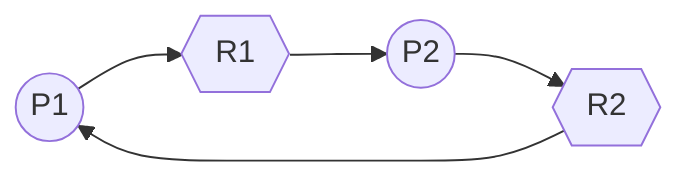
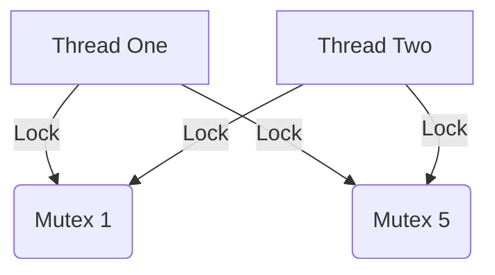
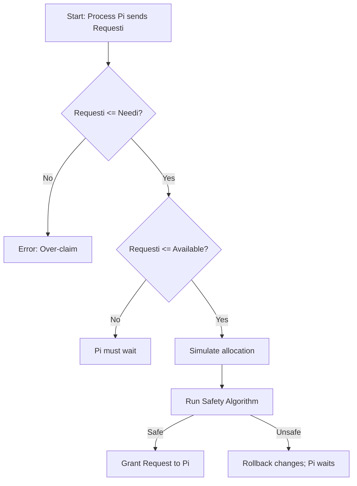

# فصل ۸: بن‌بست‌ها (Deadlocks)

## 🎯 اهداف فصل (Objectives)

در این فصل، با مفاهیم زیر آشنا می‌شویم:

- نحوه‌ی رخ دادن بن‌بست در صورت استفاده از قفل‌های متقابل (mutex locks)
    
- شرایط لازم برای وقوع بن‌بست
    
- تشخیص وضعیت بن‌بست با استفاده از نمودار تخصیص منابع
    
- بررسی روش‌های مختلف برای مدیریت بن‌بست شامل:
    
    - جلوگیری از بن‌بست (Prevention)
        
    - اجتناب از بن‌بست (Avoidance)
        
    - تشخیص بن‌بست (Detection)
        
    - بازیابی از بن‌بست (Recovery)
        
- کاربرد الگوریتم بانکدار (Banker’s Algorithm) برای اجتناب از بن‌بست
    

---

## 🧠 مدل سیستم (System Model)

برای درک بن‌بست‌ها، ابتدا باید مدل ساده‌شده‌ای از سیستم را بشناسیم که شامل موارد زیر است:

- **فرآیندها (Processes)**: برنامه‌های در حال اجرا که به منابع نیاز دارند.
    
- **منابع (Resources)**: مانند چاپگر، فایل، قفل، CPU و ... که فرآیندها به‌طور انحصاری آن‌ها را می‌گیرند و آزاد می‌کنند.
    
- **درخواست و تخصیص منابع**: فرآیندها منابع را درخواست می‌کنند و در صورت موجود بودن، سیستم عامل آن را تخصیص می‌دهد.
    

---

## 🔗 تعریف بن‌بست (Deadlock)

بن‌بست زمانی رخ می‌دهد که **گروهی از فرآیندها منتظر منابعی هستند که در اختیار یکدیگر هستند** و هیچ‌کدام نمی‌توانند ادامه دهند. یعنی همه منتظرند، ولی هیچ‌کس نمی‌تواند پیش برود.

---

## 🔄 شرایط لازم برای وقوع بن‌بست

چهار شرط زیر باید همزمان برقرار باشند تا بن‌بست رخ دهد:

1. **تخصیص انحصاری (Mutual Exclusion)**  
    منبع فقط به یک فرآیند داده می‌شود.
    
2. **نگه‌داری و انتظار (Hold and Wait)**  
    فرآیند یک منبع را نگه داشته و منتظر منابع دیگر است.
    
3. **عدم پیش‌گیری (No Preemption)**  
    منابع را نمی‌توان از فرآیند گرفت، مگر اینکه خودش آزاد کند.
    
4. **انتظار چرخشی (Circular Wait)**  
    زنجیره‌ای از فرآیندها وجود دارد که هرکدام منتظر منبعی هستند که در اختیار دیگری است.
    

---

## 📊 نمودار تخصیص منابع (Resource Allocation Graph)

می‌توان بن‌بست را با استفاده از نمودار زیر مدل کرد:



در این نمودار:

- دایره‌ها فرآیندها هستند (P1, P2).
    
- لوزی‌ها منابع هستند (R1, R2).
    
- فلش از فرآیند به منبع: درخواست منبع.
    
- فلش از منبع به فرآیند: منبع در اختیار آن فرآیند است.
    

در این مثال، یک **چرخه** بین فرآیندها و منابع وجود دارد → احتمال بن‌بست.

---

## 🎓 مثال ساده آموزشی

فرض کنید:

- فرآیند A یک چاپگر گرفته و منتظر دسترسی به فایل است.
    
- فرآیند B فایل را گرفته و منتظر چاپگر است.
    

هر دو منتظر همدیگرند و هیچ‌کدام آزاد نمی‌کنند → **بن‌بست**.

---

## 🧩 روش‌های مدیریت بن‌بست‌ها

در اسلایدها به چهار راهکار اشاره شده:

1. **پیشگیری (Prevention)**: حذف یکی از شرایط لازم.
    
2. **اجتناب (Avoidance)**: استفاده از الگوریتم‌هایی مثل بانکدار برای بررسی حالت امن.
    
3. **تشخیص (Detection)**: بررسی وجود چرخه و اعلام بن‌بست.
    
4. **بازیابی (Recovery)**: آزادسازی منابع یا پایان دادن به فرآیندها برای خارج شدن از بن‌بست.
    

---

## ✅ نکات کلیدی

- بن‌بست زمانی رخ می‌دهد که چند فرآیند منابع را به‌صورت متقابل نگه داشته و منتظر منابع دیگر باشند.
    
- چهار شرط برای وقوع بن‌بست باید **همزمان برقرار باشند**.
    
- نمودار تخصیص منابع، ابزاری برای تحلیل وقوع یا احتمال وقوع بن‌بست است.
    
- چهار رویکرد برای مقابله با بن‌بست‌ها وجود دارد که در ادامه فصل بررسی می‌شوند.
    

---
# مدل سیستم (System Model)  


---

## توضیح کامل و قابل‌فهم

در مدل سیستم برای بررسی بن‌بست، فرض می‌شود که:

- سیستم شامل مجموعه‌ای از منابع است.
- این منابع می‌توانند از انواع مختلف باشند:  
  مانند **چرخه‌های پردازنده (CPU Cycles)**، **فضای حافظه (Memory Space)**، و **دستگاه‌های ورودی/خروجی (I/O Devices)**.

### تعریف نوع منبع (Resource Type)
هر نوع منبع (مثلاً چاپگر، دیسک، پردازنده) با نماد \( R_i \) نشان داده می‌شود و می‌تواند چندین نمونه (Instance) داشته باشد.

مثلاً:
- \( R_1 = \) چاپگر (2 عدد)
- \( R_2 = \) اسکنر (1 عدد)

### نحوه استفاده فرایندها از منابع
هر فرایند برای استفاده از منبع‌ها از سه مرحله زیر عبور می‌کند:

1. **درخواست (Request)**:  
   فرایند از سیستم عامل می‌خواهد که منبع خاصی را در اختیارش بگذارد.

2. **استفاده (Use)**:  
   فرایند از منبع برای انجام وظیفه‌اش استفاده می‌کند.

3. **آزادسازی (Release)**:  
   پس از پایان کار، منبع را آزاد می‌کند تا دیگر فرایندها بتوانند از آن استفاده کنند.

---

## بن‌بست با استفاده از Semaphore (Deadlock with Semaphores)

در این مثال، دو **Semaphore** داریم:

- **S1** مقدار اولیه: 1  
- **S2** مقدار اولیه: 1  

و دو نخ (Thread):

- **T1** که به ترتیب زیر عمل می‌کند:
  ```c
  wait(S1);
  wait(S2);
```

- **T2** که به صورت زیر عمل می‌کند:
    
    ```c
    wait(S2);
    wait(S1);
    ```
    

### توضیح:

- اگر **T1** اول `S1` را بگیرد و منتظر `S2` بماند
    
- و همزمان **T2** اول `S2` را بگیرد و منتظر `S1` بماند  
    => هر دو در وضعیت انتظار یکدیگر گیر می‌کنند و **بن‌بست (Deadlock)** اتفاق می‌افتد.
    

---

## مثال ساده آموزشی

فرض کنید:

- سمان S1 یک کلید برای قفل اتاق A است.
    
- سمان S2 کلید قفل اتاق B است.
    
- شخص ۱ (T1) ابتدا کلید اتاق A را می‌گیرد و منتظر کلید B می‌ماند.
    
- شخص ۲ (T2) ابتدا کلید B را می‌گیرد و منتظر کلید A می‌ماند.
    

هیچ‌کدام کلید را پس نمی‌دهند و هیچ‌کدام نمی‌توانند وارد هر دو اتاق شوند ⇒ بن‌بست.

---

## نکات کلیدی

- منابع سیستم می‌توانند چند نوع و چند نمونه داشته باشند.
    
- فرایندها منابع را طبق توالی **درخواست → استفاده → آزادسازی** مدیریت می‌کنند.
    
- اگر منابع به‌درستی مدیریت نشوند، امکان ایجاد بن‌بست وجود دارد.
    
- مثال Semaphores نشان می‌دهد که حتی در سیستم‌های هماهنگ‌شده (مثل قفل‌گذاری با Semaphore) نیز امکان بن‌بست وجود دارد.
    
- ترتیب نامناسب درخواست منابع توسط نخ‌ها/فرایندها عامل مهمی در بروز بن‌بست است.
    

---
# مدل سیستم (System Model)  


---

## توضیح کامل مدل سیستم

در این بخش، مدل سیستم که در بررسی بن‌بست‌ها استفاده می‌شود معرفی می‌شود:

- سیستم شامل انواع منابع (Resource Types) مختلف است که معمولاً با نمادهای R₁, R₂, ..., Rₘ نشان داده می‌شوند.  
- منابع می‌توانند مواردی مانند **چرخه‌های CPU، فضای حافظه، دستگاه‌های ورودی/خروجی** باشند.  
- هر نوع منبع Rᵢ دارای Wᵢ نمونه (Instance) است، یعنی چند نمونه از آن منبع در سیستم وجود دارد.  
- هر فرایند (Process) برای استفاده از منابع، یک چرخه سه مرحله‌ای را طی می‌کند:  
  1. **درخواست (Request):** فرایند درخواست یک نمونه از منبع را می‌دهد.  
  2. **استفاده (Use):** پس از تخصیص، فرایند از منبع استفاده می‌کند.  
  3. **آزادسازی (Release):** بعد از اتمام کار، فرایند منبع را آزاد می‌کند تا سایر فرایندها بتوانند از آن استفاده کنند.

---

## بن‌بست در استفاده از Semaphore (سِمافور)

سِمافور یک متغیر یا ساختار داده است که برای همزمانی و جلوگیری از شرایط رقابتی (Race Condition) در برنامه‌های چندنخی (Multithreading) استفاده می‌شود.

### مثال:

- دو Semaphore به نام‌های S1 و S2 داریم که هر کدام مقدار اولیه ۱ دارند (یعنی فقط یک نخ می‌تواند همزمان آن‌ها را بگیرد).  
- دو نخ (Thread) به نام‌های T1 و T2 داریم که به ترتیب مراحل زیر را اجرا می‌کنند:

| نخ | مراحل اجرا |
|-|-|
| T1 | wait(S1) → wait(S2) |
| T2 | wait(S2) → wait(S1) |

**wait(S)** یعنی تلاش برای گرفتن (Lock) Semaphore و منتظر ماندن تا آزاد شود.

---

### چطور بن‌بست رخ می‌دهد؟

- اگر T1 ابتدا S1 را بگیرد، سپس منتظر S2 باشد،  
- و همزمان T2 ابتدا S2 را بگیرد و منتظر S1 باشد،  

آنگاه هر دو نخ منتظر منبعی هستند که دیگری گرفته و آزاد نمی‌کند؛ این **بن‌بست (Deadlock)** است.

---

## مثال ساده آموزشی

فرض کنید دو دوست دو کتابخانه مختلف دارند و برای انجام پروژه هر کدام باید از هر دو کتابخانه استفاده کنند:

- دوست ۱ ابتدا کتابخانه ۱ را می‌گیرد، اما منتظر کتابخانه ۲ است.
    
- دوست ۲ ابتدا کتابخانه ۲ را گرفته و منتظر کتابخانه ۱ است.  
    هیچ‌کدام حاضر نیستند کتابخانه خود را رها کنند و هر دو منتظر دیگری مانده‌اند، که این وضعیت نمونه‌ای از بن‌بست است.
    

---

## نکات کلیدی

- سیستم منابع متعددی دارد که هر نوع منبع چند نمونه می‌تواند داشته باشد.
    
- هر فرایند منابع را به صورت درخواست، استفاده و آزادسازی مدیریت می‌کند.
    
- Semaphore ابزاری برای مدیریت دسترسی همزمان به منابع است.
    
- اگر نخ‌ها یا فرایندها به ترتیب متفاوتی برای قفل کردن منابع اقدام کنند، ممکن است بن‌بست رخ دهد.
    
- بن‌بست در سِمافورها معمولاً به دلیل انتظار متقابل دایره‌ای ایجاد می‌شود.
    

---
# ویژگی‌های بن‌بست (Deadlock Characterization)  

---


## توضیح کامل

بن‌بست زمانی ممکن است در سیستم رخ دهد که **چهار شرط زیر به صورت هم‌زمان برقرار باشند**. اگر حتی یکی از این شرایط نقض شود، بن‌بست رخ نمی‌دهد. این چهار شرط عبارت‌اند از:

### 1. **انحصار متقابل (Mutual Exclusion)**  
در هر لحظه فقط **یک نخ** می‌تواند از یک منبع استفاده کند. اگر منبع در حال استفاده باشد، دیگران باید منتظر بمانند.

### 2. **نگهداری و انتظار (Hold and Wait)**  
نخی که یک یا چند منبع را در اختیار دارد، می‌تواند هم‌زمان **درخواست منابع دیگری** نیز بدهد و منتظر آن‌ها بماند.

### 3. **عدم پیش‌دستی (No Preemption)**  
سیستم نمی‌تواند منابع را به اجبار از نخ بگیرد. فقط نخ دارنده‌ی منبع می‌تواند **داوطلبانه** پس از اتمام کار، منبع را آزاد کند.

### 4. **انتظار چرخشی (Circular Wait)**  
مجموعه‌ای از نخ‌ها وجود دارند که هر کدام منتظر منبعی هستند که نخ بعدی در چرخه آن را در اختیار دارد. این چرخه از انتظار باعث بن‌بست می‌شود.

---

## نمودار تخصیص منابع (Resource Allocation Graph)

برای بررسی و شناسایی بن‌بست‌ها، از **نمودار تخصیص منابع** استفاده می‌شود.

### اجزای اصلی نمودار:

- **مجموعه نخ‌ها (Threads)**:  
  \( T = \{T_1, T_2, ..., T_n\} \)

- **مجموعه منابع (Resources)**:  
  \( R = \{R_1, R_2, ..., R_m\} \)

### انواع یال‌ها (Edges):

- **یال درخواست (Request Edge)**:  
  از نخ به منبع: \( T_i \rightarrow R_j \)  
  یعنی \( T_i \) درخواست \( R_j \) را داده است.

- **یال تخصیص (Assignment Edge)**:  
  از منبع به نخ: \( R_j \rightarrow T_i \)  
  یعنی منبع \( R_j \) به نخ \( T_i \) اختصاص یافته است.

---

## نمودار Mermaid از نمونه چرخه انتظار (بن‌بست)

```mermaid
graph LR
    T1[T1] -->|درخواست| R1
    R1 -->|اختصاص| T2
    T2[T2] -->|درخواست| R2
    R2 -->|اختصاص| T1

    style T1 fill:#f9f,stroke:#333,stroke-width:2px
    style T2 fill:#f9f,stroke:#333,stroke-width:2px
    style R1 fill:#bbf,stroke:#333,stroke-width:2px
    style R2 fill:#bbf,stroke:#333,stroke-width:2px
````

در این مدل:

- T1 در حال درخواست R1 است که به T2 اختصاص دارد.
    
- T2 در حال درخواست R2 است که به T1 اختصاص دارد.
    
- بنابراین یک چرخه‌ی انتظار بین نخ‌ها و منابع ایجاد شده که **نشان‌دهنده بن‌بست است**.
    

---

## مثال ساده آموزشی

فرض کنید سه دانشجو می‌خواهند پروژه‌ای تیمی انجام دهند و هر کدام برای کار خود به دو ابزار نیاز دارند (مثلاً لپ‌تاپ، میکروسکوپ و پرینتر).

- دانشجو ۱ لپ‌تاپ را دارد و منتظر پرینتر است.
    
- دانشجو ۲ پرینتر را دارد و منتظر میکروسکوپ است.
    
- دانشجو ۳ میکروسکوپ را دارد و منتظر لپ‌تاپ است.
    

در اینجا **شرایط انتظار چرخشی برقرار است** و هیچ‌کدام کار خود را نمی‌توانند ادامه دهند → بن‌بست!

---

## نکات کلیدی

- **بن‌بست زمانی رخ می‌دهد که چهار شرط هم‌زمان برقرار باشند.**
    
    - انحصار متقابل
        
    - نگهداری و انتظار
        
    - عدم پیش‌دستی
        
    - انتظار چرخشی
        
- **نمودار تخصیص منابع** ابزار قدرتمندی برای تحلیل و تشخیص بن‌بست است.
    
- اگر در نمودار تخصیص منابع **چرخه وجود داشته باشد** و هر منبع **فقط یک نمونه** داشته باشد، حتماً بن‌بست رخ داده است.
    
- اگر حداقل یکی از شرایط چهارگانه نقض شود، **سیستم در برابر بن‌بست ایمن** خواهد بود.
    

---

# مثال نمودار تخصیص منابع (Resource Allocation Graph Example)  


---
![[Pasted image 20250612145442.png]]
## توضیح کامل از تصویر

در این مثال، نمودار تخصیص منابع برای تحلیل وضعیت سیستم و شناسایی احتمال بن‌بست ترسیم شده است. اجزای اصلی شامل نخ‌ها (Threads)، منابع (Resources) و روابط بین آن‌هاست.

### اطلاعات اولیه:

- **R₁:** فقط ۱ نمونه  
- **R₂:** ۲ نمونه  
- **R₃:** فقط ۱ نمونه  
- **R₄:** ۳ نمونه (در این نمودار استفاده نشده است)  

### وضعیت نخ‌ها (Threads):

- **T₁:**  
  - دارای یک نمونه از R₂  
  - در حال درخواست R₁  
- **T₂:**  
  - دارای یک نمونه از R₁  
  - دارای یک نمونه از R₂  
  - در حال درخواست R₃  
- **T₃:**  
  - دارای یک نمونه از R₃  

---

## تجزیه نمودار به زبان ساده

در این نمودار:

- **T₁ → R₁**: یعنی T₁ منتظر دریافت R₁ است.  
- **R₂ → T₁**: یعنی T₁ یکی از نمونه‌های R₂ را در اختیار دارد.  
- **T₂ → R₃**: یعنی T₂ منتظر دریافت R₃ است.  
- **R₁ → T₂** و **R₂ → T₂**: یعنی T₂ همزمان R₁ و یکی از نمونه‌های R₂ را در اختیار دارد.  
- **R₃ → T₃**: یعنی T₃ تنها استفاده‌کننده از R₃ است.

---

## تحلیل وضعیت بن‌بست

در این وضعیت:

- **T₁ منتظر R₁** است که **در اختیار T₂** قرار دارد.
    
- **T₂ منتظر R₃** است که **در اختیار T₃** قرار دارد.
    
- اما **T₃ منتظر هیچ منبعی نیست**، پس زنجیره قطع می‌شود و چرخه‌ی کامل انتظار ایجاد نشده.
    

✅ **نتیجه:** در این مثال، بن‌بست وجود ندارد. چون اگرچه T₁ و T₂ در حال انتظار هستند، اما T₃ می‌تواند R₃ را در آینده آزاد کند و سپس منابع به ترتیب آزاد شوند.

---

## مثال ساده آموزشی

فرض کنید سه نفر برای پخت غذا به وسایل زیر نیاز دارند: قابلمه (R₁)، اجاق گاز (R₂)، و چاقو (R₃).

- نفر ۱ (T₁) اجاق را دارد و منتظر قابلمه است.
    
- نفر ۲ (T₂) قابلمه و اجاق را دارد و منتظر چاقو است.
    
- نفر ۳ (T₃) فقط چاقو را دارد و منتظر هیچ‌چیز نیست.
    

اگر نفر ۳ کارش را تمام کند و چاقو را آزاد کند، نفر ۲ می‌تواند ادامه دهد و سپس نفر ۱.

---

## نکات کلیدی

- **نمودار تخصیص منابع** نمایشی گرافیکی از رابطه بین نخ‌ها و منابع است.
    
- یال از نخ به منبع = درخواست
    
- یال از منبع به نخ = تخصیص
    
- اگر چرخه‌ی کامل انتظار وجود نداشته باشد، احتمال بن‌بست وجود ندارد.
    
- تحلیل چنین نموداری کمک می‌کند تا بتوان رفتار سیستم را در شرایط بحرانی بررسی و مدیریت کرد.
    

---
# نمودار تخصیص منابع همراه با بن‌بست  
**Resource Allocation Graph with a Deadlock**  

![[Pasted image 20250612145714.png]]

---

## توضیح کامل از تصویر

این نمودار نمونه‌ای از یک **وضعیت بن‌بست** (Deadlock) را در سیستم نمایش می‌دهد. با دقت به یال‌های درخواست و تخصیص، می‌توان مشاهده کرد که سه نخ به صورت چرخشی در حال انتظار هستند و هیچ‌کدام قادر به ادامه کار نیستند.

### اجزای نمودار:

- **نخ‌ها (Threads):**
  - T₁
  - T₂
  - T₃

- **منابع (Resources):**
  - R₁ (۱ نمونه)
  - R₂ (۲ نمونه)
  - R₃ (۱ نمونه)
  - R₄ (استفاده نشده)

---

## تحلیل دقیق نمودار

### تخصیص و درخواست‌ها:

- **T₁ → R₁**: T₁ منتظر دریافت R₁  
- **R₂ → T₁**: T₁ یکی از نمونه‌های R₂ را در اختیار دارد

- **T₂ → R₂**: T₂ منتظر دریافت R₂  
- **R₁ → T₂**: T₂ یک نمونه از R₁ را در اختیار دارد

- **T₃ → R₃**: T₃ منتظر دریافت R₃  
- **R₂ → T₃**: T₃ یکی دیگر از نمونه‌های R₂ را در اختیار دارد  
- **R₃ → T₂**: T₂ یک نمونه از R₃ را در اختیار دارد  

### چرخه انتظار:

1. **T₁** منتظر R₁ است → در اختیار T₂  
2. **T₂** منتظر R₂ است → در اختیار T₃  
3. **T₃** منتظر R₃ است → در اختیار T₂  
⛔ نتیجه: یک **چرخه‌ی بسته** از انتظار شکل گرفته است.

✅ در این وضعیت، هیچ نخی نمی‌تواند به کار خود ادامه دهد → **بن‌بست رخ داده است.**

---

## مثال ساده آموزشی

تصور کنید سه کاربر در یک کافی‌نت می‌خواهند بازی گروهی انجام دهند و هرکدام برای شروع نیاز به دو وسیله دارند:

- **نفر اول (T₁):** موس دارد و منتظر کیبورد است.
    
- **نفر دوم (T₂):** کیبورد و هدست دارد و منتظر موس است.
    
- **نفر سوم (T₃):** موس دارد و منتظر هدست است.
    

هرکس منتظر وسیله‌ای است که دیگری دارد، و هیچ‌کس نمی‌تواند بازی را شروع کند → **بن‌بست رخ داده است.**

---

## نکات کلیدی

- **بن‌بست = وجود چرخه‌ی بسته از نخ‌ها که هرکدام منتظر منابعی هستند که توسط دیگری نگه داشته شده است.**
    
- نمودار تخصیص منابع ابزار مؤثری برای **شناسایی چرخه‌های انتظار** و تحلیل وضعیت‌های بن‌بست است.
    
- در صورتی که همه منابع فقط **یک نمونه** داشته باشند، وجود چرخه **قطعاً** به معنای وجود بن‌بست است.
    
- اگر منابع چند نمونه داشته باشند، چرخه **ممکن است یا ممکن است به بن‌بست منجر نشود.**
    

---

# گرافی با چرخه اما بدون بن‌بست  
**Graph with a Cycle But no Deadlock**  

![[Pasted image 20250612150015.png]]

---

## توضیح کامل از تصویر

این نمودار نشان می‌دهد که **وجود چرخه در گراف تخصیص منابع، لزوماً به معنای وقوع بن‌بست نیست**. در این مثال، با وجود تشکیل یک چرخه بین نخ‌ها و منابع، بن‌بست اتفاق نیفتاده زیرا هنوز امکان انجام پردازش و آزادسازی منابع وجود دارد.

---

## اجزای نمودار

### منابع:
- **R₁**: دارای دو نمونه (● ●)
- **R₂**: دارای دو نمونه (● ●)

### نخ‌ها:
- **T₁**: در حال درخواست R₁ و نگهداری R₂
- **T₂**: نگهدارنده یکی از نمونه‌های R₁
- **T₃**: در حال درخواست R₂ و نگهداری R₁
- **T₄**: نگهدارنده یکی از نمونه‌های R₂

---

## تحلیل دقیق

در این گراف، چرخه‌ای بین T₁، R₁، T₃، R₂، و T₁ تشکیل شده است:

```

T₁ → R₁ → T₃ → R₂ → T₁

````

اما با دقت در وضعیت منابع متوجه می‌شویم که:

- R₁ دو نمونه دارد، یکی نزد T₂ و یکی نزد T₃ است.
- R₂ نیز دو نمونه دارد، یکی نزد T₁ و یکی نزد T₄ است.

به دلیل **وجود چندین نمونه از هر منبع**، این امکان وجود دارد که:

- یکی از نخ‌ها (مثلاً T₂ یا T₄) وظیفه‌اش را تمام کرده و منبع را آزاد کند.
- سپس نخی که منتظر آن منبع است، بتواند آن را دریافت کرده و ادامه دهد.
- در نتیجه چرخه شکسته می‌شود و بن‌بست رخ نمی‌دهد.

✅ **پس: چرخه ≠ بن‌بست، مگر اینکه همه منابع فقط یک نمونه داشته باشند.**

---
## مثال ساده آموزشی

فرض کنید در یک آزمایشگاه دو دستگاه چاپگر (R₁) و دو اسکنر (R₂) وجود دارد.

- **دانشجوی ۱ (T₁):** یک اسکنر در اختیار دارد و منتظر چاپگر است.
    
- **دانشجوی ۲ (T₂):** یک چاپگر در اختیار دارد.
    
- **دانشجوی ۳ (T₃):** یک چاپگر دارد و منتظر اسکنر است.
    
- **دانشجوی ۴ (T₄):** یک اسکنر در اختیار دارد.
    

در این حالت با اینکه یک چرخه بین کاربران و دستگاه‌ها شکل گرفته، اما چون از هر دستگاه **دو عدد** موجود است، کاربران می‌توانند پس از اتمام کار، دستگاه‌ها را آزاد کرده و دیگران از آن استفاده کنند → **بن‌بست اتفاق نمی‌افتد.**

---

## نکات کلیدی

- وجود چرخه در گراف تخصیص منابع، **شرط لازم** برای بن‌بست است ولی **کافی نیست**.
    
- فقط در حالتی که **همه منابع فقط یک نمونه داشته باشند**، وجود چرخه معادل با بن‌بست است.
    
- اگر حداقل یک منبع دارای چند نمونه باشد، امکان شکستن چرخه و جلوگیری از بن‌بست وجود دارد.
    
- بررسی دقیق تعداد نمونه‌های منابع در تحلیل وضعیت بن‌بست بسیار مهم است.
    

---
# حقایق پایه و روش‌های مدیریت بن‌بست  
**Basic Facts & Methods for Handling Deadlocks**  

---

## بخش اول: حقایق پایه درباره گراف تخصیص منابع

در سیستم‌هایی که از **گراف تخصیص منابع** (Resource Allocation Graph - RAG) استفاده می‌شود، می‌توان وضعیت بن‌بست را با بررسی وجود چرخه تحلیل کرد.

### قوانین مهم:

1. **اگر گراف چرخه نداشته باشد → بن‌بست وجود ندارد.**
2. **اگر گراف دارای چرخه باشد → دو حالت دارد:**
   - اگر **از هر نوع منبع فقط یک نمونه** وجود داشته باشد → **بن‌بست قطعی است.**
   - اگر **از برخی منابع چند نمونه** وجود داشته باشد → **امکان بن‌بست وجود دارد، اما قطعی نیست.**

### خلاصه تصویری:

```mermaid
flowchart TD
    A[گراف بدون چرخه] --> B[بن‌بست رخ نمی‌دهد ✅]
    C[گراف دارای چرخه] --> D{تعداد نمونه منبع؟}
    D -->|یک نمونه| E[بن‌بست قطعی ❌]
    D -->|چند نمونه| F[احتمال بن‌بست ⚠️]
````

---

## بخش دوم: روش‌های برخورد با بن‌بست

در طراحی سیستم‌عامل‌ها، چهار رویکرد کلی برای مقابله با بن‌بست وجود دارد:

### 1. **پیشگیری از بن‌بست (Deadlock Prevention)**

با طراحی سیستم به‌گونه‌ای که **یکی از شرایط لازم برای بن‌بست هرگز برقرار نشود**.  
مثال: عدم اجازه نگهداری همزمان چند منبع → حذف شرط "Hold and Wait".

### 2. **اجتناب از بن‌بست (Deadlock Avoidance)**

با بررسی وضعیت سیستم **قبل از اعطای منابع**، تصمیم‌گیری می‌شود که این تخصیص منجر به بن‌بست خواهد شد یا نه.  
ابزار مهم: **الگوریتم بانکدار (Banker’s Algorithm)**.

### 3. **تشخیص و بازیابی از بن‌بست (Detection and Recovery)**

در این روش، سیستم اجازه می‌دهد که بن‌بست رخ دهد و سپس:

- آن را تشخیص می‌دهد،
    
- و اقدام به بازیابی می‌کند (مانند آزاد کردن منابع یا خاتمه پردازش).
    

### 4. **نادیده گرفتن بن‌بست (Ignore Deadlocks)**

رویکرد رایج در سیستم‌های ساده مانند بسیاری از نسخه‌های ویندوز یا لینوکس:

> "بگذار اتفاق بیفتد، نگرانش نباشیم!"

---

# پیشگیری از بن‌بست (Deadlock Prevention)  

---

## مقدمه

در پیشگیری از بن‌بست، هدف این است که سیستم را به گونه‌ای طراحی کنیم که **حداقل یکی از چهار شرط لازم برای وقوع بن‌بست هرگز برقرار نشود**.

چهار شرط وقوع بن‌بست:
1. **محرومیت متقابل (Mutual Exclusion)**
2. **نگه‌داری و انتظار (Hold and Wait)**
3. **عدم امکان پیش‌دستی (No Preemption)**
4. **انتظار چرخشی (Circular Wait)**

---

## ۱. محرومیت متقابل (Mutual Exclusion)

- تنها در منابع **غیرقابل اشتراک** باید برقرار باشد.  
  مثلاً:
  - فایل‌های فقط‌خواندنی می‌توانند توسط چند فرآیند استفاده شوند → نیاز به محرومیت متقابل ندارند.
- برای منابعی مثل **پرینتر یا CPU** که فقط یک استفاده‌کننده دارند، این شرط **اجتناب‌ناپذیر** است.

---

## ۲. نگه‌داری و انتظار (Hold and Wait)

برای جلوگیری از این شرط:
- فرآیند **نباید هیچ منبعی در اختیار داشته باشد زمانی که درخواست منبع جدیدی می‌دهد**.
- دو راهکار:
  1. فرآیند باید **همه منابع مورد نیازش را یکجا درخواست دهد** و اگر همه مهیا شد، اجرا را شروع کند.
  2. فرآیند تنها زمانی می‌تواند منابع جدید درخواست کند که **هیچ منبعی در اختیار نداشته باشد**.

🔴 **مشکلات این روش:**
- **استفاده ضعیف از منابع** (Resource Underutilization)
- احتمال **گرسنگی فرآیندها** (Starvation)

---

## ۳. عدم امکان پیش‌دستی (No Preemption)

جلوگیری از این شرط با سیاست زیر:
- اگر فرآیندی منابعی دارد و منبع جدیدی را درخواست کند که **در دسترس نیست**:
  - تمام منابعی که در اختیار دارد، **از او گرفته می‌شود**.
  - این منابع به لیست انتظار اضافه می‌شوند.
  - فرآیند تنها زمانی مجاز به اجرا است که **همه منابع قدیمی و جدید** برایش فراهم شوند.

---

## ۴. انتظار چرخشی (Circular Wait)

برای حذف این شرط:
- یک **ترتیب کلی** (Total Ordering) برای منابع تعریف می‌کنیم (مثلاً R1 < R2 < R3 ...).
- فرآیندها باید منابع را **فقط به ترتیب افزایشی** درخواست کنند.

مثلاً:
- اگر فرآیندی R2 را در اختیار دارد، فقط مجاز به درخواست R3 یا R4 است، نه R1.

---
## مثال ساده آموزشی

فرض کنید در یک آزمایشگاه، تنها یک میکروسکوپ (منبع غیرقابل اشتراک) وجود دارد.  
سه دانشجو به ترتیب منابع مورد نیاز خود را درخواست می‌کنند.

اگر:

- هر دانشجو **فقط زمانی درخواست بدهد که هیچ منبعی در اختیار ندارد**
    
- یا منابع را **بر اساس شماره‌گذاری مشخصی** (مثلاً میکروسکوپ < سانتریفیوژ < یخچال) درخواست دهد
    

→ **بن‌بست رخ نخواهد داد.**

---

## نکات کلیدی

- برای پیشگیری از بن‌بست باید **حداقل یکی از شروط چهارگانه را حذف کنیم**.
    
- حذف شرط "Hold and Wait" و "Circular Wait" بیشتر مرسوم است.
    
- پیشگیری همیشه موفق است، اما ممکن است منجر به **کاهش بهره‌وری** سیستم شود.
    
- پیشگیری ≠ اجتناب؛ پیشگیری با طراحی اولیه انجام می‌شود، اجتناب به تحلیل لحظه‌ای نیاز دارد.
    

---
# Circular Wait – پیشگیری از شرط انتظار چرخشی

## مفهوم اصلی:

🔁 **Circular Wait** زمانی رخ می‌دهد که مجموعه‌ای از فرآیندها یا نخ‌ها (threads)، هر کدام منابعی را نگه دارند و در عین حال منتظر منابعی باشند که توسط نخ بعدی در زنجیره نگه داشته شده است.

برای پیشگیری:
- به هر **منبع (مثل mutex)** یک **شماره یکتا** اختصاص می‌دهیم.
- تمام منابع باید **به ترتیب افزایشی** شماره‌شان تخصیص یابند.

---

## شرایط مثال اسلاید:

```c
first_mutex = 1;
second_mutex = 5;
````

در این مثال:

- ترتیب صحیح گرفتن منابع باید از `first_mutex` به `second_mutex` باشد، چون 1 < 5.
    
- بنابراین **thread_two نباید منابع را به ترتیب 5 → 1** درخواست کند.
    

---

## کد توضیحی اسلاید:

### ✅ کد صحیح برای `thread_one`:

```c
void *do_work_one(void *param) {
    pthread_mutex_lock(&first_mutex);   // شماره 1
    pthread_mutex_lock(&second_mutex);  // شماره 5
    /* کار انجام شود */
    pthread_mutex_unlock(&second_mutex);
    pthread_mutex_unlock(&first_mutex);
    pthread_exit(0);
}
```

### ❌ کد نادرست برای `thread_two`:

```c
void *do_work_two(void *param) {
    pthread_mutex_lock(&second_mutex);  // شماره 5
    pthread_mutex_lock(&first_mutex);   // شماره 1 ← خطا! ترتیب کاهش یافته
    /* کار انجام شود */
    pthread_mutex_unlock(&first_mutex);
    pthread_mutex_unlock(&second_mutex);
    pthread_exit(0);
}
```

این کد باعث نقض شرط ترتیب منابع و در نتیجه **احتمال وقوع Circular Wait** می‌شود.

---

## دیاگرام Mermaid: نمونه‌ای از ترتیب مجاز و غیرمجاز



✅ مسیر A ترتیب صعودی دارد → مجاز  
❌ مسیر B ترتیب نزولی دارد → ممکن است بن‌بست ایجاد کند

---

## مثال ساده آموزشی:

فرض کنید منابع شماره‌گذاری شده‌اند:

- Mutex A: 2
    
- Mutex B: 4
    

در این صورت، نخ‌ها باید فقط این ترتیب را رعایت کنند:

- ابتدا گرفتن A و سپس B مجاز است.
    
- گرفتن B و سپس A مجاز نیست.
    

---

## نکات کلیدی

- جلوگیری از Circular Wait با ترتیب عددی منابع، ساده و بسیار مؤثر است.
    
- هر نخ باید منابع را **فقط به ترتیب افزایشی** شماره درخواست کند.
    
- این روش در سیستم‌های چندنخی (Multithreading) با mutexها بسیار کاربردی است.
    
- اجرای نادرست این ترتیب ممکن است باعث بن‌بست شود.
    

---
# Deadlock Avoidance – اجتناب از بن‌بست

---

## تعریف کلی

اجتناب از بن‌بست به معنای آن است که سیستم، **پیش از تخصیص منابع به هر فرآیند یا نخ (Thread)**، بررسی می‌کند که آیا این تخصیص باعث می‌شود سیستم در آینده وارد وضعیت بن‌بست شود یا خیر. اگر احتمال بن‌بست وجود داشته باشد، تخصیص انجام نمی‌شود.

---

## پیش‌نیاز اصلی الگوریتم‌های اجتناب از بن‌بست

برای اجرای این رویکرد، سیستم نیاز دارد که **هر نخ (Thread)** از قبل اعلام کند:

> "حداکثر چه تعداد از هر نوع منبع را ممکن است در طول اجرای خود نیاز داشته باشم؟"

📌 این اطلاعات به سیستم کمک می‌کند وضعیت آینده را مدل کند و تشخیص دهد که تخصیص یک منبع خاص **امن (Safe)** هست یا نه.

---

## وضعیت تخصیص منابع (Resource-Allocation State)

برای تصمیم‌گیری در مورد تخصیص منابع، سیستم از یک مدل استفاده می‌کند که شامل سه عنصر کلیدی است:

1. **تعداد منابع موجود (Available):** تعداد منابع آزاد فعلی از هر نوع.
2. **تخصیص‌یافته‌ها (Allocated):** تعداد منابعی که هم‌اکنون به هر نخ یا فرآیند تخصیص یافته است.
3. **حداکثر نیاز (Maximum Demand):** بیشترین تعداد منابعی که هر نخ ممکن است در آینده درخواست کند.

با این سه مؤلفه، سیستم می‌تواند شبیه‌سازی کند که آیا تخصیص بعدی منجر به بن‌بست خواهد شد یا خیر.

---

## الگوریتم کلاسیک: الگوریتم بانکدار (Banker's Algorithm)

الگوریتم مشهور در این حوزه "Banker's Algorithm" نام دارد که توسط Dijkstra معرفی شده است.

- مانند یک بانکدار فرضی عمل می‌کند که فقط زمانی به مشتری وام می‌دهد که مطمئن باشد حتی بعد از تخصیص وام، بانک توانایی پاسخگویی به نیاز سایر مشتری‌ها را نیز دارد.
- اگر تخصیص جدید باعث شود سیستم وارد وضعیت ناامن (Unsafe) شود، درخواست رد می‌شود.

---

## دیاگرام Mermaid: اجزای وضعیت تخصیص منابع

```mermaid
flowchart TD
    A[Thread] -->|Declared Max Need| B(Maximum)
    A -->|Currently Holds| C(Allocated)
    D[System] -->|Free Resources| E(Available)
    D -->|Uses Max & Allocated| F[Deadlock Avoidance Logic]
    F -->|Grants if Safe| A
````

---

## مثال ساده آموزشی

فرض کنید:

- Thread A ممکن است حداکثر به 10 واحد از منبع X نیاز داشته باشد.
    
- فعلاً 5 واحد دارد.
    
- سیستم فقط 3 واحد آزاد از X دارد.
    

اگر Thread A درخواست 3 واحد دیگر دهد، سیستم بررسی می‌کند:

- آیا بعد از تخصیص این 3 واحد، وضعیت باقی‌مانده سیستم اجازه می‌دهد سایر فرآیندها هم به نیازشان برسند؟
    

اگر پاسخ **بله** باشد → تخصیص انجام می‌شود.  
اگر پاسخ **نه** باشد → تخصیص رد می‌شود تا از بن‌بست جلوگیری شود.

---

## نکات کلیدی

- در اجتناب از بن‌بست، شرط‌های بن‌بست حذف نمی‌شوند؛ بلکه سیستم با تحلیل پویا، از ورود به وضعیت بن‌بست جلوگیری می‌کند.
    
- نیازمند دانستن **حداکثر نیاز هر فرآیند** در زمان آغاز آن است.
    
- **وضعیت تخصیص منابع** شامل: منابع آزاد، منابع تخصیص‌یافته، و حداکثر نیاز.
    
- Banker's Algorithm از این اطلاعات برای تصمیم‌گیری امن استفاده می‌کند.
    
- در سیستم‌هایی با منابع محدود و بحرانی، اجتناب از بن‌بست روش بسیار مناسبی است.
    

---
# Safe State – وضعیت ایمن در اجتناب از بن‌بست

در این اسلاید، مفهوم **وضعیت ایمن (Safe State)** به‌عنوان یک ابزار کلیدی در اجتناب از بن‌بست معرفی شده است. هدف این است که قبل از تخصیص یک منبع، سیستم بررسی کند که آیا این تخصیص منجر به ورود به وضعیت **ناایمن (Unsafe)** و در نهایت **بن‌بست** خواهد شد یا نه.

---

## تعریف وضعیت ایمن (Safe State)

سیستم در **وضعیت ایمن** است اگر بتوان ترتیب مشخصی از اجرای تمام نخ‌ها پیدا کرد که در آن:
- هر نخ بتواند تمام منابع مورد نیازش را در زمانی مناسب دریافت کند.
- پس از اجرای کامل، منابعش را آزاد کرده و به نخ بعدی در ترتیب، امکان تخصیص بدهد.

✅ اگر چنین ترتیبی وجود داشته باشد، سیستم در وضعیت **Safe** است.  
❌ اگر هیچ ترتیبی یافت نشود، سیستم وارد وضعیت **Unsafe** شده که ممکن است به **بن‌بست** ختم شود.

---

## توضیح ساده‌تر

فرض کنید نخ‌هایی داریم:  
`<T1, T2, ..., Tn>`

اگر:
- نخ T1 بتواند با منابع موجود اجرا شود،
- پس از اتمام، منابعش را آزاد کند و به T2 اجازه اجرا دهد،
- و همین روند تا Tn ادامه یابد،

آنگاه سیستم در وضعیت ایمن قرار دارد.

---

## شرایط لازم برای Safe State

برای هر نخ Ti در ترتیب فرضی:
- اگر منابع مورد نیاز Ti در حال حاضر موجود نیست، باید بتواند **منتظر بماند** تا نخ‌های Tj با j < i اجرا شده و منابعشان را آزاد کنند.
- پس از آن، Ti منابع را دریافت می‌کند، اجرا می‌شود و منابع را پس می‌دهد.

---
## مثال ساده آموزشی

فرض کنید:

- منابع موجود: 5 واحد
    
- سه نخ داریم: A، B و C
    
- نیازهای کلی آن‌ها:
    
    - A: نیاز کل = 3، تخصیص فعلی = 1
        
    - B: نیاز کل = 4، تخصیص فعلی = 2
        
    - C: نیاز کل = 2، تخصیص فعلی = 1
        

منابع آزاد = 5 - (1+2+1) = 1

الگوریتم بررسی می‌کند که:

- آیا می‌توان یک ترتیب برای اجرای A، B، C پیدا کرد که در آن، هر نخ بتواند به منابع مورد نیاز خود برسد؟
    
- مثلاً اگر اول A اجرا شود، منابع آزاد می‌کند → B اجرا شود → سپس C → ✅ وضعیت ایمن است.
    

---

## نکات کلیدی

- وضعیت ایمن به معنی **عدم وجود بن‌بست نیست**، بلکه به این معنی است که **با تخصیص فعلی می‌توان از بن‌بست جلوگیری کرد.**
    
- سیستم باید **قبل از تخصیص منابع** بررسی کند که آیا وضعیت ایمن باقی می‌ماند.
    
- اگر تخصیص باعث Unsafe State شود، باید **رد شود یا به تعویق بیفتد.**
    
- بررسی وضعیت ایمن، پایه‌ و اساس **الگوریتم Banker's Algorithm** است.
    

---

# Basic Facts – حقایق پایه درباره وضعیت ایمن و ناایمن

این اسلاید نکات پایه‌ای و بسیار مهمی را درباره رابطه بین **وضعیت ایمن (Safe State)**، **وضعیت ناایمن (Unsafe State)** و **بن‌بست (Deadlock)** بیان می‌کند.

---

## حقایق کلیدی

1. ✅ **اگر سیستم در وضعیت ایمن باشد**  
   ⟹ هرگز وارد بن‌بست نخواهد شد.

2. ⚠️ **اگر سیستم در وضعیت ناایمن باشد**  
   ⟹ امکان ورود به بن‌بست وجود دارد (ولی حتمی نیست).

3. 🔐 **هدف از اجتناب از بن‌بست (Deadlock Avoidance)**  
   ⟹ اطمینان از این است که **سیستم هرگز وارد وضعیت ناایمن نشود**.

---

## تحلیل تصویر (نمودار)


![[Pasted image 20250612151936.png]]

- فضای مستطیلی، کل **وضعیت‌های ممکن سیستم** را نشان می‌دهد.
- ناحیه‌ی خاکستری روشن: وضعیت‌های **ایمن (safe)**.
- ناحیه‌ی سفید بالایی: وضعیت‌های **ناایمن (unsafe)**.
- ناحیه‌ی تیره درون unsafe: وضعیت‌هایی که منجر به **بن‌بست (deadlock)** می‌شوند.

⬇️  
این مدل نشان می‌دهد که:

- ورود به منطقه‌ی unsafe، **ممکن است** به منطقه‌ی deadlock ختم شود.
- اما تا زمانی که سیستم در منطقه‌ی safe باقی بماند، **بن‌بست غیرممکن** است.

---

## دیاگرام Mermaid مفهومی

```mermaid
flowchart LR
    A[Safe State] -->|Possible Transition| B[Unsafe State]
    B -->|May Lead To| C[Deadlock]

    style A fill:#c6f6d5,stroke:#2f855a,stroke-width:2px
    style B fill:#fefcbf,stroke:#d69e2e,stroke-width:2px
    style C fill:#feb2b2,stroke:#c53030,stroke-width:2px
````

---

## مثال ساده آموزشی

فرض کنید سه نخ داریم: A، B، C  
و سیستم در وضعیت زیر است:

- A نیاز دارد به 2 واحد دیگر از یک منبع.
    
- B فقط 1 واحد نیاز دارد و می‌تواند اجرا شود.
    
- اگر B اجرا شود و منابعش را آزاد کند، A و سپس C هم می‌توانند اجرا شوند.
    

⬇️ بنابراین:

- اگر سیستم ابتدا منابع را به B بدهد، وضعیت **ایمن** باقی می‌ماند.
    
- اگر به جای B، منابع به A تخصیص داده شود، ممکن است هیچ نخ دیگری نتواند ادامه دهد و سیستم به بن‌بست برسد ⟹ **ناایمن**.
    

---

## نکات کلیدی

- وضعیت ایمن یعنی وجود یک ترتیب اجرا که از بن‌بست جلوگیری می‌کند.
    
- وضعیت ناایمن لزوماً بن‌بست نیست، اما **امکان رسیدن به آن وجود دارد.**
    
- اجتناب از بن‌بست تضمین می‌کند که سیستم **هرگز وارد وضعیت ناایمن نشود**.
    
- تصویر این اسلاید، مرز مفهومی بین safe، unsafe و deadlock را به خوبی نمایش می‌دهد.
    

---

# Deadlock Avoidance Algorithms – الگوریتم‌های اجتناب از بن‌بست

در این اسلاید، دو الگوریتم اصلی برای اجتناب از بن‌بست بسته به نوع منابع معرفی شده‌اند. نوع منابع در سیستم‌ها به دو دسته تقسیم می‌شود:

---

## 1. منابع با تنها **یک نمونه (Single Instance)**

📌 برای منابعی که تنها یک نمونه از آن‌ها در سیستم وجود دارد (مثل چاپگر یا دیسک خاص)، از **نمودار تخصیص منابع (Resource Allocation Graph – RAG)** استفاده می‌شود.

### ✳️ نحوه کار:

نمودار تخصیص منابع گرافی است شامل:
- گره‌های فرآیندها (Ti)
- گره‌های منابع (Rj)
- یال‌هایی برای نمایش وضعیت درخواست، تخصیص یا ادعا

### انواع یال‌ها:

- 🔹 **Claim Edge (Ti → Rj):**  
  نشان می‌دهد که نخ Ti ممکن است در آینده منبع Rj را درخواست کند.  
  👉 با خط **چین‌دار** نمایش داده می‌شود.

- 🔸 **Request Edge (Ti → Rj):**  
  وقتی نخ Ti واقعاً منبع Rj را درخواست کند، claim edge به request edge تبدیل می‌شود.  
  👉 خط **پیوسته یک‌طرفه** از نخ به منبع.

- 🔷 **Assignment Edge (Rj → Ti):**  
  وقتی Rj به Ti تخصیص داده شود، request edge به assignment edge تبدیل می‌شود.  
  👉 خط **پیوسته یک‌طرفه** از منبع به نخ.

⏹️ وقتی منبع آزاد می‌شود، assignment edge به claim edge بازمی‌گردد.

---

### 📋 شرط مهم:
> نخ‌ها باید **از قبل (a priori)** اعلام کنند که ممکن است در آینده چه منابعی را نیاز داشته باشند.

---

## 2. منابع با **چند نمونه (Multiple Instances)**

📌 در حالتی که از هر منبع چند نمونه در دسترس است (مثلاً 3 چاپگر یا 5 کانال ارتباطی)، از **الگوریتم بانکدار (Banker’s Algorithm)** استفاده می‌شود.

در این اسلاید، وارد جزئیات الگوریتم بانکدار نشده، اما در اسلایدهای قبلی اشاره شد که این الگوریتم بر اساس:
- بیشترین نیاز اعلام‌شده،
- تخصیص فعلی،
- و منابع آزاد سیستم،

تشخیص می‌دهد که آیا تخصیص بعدی باعث Unsafe State خواهد شد یا نه.

---

## نکات کلیدی

- الگوریتم مناسب بستگی به نوع منابع دارد:
    
    - منابع با یک نمونه → **نمودار تخصیص منابع (RAG)**
        
    - منابع با چند نمونه → **الگوریتم بانکدار**
        
- در RAG:
    
    - Claim Edge ⟶ Request Edge ⟶ Assignment Edge ⟶ Claim Edge
        
- سیستم باید قبل از تخصیص، با استفاده از این گراف بررسی کند که تخصیص جدید باعث ایجاد بن‌بست نمی‌شود.
    
- کلید اصلی: **اعلام نیازهای بالقوه توسط نخ‌ها قبل از اجرا (Claiming resources a priori)**
    

---

# Resource-Allocation Graph – نمودار تخصیص منابع


![[Pasted image 20250612153054.png]]

---

## 📌 اجزای نمودار:

### 🎯 گره‌ها:
- دایره‌ها: نخ‌ها یا فرآیندها (در اینجا: `T1` و `T2`)
- مربع‌ها: منابع (در اینجا: `R1` و `R2`)

### 🔄 یال‌ها:
- 🔹 **یال‌های پیوسته**:
  - `R1 → T1` و `R1 → T2`: یعنی `R1` در حال حاضر به `T1` و `T2` **تخصیص داده شده‌اند**.
- 🔸 **یال‌های چین‌دار (dashed)**:
  - `T1 → R2` و `T2 → R2`: یعنی `T1` و `T2` ممکن است در آینده `R2` را **درخواست کنند** (Claim Edges).

---

## 🧠 تحلیل وضعیت فعلی گراف

در حال حاضر:
- `T1` و `T2` هر کدام از `R1` استفاده می‌کنند (یا درخواست داده‌اند و تخصیص انجام شده).
- هر دو نخ **ادعا کرده‌اند** که در آینده به `R2` نیاز خواهند داشت.

نکته مهم:
- **هنوز هیچ Request واقعی برای `R2` ثبت نشده است.**
- فقط ادعا (Claim) شده که شاید در آینده درخواست دهند.

---
## 🧪 مثال آموزشی

فرض کنید:

- `R1` یک چاپگر است، که در حال حاضر در اختیار هر دو نخ `T1` و `T2` قرار دارد (مثلاً دو نمونه دارد).
    
- `R2` یک اسکنر است، که فعلاً آزاد است ولی هنوز کسی آن را درخواست نکرده.
    
- اما هر دو نخ در آینده **ممکن است** `R2` را درخواست کنند (Claim Edge).
    

⬇️ سیستم باید بررسی کند که اگر یکی از نخ‌ها درخواست واقعی برای `R2` بدهد، آیا این تخصیص باعث ورود سیستم به وضعیت ناایمن یا بن‌بست خواهد شد یا خیر.

---

## نکات کلیدی

- **Claim Edge** نشان‌دهنده‌ی نیازهای بالقوه در آینده است.
    
- با تبدیل claim edge به request edge، سیستم باید بررسی کند که آیا تخصیص جدید باعث ایجاد **چرخه** می‌شود یا خیر.
    
- در صورتی که **چرخه‌ای در گراف ایجاد شود** و فقط یک نمونه از هر منبع وجود داشته باشد ⟹ **بن‌بست رخ داده است**.
    
- بنابراین، با استفاده از این گراف و بررسی وضعیت قبل از تخصیص، سیستم می‌تواند از ورود به بن‌بست جلوگیری کند.
    

---

# Unsafe State in Resource-Allocation Graph – وضعیت ناایمن در نمودار تخصیص منابع

در این بخش، مفهوم **"Unsafe State" (وضعیت ناایمن)** در قالب نمودار تخصیص منابع (Resource Allocation Graph – RAG) بررسی می‌شود. این حالت می‌تواند به **بن‌بست (Deadlock)** منجر شود اما الزاماً هنوز بن‌بست رخ نداده است.

---

## ✅ Safe State vs ❌ Unsafe State

| وضعیت | تعریف | نتیجه |
|-------|--------|--------|
| **Safe State** | وضعیت سیستم به گونه‌ای است که می‌توان ترتیب امنی از اجرای نخ‌ها یافت که هرکدام به منابعشان دسترسی پیدا کنند و آزاد کنند. | 🔒 هیچ بن‌بستی اتفاق نخواهد افتاد |
| **Unsafe State** | وضعیت سیستم ممکن است منجر به بن‌بست شود، چون تضمینی برای ترتیب امن وجود ندارد. | ⚠️ امکان وقوع بن‌بست |

---
# Unsafe State in Resource-Allocation Graph
## وضعیت ناایمن در نمودار تخصیص منابع (RAG)

![[Pasted image 20250615134630.png]]

این اسلاید نمونه‌ای از **وضعیت ناایمن (Unsafe State)** را در یک سیستم با استفاده از نمودار تخصیص منابع نشان می‌دهد. این حالت نشان می‌دهد که سیستم **ممکن است** به وضعیت بن‌بست (Deadlock) وارد شود، اما هنوز وارد آن نشده است.

---

## 🧩 توصیف گراف موجود

در گراف اسلاید داریم:

- دو فرآیند یا نخ (Thread): `T1` و `T2`
- دو منبع (Resource): `R1` و `R2`
- خطوط جهت‌دار:
  - **پیکان از R1 به T1**: نشان می‌دهد که `R1` در حال حاضر به `T1` تخصیص داده شده است.  
  - **پیکان از R2 به T2**: نشان می‌دهد که `R2` به `T2` تخصیص داده شده است.
  - **خط‌چین از T1 به R2**: یعنی `T1` ادعا کرده که در آینده ممکن است `R2` را درخواست کند (claim edge).

---

## 📌 تحلیل وضعیت

در این وضعیت:

- `T1` در حال حاضر از `R1` استفاده می‌کند و در آینده ممکن است به `R2` نیاز داشته باشد.
- `T2` نیز در حال حاضر از `R2` استفاده می‌کند.
- اگر `T1` واقعاً `R2` را درخواست کند و همزمان `T2` هم بخواهد `R1` را، آنگاه یک **چرخه** در گراف شکل می‌گیرد.

این وضعیت **ناایمن** است چون اگر همهٔ فرآیندها حداکثر منابع اعلام‌شده خود را بخواهند، سیستم نمی‌تواند به صورت تضمینی آن‌ها را پشتیبانی کند، و ممکن است بن‌بست رخ دهد.

---
## 🧪 مثال ساده

فرض کنید:

- T1 = چاپگر را دارد (R1)، اما به اسکنر هم نیاز دارد (R2)
    
- T2 = اسکنر را دارد (R2)، و ممکن است به چاپگر نیاز داشته باشد (در آینده)
    

اگر هر دو هم‌زمان درخواست خود را بدهند، بن‌بست رخ می‌دهد.

---

## نکات کلیدی

- Claim Edge (خط‌چین) نشان‌دهنده درخواست احتمالی آینده است.
    
- وضعیت ناایمن، خطری بالقوه برای بن‌بست است.
    
- اگر گراف شامل چرخه شود و منابع فقط یک نمونه داشته باشند، بن‌بست قطعی خواهد بود.
    
- الگوریتم‌هایی مانند Banker’s Algorithm از ورود به این وضعیت جلوگیری می‌کنند.
    

---

# Resource-Allocation Graph Algorithm
## الگوریتم نمودار تخصیص منابع

این بخش به یکی از روش‌های **جلوگیری از بن‌بست (Deadlock Avoidance)** می‌پردازد که بر اساس **نمودار تخصیص منابع (Resource-Allocation Graph)** کار می‌کند. این روش مخصوص حالتی است که **هر نوع منبع فقط یک نمونه دارد**.

---

## 📌 ایده‌ی اصلی الگوریتم

فرض کنید **نخی (Thread) به نام Ti** می‌خواهد **منبعی به نام Rj** را درخواست کند. سیستم باید بررسی کند که **آیا این درخواست باعث ایجاد چرخه در گراف تخصیص منابع می‌شود یا خیر**.

- اگر تبدیل لبه‌ی درخواست (Request Edge) به لبه‌ی تخصیص (Assignment Edge) باعث ایجاد چرخه شود → **درخواست رد می‌شود** چون ممکن است سیستم وارد وضعیت بن‌بست شود.
- اگر چرخه‌ای ایجاد نشود → **درخواست پذیرفته می‌شود** و منبع به نخ تخصیص داده می‌شود.

---

## 🧠 مراحل الگوریتم

1. وقتی نخ `Ti` منبع `Rj` را درخواست می‌کند:
   - یک **لبه‌ی درخواست** (Ti → Rj) به گراف اضافه می‌شود.
2. بررسی می‌شود که آیا تبدیل این لبه به لبه‌ی تخصیص (Rj → Ti) موجب ایجاد **چرخه در گراف** می‌شود یا نه.
3. اگر چرخه ایجاد نشد، منبع تخصیص داده می‌شود.
4. اگر چرخه ایجاد شد، سیستم درخواست را به حالت **منتظر (blocked)** می‌برد.

---

## 🖼️ نمودار Mermaid – تبدیل Request به Assignment

فرض کنید:

- `T1` منبع `R1` را درخواست کرده و گراف فعلی شامل چرخه نمی‌شود.
- بعد از تخصیص، اگر چرخه‌ای ایجاد نشود، تخصیص انجام می‌شود.

```mermaid
flowchart TD
    %% مرحله قبل از تخصیص
    subgraph قبل از تخصیص
        R1[R1]
        T1((T1))
        T2((T2))
        T2 --> R1
        T1 -- Request --> R1
    end

    %% مرحله بعد از تخصیص (در صورت عدم ایجاد چرخه)
    subgraph بعد از تخصیص
        R1'([R1])
        T1'((T1))
        T2'((T2))
        R1' --> T1'
        T2' --> R1'
    end
````

---

## ✅ مثال ساده

فرض کنیم:

- `T1` به منبع `R1` نیاز دارد.
    
- `R1` فعلاً در اختیار `T2` نیست، اما `T2` ممکن است در آینده به منبعی که در اختیار `T1` قرار دارد نیاز داشته باشد.
    

اگر همزمان درخواست‌ها بررسی نشوند و تبدیل به چرخه شوند، بن‌بست رخ می‌دهد. الگوریتم گراف تخصیص منابع با تحلیل **دینامیکی گراف**، از این چرخه‌ها جلوگیری می‌کند.

---

## 🧷 نکات کلیدی

- این روش فقط در حالتی قابل استفاده است که **از هر نوع منبع تنها یک نمونه وجود دارد.**
    
- این الگوریتم با بررسی **ایجاد چرخه** در گراف تخصیص منابع، مانع ورود سیستم به بن‌بست می‌شود.
    
- **گراف باید به‌روز باشد** و همیشه وضعیت جاری تخصیص و درخواست را نشان دهد.
    
- اگر سیستم چرخه‌ای را تشخیص دهد، **درخواست به تعویق می‌افتد یا رد می‌شود.**
    

---

# 💳 Banker’s Algorithm (الگوریتم بانکدار)

الگوریتم بانکدار یکی از مهم‌ترین روش‌های **جلوگیری از بن‌بست (Deadlock Avoidance)** است و مخصوص حالتی است که **از هر نوع منبع چند نمونه موجود است** (برخلاف روش گراف تخصیص منابع که فقط برای یک نمونه جواب می‌دهد).

---

## 🧠 ایده‌ی اصلی

نام این الگوریتم از سیستم وام‌دهی بانک الهام گرفته شده است. در بانک، وام‌دهنده (سیستم) فقط در صورتی به مشتری (فرآیند) وام (منبع) می‌دهد که مطمئن باشد در نهایت همه می‌توانند بدهی خود را پس بدهند.

در این الگوریتم، هر فرآیند (نخ):
1. **از قبل اعلام می‌کند حداکثر چه مقدار از هر منبع نیاز دارد.**
2. وقتی درخواست می‌دهد، سیستم بررسی می‌کند آیا تخصیص فعلی سیستم را به یک **وضعیت ایمن (Safe State)** می‌برد یا نه.
3. اگر **ایمن بود → منبع تخصیص داده می‌شود**؛
   اگر نه → **درخواست منتظر می‌ماند.**

---

## 📊 ساختمان داده‌های مورد استفاده

فرض کنیم:

- `n` فرآیند (نخ) در سیستم داریم.
- `m` نوع منبع مختلف داریم.

ساختمان داده‌ها به این صورت‌اند:

| نام بردار/ماتریس | توضیح | نوع |
|------------------|--------|-----|
| `Available[m]`   | برداری که نشان می‌دهد از هر نوع منبع چه تعداد **در حال حاضر آزاد** است. | بردار |
| `Max[n][m]`      | ماتریسی که نشان می‌دهد هر فرآیند **حداکثر** چه مقدار از هر منبع ممکن است بخواهد. | ماتریس |
| `Allocation[n][m]` | ماتریسی که نشان می‌دهد هر فرآیند اکنون **چه مقدار از هر منبع در اختیار دارد.** | ماتریس |
| `Need[n][m]`     | مقدار منابعی که هر فرآیند هنوز **نیاز دارد** تا کار خود را تمام کند:  <br> `Need[i][j] = Max[i][j] - Allocation[i][j]` | ماتریس |

---

## 🔄 مراحل اجرای الگوریتم

1. وقتی فرآیند `Pi` درخواست `Request[i]` از منابع می‌دهد:
   - بررسی شود آیا `Request[i] <= Need[i]` → اگر نه، خطا است.
   - بررسی شود آیا `Request[i] <= Available` → اگر نه، باید منتظر بماند.
   - اگر شرایط بالا برقرار بود:
     - به صورت موقتی:
       - `Available = Available - Request[i]`
       - `Allocation[i] = Allocation[i] + Request[i]`
       - `Need[i] = Need[i] - Request[i]`
     - سپس با الگوریتم بررسی وضعیت ایمن، چک می‌شود آیا سیستم در وضعیت **ایمن** باقی مانده یا نه.
       - اگر ایمن بود → تخصیص نهایی می‌شود.
       - اگر ناایمن بود → تخصیص لغو می‌شود، فرآیند باید منتظر بماند.

---

## 📋 مثال ساده

فرض کن:
- 3 فرآیند (P0, P1, P2)
- 3 نوع منبع (A, B, C)
- Available = `[3, 3, 2]`

| Process | Max    | Allocation | Need = Max - Allocation |
|---------|--------|------------|--------------------------|
| P0      | 7 5 3  | 0 1 0      | 7 4 3                    |
| P1      | 3 2 2  | 2 0 0      | 1 2 2                    |
| P2      | 9 0 2  | 3 0 2      | 6 0 0                    |

اگر P1 درخواست `[1, 0, 2]` بدهد:
- بررسی می‌کنیم که آیا سیستم پس از تخصیص به وضعیت ایمن خواهد رفت یا خیر.

---

## 🧷 نکات کلیدی

- الگوریتم Banker فقط زمانی کار می‌کند که **فرآیندها از قبل حداکثر نیاز خود را اعلام کرده باشند.**
- مهم‌ترین هدف این الگوریتم: **اطمینان از باقی ماندن در وضعیت ایمن**.
- اگر تخصیص منابع باعث شود سیستم وارد وضعیت ناایمن شود → منبع تخصیص داده نمی‌شود.
- محاسبات آن ممکن است پیچیده باشد اما جلوی وقوع بن‌بست را می‌گیرد.

---
# ✅ Safety Algorithm (الگوریتم بررسی وضعیت ایمن)

الگوریتم "Safety" بخشی کلیدی از **Banker’s Algorithm** است. هدف آن این است که بررسی کند آیا پس از یک تخصیص منابع، **سیستم در وضعیت ایمن باقی می‌ماند یا نه**.

---

## 📌 ورودی‌ها

- `Available[m]`: تعداد منابع آزاد از هر نوع.
- `Max[n][m]`: حداکثر منابعی که هر فرآیند ممکن است بخواهد.
- `Allocation[n][m]`: منابعی که در حال حاضر به هر فرآیند تخصیص یافته.
- `Need[n][m] = Max - Allocation`: منابعی که هر فرآیند هنوز نیاز دارد.

---

## 🔧 داده‌های کمکی

- `Work[m]`: برداری که مقدار فعلی منابع موجود را نگه می‌دارد.
- `Finish[n]`: برداری بولی که نشان می‌دهد هر فرآیند می‌تواند با منابع موجود تمام شود یا نه.

---

## 🔁 مراحل الگوریتم

### **مرحله 1: مقداردهی اولیه**
```text
Work = Available
For all i: Finish[i] = false
````

---

### **مرحله 2: جستجوی فرآیندی قابل اجرا**

```text
پیدا کن i طوری که:
Finish[i] == false
AND
Need[i] <= Work
```

اگر پیدا نشد → برو به مرحله 4.

---

### **مرحله 3: فرض کن فرآیند i اجرا شده**

```text
Work = Work + Allocation[i]
Finish[i] = true
برگرد به مرحله 2
```

---

### **مرحله 4: بررسی وضعیت نهایی**

اگر تمام `Finish[i] == true` باشند → سیستم در وضعیت **ایمن (Safe)** است.

اگر حتی یک `Finish[i] == false` باقی مانده باشد → سیستم در وضعیت **ناایمن (Unsafe)** قرار دارد.

---

## 🧪 مثال ساده

فرض کنید:

```text
Available = [3, 3, 2]
Need[1] = [1, 2, 2]
Allocation[1] = [2, 0, 0]
```

اگر `Need[1] <= Work` باشد:

```text
Work = Work + Allocation[1] = [3,3,2] + [2,0,0] = [5,3,2]
Finish[1] = true
```

حالا بررسی ادامه دارد تا ببینیم همه فرآیندها می‌توانند به ترتیب مشابه تمام شوند.

---

## 🧷 نکات کلیدی

- این الگوریتم **تخصیص واقعی انجام نمی‌دهد**، بلکه **شبیه‌سازی می‌کند** که اگر این تخصیص انجام شود، آیا سیستم ایمن باقی می‌ماند؟
    
- اگر **حداقل یک ترتیب از اجرای فرآیندها** پیدا شود که همه به منابع مورد نیازشان برسند → وضعیت **ایمن** است.
    
- در غیر این صورت → وضعیت **ناایمن** و امکان وقوع بن‌بست وجود دارد.
    

---

# 🛡️ Resource-Request Algorithm (الگوریتم درخواست منبع برای فرآیند Pi)

این الگوریتم بخشی از **Banker’s Algorithm** است که هنگام دریافت یک درخواست جدید از یک فرآیند اجرا می‌شود و بررسی می‌کند که آیا می‌توان منابع درخواستی را بدون خطر ورود به وضعیت ناایمن (unsafe) به فرآیند داد یا نه.

---

## 📦 تعریف‌ها

- `Request[i]`: برداری از منابعی که فرآیند `P_i` می‌خواهد از نوع `R_j`.
  - اگر `Request[i][j] = k` → یعنی `P_i` خواستار `k` واحد از منبع `R_j` است.

---

## 🔁 مراحل الگوریتم

### 🧩 **مرحله 1: بررسی ادعای بیش‌از‌حد**
```text
اگر Request[i] > Need[i] → خطا (فرآیند بیش از ادعای قبلی خود درخواست کرده)
````

⛔ درخواست غیرمجاز است.

---

### 🧩 **مرحله 2: بررسی در دسترس بودن منابع**

```text
اگر Request[i] <= Available → ادامه بده
در غیر این صورت → فرآیند باید صبر کند (resources کافی نیست)
```

---

### 🧩 **مرحله 3: تخصیص فرضی منابع (شبیه‌سازی تخصیص)**

سیستم "وانمود می‌کند" که منابع را اختصاص داده:

```text
Available = Available - Request[i]
Allocation[i] = Allocation[i] + Request[i]
Need[i] = Need[i] - Request[i]
```

---

### ✅ اگر سیستم اکنون در حالت ایمن باشد (با اجرای Safety Algorithm):

→ منابع واقعاً به `P_i` اختصاص داده می‌شوند.

---

### ❌ اگر سیستم وارد وضعیت ناایمن شود:

→ تخصیص لغو می‌شود و وضعیت قبلی بازگردانده می‌شود:

```text
Available = Available + Request[i]
Allocation[i] = Allocation[i] - Request[i]
Need[i] = Need[i] + Request[i]
```

---

## 🧪 مثال ساده

فرض کنید:

```text
Available = [3, 3, 2]
Allocation[1] = [1, 0, 1]
Max[1] = [3, 2, 2]
Request[1] = [1, 2, 1]
```

1. محاسبه `Need[1] = Max - Allocation = [2, 2, 1]`
    
2. بررسی: `Request[1] <= Need[1]` → OK
    
3. بررسی: `Request[1] <= Available` → `[1,2,1] <= [3,3,2]` → OK
    

حال تخصیص فرضی انجام می‌شود و بررسی می‌کنیم که سیستم **در وضعیت ایمن باقی می‌ماند یا نه** (با استفاده از الگوریتم "Safety").

---

## 📊 دیاگرام ساده (جریان تصمیم)



---

## 📌 نکات کلیدی

- الگوریتم **فقط زمانی تخصیص واقعی انجام می‌دهد** که مطمئن شود سیستم وارد وضعیت ناایمن نمی‌شود.
    
- مرحله سوم نوعی **شبیه‌سازی تخصیص منابع** است.
    
- اگر تخصیص فرضی منجر به وضعیت ناایمن شود، سیستم به حالت قبل **بازمی‌گردد**.
    
- این الگوریتم به شدت به صحت ماتریس‌های `Max`، `Allocation` و `Available` وابسته است.
    

---
# 💡 مثال الگوریتم بانکدار (Banker's Algorithm)

## 📌 اطلاعات اولیه

- تعداد **۵ نخ** (Threads): از T₀ تا T₄
    
- **۳ نوع منبع** با ظرفیت مشخص:
    
    - **A**: ۱۰ واحد
        
    - **B**: ۵ واحد
        
    - **C**: ۷ واحد
        

---

## 📸 وضعیت لحظه‌ای سیستم (Snapshot در زمان T₀)

### 🔹 ماتریس تخصیص فعلی (Allocation)

|Thread|A|B|C|
|---|---|---|---|
|T₀|0|1|0|
|T₁|2|0|0|
|T₂|3|0|2|
|T₃|2|1|1|
|T₄|0|0|2|

### 🔹 ماتریس حداکثر درخواست (Max)

|Thread|A|B|C|
|---|---|---|---|
|T₀|7|5|3|
|T₁|3|2|2|
|T₂|9|0|2|
|T₃|2|2|2|
|T₄|4|3|3|

### 🔹 بردار منابع در دسترس (Available)

```
Available = [3, 3, 2]
```

---

## 🧮 محاسبه ماتریس Need

مقدار نیاز باقی‌مانده هر نخ برابر است با:

```
Need[i][j] = Max[i][j] - Allocation[i][j]
```

### 🔹 ماتریس Need

|Thread|A|B|C|
|---|---|---|---|
|T₀|7|4|3|
|T₁|1|2|2|
|T₂|6|0|0|
|T₃|0|1|1|
|T₄|4|3|1|

---

## ✅ بررسی ایمنی سیستم (Safety Check)

سیستم در حالت ایمن است اگر بتوان ترتیبی برای اجرای نخ‌ها پیدا کرد که در آن هیچ‌کدام از نخ‌ها منتظر دائمی منابع نباشند و همه بتوانند اجرا شده و منابع خود را بازگردانند.

🔐 در این مثال، دنباله‌ی زیر یک دنباله‌ی امن است:

```plaintext
<T₁, T₃, T₄, T₂, T₀>
```

در این دنباله:

1. **T₁** اجرا شده و منابعش (۲,۰,۰) را آزاد می‌کند → Available = (5,3,2)
    
2. **T₃** اجرا شده و منابعش (۲,۱,۱) را آزاد می‌کند → Available = (7,4,3)
    
3. **T₄** اجرا شده و منابعش (۰,۰,۲) را آزاد می‌کند → Available = (7,4,5)
    
4. **T₂** اجرا شده و منابعش (۳,۰,۲) را آزاد می‌کند → Available = (10,4,7)
    
5. **T₀** اجرا شده و منابعش (۰,۱,۰) را آزاد می‌کند → Available = (10,5,7)
    

در نهایت تمام نخ‌ها اجرا شده‌اند و سیستم در **وضعیت ایمن (Safe State)** باقی مانده است.

---
## 🧑‍🏫 مثال آموزشی ساده

فرض کنید فقط دو نوع منبع داریم: A و B، با تعداد به ترتیب 3 و 2. دو فرآیند داریم:

|Process|Allocation|Max|
|---|---|---|
|P1|(1,0)|(2,1)|
|P2|(1,1)|(2,1)|

Available = (1,1)

Need:

- P1: (1,1)
    
- P2: (1,0)
    

در این مثال، می‌توان P2 را اجرا کرد و سپس P1 → دنباله‌ی امن وجود دارد.

---

## 📌 نکات کلیدی

- الگوریتم بانکدار برای جلوگیری از بن‌بست طراحی شده است.
    
- ماتریس Need از تفاضل Max و Allocation به‌دست می‌آید.
    
- سیستم وقتی ایمن است که **دنباله‌ای از اجراها وجود داشته باشد** که هیچ فرآیندی در آن به بن‌بست نرسد.
    
- بررسی ایمنی بعد از هر درخواست منابع، **ضروری** است.
    
- اگر دنباله‌ای امن پیدا نشود، تخصیص منابع انجام نمی‌شود.
    

---
برای بررسی این دو درخواست (یکی از T₄ و دیگری از T₀)، باید طبق **الگوریتم درخواست منابع در بانکدار** عمل کنیم و بررسی کنیم آیا پس از تخصیص منابع، سیستم در وضعیت ایمن (safe state) باقی می‌ماند یا خیر.

---

## ✅ مرور گام‌های الگوریتم بانکدار

برای هر درخواست باید بررسی کنیم:

1. **آیا Request ≤ Need؟** اگر نه → خطا.
    
2. **آیا Request ≤ Available؟** اگر نه → منتظر بماند.
    
3. **شبیه‌سازی تخصیص** و اجرای الگوریتم ایمنی برای بررسی اینکه سیستم هنوز ایمن هست یا نه.
    

---

## 🔍 درخواست اول:

### ❓ T₄ درخواست (3,3,0)

### مرحله 1: بررسی Request ≤ Need

- Request = (3,3,0)
    
- Need[T₄] = (4,3,1)
    

→ ✅ (3,3,0) ≤ (4,3,1) → OK

### مرحله 2: بررسی Request ≤ Available

- Request = (3,3,0)
    
- Available = (2,3,0)
    

→ ❌ (3 > 2) → **مقدار A کافی نیست**  
🔒 **درخواست رد می‌شود یا باید منتظر بماند.**

---

## 🔍 درخواست دوم:

### ❓ T₀ درخواست (0,2,0)

### مرحله 1: بررسی Request ≤ Need

- Request = (0,2,0)
    
- Need[T₀] = (7,4,3)  
    → ✅ OK
    

### مرحله 2: بررسی Request ≤ Available

- Request = (0,2,0)
    
- Available = (2,3,0)  
    → ✅ OK
    

### مرحله 3: شبیه‌سازی تخصیص

#### وضعیت جدید پس از تخصیص:

- Allocation[T₀] += (0,2,0) → (0,1+2,0) = (0,3,0)
    
- Need[T₀] -= (0,2,0) → (7,2,3)
    
- Available -= (0,2,0) → (2,1,0)
    

### اجرای الگوریتم ایمنی با Available = (2,1,0)

حالا سعی می‌کنیم ترتیب امن پیدا کنیم:

1. **T₁**: Need = (0,2,0) → ❌ (B = 2 > 1) → نه
    
2. **T₃**: Need = (0,1,1) → ❌ (C = 1 > 0) → نه
    
3. **T₄**: Need = (4,3,1) → ❌ (همه بزرگ‌تر)
    
4. **T₂**: Need = (6,0,0) → ❌
    
5. **T₀**: Need = (7,2,3) → ❌
    

→ هیچ نخ‌ای نمی‌تواند اجرا شود! یعنی سیستم در وضعیت **ناامن (unsafe)** قرار می‌گیرد.

🔒 **درخواست (0,2,0) از T₀ نباید پذیرفته شود.**

---

## 🧾 نتیجه‌گیری

|Thread|Request|نتیجه|
|---|---|---|
|T₄|(3,3,0)|❌ رد می‌شود (منابع کافی نیست)|
|T₀|(0,2,0)|❌ رد می‌شود (سیستم unsafe می‌شود)|

---

اگر خواستی یکی از این‌ها را مرحله‌به‌مرحله روی الگوریتم ایمنی با جدول پیش ببریم، بگو تا کامل رسمش کنم.